## 数据库优化

数据库优化包括：

1. SQL优化：表结构、索引、其它查询技巧。
2. 数据库参数调优：缓冲/缓存大小、日志大小。
3. 加缓存：**Redis**。
4. 扩展：（垂直、水平、向内扩展）。


## SQL优化

对SQL来说，响应时间是衡量性能的最重要的标准。而SQL优化就是找出耗时环节，并缩减耗时。

SQL优化的措施分为2方面：

1. 减少每条SQL的执行时间。
2. 减少当前会话的持锁时间：
    1. 事务的范围要尽量小。
    2. 减少跨网络的交互，如果事务要跨网络应尽量用乐观锁来解决，少用悲观锁。

### 分析流程

> 慢查询日志的精度能达到微秒。
>
> processlist中记录了查询第一次出现的时间和消失的时间。

[SQL优化的分析流程](https://juejin.cn/post/6844903502100037640)如下图所示：



### 表结构优化

1. 字段尽可能短，节省空间、节省IO。

2. 字段尽量`NOT NULL`，这样数据库就不用去比较`NULL`了。

3. 枚举字段，如省份、性别，最好定义为<span style=background:#c2e2ff>枚举型</span>，而非<span style=background:#c2e2ff>字符串型</span>，因为**MySQL**会将<span style=background:#c2e2ff>枚举型</span>当作<span style=background:#c2e2ff>数值型</span>来处理。

4. 将IP存为<span style=background:#c2e2ff>无符号整型</span>（`4Byte`），而非<span style=background:#c2e2ff>字符串型</span>（`VARCHAR(15)`），**MySQL**提供了方法`INET_ATON`、`INET_NTOA()`。

5. [可使用Procedure Analyse来获取表结构优化建议](http://www.cnblogs.com/duanxz/p/3968639.html)：

   ```sql
   SELECT ... FROM ... WHERE ... PROCEDURE ANALYSE([max_elements,[max_memory]])
   ```

### 两个技巧

#### 段落锁

**MySQL**虽然也是分布式系统，但是它的<span style=background:#ffb8b8>热点问题</span>主要是[热点行更新的问题](https://www.cnblogs.com/wangiqngpei557/p/11962760.html)，如库存、余额的更新。

高并发时我们可以将`UPDATE`改为`INSERT`，并将热点行分散开（段落锁），来缓解<span style=background:#ffb8b8>热点问题</span>，然后查询结果时需要使用`SUM`汇总，且增加操作和减少操作需要分开。

1. 增加操作：

   ```sql
   INSERT INTO tb_sku_stock (sku_id,sku_stock,slot)
   VALUES(101010101, 10, ROUND(RAND()*9)+1) 
   ON duplicate KEY UPDATE sku_stock=sku_stock+VALUES(sku_stock);
   ```

2. 减少操作需要前置检查，不能超扣，并且由于**MySQL**使用**MVCC**来实现无锁并发，为了实时一致性，我们需要加上`FOR UPDATE`做实时检查：

   ```sql
   INSERT INTO tb_sku_stock (sku_id, sku_stock, slot)
   SELECT sku_id, -10 AS sku_stock, round(rand()*9 + 1)
   FROM(
       SELECT sku_id, SUM(sku_stock) AS ss
       FROM tb_sku_stock
       WHERE sku_id= 101010101
       GROUP BY sku_id HAVING ss>= 10 FOR UPDATE) AS tmp
   ON DUPLICATE KEY UPDATE sku_stock= sku_stock + VALUES(sku_stock)
   ```

> Java的`LongAdder`采用的也是这种段落锁的思想。

#### 减少周期性任务的持锁时间

对于一些周期性任务，如定期结算、定期取消、到底检查、对账等，会使用形如`SELECT ... FOR UPDATE`的SQL，这是因为：

1. 这些任务需要扫描某个时间段内符合指定状态的记录，由于状态类字段区分度很低，我们不会为这类字段设置索引。
2. 同时，为了保证<u>任务执行期间</u>记录不会被修改，我们会通过`FOR UPDATE`设置<span style=background:#c9ccff>行锁</span>（<span style=background:#c9ccff>排他锁</span>），在<span style=background:#f8d2ff>可重复读</span>且没有Unique Key的场景下，这会顺便触发<span style=background:#c9ccff>间隙锁</span>（Gap Lock）。

我们可以采取设置“任务编号”字段，并将`SELECT ... FOR UPDATE`替换成`UPDATE`+`SELECT`的形式，<span style=background:#c2e2ff>减少</span>持锁时间。

```sql
UPDATE tb_order SET task_id=10 WHERE order_status=0 LIMIT 10;
SELECT order_id FROM tb_order WHERE task_id=10 LIMIT 4;
```

### 其它技巧

1. **避免索引失效**
   2. 见《[3 索引](http://leanlee.top/notes/07、MySQL/3 索引#索引失效⭐)》
2. **避免缓存失效**
   1. 某些写法会令缓存失效，如：`CURDATE()`会令缓存失效，我们可以传入一个确切的日期，如`'2021-09-17'`。
3. **少用子查询，多用JOIN**
   1. 子查询，或者说嵌套查询会创建临时表，而`JOIN`不会。
4. **分解关联查询**
   1. 也就是将带`JOIN`的一整个SQL，分解为多个不带`JOIN`的SQL，并由应用层做`JOIN`。
   2. 越“小”的SQL，其缓存越不容易失效，即便失效，影响范围也小，故分解关联查询能更有效地利用数据库缓存；越“小”的SQL，锁的竞争范围越小；由应用层做`JOIN`，更容易进行数据库拆分，从而提升应用的性能和可扩展性。
5. **优化LIMIT**
   1. 借助主键翻页，使用`id BETWEEN 2000000 AND 2003000`或者`id > 2000000 LIMIT 3000`。
   1. 借助**延迟关联**减少要处理的数据量，进而提升性能。
   1. 新建字段保存预先计算出的边界值，并创建索引（空间换时间）。
6. **巧用LIMIT**
   1. 如果只想查看一条记录，可用`LIMIT 1`来提前终止扫描。
7. **随机返回1条**
   1. `ORDER BY RAND() LIMIT 1`可随机返回1条，但**MySQL**可能会为每一个独立行执行`ORDER BY RAND()`，但最后只会返回一条`LIMIT 1`，并且过程中会使用临时表和文件排序，慢。
   2. 更好的写法是，先获取记录总条数，然后传入一个随机数N作为偏移量，即，`LIMIT N, 1`。
8. **GROUP BY**
   1. 如果只想分组，不排序，可使用`GROUP BY field ORDER BY NULL`，通过禁用文件排序来提升性能。
9. **批处理**
   1. 合并`INSERT`以减少IO次数，减少执行时间，`Delayed`也有减少IO次数、提升效率的效果。
10. **避免SELECT ***
    1. 避免`SELECT *`，而是列出具体的字段，因为使用`SELECT *`时，数据库需要解析更多的对象、字段、权限，且无法触发<span style=background:#d4fe7f>索引覆盖</span>，从而消耗更多的CPU、内存、IO。
    2. 不过`SELECT *`有助于应用服务代码复用。
11. **COUNT()**
    1. `SELECT COUNT(*)`和`SELECT COUNT(1)`性能相仿，因为**MySQL**已经`SELECT COUNT(*)`做了优化。
    2. `SELECT COUNT(字段)`，如果该字段有<span style=background:#c2e2ff>索引</span>的话，查询速度能大幅提升，但如果该字段也出现在了`WHERE`中，索引将失效，**Optimizer**会改为全表扫描！
    3. `SELECT COUNT(主键)`，由于是<span style=background:#f8d2ff>聚集索引</span>，记录比较大，IO次数会多，查询速度会慢一些。但也有观点认为<span style=background:#ffb8b8>非聚集索引</span>只包含主键，不包含完整的行，IO次数反而会多，速度要更慢一些。
12. **少用NULL，多用Default**
    1. 包含`NULL`的SQL难优化，且`NULL`在<span style=background:#c2e2ff>索引</span>会做特殊处理，也会占用额外的空间，影响<span style=background:#c2e2ff>索引</span>的效率。
    2. 无法对`NULL`使用`=`、`>`、`<`等运算符，因为`NULL`与任何值的直接比较都为`NULL`。
    3. `SELECT COUNT(*)`会统计值为`NULL`的记录，`SELECT COUNT(字段)`会忽略值为`NULL`的记录。
13. **文件分离**
    1. 数据文件、<span style=background:#c2e2ff>索引</span>文件、日志文件等放在不同磁盘上，以提升IO并发量。
    2. 但实际上，如果硬盘数量少于`20`，文件分离对性能的提升幅度有限，因为**MySQL**本身已经采用了缓存、批量读写、随机写改为顺序写等措施来对IO进行了优化。
    3. 文件分离的最大作用，其实是减少事故中同时丢失数据（数据文件和<span style=background:#c2e2ff>索引</span>文件）和日志文件的可能性。

