### 简介

SQL优化包含两方面：

1. 减少每条SQL的执行时间。
2. 减少当前会话的持锁时间：事务的范围要尽量小，减少跨网络的交互，如果事务要跨网络应尽量用乐观锁来解决，少用悲观锁。


### 表结构优化

1. 字段尽可能短，节省空间、节省IO。

2. 字段尽量`NOT NULL`，这样数据库就不用去比较`NULL`了。

3. 枚举字段，如省份、性别，最好定义为<span style=background:#c2e2ff>枚举型</span>，而非<span style=background:#c2e2ff>字符串型</span>，因为**MySQL**会将<span style=background:#c2e2ff>枚举型</span>当作<span style=background:#c2e2ff>数值型</span>来处理。

4. 将IP存为<span style=background:#c2e2ff>无符号整型</span>`VARCHAR(15)`，而非<span style=background:#c2e2ff>字符串型</span>，**MySQL**提供了方法`INET_ATON`、`INET_NTOA()`。

5. [可使用Procedure Analyse来获取表结构优化建议](http://www.cnblogs.com/duanxz/p/3968639.html)：

   ```sql
   SELECT ... FROM ... WHERE ... PROCEDURE ANALYSE([max_elements,[max_memory]])
   ```


### EXPLAIN

`EXPLAIN`可以[查看SQL执行计划](https://www.cnblogs.com/xuanzhi201111/p/4175635.html)，会生成10列信息：`id`、`select_type`、`table`、`type`、`possible_keys`、`key`、`key_len`、`ref`、`rows`、`Extra`。

#### select_type

查询类型，包括简单查询、联合查询、子查询等。

#### type

`type`有多种类型，越向左性能越强：

1. `ALL` < `index` < `range` < `ref` < `eq_ref` < `const` < `system` <` NULL`。

所以对于是数字的<span style=background:#c2e2ff>字符串型</span>字段条件，最好使用单引号包裹，而非直接使用<span style=background:#c2e2ff>数值型</span>，以避免`type`由`ref`退化为`ALL`。

#### key

使用的索引。

#### rows

扫描的行数。

#### [几个慢查询案例](https://tech.meituan.com/2014/06/30/mysql-index.html)：

1. 调整`JOIN`时机，减小结果集，并将`OR`改为`UNION`。
2. 对区分度低但是不平衡的字段加索引。
3. 将先`ORDER BY`再`LIMIT`，改为先`LIMIT`再`ORDER BY`。


### 热点问题

**MySQL**虽然也是分布式系统，但是它的<span style=background:#ffb8b8>热点问题</span>主要是[热点行更新的问题](https://www.cnblogs.com/wangiqngpei557/p/11962760.html)，如库存、余额的更新。对此我们可以采用将`UPDATE`替换为`INSERT`的方法。

1. `UPDATE`过程实际上分为4步：

   1. 先将数据查出。
   2. 然后进行“row format”，转换到服务层。
   3. 服务层修改数据.
   4. 将数据写回。

2. 高并发时我们可以将`UPDATE`改为`INSERT`，并将热点行分散开，来缓解<span style=background:#ffb8b8>热点问题</span>。查询结果时需要使用`SUM`汇总，且增加操作和减少操作需要分开。

   1. 增加操作：

      ```sql
      INSERT INTO tb_sku_stock (sku_id,sku_stock,slot)
      VALUES(101010101, 10, ROUND(RAND()*9)+1) 
      ON duplicate KEY UPDATE sku_stock=sku_stock+VALUES(sku_stock);
      ```

   2. 减少操作需要前置检查，不能超扣，并且由于**MySQL**使用MVCC来实现无锁并发，为了实时一致性，我们需要加上`FOR UPDATE`做实时检查：

      ```sql
      INSERT INTO tb_sku_stock (sku_id, sku_stock, slot)
      SELECT sku_id, -10 AS sku_stock, round(rand()*9 + 1)
      FROM(
          SELECT sku_id, SUM(sku_stock) AS ss
          FROM tb_sku_stock
          WHERE sku_id= 101010101
          GROUP BY sku_id HAVING ss>= 10 FOR UPDATE) AS tmp
      ON DUPLICATE KEY UPDATE sku_stock= sku_stock + VALUES(sku_stock)
      ```


### 减少周期性任务的持锁时间

1. 对于一些周期性任务，如定期结算、定期取消、到底检查、对账等，会使用形如`SELECT ... FOR UPDATE`的SQL，这是因为：

   1. 这些任务需要扫描某个时间段内符合指定状态的记录，由于状态类字段区分度很低，我们不会为这类字段设置索引。
   2. 同时，为了保证<u>任务执行期间</u>记录不会被修改，我们会通过`FOR UPDATE`设置<span style=background:#c9ccff>行锁</span>（<span style=background:#c9ccff>排他锁</span>），在<span style=background:#f8d2ff>可重复读</span>且没有Unique Key的场景下，这会顺便触发<span style=background:#c9ccff>间隙锁</span>（Gap Lock）。

2. 我们可以采取设置“任务编号”字段，并将`SELECT ... FOR UPDATE`替换成`UPDATE`+`INSERT`的形式，<span style=background:#c2e2ff>减少</span>持锁时间。

   ```sql
   update tb_order set task_id=10 where order_status=0 limit 10;
   select order_id from tb_order where task_id=10 limit 4;
   ```


### 其他技巧

#### 缓存失效

某些写法会令缓存失效，如：

1. `CURDATE()`会令缓存失效，我们可以传入一个确切的日期，如`'2021-09-17'`。

#### 少用子查询，多用JOIN

子查询，或者说嵌套查询会创建临时表，而`JOIN`不会。

#### 优化LIMIT

借助主键翻页，使用`id BETWEEN 2000000 AND 2003000`或者`id > 2000000 LIMIT 3000`。

#### 巧用LIMIT

如果只想查看一条记录，可用`LIMIT 1`来提前终止扫描。

#### 随机返回1条

`ORDER BY RAND() LIMIT 1`可随机返回1条，但**MySQL**可能会为每一个独立行执行`ORDER BY RAND()`，但最后只会返回一条`LIMIT 1`，并且过程中会使用临时表和文件排序，慢。

更好的写法是，先获取记录总条数，然后传入一个随机数N作为偏移量，即`LIMIT N, 1`。

#### GROUP BY

如果只想分组，不排序，可使用`GROUP BY field ORDER BY NULL`，通过禁用文件排序来提升性能。

#### 批处理

合并`INSERT`以减少IO次数，减少执行时间，`Delayed`也有减少IO次数、提升效率的效果。

#### 避免“SELECT *”

避免`SELECT *`，而是列出具体的字段，因为使用`SELECT *`时，数据库需要解析更多的对象、字段、权限。

#### COUNT()

`SELECT COUNT(*)`和`SELECT COUNT(1)`性能相仿，因为**MySQL**已经`SELECT COUNT(*)`做了优化。

`SELECT COUNT(字段)`，如果该字段有<span style=background:#c2e2ff>索引</span>的话，查询速度能大幅提升，但如果该字段也出现在了`WHERE`中，索引将失效，**Optimizer**会改为全表扫描！

`SELECT COUNT(主键)`，由于是<span style=background:#c2e2ff>聚族索引</span>，记录比较大，IO次数会多，查询速度会慢一些。但也有观点认为<span style=background:#c2e2ff>非聚族索引</span>只包含主键，不包含完整的行，IO次数反而会多，速度要更慢一些。

#### 少用NULL，多用Default

包含`NULL`的SQL难优化，且`NULL`在<span style=background:#c2e2ff>索引</span>会做特殊处理，也会占用额外的空间，影响<span style=background:#c2e2ff>索引</span>的效率。

1. 无法对`NULL`使用`=`、`>`、`<`等运算符。
2. `SELECT COUNT(字段)`会忽略值为`NULL`的记录。

#### 文件分离

数据文件和<span style=background:#c2e2ff>索引</span>文件放在不同磁盘上，以提升IO并发量。

#### IN、EXISTS

1. `IN`是把<u>外表</u>和<u>内表</u>作`JOIN`，内存里遍历比较，对<u>外表</u>使用<span style=background:#c2e2ff>索引</span>。
2. `EXISTS`是对<u>外表</u>作循环（Block Nested-Loop Join，BNL），不会使用<span style=background:#c2e2ff>索引</span>，每次循环会查询<u>内表</u>，会使用索引。
3. 所以：
   1. 当<u>外表</u>、<u>内表</u>大小相当时，`IN`和`EXISTS`的差别不大；
   2. 当<u>外表</u>、<u>内表</u>大小差距悬殊时，大<u>外表</u>适合用`IN`，大<u>内表</u>适合用`EXISTS`。
4. 但也有[例外](https://cloud.tencent.com/developer/article/1144244)。<span style=background:#ffee7c>作者尝试进行分析，但没找出原因。</span>


### 分析流程

[SQL优化的分析流程](https://juejin.cn/post/6844903502100037640)如下图所示：



