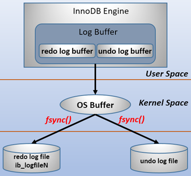
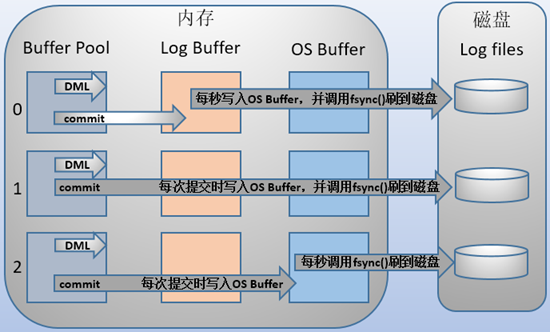
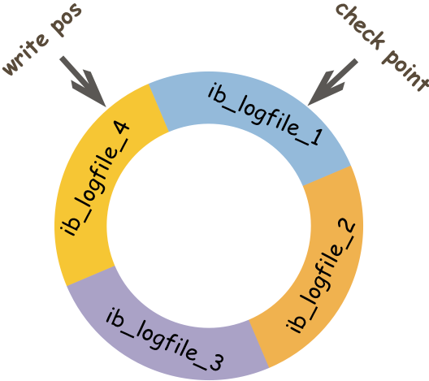

**InnoDB**[中的日志分为7种](https://www.cnblogs.com/wy123/p/8365234.html)：

1. **Redo Log**，重做日志。
2. **Undo Log**，回滚日志。
3. **Bin Log**，二进制日志。
4. **Error Log**，错误日志。
5. **Slow Query Log**，慢查询日志。
6. **General Log**，一般查询日志。
7. **Relay Log**，中继日志。

其中<span style=background:#c9ccff>Redo Log</span>、<span style=background:#f8d2ff>Undo Log</span>、<span style=background:#c2e2ff>Bin Log</span>比较重要，而<span style=background:#c2e2ff>Redo Log</span>与<span style=background:#c2e2ff>Undo Log</span>与**事务**相关，也成为事务日志。


### Redo Log

<span style=background:#c9ccff>Redo Log</span>用于确保事务的**Durability**，即数据库因故障重启后恢复事务的执行。

<span style=background:#c9ccff>Redo Log</span>按照块（Block）进行存储的，每块 <span style=background:#e6e6e6>512Byte</span>，每个块分为头、体、尾三部分。

在事务开始时就会产生<span style=background:#c9ccff>Redo Log</span>，并且随着事务的执行不断产生。<span style=background:#c9ccff>Redo Log</span>的刷盘（也称落盘）也是不断执行的，而非等到事务提交时才刷盘，<u><span style=background:#c9ccff>Redo Log</span>落盘后，**InnoDB**才会返回事务提交成功的响应，</u>正因此才保证了事务的**Durability**。



用户空间中的缓冲数据是无法直接写入磁盘的，需要经过内核空间才能写入，所以<span style=background:#c9ccff>Redo Log</span>的写入分为3步：

1. 写入缓冲区（**Redo Log Buffer**）。
2. 写入内存文件（**OS Buffer**）。
3. 调用<span style=background:#b3b3b3>fsync()</span>将内存文件持久化到硬盘上。
   1. “写入内存文件”这一步冗余但[并非](https://blog.51cto.com/wangwei007/2487410)多余，虽然数据仍在内存中，只是由归属于**MySQL**变成了归属于**OS**。
   2. 归属的改变能保证，在**MySQL**挂掉，**OS**仍然健在的情况下，数据不丢失。
   3. 毕竟**OS**要比运行其上的应用软件健壮。当然，遇到机器意外断电这种情况，就只能自求多福了。
   4. 说到系统断电，<span style=background:#b3b3b3>fsync()</span>也并非绝对安全。因为硬盘自身会有<u>物理缓存</u>，如果只是保存到硬盘的<u>物理缓存</u>，没有写入到磁盘上，断电时数据仍然会丢失。对此，可以开启Linux的“write barrier”机制来应对，而Ext4（Linux第四代扩展文件系统）默认开启该机制。

通过设置<span style=background:#b3b3b3>innodb_flush_log_at_trx_commit=0|1|2</span>[调整写入方式](https://blog.csdn.net/qq_35246620/article/details/79345359)：

| 值   | 行为                                                         |
| ---- | ------------------------------------------------------------ |
| 0    | 每次事务提交，    只写**Redo Log Buffer**。                  |
| 2    | 每次事务提交，都写入**Redo Log Buffer**后会再写到**OS Buffer**。 |
| 1    | 每次事务提交，都写入**Redo Log Buffer**并写到**OS Buffer**然后会调用<span style=background:#b3b3b3>fsync()</span>。 |

另外，**InnoDB**有一个后台线程，<span style=background:#d4fe7f>每秒</span>都会把**Redo Log Buffer**写到**OS Buffer**，并调用<span style=background:#b3b3b3>fsync()</span>。



除了每秒钟执行一次的刷盘、事务提交时也触发刷盘，当<span style=background:#c9ccff>Redo Log</span>的缓存空间剩余不到一半时，也会触发<span style=background:#c9ccff>Redo Log</span>的刷盘。

当脏页刷盘后，这个<span style=background:#c9ccff>Redo Log</span>也就完成了它的持久化任务，它所占用的空间也就可以被新的<span style=background:#c9ccff>Redo Log</span>覆盖。

是的，<span style=background:#c9ccff>Redo Log</span>采用循环写入的方式：<span style=background:#ffee7c>文章已被删除</span>

1. 每个<span style=background:#c9ccff>Redo Log</span>都会有一个LSN（Log Sequence Number）。
2. **InnoDB**会设置“**check point**”，记录需要开始刷盘的<span style=background:#c9ccff>Redo Log</span>的**LSN**，当<span style=background:#c9ccff>Redo Log</span>刷盘后，“**check point**”会向后移动。
3. **InnoDB**会设置“**write pos**”，记录最新**脏页**对应的<span style=background:#c9ccff>Redo Log</span>的**LSN**，当产生新的**脏页**后，“**write pos**”会向后移动，指向该**脏页**的**LSN**。
4. 也就是说“**write pos**”与“**check point**”之间的**脏页**就是需要落盘的**脏页**。




### 脏页的刷盘时机

**脏页**指的是与硬盘中的**数据页**不一致的内存中的**数据页**。

干净页指的是与硬盘中的**数据页**与一致的内存页**数据页**。

将内存页中的改动刷写到硬盘中时，**脏页**也就变成了干净页。

**脏页**[的刷盘时机有4种](https://segmentfault.com/a/1190000020835301)：

1. <span style=background:#c9ccff>Redo Log</span>刷盘时。
   1. 这时，**InnoDB**会直接挂起所有的数据更新操作，处理完**脏页**后才会恢复，所以要尽量避免这种情况。
2. **Buffer Pool**不足时。
   1. 这种情况是常态，会采用LRU（Lastes Recently Used）算法清理**Buffer Pool**，待腾出空间后才会继续写入。
3. 数据库系统空闲时。
6. 数据系统正常关闭时。

**脏页**的实际刷盘速度为下面两者中最快的：

1. 按比例刷盘。
   1. 当**脏页**比例接近或超过<span style=background:#b3b3b3>inodb_max_dirty_pages_pct</span>时，**InnoDB**会全力刷盘；
   2. 否则会按照<span style=background:#b3b3b3>innodb_io_capacity</span>按比例进行刷盘。
2. 按差值刷盘。
   1. **InnoDB**会计算“**write pos**”与“**check point**”的差值，差值越大，刷盘速度越快。

<span style=background:#b3b3b3>innodb_io_capacity</span>可根据磁盘的IOPS进行设置：

```bash
fio -filename=/tmp/test_randrw -direct=1 -iodepth 1 -thread -rw=randrw -ioengine=psync -bs=16k -size=500M -numjobs=10 -runtime=10 -group_reporting -name=mytest
```

**脏页**刷盘有<u>连坐机制</u>：

1. 在**脏页**刷盘时，如果邻页也是**脏页**，则邻页也会被刷入。
2. 该机制会蔓延。
3. 通过<span style=background:#b3b3b3>innodb_flush_neighbors</span>设置，默认开启，但MySQL从8.0开始默认关闭，因为：
   1. 机械硬盘的IOPS往往只有几百，开启<u>连坐机制</u>能有效减少随机IO，进而提升性能。
   2. 固态硬盘的IOPS高达几千，且擅长随机IO，所以关闭<u>连坐机制</u>、“只刷自己”，能缩短响应时间，提升性能。


### Undo Log

<span style=background:#f8d2ff>Undo Log</span>用于保证事务**Atomicity**，即保存事务发生前的数据的一个版本，用于<u>回滚</u>、<u>MVCC的读</u>等操作。

每次事务需要保存当前版本时都会产生一份<span style=background:#f8d2ff>Undo Log</span>，并伴随产生<span style=background:#c9ccff>Redo Log</span>（用于保证<u>回滚</u>的**Durability**）。

当事务执行完成时，该事务的<span style=background:#f8d2ff>Undo Log</span>不会被立即清理，而是交由<span style=background:#c2e2ff>Purge</span>线程做统一清理。

<span style=background:#f8d2ff>Undo Log</span>默认是位于数据文件目录中的<u>共享表空间</u>中的，由于事务执行时可能会产生大量的<span style=background:#f8d2ff>Undo Log</span>，进而将共享表空间撑大且不会收缩（怎么跟人的胃一样），因此在5.7版本之后，**MySQl**允许为<span style=background:#f8d2ff>Undo Log</span>单独配置表空间。

**InnoDB**[使用Rollback Segment（回滚段）的方式](https://www.cnblogs.com/xinysu/p/6555082.html)管理<span style=background:#f8d2ff>Undo Log</span>，每个**Rollback Segment**包含 <span style=background:#e6e6e6>1024</span> 个**Undo Log Segment**，即 <span style=background:#e6e6e6>1024</span> 个回滚操作。

> 5.5版本以前仅有 <span style=background:#e6e6e6>1</span> 个回滚段，5.5版本开始支持 <span style=background:#e6e6e6>128</span> 个。

<span style=background:#f8d2ff>Undo Log</span>[的写入时机](https://www.zhihu.com/question/267595935/answer/328041131)：

1. <span style=background:#f8d2ff>Undo Log</span>实际上是通过**Rollback Segment**生成Undo Page，Undo Page跟数据一起被当作修改写<span style=background:#c9ccff>Redo Log</span>，<span style=background:#c9ccff>Redo Log</span>通过多个**MTR**（**M**ini **TR**ansaction）落盘。
2. 写入时，先写<span style=background:#f8d2ff>Undo Log</span>，再修改数据，再写<span style=background:#c9ccff>Redo Log</span>。
3. 回放时，先回放<span style=background:#c9ccff>Redo Log</span>，再将没提交的事务根据<span style=background:#f8d2ff>Undo Log</span>回滚掉。

<span style=background:#f8d2ff>Undo Log</span>分为2种：

1. **Insert Undo Log**
   1. `INSERT`时产生。
   2. 只在事务回滚时需要。
   3. 当前事务提交后就可以丢弃该**Insert Undo Log**。
2. **Update Undo Log**
   1. `UPDATE`和`DELETE`时产生的。
   2. 事务回滚时、快照读时都需要。
   3. <span style=background:#c2e2ff>Purge</span>会判断其它事务的MVCC读是否依赖该**Update Undo Log**，当没有依赖时才会清理可以该**Update Undo Log**。
   4. 如果`UPDATE`的字段是主键，则直接`UPDATE`；如果不是主键，`UPDATE`会分成2步：先`DELETE`，再`INSERT`。


### Bin Log

<span style=background:#c2e2ff>Bin Log</span>用于主从复制，以及基于时间点的数据还原（跟事务的关系不是很密切）。

<span style=background:#c2e2ff>Bin Log</span>拥有过期时间，当到达过期时间就会被自动清理。

<span style=background:#c9ccff>Redo Log</span>的<span style=background:#d4fe7f>两阶段写入</span>：

1. 数据页发生改动后，会产生<span style=background:#c9ccff>Redo Log</span>，<span style=background:#c9ccff>Redo Log</span>落盘后会被标记位**Prepare**状态；
2. 紧接着会一次性的将SQL封装为<span style=background:#c2e2ff>Bin Log</span>写入；
   1. 正因此<span style=background:#c2e2ff>Bin Log</span>开启后会有额外的时间开销。
3. 然后<span style=background:#c9ccff>Redo Log</span>被修改为**Commit**状态，事务也就可以被提交了。

<span style=background:#c2e2ff>Bin Log</span>的写入也是分步进行的：

1. 写入内存中的缓存。
2. 然后调用<span style=background:#b3b3b3>fsync()</span>后的刷盘。

<span style=background:#c2e2ff>Bin Log</span>的写入过程决于<span style=background:#b3b3b3>sync_binlog = 0|1|N</span>：

| 值        | 行为                                            |
| --------- | ----------------------------------------------- |
| 0         | 每次提交事务只写入缓存，直到缓存满后才会落盘。  |
| 1         | 每次提交事务都会落盘。                          |
| N（N > 1) | 每次提交事务只写缓存，累积到N个事务后才会落盘。 |

若<span style=background:#c2e2ff>Bin Log</span>写入成功，<span style=background:#c9ccff>Redo Log</span>没能变更状态，**MySQL**重启后会重新修改<span style=background:#c9ccff>Redo Log</span>的状态；

若<span style=background:#c2e2ff>Bin Log</span>没能写入成功，<span style=background:#c9ccff>Redo Log</span>虽然写入成功，**MySQL**重启后会也会回滚事务。

另外，在主从结构中，为了保证**Consistency**，**Master**必须是 <span style=background:#e6e6e6>1</span>；**Slave**为了吞吐，可以设置成 <span style=background:#e6e6e6>0</span> 或 <span style=background:#e6e6e6>N</span>。

<span style=background:#c2e2ff>Bin Log</span>以**追加**的方式写入，当日志文件大小达到阈值时，会生成新的日志文件。

<span style=background:#c2e2ff>Bin Log</span>[有3种内容格式](https://blog.csdn.net/afreon/article/details/108178306)：

1. STATMENT，基于SQL的复制。不记录每行的变化，日志量少，IO少，但可能出现主从不一致。
2. ROW，基于行的复制。记录每一条被修改的记录，存储过程、方法、触发器都能被正确调用，但日志量大。
3. MIXED，混合模式。对STATMENT没法保存的日志使用ROW保存。

物理日志与逻辑日志：

1. <span style=background:#c9ccff>Redo Log</span>是物理日志，也就是数据页面改动后的物理记录，还原速度要快。
2. <span style=background:#c2e2ff>Bin Log</span>、<span style=background:#f8d2ff>Undo Log</span>、是逻辑日志，可以简单理解为SQL以及对应的反向SQL语句。
   1. <span style=background:#c2e2ff>Bin Log</span>包含<u>正反</u>两类，而<span style=background:#f8d2ff>Undo Log</span>只需保留<u>反向</u>日志。
   2. <span style=background:#c2e2ff>Bin Log</span>似乎也支持物理日志，即ROW模式。

层级：

1. <span style=background:#c9ccff>Redo Log</span>、<span style=background:#f8d2ff>Undo Log</span>是引擎层的日志，即**InnoDB**中的日志。
2. <span style=background:#c2e2ff>Bin Log</span>是**Server**层的日志，与引擎无关。


### 预写式日志

上文介绍的这三种日志都是预写式日志（Write Ahead Log，WAL）中的一部分。

**WAL**常用于数据库系统，提供**Atomicity**和**Durability**的保证。

所谓预写，就是在真正将数据写入磁盘之前，先将数据封装进日志，将日志写入磁盘。这样，如果应用在写入数据时因发生意外而挂掉后，再恢复时，就可以根据**WAL**来判断之前的操作是否全部成功，进而决定是继续进行、回滚操作，还是保持原样。

提升磁盘写入的方向有3个：

1. 随机写改为顺序写。
2. 单条读写改为批量缓存读写。
3. 单线程读写改为并发读写。

而**WAL**正是将随机写变成了顺序写、将单条读写改为批量缓存读写，从而提高了系统的性能。

> [有研究指出](https://blog.hufeifei.cn/2020/04/25/Alibaba/MetaQ&Notify/#2-3-ji-yu-wen-jian-shun-xu-xie-de-ri-zhi-jie-gou)顺序的磁盘I/O有时甚至快于随机内存访问速度。