## MySQL Replication

主从复制，**MySQL**自带的功能。

如[下图](https://blog.csdn.net/weixin_43750212/article/details/104778156)所示，**Master**将SQL封装为Bin Log，并启动**Log Dump**线程，向**Slave**的IO线程传输，**Slave**的IO线程会将接收到的Bin Log写成**Relay Log**，而后SQL线程会将**Relay Log**解析为SQL并执行。

主从之间有延迟，数据不一致；**Master**挂掉，**Slave**不会自动切换为**Master**。

> 为了保证数据的一致性，**Master**必须是 `1`；**Slave**为了吞吐，可以设置成 `0` 或 `N`。

> 复制产生的开销，主要来自Bin Log，但即便不开启复制，出于备份的需要，也会启用Bin Log。

## MySQL Fabirc

**MySQL Fabirc**在**MySQL Replication**的基础上，增加了自动数据分片、故障检测与转移（自动将**Slave**切换为**Master**）。

由**MySQL**官方提供的，但仍未解决主从延迟，且查询、事务仅支持同一分片，故障恢复速度慢，`30秒`左右。

## MySQL Cluster

真正的集群：

1. 多主多从结构，且故障恢复速度快，小于`1秒`。
2. 可以自动切分数据，可伸缩。
3. 能够跨节点冗余数据。
4. 自动负载均衡。

由**MySQL**官方提供，但是只支持**NDB**引擎，只支持读已提交。

## Master Replication Manager for MySQL

**Google**基于**MySQL Replication**开发的，同一时刻只允许对一个**Master**写入，另一台**Master**提供部分读。

1. 双主多从结构。
2. 自动主主切换，`3秒`内完成切换。
3. 多个节点读的负载均衡。

但是仍未能保证数据一致性。

## Master High Availability

**Facebook**基于**MySQL Replication**开发的，由一主两从组成基本单元，基本单元可以有多组。

能进行故障的自动检测与转移，但需搭配**Keepalived**使用。

[美团基于**MHA**打造了高可用的数据库](https://tech.meituan.com/2017/06/29/database-availability-architecture.html)。

> 提升数据库的可用性，主要包括两方面：
>
> - 通过适当的监控，以及规范流程，来提高MTBF（Mean Time Between Failure，平均失效时间）。
> - 通过增加冗余设施等措施，来保证发生宕机时能快速恢复，即，降低MTTR（Mean Time To Repair，平均恢复时间）。

## 异地多活

[饿了么异地多活技术实现（一）总体介绍](https://zhuanlan.zhihu.com/p/32009822)

