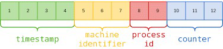

## 简介

[**MongoDB**](https://www.cnblogs.com/littleatp/p/11675233.html)是一个基于分布式文件存储的数据库，介于关系型数据库与非关系型数据库之间。

**MongoDB**是天生的分布式：

1. **MongoDB**读性能好：

   1. 尽可能地利用内存来做缓存。
   2. 自动选择速度最快的索引来进行查询。
   3. 精简服务端，将更多的操作交由客户端。

2. **MongoDB**的写性能也优于**MySQL**，约`2.5W/s`。

3. **MongoDB**具有良好的横向扩展性，可以自由的增减分片。

4. **MongoDB**的每个文档都拥有一个`12Byte`的主键字段，且是分布式主键，该主键由客户端生成的，以获得更好的随机性、减轻服务端的负载。

   

## 面向文档

**MongoDB**面向**文档**存储，使用基于JSON的BSON存储文档。

1. 关系型数据库是面向**行**存储，其中的**行**指的是结构化数据，或者说是字段固定的数据；
2. 而**文档**指的是半结构化数据，或者说是字段不固定的数据。

面向文档的数据库往往Schema灵活，**MongoDB**也不例外。

**MongoDB**允许对同一集合中的不同文档同时进行写入；但对于同一文档的只允许一个写入进行，其它写入需等待该写入完成后，通过竞争获取资格。

**MongoDB**可以使用**JavaScript**来编写`Map`函数和`Reduce`函数来分别进行批量处理和聚合操作。编写的函数可以存在服务端，以便下次直接调用。

## 索引

**MongoDB**的索引也采用了**B+树**。

**MongoDB**支持单列索引，也支持复合索引（联合索引），还支持通过参数设置索引特性：

1. `unique = true`，开启唯一索引。
2. `expireAfterSeconds = 3600`，开启索引的TTL（Time To Live），单位毫秒。
3. `sparse = true`，开启稀疏索引，仅索引非空字段的文档。
4. `partialFilterExpression: { rating: { $gt: 5 }`，开启条件式索引，满足计算条件的文档才进行索引。

> **MongoDB**的字段支持数组类型，其索引也支持数组类型，但最多只允许一个。

此外还有：

1. 哈希索引，用于快速检索，哈希类型的分片的键会使用哈希索引。
2. 地理空间索引，用于地理空间查询，如，寻找附近1公里的商家。
3. 文本索引，用于全文检索。
4. 模糊索引，基于匹配规则的灵活式索引。

## 集群

分片、负载均衡、容灾

每个节点都会向其它节点发送心跳，备节点在10秒内没能收到主节点的响应就会发起选举。

节点间通过日志同步。

## 与Elasticsearch相比[[1]](https://leriou.github.io/2019-01-09-mongodb-compareto-elasticsearch/)[[2]](https://stor.51cto.com/art/202102/644834.htm)

不难发现，**MongoDB**与**Elasticsearch**的功能高度重合，两者相比：

1. **MongoDB**是一个文档型的业务数据库，数据管理能力（增删改查）强。同时，内存占用少、磁盘占用少（压缩数据）、写入延迟低。
2. **Elasticsearch**是一个搜索引擎，专注全文检索，并发性能高、分片扩展方便。但其写入能力较弱，Mapping不可变、每秒`flush`。

## BSON

BSON，Binary JSON，主要有3个特点：

1. ##### 类型丰富

   1. BSON由常见的数据类型，包括布尔型、整型、浮点型，还支持日期、正则等，详见下表。
   2. BSON支持字节数组，对于二进制的存储无需先将数据转换为base64再存入。

2. ##### 遍历速度快

   1. 遍历JSON时无法跳过一个文档，需要完整地遍历完一个文档，遍历地同时还需要进行括号地匹配，以判断文档是否结束。
   2. 而BSON会将整个文档的长度保存到文档的头中，从而可以在遍历时跳过一个文档。

3. ##### 操作简单

   1. JSON的字段值是无类型的，当字段的值被修改时，比如由个位数变为十位数，我们就需要将该值后面的所有数据向后移动一位。
   2. 但BSON的字段的值是有类型，会预留空间，无需移动数据，就是有点**占空间**。

**MongoDB**以顺序表的方式存储数据，并且只存储传入的字段，不像关系型数据库会为空值字段预留空间，所以文档之间非常紧凑，当我们扩展文档时，就会出现空间不足的问题。

为此，**MongoDB**提出了padding factor（填充因子）的概念，即，预留空间，方案主要有2种：

1. ##### 非官方方案

   1. 在插入文档时，就存入冗余数据，提前将空间占留出来；当修改文档时，删除部分冗余数据，向腾出的空间中更新数据。

2. ##### 官方方案

   1. 设置集合属性`usePowerOf2Sizes = true`，插入文档是，为文档分配的空间均为 `2^n`。
   2. 该方案会降低写入性能、降低空间的使用效率，适用于需要频繁改动的情景。

| **类型**       | **说明**                                        |
| -------------- | ----------------------------------------------- |
| Null           | 空值                                            |
| Undefined      | 未定义，不同于null                              |
| 布尔           | true、false                                     |
| 整型           | 包含32位、64位两种                              |
| 浮点型         | 64位                                            |
| UTF-8          | 即字符串型                                      |
| 二进制         | 如，{x:}                                        |
| 数组           | 如，{x:[1,2,3]}，实际上还是一对象的形式进行保存 |
| 日期           | 如，{x:new Date()}                              |
| 正则           | 如，{x:/.*?/}                                   |
| 对象标识符     | 如，{_id:ObjectId()}                            |
| 内嵌文档       | 如，{x:{name:"Lean",age:25}}                    |
| Javascript代码 | 如，{x:function(){}}                            |

