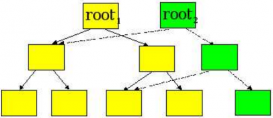

## 存储引擎

**MongoDB**也是采用了独立存储引擎的设计，由存储引擎来负责内存、硬盘上的数据的管理。

**MongoDB**[的存储引擎主要有](https://www.cnblogs.com/duanxz/p/3558913.html)InMemory、WiredTiger（默认引擎）。


## InMemory

该引擎只将数据、索引、操作日志存储到内存中，除了少量的元数据、诊断日志会存储在硬盘上。

InMemory采用“持有主分片的节点会将操作日志发给其它持有副本的节点”的方式同步数据。

<span style=background:#ffee7c>MongoDB是否可以与Redis作比较？</span>


## WiredTiger

### 并发写入

WiredTiger采用乐观并发控制（文档自带一个版本字段用于实现乐观锁），只在global、database、collection级别上使用<span style=background:#c2e2ff>意向锁</span>。

### 内存使用

WiredTiger会在内存中设置缓存，其缓存分为2部分：
1. 应用内部缓存，数据未经压缩的，默认大小取“1GB”、“内存空间的60%”中的最大值。
2. 应用外部缓存，即OS Cache，存放于该处的数据都经过压缩，占用大小不固定。

缓存<span style=background:#ffee7c>（内部缓存还是外部缓存？）</span>以B树的方式进行组织，树中的节点按页（Page）进行组织，写入、读取时都是以页为单位进行，页（节点）分为3类：

1. Root Page，根节点
2. Internal Page，非叶子节点，存放索引。
3. Leaf Page，叶节点，真正存放数据。<span style=background:#ffee7c>（那这不成了B+树了吗？这里是不是说错了？）</span>

Page是WiredTiger的最小存储单元，其文件格式为extent。

### 写入过程

WiredTiger采用了叫做Journal的预写式日志的设计，即先将数据的操作日志顺序写入硬盘，数据只是缓存在内存中；之后再通过Checkpoint操作，为当前缓存中的数据创建一致性视图（也称作Snapshot，快照），然后持久化到硬盘中。

Journal会先缓存在内存中，每达到128K时才会写入硬盘，所以还是存在丢数据的可能。

WiredTiger每60秒或者在日志达到2GB时会进行一次CheckPoint。

Snapshot、Journal用于宕机后恢复数据。WiredTiger初始化时，会先恢复到最新的Snapshot，然后再从Journal中恢复数据。

Checkpoint操作采用“Copy On Write”的设计，修改操作不在原有的Leaf Page上进行，而是新建一棵B树，为修改的内容分配新的页。

一次Checkpoint的过程大致如下：

1. 对所有普通表进行Checkpoint，将这些表的元数据保存到WiredTiger.wt。
2. 对WiredTiger.wt进行Checkpoint，其元数据保存到WiredTiger.turtle.set中，待保存完毕后将其重命名为WiredTiger.turtle（旧文件删掉）。



### 数据压缩

WiredTiger会对集合、索引以及日志进行压缩：
1. 使用块压缩处理集合。
2. 使用前缀压缩处理索引。

固然压缩就需要解压，而解压、压缩都会额外消耗CPU，但是压缩后的数据减少了对磁盘的读写以及空间占用。

文档的默认压缩算法为snappy，能很好的平衡压缩、解压速度。

### 空间回收

WiredTiger在删除硬盘上的文档后，不会将空间释放给操作系统，而是将这些空间记录下来，当有新写入时会优先向这些空间中进行。

这样做会带来空间碎片，我们可以使用合并命令来进行碎片整理，包括对空间碎片的处理、将剩余回收空间的释放给操作系统。整理过程中会对数据库加锁，整理完成后会重建索引。

### WiredTiger基本配置

```yaml
storage:
  joural:
    enabled: true               #启用journal日志，false为关闭
  engine: wiredTiger            #指定存储引擎
  wiredTiger:
    cacheSizeGB: 8              #来指定mongodb使用内存的多少-8G
    engineConfig:               #存储引擎的配置
      journalCompressor: snappy #指定journal日志的压缩方式
    indexConfig:                #索引配置
      prefixCompression: true   #前缀压缩开启
    collectionConfig:
      blockCompressor: snappy   #指定集合的压缩方式              
```

### WiredTiger文件目录结构[[1]](https://mongoing.com/archives/2540)

```
├── WiredTiger
├── WiredTiger.basecfg #存储基本配置
├── WiredTiger.lock    #防止多个进程连接同一个数据库
├── admin              #*.wt存储各类集合的数据
│  ├── table1.wt
│  └── table2.wt
├── local
│  ├── table1.wt
│  └── table2.wt
├── WiredTiger.wt      #存储其它表的元数据信息
├── WiredTiger.turtle  #存储WiredTiger.wt的元数据信息
└── journal            #预写式日志
├── WiredTigerLog.0000000003
└── WiredTigerPreplog.0000000001              
```


## Copy On Write

Copy On Write，COW，写入时复制，是一种优化策略。

COW的核心思想为：当多个调用者（Caller）同时请求相同资源时，他们会共同获取相同的指针以指向相同的资源，直到某个Caller试图修改资源的内容时，系统才会真正复制一份专用副本（Private Copy）给该Caller，而其它Caller所见到的最初的资源仍然保持不变。

这一过程对其它的Caller都是[透明](https://zh.wikipedia.org/wiki/透明)的，多个Caller能共享同一份资源。
