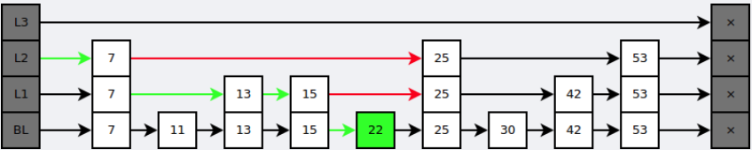

## 对象

**Redis**中的每个Key、Value都基于一个名为“redisObject”的数据结构：

```c
typedef struct redisObject {
    int refcount;        // 引用计数
	unsigned type:4;     // 类型
    unsigned encoding:4; // 编码
    unsigned notused:2;  // 对齐位
    unsigned lru:22;     // LRU 时间（相对于 server.lruclock）
    void *ptr;     		 // 指向对象的值
} robj;
```

C语言没有垃圾回收机制，所以**Redis**使用<span style=background:#c2e2ff>引用计数</span>法来回收垃圾。


## 类型

<table cellspacing="0" cellpadding="0">
	<thead>
		<tr>
			<th style="width: 75px; min-width: 75px;">Type</th>
			<th style="width: 95px; min-width: 95px;">中文名</th>
			<th style="width: 315px; min-width: 315px;">简介</th>
			<th style="width: auto;">特性</th>
			<th style="width: 350px; min-width: 350px">场景</th>
		</tr>
	</thead>
	<tbody>
		<tr><td>String</td><td>字符串</td><td>二进制安全</td><td>可以包含任何数据，比如图片或者序列化的对象<br/>一个Key最大能存储512M</td><td>1、简单的缓存<br/>2、计数器</td></tr>
		<tr><td>Hash</td><td>字典</td><td><u>键值对</u>集合<br/>即编程语言中的Map类型</td><td>适合存储对象，并且可以只读写某几项属性<br/>(Memcached中需要取出整个字符串反序列化成对象修改完再序列化存回去)</td><td>1、存储、读取、修改用户等<span style=background:#c2e2ff>对象</span>的属性</td></tr>
		<tr><td>List</td><td>列表</td><td>链表(双向链表)</td><td>增删改，提供了操作某一段元素的API</td><td>1、最新消息<span style=background:#c2e2ff>排行</span>等功能(比如朋友圈的时间线)<br/>2、消息队列（rpop、lpush）</td></tr>
		<tr><td>Set</td><td>集合</td><td>元素不重复、有序排列</td><td>添加、删除，查找的复杂度都是O(1)<br/>为集合提供了求交集、并集、差集等操作</td><td>1、<span style=background:#c2e2ff>共同</span>好友（求交集）<br/>2、利用<span style=background:#c2e2ff>唯一性</span>，统计访问网站的所有独立IP<br/>3、好友推荐时，根据tag求交集，大于某个阈值就可以推荐</td></tr>
		<tr><td>Sorted Set</td><td>有序集合</td><td>将Set中的元素增加一个权重参数score<br/>元素按score有序排列</td><td>数据插入集合时，已经进行天然排序</td><td>1、<span style=background:#c2e2ff>排行榜</span><br/>2、带权重的消息队列（延时队列）</td></tr>
	</tbody>
</table>

此外，[**Redis**还可作](https://blog.csdn.net/ThinkWon/article/details/103522351)：

1. 会话缓存
   1. 使用**Redis**来统一存储多台应用服务器的会话信息。
   2. 当应用服务器不再存储用户的会话信息，也就不再具有状态，一个用户可以请求任意一个应用服务器，从而更容易实现高可用性以及可伸缩性。

2. 查找表
   1. **Redis**查找快速，还可以用来做查找表，如，存储DNS。
   2. 查找表需要可靠，所以内容不能失效；但，缓存不作为可靠的数据来源，内容可以失效。


## 编码⭐

针对以上5种<u>Type</u>，[**Redis**设计](https://redisbook.readthedocs.io/en/latest/index.html)了不同的<u>Encoding</u>。


## 简单动态字符串

Simple Dynamic String，SDS，简单动态字符串。

```c
typedef char *sds;
struct sdshdr {
    char buf[]; // 实际保存字符串数据的地方
    int len;    // 字符数组已用长度
    int free;   // 字符数组剩余可用长度
};
```

**Redis**中，几乎所有模块都在使用**SDS**，而非传统的C语言字符串，其主要作用为：

1. 实现字符串对象，做`char*`的替代品。
   1. <span style=background:#c2e2ff>减少</span>了字符串<span style=background:#c2e2ff>追加</span>操作产生的内存<span style=background:#c2e2ff>重分配</span>次数。
   2. <span style=background:#c2e2ff>简化</span>了字符串的<span style=background:#c2e2ff>长度</span>计算。
3. 二进制安全。
   1. 所以不止可以存储字符串，还可以存储图片、音频、视频等二进制数据。


## 字典

### 用途

实现数据键空间（Key Space）。

用作**Hash**类型的Value的底层实现之一。

### 数据结构

如下所示，**Redis**的**Dictionary**（`dict`）包含两个散列表（`dictht`），以方便扩容时的`Rehash`。


```c++
typedef struct dict {       // 字典
    dictht ht[2];			// 散列表
    long rehashidx;			// Rehash Index
    ……
} dict;
typedef struct dictht {		// 散列表，HashTable
    dictEntry **table;		// 指针数组，俗称桶、bucket
    ……
} dictht;
typedef struct dictEntry {	// 键值对
    struct dictEntry *next; // 后继指针
    ……
} dictEntry;
```

`dictht`使用<u>拉链法</u>（链地址法）解决碰撞冲突，如[下图](https://redisbook.readthedocs.io/en/latest/internal-datastruct/dict.html)所示：


### 扩容⭐

为了保证性能（<u>节点数量与散列表的大小</u>为`1:1`时性能最好），每次向**Dictionary**中增加<u>键值对</u>时，都会对`dict.ht[0]`的<u>节点数量与散列表大小</u>的比率（Ratio）作比较，当Ratio大于阈值时就会触发扩容。

扩容时，将`dict.ht[0]`上的<u>键值对</u>逐个`Rehash`到`dict.ht[1]`上，而该`dict.ht[0]`的`table[rehashidx]`会指向`Null`，`dict.rehashidx`会加1，直到`dict.rehashidx`等于`dict.ht[0]`的长度，`Rehash`完毕，然后会交换这两个`dict.ht`的角色。

### 渐进式⭐

`Rehash`中<u>键值对</u>的移动不是一次性完成，而是渐进式的，以避免服务器压力陡增。

`Rehash`开始后时，每次**Dictionary**被使用时，才会执行一次“<u>键值对</u>的移动”。

渐进式`Rehash`会将**Dictionary**中的数据分散到两个`dict.ht`中。

当**Redis**执行常规任务时，也会执行`Rehash`， 即，在规定时间内， 尽可能地对需要进行`Rehash`的**Dictionary**进行`Rehash`，以加速`Rehash`。

### 收缩

当<u>键值对</u>不断减少，直到Ratio小于阈值时，会自动触发收缩**字典**。

### 应用

`WATCH`、订阅发布就是使用**字典**来实现的。


## 压缩列表

```c++
area        |<------------------- entry -------------------->|
            +------------------+----------+--------+---------+
component   | pre_entry_length | encoding | length | content |
            +------------------+----------+--------+---------+
```

**Zip List**使用连续的内存来保存元素，但元素的空间长度不一，所以**Zip List**会在元素的头部存储元素<u>自身的长度</u>（`length`）。

> **Zip List**没有采用任何压缩压缩算法，所以翻译为“紧凑列表”更恰当一些。

**Zip List**中的元素没有存放指向前后元素的<u>指针</u>，而是存储了前一个元素的<u>长度</u>（`pre_entry_length`），而不同的编码（`encoding`）会导致`pre_entry_length`长度不同，`1Byte`或`5Byte`：

- `1Byte`：如果前一元素的长度小于`254Byte`，`pre_entry_length`便使用`1Byte`来保存。
- `5Byte`：如果前一元素的长度大于等于`254Byte`，那么将第`1`个字节的值设为`254`，然后用接下来的`4`个字节保存实际长度。

> 存<u>长度</u>比存<u>指针</u>省空间，但会降低读性能，这种设计属于“时间换空间”。

结合元素的`encoding`、`length`、`pre_entry_length`即可推算相邻元素的位置。

**Zip List**的写性能差，如，往已有的两个元素A、B间插入一个新元素C，如果A总长为`253Byte`，但C总长`254Byte`，那么B.pre_entry_length就会由`1Byte`扩充为`5Byte`，进而引起B的总长变长。

> 这种扩充是连锁，直到某个后续元素的`pre_entry_length`无需变化。
>
> 当然，连锁反应发生的概率较低。

**Zip List**要比**Dictionary**、**Linked List**、**Skip List**省内存，**Redis**会优先使用**Zip List**，当满足某些条件时：

1. **Hash**才会将**Zip List**转为**Dictionary**。
2. **List**才会将**Zip List**转为**Linked List**。
3. **Sorted Set**才会将**Zip List**转为**Skip List**。


## 双端链表

**Redis**中的**Linked List**采用通用设计。

**Linked List**除了作为**List**的底层实现，还广泛应用于：

1. 事务模块使用**Linked List**保存输入的命令。
2. 服务器模块使用**Linked List**保存多个客户端。
3. 订阅 / 发送模块使用**Linked List**保存多个客户端。
4. 事件模块使用**Linked List**保存时间事件。


## Quick List[[1]](https://zhuanlan.zhihu.com/p/102422311)

**Linked List**便于插入、删除元素，但会产生空间碎片；**Zip List**空间利用率高，但是不便于插入、删除；于是**Redis**便推出了两者的结合**Quick List**，由**Zip List**组成的**Linked List**。

**Redis3.2**后，List只是用**Quick List**实现。


## 整数集合

当**Set**中的元素均为整数且数量不多时，会采用**Int Set**作为实现。

**Int Set**中的整数可由`16Bit`升级为`32Bit`、`32Bit`升级为`64Bit`，整数最终几位，取决于位数最大的那个整数，升级会引起整个**Int Set**的内存的重新分配。

**Int Set**使用<span style=background:#c2e2ff>二分查找</span>算法，来判断整数在集合中的位置（数组的索引）。


## 跳跃列表⭐

**Skip List**是一个基于多指针的有序链表，其中的“层”（`level[]`）实际上是节点中的一个数组。

```c
typedef struct zskiplistNode {
    robj *obj;						   // member对象
    double score;					   // 分值：排序的依据
    struct zskiplistNode *backward;	   // 后退指针：方便倒序遍历
    struct zskiplistLevel {
        struct zskiplistNode *forward; // 前进指针：指向下一节点
        unsigned int span;			   // 这个层跨越的节点数量，或者说到下一节点的距离，跳跃时的依据
    } level[];						   // 层：节点插入时，层数是随机的；且最高32层
} zskiplistNode;
```

### 查找

查找数据时，从**Skip List**的上层指针开始查找，找到对应区间后再向下层指针查找。

[下图](https://www.cyc2018.xyz/数据库/Redis.html#跳跃表)演示了查找“22”的过程：



**Skip List**查找单个Key的过程近似二分查找，时间复杂度平均 `O(log N)`，与平衡树相仿；但最坏为`O(N)`，比平衡树差。

[另外](https://zhuanlan.zhihu.com/p/23370124)，跳表：

1. 内存占用略少。
2. 插入、删除速度快。
   1. **红黑树**、**B/B+树**的维护成本高，不适合写多读少的场景。
   1. 如，**红黑树**需要进行<span style=background:#c2e2ff>旋转</span>来维护平衡性。
3. 容易实现。
   1. 范围查找要比平衡树容易实现。

> 另外，内存速度快，为**红黑树**提供了良好的舞台；磁盘IO慢、按块存储，更适合<u>高度更低</u>的**B/B+树**。

**Redis**中的**Skip List**在通用设计的基础上增加了：

1. 可重复的Score：多个不同的Member的Score可相同。
2. 对比时，要同时检查Score和Member。
3. 每个节点都带有高度为1的后退指针，用于从表尾向表头迭代。

### 插入

[插入过程](https://blog.csdn.net/u013536232/article/details/105476382)大致为：1.遍历以定位、2.生成随机层数、3.插入节点并更新`*forward`、4.设置`*backward`、5.更新节点个数。

> 遍历时会使用`update[32]`、`rank[32]`两个数组来辅助计算`zskiplistLevel.span`。
