## 淘汰策略

**Redis**的查找快速，常用作当缓存。

当内存使用量超出阈值时，**Redis**就会淘汰数据， 淘汰策略有6种：

| 策略            | 范围                                  | 方式                                   |
| :-------------- | :------------------------------------ | -------------------------------------- |
| volatile-lru    | 从已设置过期时间的数据集中            | 挑选 最近最少使用的 数据淘汰           |
| volatile-ttl    | 从已设置过期时间的数据集中            | 挑选 将要过期的         数据淘汰       |
| volatile-random | 从已设置过期时间的数据集中            | 任意选择                      数据淘汰 |
| allkeys-lru     | 从                       所有数据集中 | 挑选 最近最少使用的 数据淘汰           |
| allkeys-random  | 从                       所有数据集中 | 任意选择                      数据淘汰 |
| noeviction      | 禁止驱逐数据，默认策略                | -                                      |

出于对性能和内存消耗的考虑，**Redis**的淘汰算法[实际上并非针对所有Key](https://zhuanlan.zhihu.com/p/142893249)，而是抽样一小部分并从中选出被淘汰的Key。

为了提高缓存的命中率，开发者需要保证缓存数据都是热点数据，对此，可将<u>内存最大使用量</u>设置为热点数据占用的内存量，并使用淘汰策略中的`allkeys-lru`。

> 很久没用的Value会交换到磁盘中，也就是虚拟内存功能，但是这个功能在2.6版本中移除了。

## 缓存问题

缓存系统有3个不能忽视的常见问题：

### 缓存雪崩

缓存雪崩是指：

1. 存在大量过期时间接近的数据，这些数据在某一时间（段）同时过期；
2. 此时如果收到大量请求，就不会命中缓存，而是直接查询数据库，造成数据库的压力陡增。

解决方法有：
1. 调整过期时间，如设置随机的过期时间、将过期时间错列开等。

### 缓存穿透

缓存穿透是指:

1. 数据库、缓存中都不存在所请求的数据；
2. 这时如果重复请求，数据库也会不断响应，徒增开销。

解决方法有：

1. 完善判空。
     1. 缓存穿透，往往意味着我们的前端或者业务逻辑需要完善，即，减少这种请求的发送，如同一用户在用一IP恶意反复请求。
2. 将`Null`作为值放入缓存，使得请求命中，无需查询数据库。
   1. 最好设置过期时间，避免长期占用。
3. [布隆过滤器](https://zhuanlan.zhihu.com/p/140772422)。
     1. 不存在漏报，但存在误报。
     2. 一个很长的二进制位数组。
     3. 若干个哈希函数。

### 缓存击穿

缓存击穿是指：

1. 数据库中有数据，但是缓存中没有；
2. 如果此时收到关于该数据的请求，但数据库还没返回结果到缓存中，紧接着又收到了大量关于该数据的请求，那么数据库也会响应这些请求。
3. 这个问题往往发生于热点数据过期时。

解决方法有：
1. 延长或取消热点数据的过期时间。
2. 请求数据库时<u>加锁</u>，数据库返回数据时<u>解锁</u>。

## 数据一致性

将**MySQL**中的数据同步**Redis**的[常见方案](https://www.zhihu.com/question/319817091/answer/2110995185)有：

1. ##### 自然过期

   1. 等**Redis**中的数据自然过期，然后再去**MySQL**中取。
   2. 数据不一致的持续时间取决于设置的过期时间。

2. ##### 定时任务

   1. 定时统一更新**Redis**中的数据。
   2. 根据实现方式的不同，数据不一致的持续时间，取决于定时任务的周期，或消息队列的生产/消费速度。

3. ##### 主动删除、更新

   1. 更新**MySQL**的同时，更新或直接`DEL`掉**Redis**中对应的缓存。
   2. 往往需要加锁来应对：更新或直接`DEL`缓存时可能会出错、高并发时可能会出现的<u>更新丢失</u>。

4. ##### 订阅变更日志

   1. 基于[**Alibaba Canal**](https://github.com/alibaba/canal)更新缓存：

