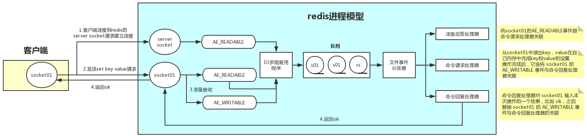

## 进程模型

**Redis**服务端采用**NIO**，其进程模型采用多路复用模型中**Reactor**模型，**Reactor**模型主要分为2部分。

### 事件

多路复用模型由事件驱动，**Redis**定义了多种事件即相应的事件处理器。

- 事件处理器包括：连接应答器，命令请求处理器，命令回复处理器。

### 事件分发器

**Redis**将**Selector**细分为IO多路复用程序和文件事件分派器，并在IO多路复用程序和文件事件分派器之间引入了**队列**来增强处理能力。

- IO多路复用程序负责监听多个**Socket**，将各个**Socket**产生的<u>文件事件</u>放入**队列**中。
- 文件事件分派器会将**队列**中的事件分派给不同的事件处理器处理。

> File Event Handler，也叫做Dispatcher，结合两者，我们将其译为文件事件分派器。

## 处理过程

### 连接的建立

1. **Redis**客户端向服务端请求建立**Socket**，服务端中的IO多路复用程序将请求封装为AE_READABLE事件，并压入队列。
2. 文件事件分派器从队列中取出AE_READABLE事件并将其分派给连接应答器。
3. 连接应答器与客户端建立连接，并将该连接的AE_READABLE事件与命令请求处理器关联。

### 命令的执行

1. 建立连接后的客户端向服务端发送请求，以执行<u>键值对</u>的处理命令，服务端中的IO多路复用程序将请求封装为AE_READABLE事件，放入队列。
2. 分派器从队列中取出AE_READABLE事件，由于该连接已经与命令请求处理器相关联，所以事件会分派给命令请求处理器。
3. 命令请求处理器收到事件后，会从事件中取出（我猜的）<u>键值对</u>处理命令并执行，执行完毕后，会将该连接的AE_WRITABLE事件与命令回复处理器关联。

### 结束通信

1. 当客户端准备好接收返回结果时，也会向服务端发送请求，服务端中的IO多路复用程序将请求封装为AE_WRITABLE事件，并压入队列。
2. 分派器从队列中取出AE_WRITABLE事件，由于该连接已经与命令回复处理器相关联，所以事件会分派给命令回复处理器。
3. 命令回复处理器将<u>键值对</u>的处理结果返回给客户端，并解除该连接的AE_WRITABLE事件与命令回复处理器的关联。

> 此外还有AE_NONE事件，表示该连接没有任何事件。
>
>  事件处理器优先处理读事件。怎么个优先法？

## 与多线程[[1]](https://www.cnblogs.com/gz666666/p/12901507.html)

一般来说，**Redis**的瓶颈不在于CPU，而在于内存和网络。

1. CPU

   1. 由于CPU压力较小，我们可以通过在一台机器上部署多个**Redis**实例来提升对多处理器、多核心的利用率。
   2. 这种多实例的思想与多线程的思想相仿，利用并发来提升对机器资源的利用率。

3. 内存不足其实很容易解决，对硬件进行扩容就行。

3. **Redis**在6.0版本引入了多线程来提升网络IO。
   1. **Redis**的多线程仅限并发写、并发读，而不支持并发的既读又写，其核心仍旧为单线程。
   2. 其实在4.0版本，**Redis**就引入了多线程来提升删除速度。

## 时间事件

除了读写的<u>文件事件</u>，**Redis**中还存在大量<u>时间事件</u>：

1. 更新服务器的各类统计信息，如时间、内存占用、数据库占用等。
2. 清理过期<u>键值对</u>。
3. 关闭和清理失效的连接。
4. 尝试进行持久化。
5. **Master**定期向**Slave**同步。
6. 等等。

<u>时间事件</u>有三个主要属性：

1. `when`：在该时间点执行，为毫秒格式的UNIX时间戳。
2. `timeProc`：事件处理函数。
3. `next`：指向下一个时间事件，形成无序链表。

根据`timeProc`指向的函数的返回值，可将<u>时间事件</u>分为2类：

1. 返回`AE_NOMORE`，则该事件为单次执行事件，执行后会被删除。
2. 返回非`AE_NOMORE`的整数值，则该事件会为循环执行事件，执行完后会更新`when`属性，从而再次执行。

**Redis**中的事件：

1. 一种事件会等待另一种事件执行完毕之后才开始执行，事件之间不会出现抢占。
2. 事件处理器先处理<u>文件事件</u>，即，优先处理命令请求，再执行<u>时间事件</u>。
3. <u>文件事件</u>的等待时间，由距离到达时间最短的<u>时间事件</u>决定。

不难看出，<u>时间事件</u>的处理时间， 通常会比预定的时间要晚。

## 启动过程

[略](https://redisbook.readthedocs.io/en/latest/internal/redis.html)。
