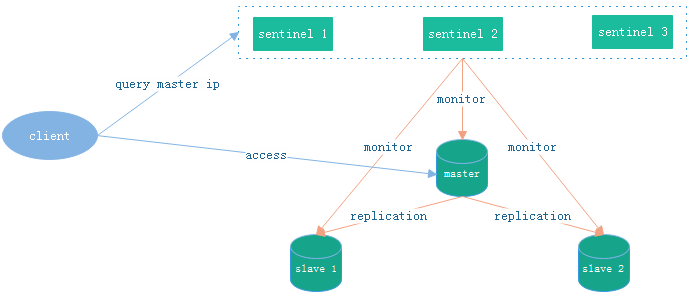
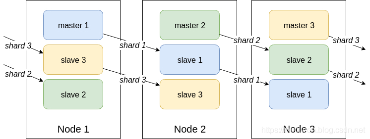

## 客户端分配

**Redis**的分布式模式在最开始时，服务端由多个实例组成，但实例之间毫无联系，由客户端将Key散列到相应实例上。服务端很容易扩展，但每个客户端需要重新调整散列方法，并且数据的备份也会变得复杂。


## 主从模式

另一种分布式模式是一主多从的模式，通过`SLAVEOF`开启。

<u>主从模式</u>往往搭配读写分离，即，**Master**只负责数据的写入，**Slave**提供副本的读取。但由于副本的复制是异步的，故存在延迟，而且，所有的读写分离的方案都会增加系统的复杂度。



如[上图](https://blog.csdn.net/weixin_42711549/article/details/83061052)所示，副本复制的过程：

1. 当**Slave**与**Master**建立连接后，**Slave**会向**Master**发送`SYNC`，请求同步数据。
2.  当**Master**收到请求后，会执行`BGSAVE`生成<span style=background:#b3b3b3>dump.rdb</span>，同时会记录<span style=background:#ffb8b8>此期间</span>收到<span style=background:#ffb8b8>的写命令</span>。
3. 待<span style=background:#b3b3b3>dump.rdb</span>生成后，**Master**会将其发送给**Slave**，当**Slave**收到命令后会加载<span style=background:#b3b3b3>dump.rdb</span>。
4. **Slave**加载完<span style=background:#b3b3b3>dump.rdb</span>后，**Master**会将<span style=background:#ffb8b8>此期间的写命令</span>发送给**Slave**，**Slave**执行会执行<span style=background:#ffb8b8>这些写命令</span>。
5. 之后，每当**Master**收到写命令时，都会增量同步给**Slave**。

> 使用<u>主从模式</u>时，需要开启**Master**的持久化功能，以防止**Master**故障重启后没有快照可读从而缓存为空，进而会导致**Slave**将空缓存同步。
>
> 关于**Slave**与**Master**断开后重连的探讨可查看[文章](https://www.cnblogs.com/lukexwang/p/4711977.html)。

而副本的复制最好以链式进行，而非树式进行，以降低主节点的压力。

不难发现，主从之间存在数据不一致问题。


## Redis Sentinel

**Master**故障后，需要手动切换**Slave**，于是**Redis**便推出了[哨兵模式](https://blog.csdn.net/weixin_42711549/article/details/83061052)。

> **Sentinel**也是分布式的，需要至少3个节点才能保证可用性。

**Redis Sentinel**基于<u>主从模式</u>，即**Master**可读写，**Slave**只读，**Sentinel**会监视节点状态，在**Master**宕机时自动选举新的**Master**，从而自动恢复（Failover）。



### 上线

**Sentinel**<span style=background:#c2e2ff>上线</span>后会向所有的<u>**Master**、**Slave**、其它**Sentinel**</u>发送`MEET`，而它们会回复`PONG`，将自己的状态发送给对方，然后**Sentinel**：

1. 每隔<span style=background:#e6e6e6>10秒</span>，会向所有的<u>**Master**、**Slave**</u>发送`INFO`来获取网络拓扑。

2. 每隔<span style=background:#e6e6e6>2秒</span>，会向所有的<u>**Master**、**Slave**</u>的<span style=background:#b3b3b3>\_sentinel\_:hello</span>频道上发送该**Sentinel**对于**Master**的判断，以及该**Sentinel**自身的信息，其它**Sentinel**会订阅该频道，来了解该**Sentinel**和它对**Master**的判断。

   > Sentinel会发送自己的IP、Port、运行ID、配置版本，以及Master的名字、IP、Port、配置版本等。

3. 每隔<span style=background:#e6e6e6>1秒</span>，会向所有的<u>**Master**、**Slave**、其它**Sentinel**</u>发送`PING`做心跳检测，而它们会回复`PONG`表示可达。

### 下线

**Sentinel**会判断<span style=background:#c2e2ff>下线</span>：

1. <span style=background:#c9ccff>主观下线</span>：**Sentinel**如果没能在额定时间内收到<u>**Master**、**Slave**、其它**Sentinel**</u>的`PONG`，就会<span style=background:#c9ccff>主观</span>上认为这个节点已<span style=background:#c9ccff>下线</span>。

   > <span style=background:#c9ccff>主观下线</span>后，`INFO`的发送间隔会由<span style=background:#e6e6e6>10秒</span>变为<span style=background:#e6e6e6>1秒</span>。

2. <span style=background:#f8d2ff>客观下线</span>：当<span style=background:#c9ccff>主观下线</span>的节点为**Master**时，该**Sentinel**会询问其它**Sentinel**对**Master**的判断，当大多数**Sentinel**都认为**Master**<span style=background:#c9ccff>主观下线</span>时，该**Sentinel**会做出<span style=background:#f8d2ff>客观下线</span>**Master**的决定，并发起选举。

### 选举

**Sentinel**判断**Master**<span style=background:#f8d2ff>客观下线</span>后，会先使用[Raft算法](https://www.cyc2018.xyz/其它/系统设计/分布式.html#六、raft)选出一名**Sentinel Leader**，然后由这名**Leader**根据**Slave**的优先级、复制进度（偏移量）、ID从**Slave**中选出新的**Master**，然后更新所有节点的配置。

> 最先发现**Master**下线的**Sentinel**会进行拉票，若获得半数支持，就会成为**Leader**；如果多个**Sentinel**的票数一样，则会等待随即等待一段时间，发起新一轮选举，直到选出**Leader**。

当所有节点配置更新完后，**Sentinel**会通知客户端节点变更信息，之后客户端会连接新的**Master**。

### [拓展](https://www.cnblogs.com/duanxz/p/4701831.html)

**Sentinel**会设置**Master**的版本号，以保证串行选举**Master**，并且一个能互相通信的**Sentinel**集群最终会采用版本号最高且相同的配置。

当**Master**与集群隔离，且客户端仍在其发送数据，且但集群中选举出了新的**Master**，当旧**Master**的网络恢复而重新加入到集群中时会变为**Slave**，此期间写入的数据就会<u>丢失</u>。这一问题只能能缓解，无法解决。

**Sentinel**的状态会被持久化到<span style=background:#b3b3b3>redis-sentinel.conf</span>中，当**Sentinel**不会把自己的配置告诉其它**Sentinel**，即，需要手动逐个修改**Sentinel**的配置。


## Redis Cluster

**Redis**的<u>主从模式</u>，与**MySQL**的主从类似，存在**难扩展**、**单点**（**Slave**只读，无法分担**Master**的写压力）的问题，称不上真正的集群，于是**Redis**便推出了真正的[集群模式](https://zhuanlan.zhihu.com/p/194143258)：

   

**Redis Cluster**没有引入一致性散列，而是引入了槽（Slot）来解决扩展问题：

1. **Cluster**中有<span style=background:#e6e6e6>16384</span>（<span style=background:#e6e6e6>2^14</span>）个**Slot**，这些**Slot**会均分给每个节点。
2. 客户端将Key进行CRC16校验后，再对<span style=background:#e6e6e6>2^14</span>取余，从而决定放入哪个**Slot**。
3. **Slot**的设定也限制了**Cluster**最多有<span style=background:#e6e6e6>2^14</span>个节点。

> CRC，Cyclic Redundancy Check，循环冗余校验。

**Redis Cluster**至少需要 <span style=background:#e6e6e6>6</span> 个节点，<span style=background:#e6e6e6>3</span> 主 <span style=background:#e6e6e6>3</span> 从。

### 上线

**Cluster**采用<span style=background:#c2e2ff>无中心架构</span>，客户端可以请求**Cluster**中的任意节点，节点会将请求<span style=background:#c2e2ff>转发</span>给正确的节点。

> 每个节点会维护了一个节点数组，数组大小也是16384，用于储存**Slot**对应节点的Host等信息。

**Cluster**中的节点<span style=background:#c2e2ff>上线</span>后，会通过Gossip协议向其它节点发送`MEET`，而其它节点会回复`PONG`，计算**Slot**后会将部分旧数据迁移到新节点中；之后节点间会定期发送`PING`、`PONG`来通信。

> 正在迁移时，若客户端向旧节点请求数据，旧节点会向客户端回复`ASK`重定向请求。
>
> 迁移完后，客户端仍会向旧节点请求数据，旧节点会回复`MOVED`表示数据已迁移。

### 下线

**Cluster**中的节点会判断其它节点是否<span style=background:#c2e2ff>下线</span>：

1. <span style=background:#c9ccff>主观下线</span>：当某一节点在指定时间内一直没能回复当前节点时，当前节点会将该节点标记为<span style=background:#c9ccff>主观下线</span>，并散布该消息。
2. <span style=background:#f8d2ff>客观下线</span>：当超过**Slot**的半数的节点都标记该节点为<span style=background:#c9ccff>主观下线</span>时，<span style=background:#c9ccff>主观下线</span>也就升级为了<span style=background:#f8d2ff>客观下线</span>，**Cluster**会自动**Failover**。

### 选举

如果**Slave**与**Master**断开超过指定时间，则不具备<span style=background:#c2e2ff>资格</span>；否则，等待一段时间后才开始选举。

选择复制进度（偏移量）最小的**Slave**投票，当赞成的**Master**超过半数时，该**Slave**就当选了，会切换为**Master**。

### 补充

**Cluster**解决了**Sentinel**存在的<u>难扩展</u>、<u>单点</u>问题，但：

1. **Slave**只充当<span style=background:#c2e2ff>冷备</span>，不能分担**Master**的读压力。

2. 运维复杂：数据迁移过程中如果某个**Slot**正在被操作，则会导致迁移报错，需要人工干预。

3. 分布式逻辑和存储模块耦合。

   > 无法使用`SACN`全部数据，只能[遍历节点](https://www.cnblogs.com/williamjie/p/11132211.html#3.6 多节点命令实现)，逐个扫描，或者使用hash_tag（会增加维护开销）。

4. 功能受限，只能使用0号数据库，且不支持**Pipeline**。


可在客户端保存**Slot**和节点组的映射关系，并为每个节点组创建一个JedisPool来改善性能，减轻**Cluster**的路由压力。


## 切片集群

**Redis Sharding**是**Redis Cluster**出来之前，普遍使用集群方案。

**Redis Sharding**中的节点相互独立、没有关联，客户端会根据配置将Key<span style=background:#c2e2ff>散列</span>射到特定的节点上。

扩展成本由服务端（节点）<span style=background:#c2e2ff>转嫁</span>到了客户端；连接不能共享，占用资源。

Jedis提供了支持**Redis Sharding**，提供ShardedJedis、ShardedJedisPool类。

> Jedis是**Redis**推出Java版的客户端，提供了比较全面的**Redis**命令。


## 代理

**Redis Sharding**难以扩展，于是便有了<u>代理服务器</u>，即，所有的客户端通过代理服务器来访问服务端，由Key散列也交由代理负责，但显然性能会有所损耗。

豌豆荚的Codis就是一个**Redis**代理，包含4部分：

1. Zookeeper：存放路由信息。
2. Codis Proxy：代理服务器，对客户端来说，和直接访问**Redis**单例没有区别。
3. Codis Server：一个**Redis**分支。
4. Codis Dashboard：管理工具，用于增删Proxy、Server节点，以及数据迁移。

| 维度         | Codis                                                        | Redis Cluster            |
| ------------ | ------------------------------------------------------------ | ------------------------ |
| 路由信息     | 保存在**Zookeeper**中，代理服务器会在本地缓存                | 每个节点都会保存         |
| 扩容         | 同时增加Codis Server和Codis Proxy                            | 仅需增加Redis实例        |
| 迁移         | 同步迁移、异步迁移                                           | 同步迁移                 |
| Pipeline     | 支持                                                         | 不支持                   |
| 均衡数据分布 | 根据节点内存，自动对**Slot**进行迁移                         | 没有对**Slot**作额外处理 |
| 可靠性       | Codis Server：主从集群保障可靠性<br/>Codis Proxy：无状态设计，故障后重启即可<br/>Zookeeper：可靠性高 | 有相关机制               |


## 分布式锁

**Redis**单机 / 主从[可以作为分布式锁](https://mp.weixin.qq.com/s?__biz=MzA4NTg1MjM0Mg==&mid=509777776&idx=1&sn=e56f24bdf2de7e25515fe9f25ef57557&mpshare=1&scene=1&srcid=1010obMrtv58nLkdNhXXmSuL&key=c50f8b988e61749a258b35d3a186a3d12448d4e9d7ce7b09f4aa5881726ff3f2091ab64e975692dcbdae4f56d3fb1530&ascene=0&uin=MzM4Njg2NDU1)。

#### 加锁

`SET resource_name random_value NX PX 30000`

1. `random_value`
   1. 由客户端生成随机字符串；
   2. 用于保证一段时间内所有客户端的所有加锁的请求都是唯一的。
2. `NX`
   1. 只有当Key（`resource_name`）不存在时，才能`SET`成功。
   2. 进而保证了只有第一个请求的客户端才能获得锁，其它客户端在锁被释放之前都无法获得锁。
3. `PX 30000`
   1. 锁在<span style=background:#e6e6e6>30000毫秒</span>后自动失效。
      1. [也可使用](https://redis.io/commands/set)`EX 30`（<span style=background:#e6e6e6>30秒</span>）来替换。
   2. 锁的失效时间没有通用设置：过短，会导致业务逻辑没执行完；过长，会降低并发量。
      1. 可通过设置较短的超时时间，并增加`WATCH`和有限重试，来防止锁失效，或被异常释放。

#### 解锁

解锁需要使用Lua：

```lua
if redis.call("get",KEYS[1]) == ARGV[1] then // 将resource_name作为KEYS[1]、random_value作为ARGV[1]传入
    return redis.call("del",KEYS[1])
else
    return 0
end
```

<span style=background:#fdc200>注意</span>，不要使用`SETNX`、`EXPIRE`加锁和`GET`、`DEL`解锁的方式，因为一组**Redis**命令不具有原子性。

> 不具有原子性会导致`GET`时锁可能已经失效等问题。

**Redis**单机可以提供分布式锁，因为它是串行的；但<u>主从模式</u>中，**Redis**的主从复制（Replication）是异步的，这可能导致**Failover**时丧失锁的安全性；而**Redis Cluster**存在脑裂问题，无法提供分布式锁。


## Red Lock

**Red Lock**是官方提供的分布式锁，具有互斥、避免死锁、良好的容错特性，保证了**Failover**时锁的安全性。

**Red Lock**可使用Redisson + Lua来实现。

> Redisson也是**Redis**推出的Java版的客户端，还可用于实现公平锁、联锁、读写锁、**CountDownLatch**。
>

#### 加锁

客户端运行如下算法来加锁：

<span style=background:#e6e6e6>Step1.</span>  获取当前时间，单位毫秒。

<span style=background:#e6e6e6>Step2.</span>  依次访问集群中的所有节点来加锁，加锁命令还是上面的加锁命令。但加锁时会设置一个有效时间，它远小于<span style=background:#c9ccff>锁的有效时间</span>，以保证客户端在某个节点解锁失败时能立即尝试下一个节点。

<span style=background:#e6e6e6>Step3.</span>  计算整个<span style=background:#f8d2ff>加锁过程消耗的时间</span>，即，用当前时间减去<span style=background:#e6e6e6>Step1.</span>中的时间，如果<span style=background:#f8d2ff>加锁消耗的时间</span>没有超过<span style=background:#c9ccff>锁的有效时间</span>，且客户端在半数以上节点上成功加锁，则加锁成功；否则向所有节点解锁。

<span style=background:#e6e6e6>Step4. </span>  加锁成功后，需要更新<span style=background:#c9ccff>锁的有效时间</span>，即扣除<span style=background:#e6e6e6>Step3.</span>中<span style=background:#f8d2ff>加锁消耗的时间</span>。

#### 解锁

解锁过程比较简单，客户端向集群中的所有节点发送解锁Lua，不管之前是否在当前节点成功加锁。

#### 局限

<span style=background:#e6e6e6>Step4. </span>中更新后的<span style=background:#c9ccff>锁的有效时间</span>的长短没有通用标准。（多短算短，多长算长？）


## [Red Lock安全吗？](https://mp.weixin.qq.com/s?__biz=MzA4NTg1MjM0Mg==&mid=2657261521&idx=1&sn=7bbb80c8fe4f9dff7cd6a8883cc8fc0a&chksm=84479e08b330171e89732ec1460258a85afe73299c263fcc7df3c77cbeac0573ad7211902649&scene=21#wechat_redirect)

Martin Kleppmann在《[How to do distributed locking?](https://martin.kleppmann.com/2016/02/08/how-to-do-distributed-locking.html)》中指出：

1. **Red Lock**基于同步模型，且对时钟的依赖较强，无法保证某些场景下共享资源的安全访问（没有了锁的保护）：
   1. 如客户端长期阻塞（**GC Pause**、网络波动都算）导致锁过期，此时其它客户端成功加锁，而该客户端从阻塞中恢复后，<span style=background:#d4fe7f>仍然认为自己持有锁</span>。单机**Redis**作分布式锁时，同样存在该问题。
   2. 如**Cluster**中网络故障，且有节点发生时钟向前跳跃所引发的脑裂的问题，进而导致多个客户端同时认为自己加锁成功。
2. 时钟依赖问题，可通过乐观锁的方式改进，即客户端获取锁后会得到一个单调递增的版本号，每次请求节点是都会携带版本号供节点校验。
3. 一个好的分布式算法，应该基于异步模型，且算法的安全性不应依赖于任何记时假设，如，**Paxos**、**Raft**。时间因素不应该影响算法的安全性，只可能影响到算法的“活性”，即，即使在非常极端的情况下（比如系统时钟严重错误），算法顶多是不能在有限的时间内给出结果而已，而不应该给出错误的结果。

Martin还认为锁分为2种：

1. 为了效率
   1. 锁用于协调各个客户端避免做重复的工作。
   2. 即使锁偶尔失效了，也只是可能把某些操作多做一遍而已，不会产生其它的不良后果，如，重复发送了Email。
   3. **Redis**单机 / 主从就足够了。
2. 为了正确性
   1. 在任何情况下都不允许锁失效，以避免数据不一致、丢失、损坏或者其它严重的问题。
   2. 不要使用**Red Lock**，它不是强一致性的，应使用**Zookeeper**、数据库事务等方案。

但Antirez显然不同意，他认为**Red Lock**和其它分布式锁方案一样安全，或者说**Zookeeper**没比**Red Lock**安全到哪儿去。

Antirez认为，如果引入“单调递增的版本号”，即资源服务器（如，MySQL）都已经提供互斥的原子操作了，那就直接不需要使用分布式锁；并且**Red Lock**的随机字符串（`random_value`）虽然不是递增的，但却是唯一的，可以达到与之相同的效果。

Antirez关于时钟依赖的看法：

1. 时钟跳跃
   1. 这确实会引起**Red Lock**的异常，所以我们应该使用渐进式时钟调整。
2. GC Pause、网络延迟
   1. **Red Lock**对此有一定的免疫力。
