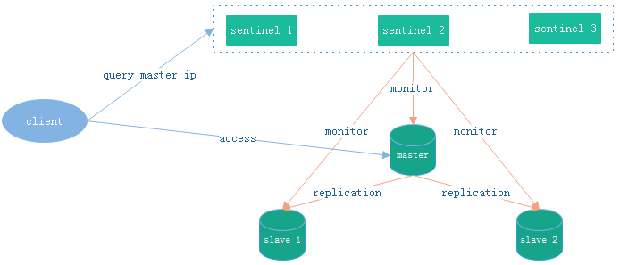
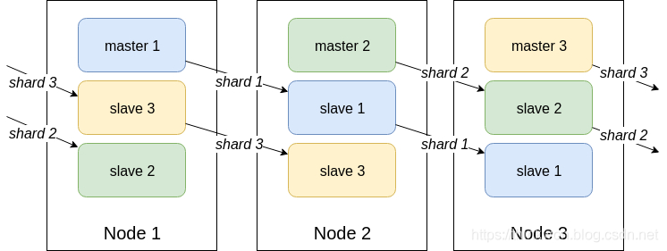

## 客户端分配

**Redis**的分布式模式在最开始时，服务端由多个实例组成，但实例之间毫无联系，由客户端将Key散列到相应实例上。

服务端很容易扩展，但每个客户端需要重新调整散列方法，并且数据的备份也会变得复杂。

## 主从模式🌙

另一种分布式模式是一主多从的模式，通过`SLAVEOF`开启。

### 同步

如[下图](https://blog.csdn.net/weixin_42711549/article/details/83061052)所示，副本的同步过程为：

1. 当**Slave**与**Master**建立连接后，**Slave**会向**Master**发送`SYNC`，请求同步数据。
2. 当**Master**收到请求后，会执行`BGSAVE`生成`dump.rdb`，同时会记录此期间收到的写命令。
3. 待`dump.rdb`生成后，**Master**会将其发送给**Slave**，当**Slave**收到命令后会加载`dump.rdb`。
4. **Slave**加载完`dump.rdb`后，**Master**会将此期间的写命令发送给**Slave**，**Slave**执行会执行这些写命令。
5. 之后，每当**Master**收到写命令时，都会增量同步给**Slave**。

### 挑战

<u>主从模式</u>往往搭配读写分离，即，**Master**只负责数据的写入，**Slave**提供副本的读取。

- 但由于副本的同步是异步的，故存在延迟，而且，所有的读写分离的方案都会增加系统的复杂度。
- 延迟的存在带来了主从之间数据不一致的风险，根据需要可忽略以等待最终一致，或者使用**Red Lock**实现强一致性。

> 使用<u>主从模式</u>时，需要开启**Master**的持久化功能，以防止**Master**故障重启后没有快照可读从而缓存为空，进而会导致**Slave**将空缓存同步。
>
> 副本的复制最好以链式进行，而非树式进行，以降低主节点的压力。
>
> 关于**Slave**与**Master**断开后重连的探讨可查看[文章](https://www.cnblogs.com/lukexwang/p/4711977.html)。

## Redis Sentinel

**Master**故障后，需要手动切换**Slave**，于是**Redis**便推出了[哨兵模式](https://blog.csdn.net/weixin_42711549/article/details/83061052)。

> **Sentinel**也是分布式的，需要至少3个节点才能保证可用性。

**Redis Sentinel**基于<u>主从模式</u>，即，**Master**可读写，**Slave**只读，**Sentinel**会监视节点状态，在**Master**宕机时自动选举新的**Master**，从而自动恢复（Failover）。

### 上线

**Sentinel**上线后会向所有的<u>**Master**、**Slave**、其它**Sentinel**</u>发送`MEET`，而它们会回复`PONG`，将自己的状态发送给对方，然后**Sentinel**：

1. 每隔`10秒`，会向所有的<u>**Master**、**Slave**</u>发送`INFO`来获取网络拓扑。

2. 每隔`2秒`，会向所有的<u>**Master**、**Slave**</u>的`_sentinel_:hello`频道上发送该**Sentinel**对于**Master**的判断，以及该**Sentinel**自身的信息，其它**Sentinel**会订阅该频道，来了解该**Sentinel**和它对**Master**的判断。

   > **Sentinel**会发送自己的IP、Port、运行ID、配置版本，以及**Master**的名字、IP、Port、配置版本等。

3. 每隔`1秒`，会向所有的<u>**Master**、**Slave**、其它**Sentinel**</u>发送`PING`做心跳检测，而它们会回复`PONG`表示可达。

### 下线

**Sentinel**会判断下线：

1. 主观下线：**Sentinel**如果没能在额定时间内收到<u>**Master**、**Slave**、其它**Sentinel**</u>的`PONG`，就会主观上认为这个节点已下线。

   > 主观下线后，`INFO`的发送间隔会由`10秒`变为`1秒`。

2. 客观下线：当主观下线的节点为**Master**时，该**Sentinel**会询问其它**Sentinel**对**Master**的判断，当大多数**Sentinel**都认为**Master**主观下线时，该**Sentinel**会做出客观下线**Master**的决定，并发起选举。

### 选举

**Sentinel**判断**Master**客观下线后，会先使用[Raft算法](https://www.cyc2018.xyz/其它/系统设计/分布式.html#六、raft)选出一名**Sentinel Leader**，然后由这名**Leader**根据**Slave**的优先级、复制进度（偏移量）、ID从**Slave**中选出新的**Master**，然后更新所有节点的配置。

> 最先发现**Master**下线的**Sentinel**会进行拉票，若获得半数支持，就会成为**Leader**；如果多个**Sentinel**的票数一样，则会等待随即等待一段时间，发起新一轮选举，直到选出**Leader**。

当所有节点配置更新完后，**Sentinel**会通知客户端节点变更信息，之后客户端会连接新的**Master**。

### 拓展[[1]](https://www.cnblogs.com/duanxz/p/4701831.html)

**Sentinel**会设置**Master**的版本号，以保证串行选举**Master**，并且一个能互相通信的**Sentinel**集群最终会采用版本号最高且相同的配置。

当**Master**与集群隔离，且客户端仍在其发送数据，且但集群中选举出了新的**Master**，当旧**Master**的网络恢复而重新加入到集群中时会变为**Slave**，此期间写入的数据就会<u>丢失</u>。这一问题只能能缓解，无法解决。

**Sentinel**的状态会被持久化到`redis-sentinel.conf`中，当**Sentinel**不会把自己的配置告诉其它**Sentinel**，即，需要手动逐个修改**Sentinel**的配置。

## Redis Cluster

**Redis**的<u>主从模式</u>，与**MySQL**的主从类似，存在**难扩展**、**单点**（**Slave**只读，无法分担**Master**的写压力）的问题，称不上真正的集群，于是**Redis**便推出了真正的[集群模式](https://zhuanlan.zhihu.com/p/194143258)：

   

**Redis Cluster**没有引入一致性散列，而是引入了槽（Slot）来解决扩展问题：

1. **Cluster**中有`16384`（`2^14`）个**Slot**，这些**Slot**会均分给每个节点。
2. 客户端将Key进行CRC16校验后，再对`2^14`取余，从而决定放入哪个**Slot**。
3. **Slot**的设定也限制了**Cluster**最多有`2^14`个节点。

> CRC，Cyclic Redundancy Check，循环冗余校验。

**Redis Cluster**至少需要 `6` 个节点，`3` 主 `3` 从。

### 上线

**Cluster**采用无中心架构，客户端可以请求**Cluster**中的任意节点，节点会将请求转发给正确的节点。

> 每个节点会维护了一个节点数组，数组大小也是`16384`，用于储存**Slot**对应节点的Host等信息。

**Cluster**中的节点上线后，会通过Gossip协议向其它节点发送`MEET`，而其它节点会回复`PONG`，计算**Slot**后会将部分旧数据迁移到新节点中；之后节点间会定期发送`PING`、`PONG`来通信。

> 正在迁移时，若客户端向旧节点请求数据，旧节点会向客户端回复`ASK`重定向请求。
>
> 迁移完后，客户端仍会向旧节点请求数据，旧节点会回复`MOVED`表示数据已迁移。

### 下线

**Cluster**中的节点会判断其它节点是否下线：

1. 主观下线：当某一节点在指定时间内一直没能回复当前节点时，当前节点会将该节点标记为主观下线，并散布该消息。
2. 客观下线：当超过半数的节点都标记该节点为主观下线时，主观下线也就升级为了客观下线，**Cluster**会自动**Failover**。

### 选举

如果**Slave**与**Master**断开超过指定时间，则不具备资格；否则，等待一段时间后才开始选举。

选择复制进度（偏移量）最小的**Slave**投票，当赞成的**Master**超过半数时，该**Slave**就当选了，会切换为**Master**。

### 补充

**Cluster**解决了**Sentinel**存在的<u>难扩展</u>、<u>单点</u>问题，但：

1. **Slave**只充当冷备，不能分担**Master**的读压力。

2. 运维复杂：数据迁移过程中如果某个**Slot**正在被操作，则会导致迁移报错，需要人工干预。

3. 分布式逻辑和存储模块耦合。

   > 无法使用`SACN`全部数据，只能[遍历节点](https://www.cnblogs.com/williamjie/p/11132211.html#3.6 多节点命令实现)，逐个扫描，或者使用hash_tag（会增加维护开销）。

4. 功能受限，只能使用0号数据库，且不支持**Pipeline**。

可在客户端保存**Slot**和节点组的映射关系，并为每个节点组创建一个JedisPool来改善性能，减轻**Cluster**的路由压力。

## 切片集群

**Redis Sharding**是**Redis Cluster**出来之前，普遍使用集群方案。

**Redis Sharding**中的节点相互独立、没有关联，客户端会根据配置将Key散列射到特定的节点上。

扩展成本由服务端（节点）转嫁到了客户端；连接不能共享，占用资源。

Jedis提供了支持**Redis Sharding**，提供ShardedJedis、ShardedJedisPool类。

> Jedis是**Redis**推出Java版的客户端，提供了比较全面的**Redis**命令。

## 代理

**Redis Sharding**难以扩展，于是便有了<u>代理服务器</u>，即，所有的客户端通过代理服务器来访问服务端，由Key散列也交由代理负责，但显然性能会有所损耗。

豌豆荚的Codis就是一个**Redis**代理，包含4部分：

1. **Zookeeper**：存放路由信息。
2. **Codis Proxy**：代理服务器，对客户端来说，和直接访问**Redis**单例没有区别。
3. **Codis Server**：一个**Redis**分支。
4. **Codis Dashboard**：管理工具，用于增删Proxy、Server节点，以及数据迁移。

| 维度         | Codis                                                        | Redis Cluster            |
| ------------ | ------------------------------------------------------------ | ------------------------ |
| 路由信息     | 保存在**Zookeeper**中，代理服务器会在本地缓存                | 每个节点都会保存         |
| 扩容         | 同时增加**Codis Server**和**Codis Proxy**                    | 仅需增加**Redis**实例    |
| 迁移         | 同步迁移、异步迁移                                           | 同步迁移                 |
| Pipeline     | 支持                                                         | 不支持                   |
| 均衡数据分布 | 根据节点内存，自动对**Slot**进行迁移                         | 没有对**Slot**作额外处理 |
| 可靠性       | **Codis Server**：主从集群保障可靠性 **Codis Proxy**：无状态设计，故障后重启即可 **Zookeeper**：可靠性高 | 有相关机制               |

