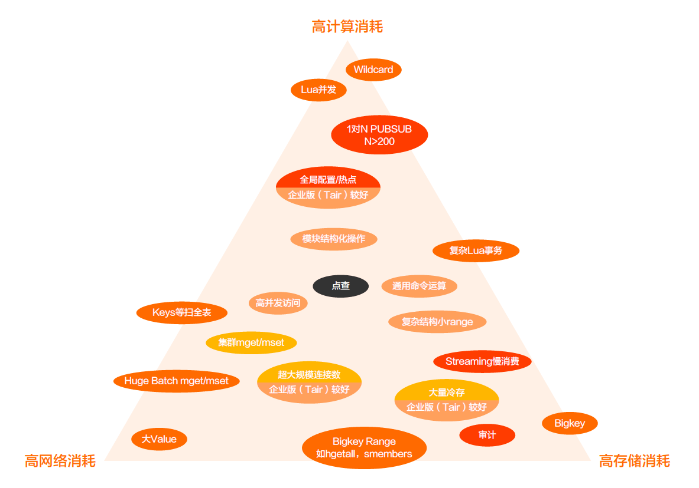

## 概要

[上面的图片](https://developer.aliyun.com/article/783820)从计算、存储、网络三个维度出发，总结了开发过程中，不要触碰的边界，也就是：

- 计算方面：Wildcard、**Lua**并发、1对N PUBSUB、全局配置/热点。
- 存储方面：Streaming慢消费、Big Key等。
- 网络方面：`KEYS`等扫全表、Huge Batch`MGET`/`MSET`、大Value、Big Key Range（`HGETALL`、`SMEMBERS`）。

> 高并发不等于高吞吐。
>
> **Redis**在高负载下的瓶颈一般集中在网络IO上。
>
> 永远不要强依赖Cache，它会丢，也会被淘汰。

## Big Key

**Big Key**指的是Key对应的Value比较大：

- 虽然**String**类型的Value最大可存储`512MB`的值，但当Value超过`10KB`时，我们就会认为是**Big Key**；
- 虽然**List**类型的Value最多可以存储`2^32`个元素，但是当元素数量超过`2.5亿`时，我们就会认为是**Big Key**。

据阿里云统计，`80%`的问题是由**Big Key**导致。

**Big Key**会造成：

1. 内存空间不均匀（数据倾斜）。
2. 操作耗时（变慢）。
3. 存在网络阻塞风险。
    1. 如，对一个`1MB`的数据每秒访问`1000次`，就会产生`1000MB`的流量。

**Big Key**可用以下方式发现：

1. 使用`redis-cli --bigkeys`。

2. 使用`SCAN`扫描Key，然后使用`DEBUG OBJECT Key`判断Key的大小。

   > `KEYS pattern`开销大，线上往往禁用，所以才用`SCAN`，分批次扫描。

3. 使用`STRLEN`判断当前Key的大小。

找出**Big Key**后将其删除。

## 慎用Lua

一般来说，不建议在**Redis**里面使用**Lua**，因为**Lua**需要先解析、翻译，然后才能执行：

1. 在**Redis**中调用**Lua**，等于是在C里面调**Lua**，然后**Lua**里面再去调C，即，返回值会有两次的转换，先从**Redis**协议返回值转成**Lua**对象，再由**Lua**对象转成C的数据返回。
2. 因为**Redis**是单线程的，当CPU被耗在**Lua**的时候，只有更少的CPU处理业务命令。
3. 有很多**Lua**解析、VM处理，包括`Lua.vm`内存占用，会比一般的命令时间慢。

如果要在**Redis**中使用**Lua**：
1. 最好只写比较简单的，比如`if`判断。
2. 尽量避免循环，尽量避免重的操作，尽量避免大数据访问、获取。

或者先对**Lua**进行预编译和加载，不会`unload`和`clean`，然后使用`EVALSHA`执行，这样会比纯`EVAL`省CPU。
- 但要注意，**Redis**在重启、切换、变配后，字节码缓存会失效，需要`reload`，所以这种方式仍然存在缺陷，建议使用复杂数据结构，或者使用`module`来取代**Lua**。

## 危险命令

**Redis**中的一些命令很危险，一定会出问题，即使当前没有，当数据量上涨后必然引发慢查，出现后无能为力，所以应在一开始就禁用危险命令，出现时也可以使用一些手段优化。

### KEYS

**Redis**存储Key是无序的，使用`KEYS`匹配时必然全表扫描，数据量一多必然卡住。 

如果可以，**String**类型的数据可以改为**Hash**类型，这样就能将<u>全表扫描</u>变为<u>点查</u>、<u>范围扫描</u>。 虽然**Hash**中字段太多也会慢，但与`KEYS`相比，性能可以提升一个到两个数量级。

### 其它范围扫描

`HGETALL`、`SMEMBERS`、`LRANGE`、`ZRANGE`、`EXHGETALL`等命令直接与数据结构的字段（field/subkey）的多少有关，时间复杂度为`O(n)`，比较占用网卡存储。

可使用`SCAN`进行代替。

### 清理

`FLUSHALL`、`FLUSHDB`会清空数据库，造成数据丢失，要慎用。

### BIT

`BITOP`、`BITSET`：设置过远的BIT或直接导致**OOM**。

