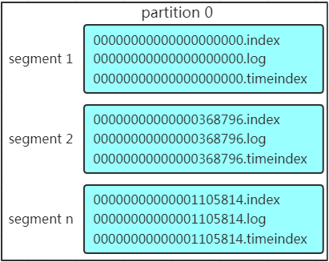
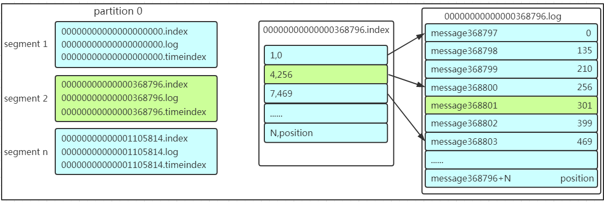

## 消息队列

消息队列有2个主要作用： 解耦和异步。

> 异步会进一步发挥缓冲、削峰等作用。

消息队列有单播（点对点）、广播（订阅/发布）两种模式。

消息队列可用于：日志收集、用户活动跟踪、消息发送、运营指标（监控、报警）、流式处理、事件源等场景。


## 关于数据结构⭐

### 分区

一个**Topic**可以切分为多个**Partition**，方便横向扩展，每个**Partition**在磁盘上对应的是一个的目录，在这个目录中存储着多组**Segment**文件。

每个**Partition**内的**Message**都是有序的，但是**Partition**间的**Message**显然是无序的。

> **Kafka**使用追加写的方式，并发读写不会相互阻塞。

**Kafka**将消息的<span style=background:#d4fe7f>负载均衡</span>分别交由**Producer**、**Consumer**来完成，而非**Broker**。

### 副本

**Partition**其实分为2种：**Primary Partition**和**Replicative Partition**。

> **Replicative Partition**，也被称为**Replication**，简称**Replic**。

每个**Primary Partition**可以有多个**Replication**，用于容灾，**Replication**的数量不大于**Broker**的数量。

### 分区和副本

**Partition**和**Replication**的按照如下算法分配到**Broker**上：

1. 将**Broker**（`size = n`）和待分配的**Partition**排序。
2. 将第`i`个**Partition**分配到第`i % n`个**Broker**上。
3. 将第`i`个**Partition**的第`j`个**Replication**分配到第`(i + j) % n`个**Broker**上。

### 段

如[下图](https://www.cnblogs.com/sujing/p/10960832.html)所示，**Segment**按**Offset**有序排列。

**Segment**是一个逻辑概念，**Partition**是由若干个**Segment**组成，而每个**Segment**由3个相同名称的文件组成，包括2个索引文件（`*.index`、`*.timeindex`）和1个日志文件（`*.log`）组成。

> 索引文件用于检索**Message**，而日志文件用于保存**Message**。

**Segment**的大小达到阈值后，**Broker**不会继续写入，而是创建新的**Segment**。



### 消息

**Message**的存储策略有基于时间、基于大小两种。

> 删除旧数据不会提升**Kafka**的传输效率，只是释放了磁盘空间。

**Message**由以下属性组成：

| 属性名         | 大小   | 描述                                     |
| -------------- | ------ | ---------------------------------------- |
| offset         | 8 Byte | 偏移量，有序ID                           |
| message size   | 4 Byte | 消息大小                                 |
| CRC32          | 4 Byte | 用于校验（校验不通过的消息会被直接丢弃） |
| magic          | 1 Byte | 协议版本号                               |
| attributes     | 1 Byte | 独立版本、标识压缩类型、编码类型         |
| key            | K Byte | 可选                                     |
| key length     | 4 Byte | Key的长度；当length为 `-1` 时，Key可不填 |
| payload length | 4 Byte | 消息体大小                               |
| payload        | 任意   | 消息体                                   |


## 关于角色

### 经纪人

消息队列服务器。

**Broker**根据持有的**Partition**的主副类型，分为**Leader**、**Follower**2种<span style=background:#c2e2ff>角色</span>：

1. 拥有**Primary Partition**的**Broker**被称为该**Partition**的**Leader**。
2. 拥有**Replication**的**Broker**被称为该**Partition**的**Follower**。
3. 整个**Broker Cluster**是无主的，**Leader**、**Follower**仅针对**Partition**而言。

任一**Broker**都可以向**Producer**提供包含“存活的**Broker**列表”、“**Partition Leader**列表”等Metadata，**Producer**会根据这些Metadata与**Topic**中的所有**Partition Leader**保持连接，并将**Message**<span style=background:#c2e2ff>直接</span>通过**Socket**发送给对应的**Broker**，中间不会经过任何“路由层”。

### 生产者

生产**Message**，推送到消息队列。

**Producer**[会使用](https://cloud.tencent.com/developer/article/1657649)`DefaultPartitioner`来<span style=background:#d4fe7f>均衡</span>**Message**在**Partition**上的分布，[规则如下](https://blog.csdn.net/suifeng3051/article/details/48053965)：

1. 如果**Message**没有指定**Partition**，但设置了Key，则会根据Key散列到相应的**Partition**。
3. 如果**Message**没有指定**Partition**，也未设置Key，则会[轮流](../04、Network/5.1 Nginx的常用配置#轮替轮转轮流roundrobin）默认）)选出一个**Partition**。

另外开发者也可以指定`HashPartitioner`，或直接通过`Partitioner`接口实现自定义的<span style=background:#d4fe7f>均衡</span>（分区）方法。

### 消费者

**Kafka**采用**Pull**的方式消费。

> - Push方式：
>   - 主动权在**Broker**，会增加**Broker**的负载；
>   - 如果**Consumer**消化不良，还可能把**Consumer**给撑死，同时引起消息堆积；
>   - 不易实现顺序消费；
>   - 但消息比较及时。
> - Pull方式：
>   - 主动权在**Consumer**，可以按需消费；
>   - Pull频率一提高，**Broker**的压力就会增大；
>   - [还需考虑长连接、忙等待/延迟等问题](https://tech.meituan.com/2016/07/01/mq-design.html#消息延迟与忙等)。

**Consumer**有2套API可选：

1. ##### Sample-API
   
   1. 维持和单一**Broker**的无状态连接，每次请求都需要指定**Offset**，比较灵活。
2. ##### High-Level API
   
   1. 封装了对整个**Cluster**的连接，并维护自己**Offset**。
      1. 早期版本中使用**Zookeeper**维护。
      2. 后期版本，**Consumer**会用`__consumer_offsets`主题维护自己的**Offset**：以包含**Consumer Group**、**Topic**、**Partition**的三元组作为Key，直接提交到`compacted topic`中。
   2. 以**Consumer Group**为基础。

> High-Level API、Simple API都可以选择自动提交或手动提交。

### 消费者组

**Consumer Group**由多个**Consumer**组成，用于实现消费过程的<span style=background:#d4fe7f>负载均衡</span>。

**Consumer Group**中的**Consumer**[按照一定的策略来分配](https://www.cnblogs.com/hzmark/p/sticky_assignor.html)**Partition**，默认策略为**RangeAssignor**，其算法为：

```js
function assign(topic, consumers) {
  // 按照名称的字典序，对Partition和Consumer进行排序
  let partitions = topic.getPartitions();
  sort(partitions);
  sort(consumers);

  // 计算每个Consumer分配的分区数
  let numPartitionsPerConsumer = partition.size() / consumers.size(); 
  // 部分Consumer会额外分配一些Partition
  let consumersWithExtraPartition = partition.size() % consumers.size();
  // 计算分配结果
  consumers.forEach((v, i) => {
    // 第i个Consumer分配到的Partition的index
    let start = numPartitionsPerConsumer * i + Math.min(i, consumersWithExtraPartition);
    // 第i个Consumer分配到的分区数
    let length = numPartitionsPerConsumer + (i + 1 < consumersWithExtraPartition ? 1 : 0);
    // 分装分配结果
    assignment.get(consumersForTopic.get(i)).add(partitions.slice(start, start + length));
  }
}
```

上述过程可以以另一种方式进行描述：

1. 当组内的**Consumer**数量大于**Partition**数量时，多出来的**Consumer**不会工作。

2. 当组内的**Consumer**数量等于**Partition**数量时，一个**Consumer**只会<span style=background:#d4fe7f>专注</span>消费一个**Partition**。

   > 此时如果**Producer**通过Key将**Message**发送到指定的**Partition**，就能做到<span style=background:#19d02a>顺序消费</span>，如，将`user_id`作为Key。
   >
   > 另一种实现<span style=background:#19d02a>顺序消费</span>的做法是，只为**Topic**创建一个**Partition**。

3. 当组内的**Consumer**数量小于**Partition**数量时，**Consumer**会读取不同的**Partition**，负载不均衡。

   1. 由于不能整除，“多出来”、字典序靠前的**Partition**，总是会被分配给字典序靠前的**Consumer**。
   2. 不难想象，随着**Partition**分配不均的**Topic**的增多，负载不均的问题会不断增强。

“负载不均”不断增强的一个原因是**RangeAssignor**只针对单个**Topic**的**Partition**；如果我们扩大**Topic**的**Partition**的范围再来分配，就能缓解这一问题，于是便有了**RoundRobinAssignor**、**StickyAssignor**。

新加入的**Partition**不会同步（迁移）旧**Message**，但会触发**Partition**在**Consumer Group**成员上的的再分配（**Rebalance**）。

> **Consumer**的**Rebalance**在早期版本中使用**Zookeeper**维护；后期改为Metadata API。


## Kafka与Zookeeper

**Producer**：使用**Zookeeper**来发现**Broker**，以便和**Topic**下每个**Partition Leader**建立连接。

**Broker**：使用**Zookeeper**来注册自己，以监测**Partition Leader**。

**Consumer**：使用**Zookeeper**来注册自己，包括自己订阅的**Topic**、消费的**Partition**列表等，并监测**Consumer Group**、**Broker**、**Partition**，以便和**Topic**下每个**Partition Leader**建立连接，以及发生变化时进行**Rebalance**。

**Consumer Group**：使用**Zookeeper**保存每个**Partition**的**Consumer**的ID和**Offset**。

**Controller**：使用**Zookeeper**选举**Leader**，并通知各个**Broker**。


## 选举

**Leader**的[选举大致过程为](https://matt33.com/2018/06/15/kafka-controller-start/)：

1. **Broker**通过在**Zookeeper**中抢注临时节点的方式选出一个**Controller**。

2. **Controller**会Watch其它的**Broker**，当发现没有**Leader**（如**Leader**宕机）时，就会从**ISR**中选择一个**Broker**作为**Leader**。

   > ISR，In-Sync Replica，可靠从属节点列表，通过配置“列表最小数量”（`min.insync.replicas`）来开启。
   >
   > `min.insync.replicas`仅在`request.required.acks = -1`时生效。
   >
   > 当ISR中的**Replication**数量小于`min.insync.replicas`时，**Partition**仅提供读服务。
   >
   > **Leader**仍在**ISR**中，**ISR**针对的是**Partition**而非**Topic**。
   >
   > OSR，Outof-Sync Replica，不在**ISR**中的**Broker**会被放入**OSR**。

3. 如果**ISR**中的**Broker**都宕机，或者**ISR**未开启，**Kafka**会选择一个幸存的**Broker**作为**Leader**。

   > 如果`unclean.leader.election.enable=false`，那么情况会不同。

4. 如果没有**Broker**幸存，**Kafka**会将第一个恢复的**Broker**作为**Leader**。

5. 如果该**Broker**不在**ISR**中的，**Kafka**会将其标记，待**ISR**中的任一**Broker**恢复后，将**ISR**中的**Broker**设为**Leader**。

> 当**Broker**的同步进度<span style=background:#c2e2ff>落后</span>太多或发生<span style=background:#c2e2ff>超时</span>，**Leader**会将这个**Broker**移出**ISR**；当这个**Broker**恢复后（进度已经追回、及时响应），**Leader**不会自动将其加入**ISR**，需要人工<span style=background:#c2e2ff>手动</span>添加。

当**Cluster**状态发生变化，包括**Leader**掉线、**Replication**重新分配、自动均衡**Leader**、**Broker**掉线以及**Controller**掉线等情况，就可能触发重新选举。

> 自动均衡**Leader**开启，会保证**Primary Partition**的均匀分布，以保证读写流量的大致均匀分布。但在实际环境中，不同的**Primary Partition**往往流量不同，所以说是大致分布。并且大集群往往会关闭自动均衡**Leader**，手动执行均衡**Leader**，以避免高峰期抢占资源。

**Controller**除了负责**Leader**的选举，还负责**Broker**上下线，以及**Partition**的扩容、**Replication**的分配，以及状态机的管理。


## 消息读取过程⭐



**Broker**查找**Message**的过程如[上图](https://www.cnblogs.com/sujing/p/10960832.html)所示：

1. 根据<span style=background:#c9ccff>逻辑**Offset**</span>从**Partition**中<u>确定**Segment**</u>。

2. 在该**Segment**对应的`offset.index`中根据<span style=background:#ffb8b8>相对**Offset**</span>找到**Message**的<span style=background:#f8d2ff>物理**Offset**</span>。

   > <span style=background:#ffb8b8>相对**Offset**</span> = <span style=background:#c9ccff>逻辑**Offset**</span> - <span style=background:#993af9;color:#f1f1f1>起始**Offset**</span>
   >
   > 而<span style=background:#993af9;color:#f1f1f1>起始**Offset**</span>就是**Segment**的编号，也就是`offset.index`中的`offset`。

3. 根据<span style=background:#f8d2ff>物理**Offset**</span>到`offset.log`中直接定位到**Message**，然后读取。

<u>确定**Segment**</u>和查找<span style=background:#ffb8b8>相对**Offset**</span>的过程都会采用<span style=background:#c2e2ff>二分查找</span>。


## 关于索引

**Kafka**采用<span style=background:#c2e2ff>稀疏索引</span>（索引值不连续），而非全量索引，以减少索引文件大小。

`*.index`[中的索引项](https://honeypps.com/backend/why-mysql-donot-use-kafka-index/)为`8Byte`，前`4Byte`为<span style=background:#ffb8b8>相对**Offset**</span>，后`4Byte`为<span style=background:#f8d2ff>物理**Offset**</span>。

**Kafka**会通过<span style=background:#c9ccff>MappedByteBuffer</span>将索引文件直接映射到内存中，并在内存中用跳跃表（`ConcurrentSkipListMap`）来重新组织**Segment**，每个**Segment**的编号（<span style=background:#993af9;color:#f1f1f1>起始**Offset**</span>）作为Key，这样可以根据**Offset**来快速定位**Segment**。

`*.timeindex`用于根据指定的Timestamp来查找对应的**Offset**，类似于RDBMS中的辅助索引。

> RDBMS，Relational DataBase Management System，关系型数据库。

**MySQL**的基于**B+树**的索引，与**Kafka**基于跳表、分离文件的索引相比：

1. “<u>M的索引</u>”略快于“<u>K的索引</u>”：
   1. 因为“<u>K的索引</u>”的索引文件和数据文件分离，查找过程略微繁琐。
   2. 并且“<u>K的索引</u>”为<span style=background:#c2e2ff>稀疏索引</span>，最后需要遍历一小段才能定位记录，而“<u>M的索引</u>”能直接定位到文件记录。
2. “<u>M的索引</u>”的设计与**MySQL**的读写过程相适应，“<u>K的索引</u>”的设计与**Kafka**的读写过程相适应：
   1. 当创建新的**Segment**时，`ConcurrentSkipListMap`才需要更新，而**MySQL**每次插入、更新、删除都需要更新索引。
   2. “<u>M的索引</u>”和“<u>K的索引</u>”都不能完成对方系统的要求，如：**Kafka**仅需顺序读写，不需要检索，“<u>M的索引</u>”对它来说反而太重了，维护成本太高。

**B+树**和**跳表**都是<span style=background:#c2e2ff>二分查找</span>，单论查找速度，两者相仿；但基于**B+树**的索引更侧重读性能，而基于**跳表**的索引更侧重写性能。
