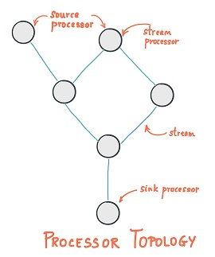
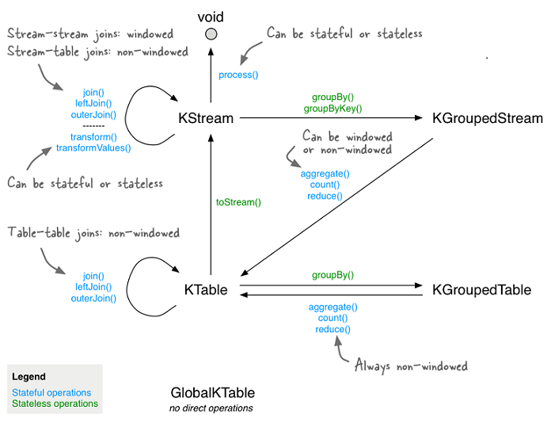

## 流

一个无限增长的数据集，叫做流式数据，简称流。

这类数据有以下特点：

- 无界：数据随时间的推移而不断加入。
- 事件：数据类型多为事件。
- 有序：事件的发生总是有时间先后顺序的。
- 不可变：事件一旦产生，就不能改变，只能通过发布新事件的方式进行弥补。
- 可重复结果：或者说是可重播。

> 表与流：表可以看作是流的当前状态、或结果。

## 流式处理

流式处理，也叫做流式计算，指的是从流式数据中持续读取、处理、生成结果。

流处理是近实时，介于在线计算和离线计算之间。

流处理[是一种编程范式，介于](https://my.oschina.net/u/2424727/blog/2989115)“请求/响应”范式和“批量处理”范式之间。

> 请求/响应范式：延迟小。
>
> 批量处理：延迟高，吞吐高。

## Kafka Streams

流处理[的3大框架为](https://juejin.cn/post/6844903934557945870)：

- **Storm**：低延迟。
- **Spark Streaming**：体系完善、社区活跃。
- **Flink**：设计理念贴近流处理，API便捷。

但无论哪种框架，都需要使用**Kafka**来中转消息。

**Kafka**干脆推出了自己的流处理框架：**Kafka Streams**。

**Kafka Streams**基于**Kafka**，是一组丰富的、轻量级的客户端库。

此外还有低延迟、自动容灾、数据只处理一次等特点。

### 流、表

流始终将记录解释为`insert`，而表始终将记录解释为`upsert`。

> 流在某一时刻的状态便是表。

**Kafka Streams**中的表分为：

- `KTable`：基于某一分区的表。
- `GlobalKTable`：基于全部分区的表，常用于`JOIN`。

### 拓扑

**Kafka Streams**中的拓扑指的是一系列计算逻辑的集合。

拓扑中的每个节点叫做流处理器，代表计算逻辑中具体的步骤，包括<u>各种转换操作</u>。

有两种比较特殊的处理器：

- Source Processor：没有上游处理器，而是从一个或多个**Topic**中输入流。
- Slink Processor：没有下游处理器，而是将流输出到指定的**Topic**。

## Kafka Streams API

<u>各种转换操作</u>包括：汇集、分发、过滤、映射、关联、分组、聚合等。

聚合又包括：计数、求和、求平均数、求最值等。

> **Kafka Streams**不仅提供Java API，还提供了KSQL。

## 应用场景

### 单词统计

将文本按空格拆分为单词，过滤停用词，然后统计词频。

### 股价统计

统计某支股票5秒钟内的交易次数、平均成交价、最高价、最低价。

### 点击事件分析

将用户基本信息、搜索信息进行管理，进而分析用户行为，决定推送内容。