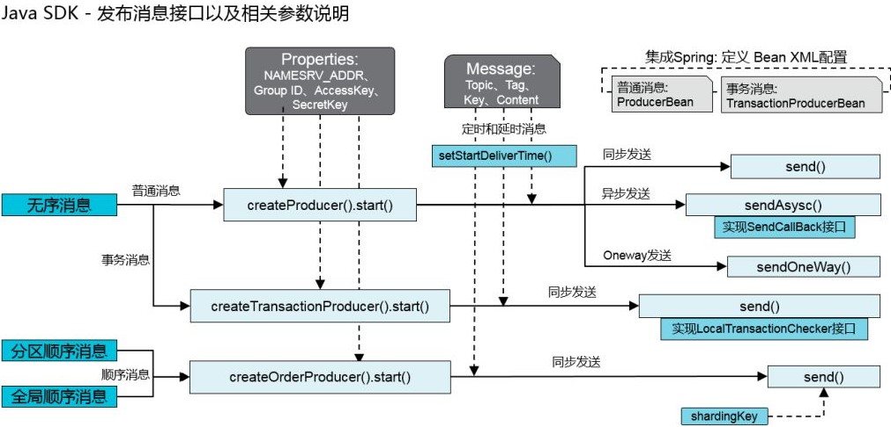

## 由来[[1]](https://www.jianshu.com/p/b09bd8e8ee50)

**2007年**，淘宝实施了“五彩石”项目，将交易系统由单机升级为分布式，这个过程中产生了**Notify**。

**2010年**，阿里巴巴B2B部门基于**ActiveMQ 5.1**又开发了自己的另一款消息引擎**Napoli**。

**2011年**，**Linkin**推出**Kafka**后，阿里巴巴在研究了**Kafka**的整体机制和架构设计之后，基于**Kafka**，使用Java进行了完全重写，并推出了**MetaQ 1.0**，用于解决顺序消息和海量堆积的问题，由开源社区[killme2008](https://github.com/killme2008/Metamorphosis)维护。

**2012年**，阿里巴巴对**MetaQ**进行了架构重组升级，发布了**MetaQ 2.0**，这时就发现基于**Kafka**的**MetaQ**在阿里巴巴庞大的体系下<u>很难进行水平扩展</u>，所以在2012年的时候就开发了**MetaQ 3.0**，并对外称为**RocketMQ 3.0**。

**2015年**，基于**MetaMQ**开发了阿里云的**Aliware MQ**和**Notify 3.0**。

**2016年**，阿里巴巴将**RocketMQ**的捐赠给**Apache**。

## 角色

### 命名服务器

**RocketMQ**的服务端除了**Broker**，还有**Name Server**。

**Name Server**提供命名服务，发现、更新**Broker**服务，以及消息路由服务。

**Name Server**几乎无状态，集群部署时，节点间也几乎没有同步。

> **Name Server**的作用完全可以由**Zookeeper**来代替，那**RocketMQ**为什么要造轮子呢？
>
> 这要从上面的“<u>难以水平扩展</u>”说起。
>
> 当有新的**Broker**加入集群时，**Kafka**虽不会进行数据迁移，但会进行Rebalance甚至重新选举，这对线上环境来说是棘手问题，即，<u>难以水平扩展</u>。对此，**RocketMQ**采用主从架构的**Broker Group**，在**Broker Group**的基础上组成了松散的集群，实现了灵活的水平扩展。主从结构的设计，令**RocketMQ**无需选举、无需维护HighWatermark，大大减弱了对**Zookeeper**的依赖。
>
> 另外，**RocketMQ**更注重**Availability**，各成员会在本地缓存集群的信息，当这些信息不准确时仍然可以先凑合着用；而**Zookeeper**恰恰相反，它更注重**Consistency**，集群信息发生变化时，所有成员需要到**Zookeeper**中更新，增加系统复杂度，造成系统停顿。”本地缓存集群信息“又减弱了对**Zookeeper**的依赖。
>
> 随着数据量的增长、集群规模的扩大，各成员如果借助**Zookeeper**进行通信，很快就会触及**Zookeeper**的写瓶颈，而**Zookeeper**是一个注重**Consistency**的系统，它只有一个写入节点——**Master**，也就是说**Zookeeper**的写功能是<u>难以扩展</u>的；当触及**Zookeeper**的读瓶颈时，虽然可以对**Zookeeper**集群进行扩展，但是需要逐台停机、更新配置、重新启动，较为繁琐（**Zookeeper 3.5**开始支持动态扩容）；而如果各成员直接相互通信，如同步消费进度、负载均衡，那就又减弱了对**Zookeeper**的依赖。
>
> 三次减弱了后，**Zookeeper**对**RocketMQ**来说就不是”The One“了，所以**RocketMQ**才自行实现了轻量级的命名服务，而对**RocketMQ**造轮子的判断也就不成立了。
>
> 正是因为**Zookeeper**对大集群反而会有运维和性能的拖累，所以**Kafka**也在逐步地减弱对它的依赖。

### 代理人

每个**Broker**都会定时向**Name Server**更新**Topic**等信息。

**Broker**采用主从设计，通过“Broker Name”来组织，通过“Broker ID”来区分**Master**、**Slave**。

有3种主从模式：

1. <u>一主多从</u>。
2. <u>多主无从</u>，无容灾。
3. <u>多主多从</u>，性能接近<u>多主无从</u>，且能自动**Failover**。
   1. `2m-2s-sync`，同步双写。
   2. `2m-2s-async`，异步复制，可能丢消息。

**Producer**只能向**Master**发送消息，而**Consumer**既可以从**Master**消费，也可以从**Slave**消费（由**Broker**的配置决定)。

主从模式相比于副本模式，实现简单，但多一些资源占用（**Slave**虽然可以提供服务，但很有可能被忽略而限制）。

当**Master**宕机后，**Producer**、**Consumer**会感知到，进而选择与**Slave**交互。

### 生产者

**Producer**在初始化时会：

1. 如果没有指定**Name Server**，会自动寻找。
2. 启动定时任务，定时更新**Name Server**地址，定时从**Name Server**更新**Topic**的路由信息、已经挂掉的**Broker**，定时向所有**Broker**发送心跳。
3. 启动负载均衡的服务。

**Producer**根据策略选择接收**Message**的**Broker**。

> 开发者[可自行实现策略](https://www.javazhiyin.com/64276.html)，也可使用内置策略：
>
> - SelectMessageQueueByHash，散列取余，做到了负载均衡，默认策略。
> - SelectMessageQueueByRandom，随机挑选。
> - SelectMessageQueueByMachineRoom，挺有意思，竟然返回`null`，可能是留给开发者实现。
>
> 也可以不指定策略，这时，会轮询**Consume Queue**。

**Producer**的同步发送会重投、异步发送会重试（Oneway没有任何保证），故**RocketMQ**[无法避免](https://github.com/apache/rocketmq/blob/master/docs/cn/features.md#10-消息重投)重复接收。

### 消费者

**Consumer**对Push、Pull都支持，但其Push实际上是对Pull的一种封装，采用长轮询实现，实时性要高。

> [短轮询、长轮询、长连接](https://www.cnblogs.com/qiqi715/p/13138589.html)。

### 消费者组

**Consumer**根据“Group ID”组成**Consumer Group**，**Consumer**的消费逻辑必须相同（包括**Tag**的使用）。

## 数据结构🌙

### Commit Log

**RocketMQ**采用单一文件存储，即，所有的**Message**都存储在一个名为**Commit Log**的文件中，并以追加写的方式写入。

当**Commit Log**体积达到阈值时，会切换到下一个**Commit Log**。

**RocketMQ**的**Message**[的属性](./5.2 消息数据结构)多达17项（包含消息体），比**Kafka**多了8项。

### Consume Queue

**RocketMQ**会为每个**Topic**创建**Consume Queue**文件，用于保存由**Message**的**Offset**、**Size**和**Tag**的<u>散列值</u>组成的三元组，读**Message**时会先读**Consume Queue**，然后根据**Offset**到**Commit Log**中读**Message**。

| Offset | Size   | Tag（Hash Code）                                       | 总计    |
| ------ | ------ | ------------------------------------------------------ | ------- |
| 8 Byte | 4 Byte | 8 Byte（可为空） | 20 Byte |

> 多**Consume Queue**的设计趋向随机读。
>
> **Commit Log**、**Consume Queue**均使用了Page Cache和**MMap**来提升读写性能，即，将文件映射到Page Cache中。**Commit Log**的默认最大体积为`1G`，也正是因为**MMap**的限制。
>
> **RocketMQ**还采用了多路复用、[内存预分配、mlock系统调用、文件预热](https://www.cnblogs.com/duanxz/p/5020398.html)等措施来提升性能。

### Consume Queue与负载均衡

对于生产：**Message**只会发给一个**Consume Queue**，即，**Message**在不同**Broker**上不会重复，并且在不同的**Consume Queue**中也不会重复。（重复发送另当别论）

对于消费：**Broker**上的同一**Topic**的同一**Consume Queue**中的**Message**只会发给**Consumer Group**中的同一个**Consumer**；但开启<u>广播模式</u>后，**Message**则会发给**Consumer Group**中的每个**Consumer**。

> 换句话说，**Consumer Group**中的**Consumer**不会消费同一**Broker**上的同一**Topic**的同一**Consume Queue**：
>
> - **Consumer**的数量小于**Consume Queue**的数量时，有的**Consumer**会消费多个**Consume Queue**。
> - **Consumer**的数量等于**Consume Queue**的数量时，**Consumer**与**Consume Queue**一一对应。
> - **Consumer**的数量大于**Consume Queue**的数量时，多出来的**Consumer**会空闲。
>
> 但开启<u>广播模式</u>后，**Consumer**就会消费**Topic**在所有**Broker**。

也就是说，**Consume Queue**是负载均衡的基本单位，另外，如[下图](https://www.cnblogs.com/duanxz/p/3509074.html)所示：

1. **Consume Queue**会根据每个**Broker**的配置被均分为指定份数。
2. 开发者可以通过为不同的**Broker**设置不同的数量的**Consume Queue**，令不同的**Broker**的负载不同。

**Consumer**会定期对**Topic**的所有**Consume Queue**进行**Rebalance**。

### 标签

**Topic**是一级类型，而**Tag**是二级类型。

一条**Message**可以有多个**Tag**。

**Tag**、Key都是为了标记，但**Tag**用于顺序消费时过滤**Message**，而Key用于根据索引查询和防止重复消费（消息被谁消费）。

消费**Message**时，**Broker**会访问**Consume Queue**，根据其中的**Tag**的<u>散列值</u>粗略过滤掉一部分**Message**，而后**Consumer**仍然需要进行精确过滤。

