## 由来

**2007年**，淘宝实施了“五彩石”项目，将交易系统由单机升级为分布式，这个过程中产生了**Notify**。

**2010年**，阿里巴巴B2B部门基于**ActiveMQ 5.1**又开发了自己的另一款消息引擎**Napoli**。

**2011年**，**Linkin**推出**Kafka**后，阿里巴巴在研究了**Kafka**的整体机制和架构设计之后，基于**Kafka**，使用Java进行了完全重写，并推出了**MetaQ 1.0**，用于解决顺序消息和海量堆积的问题，由开源社区[killme2008](https://github.com/killme2008/Metamorphosis)维护。

**2012年**，阿里巴巴对**MetaQ**进行了架构重组升级，发布了**MetaQ 2.0**，这时就发现基于**Kafka**的**MetaQ**在阿里巴巴庞大的体系下<u>很难进行水平扩展</u>，所以在2012年的时候就开发了**MetaQ 3.0**，并对外称为**RocketMQ 3.0**。

**2015年**，基于**MetaMQ**开发了阿里云的**Aliware MQ**和**Notify 3.0**。

**2016年**，阿里巴巴将**RocketMQ**的捐赠给**Apache**。

> 摘自[文章](https://www.jianshu.com/p/b09bd8e8ee50)。


## 角色

### 命名服务器

**RocketMQ**的服务端除了**Broker**，还有**Name Server**。

**Name Server**提供命名服务，发现、更新**Broker**服务，以及消息路由服务。

**Name Server**几乎无状态，集群部署时，节点间也几乎没有同步。

> **Name Server**的作用完全可以由**Zookeeper**来代替，那**RocketMQ**为什么要造轮子呢？
>
> 这要从上面的“<u>难以水平扩展</u>”说起。
>
> **Kafka**采用副本机制进行容灾，**Replication**会均匀的分散在**Broker**上，所以，当有新的**Broker**加入集群时，副本就会发生数据迁移，这对线上环境来说是棘手问题，即，<u>难以水平扩展</u>。对此，**RocketMQ**采用主从结构的**Broker Group**，在**Broker Group**的基础上组成了松散的集群，实现了灵活的水平扩展。主从结构的设计，令**RocketMQ**无需选举、无需维护HighWatermark，大大减弱了对**Zookeeper**的依赖。
>
> 另外，**RocketMQ**往往面对海量数据，应该更注重**Availability**，各成员会在本地缓存集群的信息，当这些信息不准确时仍然可以先凑合着用；而**Zookeeper**恰恰相反，它更注重**Consistency**，集群信息发生变化时，所有成员需要到**Zookeeper**中更新，增加系统复杂度，造成系统停顿。”本地缓存集群信息“又减弱了对**Zookeeper**的依赖。
>
> 随着数据量的增长、集群规模的扩大，各成员如果借助**Zookeeper**进行通信，很快就会触及**Zookeeper**的写瓶颈，而**Zookeeper**是一个注重**Consistency**的系统，它只有一个写入节点——**Master**，也就是说**Zookeeper**的写功能是<u>难以扩展</u>的；当触及**Zookeeper**的读瓶颈时，虽然可以对**Zookeeper**集群进行扩展，但是需要逐台停机、更新配置、重新启动，较为繁琐（**Zookeeper 3.5**开始支持动态扩容）；而如果各成员直接相互通信，如同步消费进度、负载均衡，那就又减弱了对**Zookeeper**的依赖。
>
> 三次减弱了后，**Zookeeper**对**RocketMQ**来说就不是”The One“了，所以**RocketMQ**才自行实现了轻量级的命名服务，而对**RocketMQ**造轮子的判断也就不成立了。
>
> 正式因为**Zookeeper**对大集群反而会有运维和性能的拖累，所以**Kafka**也在逐步地减弱对它的依赖。

### 代理人

每个**Broker**都会定时向**Name Server**更新**Topic**等信息。

**Broker**采用主从设计，通过“Broker Name”来组织，通过“Broker ID”来区分**Master**、**Slave**。

有3种主从模式：

1. <u>一主多从</u>，
2. <u>多主无从</u>，无容灾。
3. <u>多主多从</u>，性能接近<u>多主无从</u>，且能自动**Failover**。
   1. 2m-2s-sync，同步双写。
   2. 2m-2s-async，异步复制，可能<span style=background:#f8d2ff>丢消息</span>。

**Producer**只能向**Master**发送消息，而**Consumer**既可以从**Master**消费，也可以从**Slave**消费（由**Broker**的配置决定)。

主从模式相比于副本模式，实现简单，但多一些资源占用（**Slave**虽然可以提供服务，但很有可能被忽略而限制）。

当**Master**宕机后，**Producer**、**Consumer**会感知到，进而选择与**Slave**交互。

### 生产者

**Producer**在初始化时会：

1. 如果没有指定**Name Server**，会自动寻找。
2. 启动定时任务，定时更新**Name Server**地址，定时从**Name Server**更新**Topic**的路由信息、已经挂掉的**Broker**，定时向所有**Broker**发送心跳。
3. 启动<span style=background:#d4fe7f>负载均衡</span>的服务。

**Producer**根据策略选择接收**Message**的**Broker**。

> 开发者[可自行实现策略](https://www.javazhiyin.com/64276.html)，也可使用内置策略：
>
> - SelectMessageQueueByHash，散列取余，做到了<span style=background:#d4fe7f>负载均衡</span>，默认策略。
> - SelectMessageQueueByRandom，随机挑选。
> - SelectMessageQueueByMachineRoom，挺有意思，竟然返回Null，可能是留给开发者实现。
>
> 也可以不指定策略，这时，会轮询**Consume Queue**。

**Producer**的同步发送会重投、异步发送会重试（Oneway没有任何保证），故**RocketMQ**[无法避免](https://github.com/apache/rocketmq/blob/master/docs/cn/features.md#10-消息重投)<span style=background:#c9ccff>重复接收</span>。


### 消费者

**Consumer**对Push、Pull都支持，但在Push实际上是对Pull的一种封装，采用长轮询实现，实时性要高。

### 消费者组

**Consumer**根据“Group ID”组成**Consumer Group**，**Consumer**的消费逻辑必须相同（包括**Tag**的使用）。


## 数据结构

### Commit Log

**RocketMQ**采用单一文件存储，即，所有的**Message**都存储在一个名为**Commit Log**的文件中，并以追加写的方式写入。

当**Commit Log**体积达到阈值时，会切换到下一个**Commit Log**。

**RocketMQ**的**Message**的属性多达17项（包含消息体），比**Kafka**多了8项。


<table style="font-size: 12px; width: 1400px;">
	<thead>
		<tr>
			<th colspan="28" style="text-align: center; font-size: 16px">Message 结构</th>
		</tr>
		<tr>
			<th style="width: 50px; padding:0 3px;">1 Byte</th>
			<th style="width: 50px; padding:0 3px;">1 Byte</th>
			<th style="width: 50px; padding:0 3px;">1 Byte</th>
			<th style="width: 50px; padding:0 3px;">1 Byte</th>
			<th style="width: 50px; padding:0 3px;">1 Byte</th>
			<th style="width: 50px; padding:0 3px;">1 Byte</th>
			<th style="width: 50px; padding:0 3px;">1 Byte</th>
			<th style="width: 50px; padding:0 3px;">1 Byte</th>
			<th style="width: 50px; padding:0 3px;">1 Byte</th>
			<th style="width: 50px; padding:0 3px;">1 Byte</th>
			<th style="width: 50px; padding:0 3px;">1 Byte</th>
			<th style="width: 50px; padding:0 3px;">1 Byte</th>
			<th style="width: 50px; padding:0 3px;">1 Byte</th>
			<th style="width: 50px; padding:0 3px;">1 Byte</th>
			<th style="width: 50px; padding:0 3px;">1 Byte</th>
			<th style="width: 50px; padding:0 3px;">1 Byte</th>
			<th style="width: 50px; padding:0 3px;">1 Byte</th>
			<th style="width: 50px; padding:0 3px;">1 Byte</th>
			<th style="width: 50px; padding:0 3px;">1 Byte</th>
			<th style="width: 50px; padding:0 3px;">1 Byte</th>
			<th style="width: 50px; padding:0 3px;">1 Byte</th>
			<th style="width: 50px; padding:0 3px;">1 Byte</th>
			<th style="width: 50px; padding:0 3px;">1 Byte</th>
			<th style="width: 50px; padding:0 3px;">1 Byte</th>
			<th style="width: 50px; padding:0 3px;">1 Byte</th>
			<th style="width: 50px; padding:0 3px;">1 Byte</th>
			<th style="width: 50px; padding:0 3px;">1 Byte</th>
			<th style="width: 50px; padding:0 3px;">1 Byte</th>
		</tr>
	</thead>
	<tbody>
		<tr>
			<td colspan="4" style="padding:2px 3px">Message Length</td>
			<td colspan="4" style="padding:2px 3px">Magic Code</td>
			<td colspan="4" style="padding:2px 3px">Body CRC</td>
			<td colspan="4" style="padding:2px 3px">Queue ID</td>
			<td colspan="4" style="padding:2px 3px">Flag</td>
			<td colspan="8" style="padding:2px 3px">Queue Offset</td>
		</tr>
		<tr>
			<td colspan="8" style="padding:2px 3px">Physical Position</td>
			<td colspan="4" style="padding:2px 3px">System Flag</td>
			<td colspan="8" style="padding:2px 3px">Message Born Timestamp</td>
			<td colspan="8" style="padding:2px 3px">Message Host</td>
		</tr>
		<tr>
			<td colspan="8" style="padding:2px 3px">Store Timestamp</td>
			<td colspan="8" style="padding:2px 3px">Store Host</td>
			<td colspan="4" style="padding:2px 3px">Reconsumer Times</td>
			<td colspan="8" style="padding:2px 3px">Prepare Transaction Offset</td>
		</tr>
		<tr>
			<td colspan="4" style="padding:2px 3px">Body Lenght</td>
			<td colspan="24" style="padding:2px 3px">Message Body（N Byte）</td>
		</tr>
		<tr>
			<td style="padding:2px 3px;">Topic Length</td>
			<td colspan="27">Topic</td>
		</tr>
		<tr>
			<td colspan="2" style="padding:2px 3px">Properties Length</td>
			<td colspan="26">Properties</td>
		</tr>
	</tbody>
</table>


### Consume Queue

**RocketMQ**会为每个**Topic**创建**Consume Queue**文件，用于保存由**Message**的**Offset**、**Size**和**Tag**的<u>散列值</u>组成的三元组，读**Message**时会先读**Consume Queue**，然后根据**Offset**到**Commit Log**中读**Message**。

| Offset | Size   | Tag（Hash Code）                                       | 总计    |
| ------ | ------ | ------------------------------------------------------ | ------- |
| 8 Byte | 4 Byte | 8 Byte（<span style=background:#19d02a>可为空</span>） | 20 Byte |

> 多**Consume Queue**的设计趋向随机读。
>
> **Commit Log**、**Consume Queue**均使用了<span style=background:#c9ccff>Page Cache</span>和MMap来提升读写性能，即，将文件映射到<span style=background:#c9ccff>Page Cache</span>中。**Commit Log**的默认最大体积为1G，也正是因为MMap的限制。
>
> **RocketMQ**还采用了多路复用、[内存预分配、mlock系统调用、文件预热](https://www.cnblogs.com/duanxz/p/5020398.html)等措施来提升性能。

### Consume Queue与负载均衡

对于生产：**Message**只会发给一个**Consume Queue**，即**Message**在不同**Broker**上不会重复，并且在不同的**Consume Queue**中也不会重复。（重复发送另当别论）

对于消费：**Broker**上的同一**Topic**的同一**Consume Queue**中的**Message**只会发给**Consumer Group**中的同一个**Consumer**；但开启<u>广播模式</u>后，**Message**则会发给**Consumer Group**中的每个**Consumer**。

> 换句话说，**Consumer Group**中的**Consumer**不会消费同一**Broker**上的同一**Topic**的统一**Consume Queue**：
>
> - **Consumer**的数量小于**Consume Queue**的数量时，有的**Consumer**会消费多个**Consume Queue**。
> - **Consumer**的数量等于**Consume Queue**的数量时，**Consumer**与**Consume Queue**一一对应。
> - **Consumer**的数量大于**Consume Queue**的数量时，多出来的**Consumer**会空闲。
>
> 但开启<u>广播模式</u>后，**Consumer**就会消费**Topic**在所有**Broker**。

也就是说，**Consume Queue**是<span style=background:#d4fe7f>负载均衡</span>的基本单位，另外，如[下图](https://www.cnblogs.com/duanxz/p/3509074.html)所示：

1. **Consume Queue**会根据每个**Broker**的配置被<span style=background:#c2e2ff>均分</span>为指定份数。
2. 开发者可以通过为不同的**Broker**设置不同的数量的**Consume Queue**，令不同的**Broker**的负载不同。

**Consumer**会定期对**Topic**的所有**Consume Queue**进行**Rebalance**。


### 标签

**Topic**是一级类型，而**Tag**是二级类型。

一条**Message**可以有多个**Tag**。

**Tag**、Key都是为了标记，但**Tag**用于顺序消费时过滤**Message**，而Key用于根据索引查询和防止重复消费（消息被谁消费）。

消费**Message**时，**Broker**会访问**Consume Queue**，根据其中的**Tag**的<u>散列值</u>粗略过滤掉一部分**Message**，而后**Consumer**仍然需要进行精确过滤。

#### 目录结构

```java
root
|----commitlog							   # Commit Log
|     |----00000000000000000000			   # 根据Offset命名
|     |----00000000001073741824			   # 每个文件默认大小1GB（1GB = 1073741824B）
|----config								   # 配置文件
|     |----consumerFilter.json
|     |----consumerOffset.json
|     |----delayconsumerOffset.json
|     |----subscriptionGroup.json
|     |----topic.json
|----consumerqueue						   # Consumer Queue
|     |----test-topic
|           |----0						   # Queue ID
|           |    |----00000000000000000000 # 大小约5.72MB，300K条数据
|           |----1
|                |----00000000000012300000
|                |----00000000000045600000
|     |----%RETRY%ConsumerGroupA		   # 消费失败，消息将发往重试队列
|     |----%DLQ%ConsumerGroupA			   # 重试指定次数仍然失败，则发往死信队列（Dead Letter Queue）
|     |----SCHEDULE_TOPIC_XXXX			   # 延迟重试，减轻Broker的负担
|----index								   # 用于索引Message的Key
|     |----202110032340001				   # 以创建时的时间命名，大小固定（420000040Byte），约20M项索引
```

> 根据Key即可从索引找出指定时间范围内的结果集。
>
> [索引文件结构为](https://blog.csdn.net/quhongwei_zhanqiu/article/details/39153195)：
>
> <table style="font-size: 12px; width:600px">
> 		<thead>
> 			<tr>
>                 <th style="padding: 0 3px; width: 60px;">40 Byte</th>
>                 <th style="padding: 0 3px; width: 80px;">5M * 4 Byte</th>
>                 <th style="padding: 0 3px; width: 340px;">20M * 20 Byte</th>
>                 <th style="padding: 0 3px; width: 120px;">420000040 Byte</th>
>             </tr>
> 		</thead>
>     <tbody>
>         <tr>
>             <td style="padding: 0 3px;">Header</td>
>             <td style="padding: 0 3px;">Slot Table</td>
>             <td style="padding: 0 3px;">Index Linked List</td>
>             <td style="padding: 0 3px;">大小固定</td>
>         </tr>
>     </tbody>
> </table>
>
> 其中“Header”结构为：
>
> <table style="font-size: 12px; width:600px">
> 		<thead>
> 			<tr>
>            <th style="padding: 0 3px; width: 120px;">8 Byte</th>
>            <th style="padding: 0 3px; width: 120px;">8 Byte</th>
>            <th style="padding: 0 3px; width: 120px;">8 Byte</th>
>            <th style="padding: 0 3px; width: 120px;">8 Byte</th>
>            <th style="padding: 0 3px; width: 60px;">4 Byte</th>
>            <th style="padding: 0 3px; width: 60px;">4 Byte</th>
>         </tr>
> 		</thead>
>     <tbody>
>         <tr>
>             <td style="padding: 0 3px;">Begin Timestamp</td>
>             <td style="padding: 0 3px;">End Timestamp</td>
>             <td style="padding: 0 3px;">Begin Physical Offset</td>
>             <td style="padding: 0 3px;">End Physical Offset</td>
>             <td style="padding: 0 3px;">Hash Slot Count</td>
>             <td style="padding: 0 3px;">Index Count</td>
>         </tr>
>     </tbody>
> </table>
> “Slot Table”存储的是它对应的“Index Linked List”的表头，即，采用拉链法解决散列冲突。
>
> “Index Linked List”是由索引项组成的链表，索引项倒序排列，其中的索引项结构为：
>
> <table style="font-size: 12px; width:600px">
> 		<thead>
> 			<tr>
>            <th style="padding: 0 3px; width: 120px;">4 Byte</th>
>            <th style="padding: 0 3px; width: 240px;">8 Byte</th>
>            <th style="padding: 0 3px; width: 120px;">4 Byte</th>
>            <th style="padding: 0 3px; width: 120px;">4 Byte</th>
>         </tr>
> 		</thead>
>    <tbody>
>         <tr>
>             <td style="padding: 0 3px;">Key Hash</td>
>             <td style="padding: 0 3px;">Commit Log Offset</td>
>             <td style="padding: 0 3px;">Timestamp</td>
>             <td style="padding: 0 3px;">Next Index Offset</td>
>         </tr>
>     </tbody>
> </table>


## 事务

**RocketMQ**的事务参考了2PC（Prepare、Commit），通过“两条半份”消息来实现的。




## 监控

一般会使用**Zabbix**从两个维度监控应用状态，进而提供告警等功能。

1. 进程的CPU、内存、IO等使用量。
2. JVM的服务质量，如**GC**、并发数、内存分布等。

而**RocketMQ**[提供了RocketMQ-Console来](https://blog.csdn.net/luanlouis/article/details/88078657)监控、管理集群。


## 与Kafka相比

### 吞吐

**Kafka**高吞吐量、低延迟，号称能处理百万级数据，**RocketMQ**虽然只能处理万级数据，但抗堆积能力强，因为：

1. **Kafka**基于不同的**Partition**，是多文件的、多队列的。

   1. **Topic**越多，**Partition**就越多，文件数就越多，会消耗大量文件句柄，同时会使顺序读写退化为随机读写，造成性能急剧下降。

      > **Kafka** 1.0又引入了基于Timestamp的索引文件。

   2. **Kafka**只能保证一个**Partition**内的顺序消费。

2. **RocketMQ**使用一个**Commit Log**保存消息和多个**Consume Queue**保存索引。

   1. 单一**Commit Log**这一设计，令**RocketMQ**在大量写入时也不会有衰减。
   2. **Consume Queue**虽然有多个，但是体积小，并且使用了**MMap**，即便有大量写入也不会有明显衰退。

### 功能

**RocketMQ**同样支持异步刷盘、**Replication**、拉取消息、事务，此外：

1. 同步刷盘。

   > 虽然都是基于<span style=background:#c9ccff>Page Cache</span>，[但Kafka没有提供同步刷盘的方法](https://new.qq.com/omn/20201124/20201124A0AGP400.html)，所以有时才需要对<span style=background:#c9ccff>Page Cache</span>调优。

2. 支持推送消息。

3. 支持[定时消息、延时消息](https://github.com/apache/rocketmq/blob/master/docs/cn/features.md#8-定时消息)。

4. 支持全局顺序消费。


## 延迟消息的原理

#### Consumer法

Producer将指定的时间段转换成具体的时间戳，然后投递到专用Topic。

Consumer批量拉取消息后，<span style=background:#c2e2ff>定时</span>轮询本地消息表，然后将到点的Message投递到目标主题。

注意：

- 批量拉取是为了让这一段时间内的消息<span style=background:#c2e2ff>有序</span>。
- 不同时间粒度的消息最好分别投放到不同的专用主题，由不同的消费者消费，进而避免消费者本地消息的<span style=background:#c2e2ff>积压</span>。也可用[时间轮](https://cloud.tencent.com/developer/article/1831327)的方式防止积压。（格子、层级）
- Consumer需要主动[调用暂停/恢复的API](https://zhuanlan.zhihu.com/p/365802989)，以避免Broker认为Consumer挂掉。

### Broker法

基于Consumer法，Broker启动一个专门Consumer定时轮询，进行投递。

> RocketMQ就是这种。

### Producer法

定时将消息投递到目标主题。

需要本地消息表将未发送的主题<span style=background:#c2e2ff>持久化</span>。


## 其它[[1]](https://www.cnblogs.com/duanxz/p/4610827.html)

### ActiveMQ

**AMQ**支持JMS，对消息幂等支持好。

另一个不同是，**AMQ**使用JDBC进行持久化：

1. 轮询：轮询消息队列表，低效。
2. 锁：降低并发量。
3. 数据增长：数据库难以应对消息、日志这类海量数据。

### RabbitMQ

##### 优势

1. 支持AMQP协议
2. 支持多版本语言客户端
3. 轻量级中间件，易于部署
4. Message会根据路由规则分发到不同的队列中，且路由规则灵活，甚至可以自行实现路由规则，。

##### 不足

1. 对消息堆积的支持并不好。大量消息积压的时候，会导致**RabbitMQ**的性能急剧下降。

2. 性能相较于**RocketMQ**、**Kafka**性能相差了一个数量级。

3. 使用的编程语言Erlang，学习路线陡峭，难以二次扩展。
