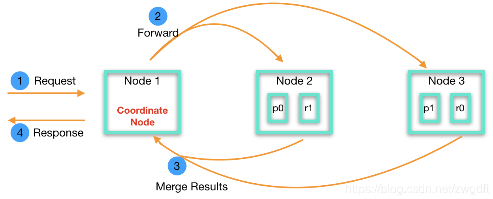

## 写入过程

**Document**的[写入过程](https://blog.csdn.net/zwgdft/article/details/83619905)为：

1. **Elasticsearch**收到写入**Document**的请求后，会根据**Document**的Key来确定**Document**该分配到哪片**Shard**上。
   1. 计算方法为，先求该Key的<u>散列值</u>，然后将<u>散列值</u>模除<u>分片数</u>得到余数，该余数就是**Shard**的编号。

2. **Elasticsearch**也采用了**WAL**（预写式日志）机制，当**Shard**所在的**Node**收到该**Document**后会先写**TransLog**。
   1. **TransLog**也被用来作实时CURD。
   2. `index`、`delete`、`update`、`bulk`等操作，每次都会将自己产生的**TransLog**执行fsync()，而其它操作每5秒才对**TransLog**执行一次fsync()。

3. 待日志写完后，

   1. **Node**将**Document**写入内存缓冲区。
      1. 此时**Document**没有生效，查询不到，需等待每秒1次的refresh，将缓冲区的文档封装成**Segment**写入到OS Cache中。
      2. **Elasticsearch**会周期性地对OS Cache中的数据执行fsync()，完成数据的持久化，**TransLog**也就失效待清理。
      3. 不难想象随着时间的推移，会产生大量小**Segment**，导致性能下降，所以**Elasticsearch**会周期性地对**segment**进行合并整理。

   2. 同时将**Document**同步给其它**Replica**。

4. 待完成写入OS Cache、同步副本后，**Node**将结果返回给Client。

## 读取过程

**Document**的查询过程分为：

### [Query](https://www.elastic.co/guide/cn/elasticsearch/guide/current/_query_phase.html)

1. Client向集群中的某一**Node**发送请求，而收到请求的**Node**就会自动担任“Coordinate Node”，进行Query和Fetch。

2. “Coordinate Node”会在本地创建<u>from+size大小的有序队列</u>，然后将请求广播给所有拥有该**Index**的**Shard**（无论Primary Shard还是Replica）的“Data Node”，当然这些“Data Node”可能包含该“Coordinate Node”。

3. “Data Node”收到广播后，检索**Shard**，每个**Shard**都会在本地创建<u>from+size大小的有序队列</u>，将结果填入队列中，这个队列仅包含Document.ID和<u>排序用的分数</u>。

   > 一个**Shard**会用一个线程来查询，也就是说，**Shard**越多，线程数就越多，并发量就越大；但是，分片数 / 线程数不是越多越好，过多的线程数反而会带来<u>过多的句柄</u>、<u>过多的排队</u>以及<u>资源的消耗</u>，反而降低性能（不一定比较少数量的较大分片更快）。
   >
   > **Elasticsearch**使用[词频统计来计算分数（相关性）](https://www.elastic.co/guide/en/elasticsearch/guide/current/relevance-intro.html)。

4. “Data Node”将各个**Shard**的队列返回给“Coordinate Node”，“Coordinate Node”将这些队列合并、排序、分页，最终添加到自己的<u>有序队列</u>中。

   > 我推测，最终队列中只有size个文档，from之前的都会丢弃，不会进入Fetch阶段，更不会返回给客户端。

### [Fetch](https://www.elastic.co/guide/cn/elasticsearch/guide/current/_fetch_phase.html)

1. “Coordinate Node”从刚才生成的<u>有序队列</u>中按照Document.ID，再去各个“Data Node”上Fetch（拉取）实际的文档内容（_source）。
2. 如有需要，还会再拉取后根据元数据丰富结果、高亮搜索片段。

3. 根据from+size，将不需要的结果丢弃，即分页，最后将结果返回给Client。

之后每次请求中的Query，“Coordinate Node”不再广播，而是采用轮询”Primary Shard“和”Replica“的方式，以负载均衡。

## 分页

不难发现，受读取原理的决定，**Elasticsearch**的深分页功能支持的不好，通常10K~50K条，也就是1k~5k页的深分页是可行的，超过这个范围的分页会使排序过程变得非常繁重，且开销巨大。

如果是下拉加载（刷微博）这种分页，而非输入指定页号然后跳转，那么可以使用“Scroll API”。

> “Scroll API”会一次性为符合条件的所有数据生成一个快照，然后通过每次移动游标`scroll_id`来实现翻页。“Scroll API”翻页的响应时间是毫秒级的，要比直接分页快很多。
>
> 生成一个快照时须指定`scroll`参数，并指定快照的失效时间。

除了使用“Scroll API”，还可以使用“search_after”来实现翻页。

> “search_after”会使用前一页的结果来辅助下一页的检索。
>
> 这种方式也不允许跳页。
>
> 初始化时，需要使用一个唯一值的字段作为`Sort`的字段。

同时，大批量获取数据时，往往会设置搜索类型为scan来禁用排序。

## 热点问题

### 读写

**Elasticsearch**能很好地应对读操作的热点问题，因为**Elasticsearch**是一个以读（检索）为主的系统，热点数据往往在内存中都会有缓存，会很快的返回给客户端，读操作一般不会成为系统瓶颈，如果成为瓶颈，我们可以采用增加节点，以及横切竖切的方式应对。

关于写操作的热点问题，因为写入发生在硬盘，<u>写硬盘</u>显然要比<u>读内存</u>漫长地多，容易成为系统瓶颈，可增加**Node**分散压力，用空间换时间。

### 横切竖切

横切指的是“精简字段”，竖切的指的是“冷热数据分离”，两者的最终目的，是将尽可能将一半以上，甚至全部的搜索用的热点数据装入内存，这样能大大提升查询速度。

> 当然也可以采用SSD这种这种的方案，但前提也是横切竖切。

同时可采用**Elastisearch** + **HBase** 的组合，即，查出Document.ID后，去**HBase**中获取**Document**的详细数据。因为**HBase**十分适合海量数据的实时存储，但不擅长复杂的搜索。

> 很难说“**Elastisearch**开启`_source`，自动保存原文”的方式，和“**Elastisearch**关闭`_source`，由 + **HBase**保存原文”的方式，孰优孰劣。
>
> “**HBase**返回原文”的方式多了一层业务逻辑，对查询速度有影响，但至少节省了**Elastisearch**机器的磁盘空间，如果**Elastisearch**机器采用SSD，这或许有意义，但SSD才几个钱儿？

