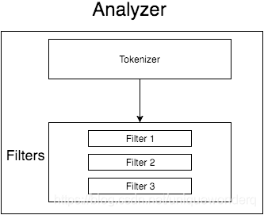

这篇笔记是对**Elasticsearch**概念及原理的补充，所有内容摘自《Elasticsearch权威指南（中文版）》，**Elasticsearch**版本应该是<span style=background:#c2e2ff>2.x</span>。


## 安装

1. 创建一个用户用于启动**Elasticsearch**，并为脚本文件`elasticsearch`赋权。

   1. ```bash
      useradd -g root elasticsearch
      chmod -R 777 bin/
      ```

2. [修改系统资源限制](https://blog.csdn.net/qq_33363618/article/details/78882827?utm_source=blogxgwz2)。

3. 启动**Elasticsearch**。

4. **Elasticsearch**正常启动后，改为后台启动。

   1. 先使用`ctrl+c`停止**Elasticsearch**，然后`./elasticsearch -d`，以后台运行方式启动。


## 连接集群

**Elasticsearch**提供了2种交互方式。

### Java API

端口为9300，并提供了2种类型的Client。

##### Node Client

Client以无数据节点的身份加入到集群中。

该模式下，Client知道数据的分布，将请求转发给相应的**Data Node**来处理。

##### Transport Client

不加入集群，只是将请求转发到集群中。

### RESTful API

数据格式为JSON，端口为9200。

**Elasticsearch**官方客户端会自动处理序列化、反序列化JSON。

> JSON，JavaScript Object Notation，对象符号，虽然绝大部分语言都支持JSON，但是处理细节不同，具体请看Serialization和Marshelling两个处理JSON的模块。


## 索引

索引名必须是**小写**，不能以**下划线**开头，不能包含**逗号**（因为**逗号**用于多索引检索）。


## 文档

### 元数据

文档有若干元数据：`_index`，`_type`，`_id`，`_version`。

`_version`

1. `_version`可以用作乐观锁。
   1. 使用内部版本控制时的判断标准是相等。
   2. 使用外部版本控制时的判断标准是不小于。
2. `_version`的值为整数，且有范围，大于零，小于`9.2e+18`（Java长整型的最大值）

### 插入

插入新数据时可以不指定ID，让**Elasticsearch**自动生成。

自动生成的ID有`22字符`长，URL-safe，Base64-encoding string universally unique identifiers，UUIDs。

### 更新

众所周知，**Elasticsearch**中的文档是不可变的，因为**Luence**就不支持**Document**的局部更新，`Update`的实质还是`Create`新文档，只不过合并工作由**Elasticsearch**自行完成。


## 查询

### 索引查询

1. 多索引：使用**逗号**分隔。
2. `_all`：查询所有索引。
3. 通配符：`*`，`+`，`-`。
4. 日期索引名称中的数字支持。

### Bulk批量请求

```json
{action:metadata} \n
{request body} \n
```

`action`包括：

- `create`：不存在时才创建。
- `index`：不存在则创建，存在则更新。
- `update`：局部更新。
- `delete`。

`metadata`不做赘述。

**Bulk**请求不是原子操作，不支持事务。

批量中的数量取决于硬件、文档大小和复杂度、索引和检索的负载，需要通过实验确定，通常在`1000~5000条`之间，以及`5~15MB`之间。

出于性能的考量，**Bulk**没有使用JSON数组，而是使用换行符分割。

> 因为如果使用JSON数组，那就需要增加解析工作，同时伴有序列化数组为内部格式的工作，增加内存使用，以及垃圾回收的需要。

### 查询方式

**Elasticsearch**有2种查询方式：

1. ##### Query String，查询字符串

   1. 请求方式为Get。
   2. 查询参数都放在URL中。
   3. 适合在命令行下运行 点对点查询，强大简介，但是晦涩难读。

2. ##### Request Body，请求体

   1. 请求方式为Post。

**Elasticsearch**的值可以是数组，如果是数组，则需要值的类型保持一致。

### 文本分析

**Analysis**是全文搜索的一个重要环节，是把全文本转换一系列单词（term/token）的过程，包含3个步骤/组件：

1. <span style=background:#c9ccff>char_filter</span>：将文本块进行字符<span style=background:#19d02a>过滤</span>，以避免特殊字符，如，笑脸、连接符`&`等。
2. <span style=background:#ffb8b8>tokenizer</span>：<span style=background:#19d02a>分词</span>，中文分词比英文分词更为复杂。
3. <span style=background:#f8d2ff>token_filter </span>：<span style=background:#19d02a>标准化</span>，也称表征过滤，Token Filters，包括<span style=background:#d4fe7f>修改词</span>、<span style=background:#d4fe7f>去掉停用词</span>、<span style=background:#d4fe7f>增加同义词</span>、<span style=background:#d4fe7f>大写变小写</span>等。

[Analyzer由](https://blog.csdn.net/uniquewonderq/article/details/107080560)<span style=background:#ffb8b8>tokenizer</span>和<span style=background:#f8d2ff>token_filter </span>组成，<span style=background:#c9ccff>char_filter</span>会在<span style=background:#19d02a>tokenizer</span>前会运行。



#### 分词器

<span style=background:#993af9;color:#f1f1f1>IK Analysis</span>是最好的**Lucene**中文分词器之一，基于词典分词和文法分析算法。

> 取名为“IK”，[是因为](https://www.iteye.com/magazines/43-ik-analyzer)作者喜欢玩《Diablo II》，并在发明IK的那天打出了“Immortal King”这个套装。

它分为两种：

1. <span style=background:#993af9;color:#f1f1f1>ik_max_word</span>
   1. 会对文本做最细粒度的拆分。
   2. 适合**Term Query**。
   3. 比如，会将“中华人民共和国国歌”拆分为“中华人民共和国,中华人民,中华,华人,人民共和国,人民,人,民,共和国,共和,和,国国,国歌”，会穷尽各种可能的组合。
2. <span style=background:#993af9;color:#f1f1f1>ik_smart</span>
   1.  会做最粗粒度的拆分。
   2. 适合**Phrase Query**。
   3. 比如，会将“中华人民共和国国歌”拆分为“中华人民共和国,国歌”。

> **ik 5.0.0**后改名为<span style=background:#993af9;color:#f1f1f1>ik_max_word</span>和<span style=background:#993af9;color:#f1f1f1>ik_smart</span>。 

> 按拼音进行模糊搜索：使用`elasticsearch-analysis-pinyin`插件对汉字的全拼、简拼建立索引。


## 查询与过滤

`query`包括：`match`、`match_all`、`multi_match`、<span style=background:#e6e6e6>bool **match**</span>（`must`、`must_not`、`should`）。

`filter`包括：`term`，`terms`，`exists`，`missing`，<span style=background:#e6e6e6>bool **term**</span>（`must`、`must_not`、`should`），`range`（`gt`、`gte`、`lt`、`lte`）。

> `filter`相当于SQL里的`WHERE`。据说，对于条件查询，**Elasticsearch**比**MySQL**快，主要原因可能是**Elasticsearch**是集群、采用了字节集。

`query`和`filter`相比：

1. `query`要计算文档相关性，`filter`不用。
2. `query`的结果<span style=background:#ffb8b8>无法缓存</span>，`filter`的结果可以缓存。
3. 倒排索引使得简单查询的速度，要比经过缓存的过滤语句要快。

### 过滤

所以除了<u>全文检索</u>、需要<u>相关性评分</u>的场景，其它场景用`filter`比较合适。

执行`filtered`时，`filter`是先于`query`执行的，而`filter`的执行过程分3步：

1. 根据过滤条件返回文档列表。

2. 过滤器创建一个字节集来保存词条对应的文档。

3. 字节集作为缓存存储在内存中，用于跳过1、2两步，以加速查询。

   1. 对于新插入的**Document**，字节集缓存也会进行增量更新，我们无需关心缓存的过期时间。
   2. 枝叶过滤器会被缓存，而组合起来的过滤器则不会被缓存。

   3. 但也有部分枝叶过滤器不会被缓存：

      1. 脚本过滤器对**Elasticsearch**是不透明的，因此不会被缓存。
      2. 地理坐标过滤器。
      3. 日期精确到天时会被缓存，而精确到时、分、秒、毫秒时不会被缓存。

#### 包含

**Elasticsearch**中的`term`/`terms`是包含操作，而非相等，这是因为采用了倒排索引导致的。

如果采用相等查询，则需额外增加字段来辅助过滤。

#### 范围

`range`支持对字符串范围过滤，按字典序计算。

对字符串进行范围过滤时，**Elasticsearch**会对范围内的每个短语执行`term`，所以相比于对数字、日期，对字符串的速度会慢一些，我们最好将字符串的长度控制在一个较短的长度。

#### 空值

**Elasticsearch**不存储空值，即不存储**Document**中缺少的字段，进而这篇**Document**也不会出现在该字段的倒排索引中，对此常会用`exists`、`missing`过滤器来处理。

而“`null`、`[]`、`[null]`”不等同于空值，它们实际上是有值的，可以使用`term`来处理。

#### 顺序

过滤器是按照顺序执行的，过滤语句的不同顺序对查询的速度是有影响的，我们应将明显缩小范围的条件、带缓存的条件向前排。

### 参数调优

**Elasticsearch**的数据写入已经足够快了，如果你有牺牲安全性而进一步提升性能的需要，那么下面这些参数是你需要了解的：

1. `replication=sync|async`：默认<span style=background:#d4fe7f>同步</span>更新副本，当设置为<span style=background:#d4fe7f>异步</span>更新副本时，有节点过载的风险。

2. `consistency=one|all|quorum`：略。

3. `timeout=60`：默认1分钟，需要`number_of_replicas > 1`才会生效。协调节点会等待所有分片的回答，如果一个节点出现问题，会拖慢整个请求。

4. `routing`：索引建立时，通过提供自定义的`routing`参数来保证所有相关的**Document**都会放到一个单独的**Shard**中；在搜索时直接指定`routing`的值来搜索这些**Shard**，而非请求全部分片。

**Elasticsearch**还提供了一些参数来影响搜索过程：

1. `preference=_primary|_primary_first|_local|...`
   1. 偏爱，用于处理结果震荡问题（Primary Shard、Replica中的**Document**顺序可能不一致，进而导致搜索结果顺序不一致）。
2. `search_type=query_then_fetch|query_and_fetch|count|dfs_query_then_fetch|dfs_query_and_fetch|scan`
   1. `search_type=query_and_fetch`常搭配`routing`参数一起使用。
   2. `search_type=dfs_query_then_fetch|dfs_query_and_fetch`有一个预搜索的阶段，计算项目频数。
   3. `search_type=scan`常搭配Scroll API使用。


## 排序

字段值的排序默认为<span style=background:#c2e2ff>顺序</span>，相关性排序默认是按<span style=background:#c2e2ff>倒序</span>。

<span style=background:#ffb8b8>Relevance</span>，相关性，`_score`，是计算出来的，比较消耗性能，可以通过设置`track_scores=true`来强制开启。

<span style=background:#ffb8b8>Relevance</span>的计算方式取决于不同的查询类型：

1. fuzzy：会计算与关键词拼写的<u>相似程度</u>。（英文才有拼写一说）
2. terms：会计算找到的内容与搜索关键词组成部分匹配的<u>百分比</u>。

一般意义上的全文检索是指，计算内容与关键词的类似程度。

**Elasticsearch**采用<span style=background:#d4fe7f>TF/IDF</span>（词频、逆文本频率）算法来计算<span style=background:#ffb8b8>Relevance</span>：

1. 词频越高，<span style=background:#ffb8b8>Relevance</span>越高。
2. 本文档中的高频词在其它文档中出现的频率越低，<span style=background:#ffb8b8>Relevance</span>越高。
3. 字段长度越短，<span style=background:#ffb8b8>Relevance</span>越高。

加上`explain`参数能输出评分过程，方便开发者分析，显然开销巨大，仅限开发需要。

> JSON格式的`explain`描述难读，可以加上`format=yaml`将其转换成易读的格式。

为了提高排序的效率，**Elasticsearch**会将所有字段的值都加载到内存中，这就叫“<span style=background:#c9ccff>数据字段</span>”。显然，这一过程是非常缓慢，且消耗内存的。

<span style=background:#c9ccff>数据字段</span>常用于以下场景：

- 对一个字段进行排序。
- 对一个字段进行聚合（Aggregations）。
- 某些过滤，比如地理位置。
- 某些与字段相关的脚本计算。


## 映射

创建**Index**时可以指定Mapping，此后可以向**Mapping**中增加内容，但无法修改已有内容（不然**Index**没法正常工作了）。

**Mapping**的最高一层成为根对象，它包含：

1. 一个`Properties`节点，即字段定义，如`type`、`index`、`analyzer`等。

2. 元数据字段，如：`_index`、`_type`、`_id`、`_uid`、`_source`、`_all`等。

   1. `_source`，源数据字段保留了源（原）文档，虽然占磁盘，但是几乎是必备的，因为：
      1. 有了`_source`，我们无需额外到别的数据源中查询文档，并且可以从`_source`中直接取回需要的部分字段。
      2. 映射有变化，需要`reindex`（重新索引）时，可以直接在**Elasticsearch**中操作，无需额外到别的数据源中重新抽取数据。
      3. 如果缺少`_source`字段，部分更新操作不会生效。
   2. `_index`、`_id`两个字段既不会保存，也不会被索引，其中`_id`与`_type`拼接为`_uid`（`_type#_id`)来进行保存即索引。对`_id`的查询实际上是对`_uid`进行查询。

3. 设置项，控制如何处理新字段，如：`analyzer`、`dynamic_date_formats`、`dynamic_templates`等。

4. 其它设置，能同时应用在根对象和其它对象类型的字段上，如：`enabled`、`dynamic`、`include_in_all`等。

> 字段都会经过压缩。


## 模板

**Elasticsearch**提供**Template**来简化部分映射工作。

**Template**包括：模板名、匹配规则、适用字段（`match=_|*，match_mapping_type=string|long|date|...，path_match，unmatch，path_unmatch`）。

**Template**按照顺序来检测是否符合，并使用第一个匹配的**Template**。

“`_default_`”映射可以用来**Mapping**同一**Document**中的公共配置，减少重复操作。


## 重索引

`reindex`的步骤为：新建一个**Index**，使用`scan-scroll`批量读取<u>旧**Index**</u>中的**Document**的`_source`，然后通过**Bulk**传输到<u>新**Index**</u>中。

`reindex`过程中，可以通过时间来将数据进行划分，方便我们按批次传输数据，同时方便将<u>旧**Index**</u>中新插入的数据同步到<u>新**Index**</u>中。


## 扁平化为键值对

对象在内部会被转换成扁平化的键值结构。

如下对象

```json
{"name":{"first":"Li","last":"XiaoHui"}}
```

会被转换成

```json
{"name.first":"Li","name.last":"XiaoHui"}
```


## 版本一览[[1]](https://juejin.cn/post/6862248431114453006)

Elasticsearch的版本越过3.x、4.x，而是由2.x直接变成了5.x，这是为了ELK技术栈版本的统一，避免给用户带来混乱。

