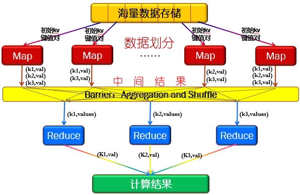
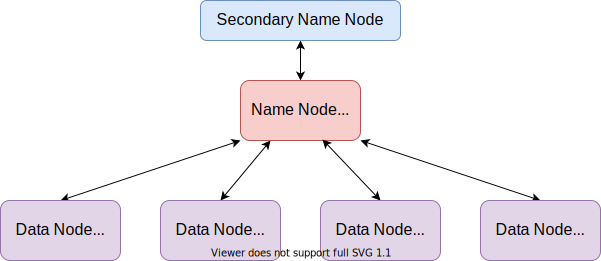
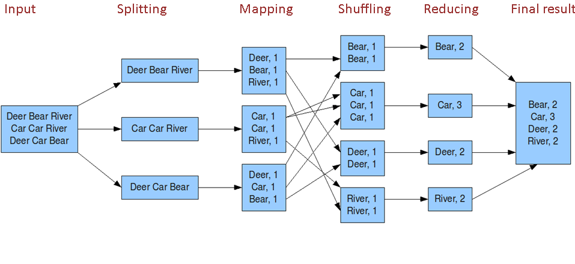
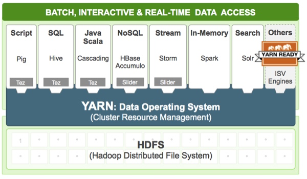
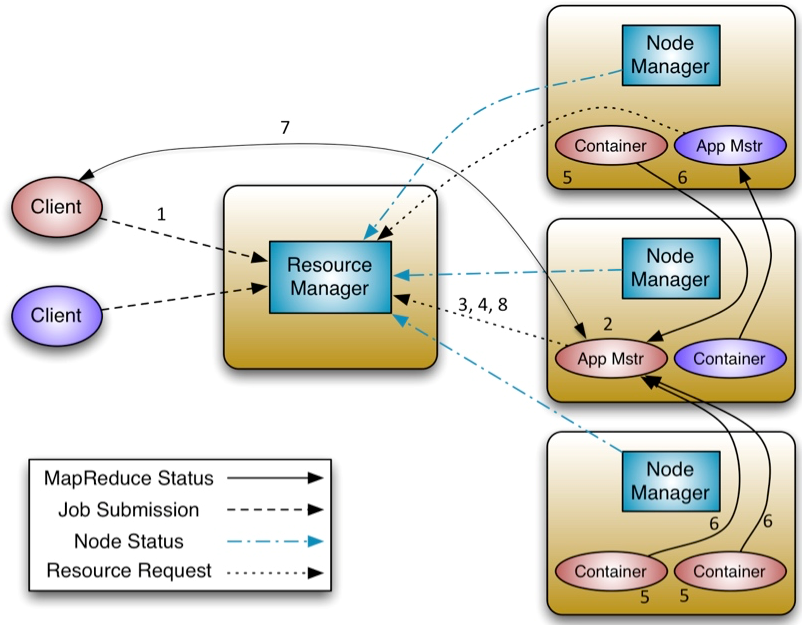

## 简介[[1]](https://cloud.tencent.com/developer/article/1431491#MapReduce运行原理)

**MapReduce**的核心思想是分治：

1. `map`：首先，将计算作业拆分为若干个任务，分配给不同的计算节点并行执行。
2. `barrier`：然后，对Map产生的中间结果进行聚合、整理（sorting, combining, partitioning,…）。
3. `reduce`：最后，将中间结果进行汇总。

> Map、Reduce源自函数式语言Lisp。
>
> 输入、中间结果、最终结果都保存在**HDFS**中。

## 节点

### 作业跟踪器

Job Tracker负责处理Client提交的作业、调度任务。

Job Tracker负责决定哪些**Block**参与作业，并把作业分割为多个任务，并将这些执行Map、Reduce任务交给多个Task Tracker执行。

### 任务跟踪器

Task Tracker收到任务后会启动多个JVM，Task Tracker会监控这些并行任务，还会重启失败的任务，当任务完成时，会向Job Tracker报告。

Task Tracker会定时向Job Tracker发送心跳，报告任务的执行情况。

### 数量

一个集群只有一个Job Tracker，但会有多个Task Tracker。

Task Tracker往往与Data Node部署在同一台机器上，以节省网络开销；Data Node上往往只会部署一个Task Tracker。

## 处理过程

#### Input Split

Job Tracker将输入文件根据**Block**的大小进行分片，每个分片对应一个Map任务，如，有`3MB`、`129MB`两个不同大小的输入文件，会被分为`1MB`、`128MB`、`1MB`三个分片。

这里的切分不是真的将文件进行切分，而是保存文件的切分位置、分片的长度。

不难看出，每个分片的大小可能不均，而这正是编写**MapReduce**时的优化点。

#### Mapping

Task Tracker根据分片执行开发者编写的`map()`，执行时尽量从本节点、本机架中读取数据。

#### Combine

Task Tracker执行本地`reduce`，在`map()`计算出中间结果前对重复的<u>键值对</u>作简单的合并，执行完成后告知Job Tracker。

#### Shuffle

将`map()`计算出的中间结果作为`reduce()`的输入，也是优化点。

#### Reduce

Task Tracker执行开发者编写的`reduce()`，执行完成后告知Job Tracker。

## 不足

随着Task Tracker数量地增长，Job Tracker的负担会变得很重；而“根据**Block**对任务进行划分”的方式太过简单，没有考虑CPU、内存、网络、磁盘等资源，Task Tracker间的负载不均匀。

> Task Tracker数量的上限大约为`4000`。

另外，**MapReduce**的源码可读性较差，难以维护。而且任何对于**MapReduce**的升级，都需要对整个**Hadoop**进行升级，并且需要对集群中的每个节点升级。

正是因为**MapReducer**存在诸多不足，所以就有了**YARN**。

## YARN

**Yarn**将“作业”这一概念换成了Application，以便运行**MapReduce**以外的其它应用，如，一个Storm应用。

> DAG，Directed Acyclic Graph，有向无环图。

如[下图](https://blog.csdn.net/suifeng3051/article/details/49486927)所示，**Yarn**拓展了**Hadoop**，使其不仅支持**MapReduce**，还方便的管理诸如**Hive**、**Hbase**、**Pig**、**Spark**/**Shark**等应用，令这些应用互不干扰的运行在同一个**Hadoop**中。

### 组件

**YARN**主要有以下组件：

Resource Manager

- 全局级别的进程。

- **Scheduler**：Resource Manager中的一个专门用来进行资源管理的组件，负责分配Node Manager上的**Container**。

Node Manager

- 节点级别的进程。
- **Container**：对CPU、内存等计算资源的抽象，所有应用都运行在**Container**中。
- **Applicaton Manager**：接收任务，并未应用分配一个**Container**来运行Application Master，并对其进行监控。
- Node Manager会不断向Resource Manager发送本地**Container**的使用情况。
- 一个Node Manager拥有多个**Container**。

Application Master

- 应用级别的进程。
- 是对运行在**Yarn**中某个应用的抽象，向Resource Manager申请**Containers**，与Node Manager交互来执行和监控具体的任务。

### 执行过程

如下图所示：

1. Client向Resource Manager提交**Applicaton**。
2. Resource Manager寻找一个可运行**Container**的Node Manager，并在**Container**中启动一个Application Master实例。
3. Application Master启动后，向Resource Manager注册，注册后Client就可通过Resource Manager获取为其创建的Application Master的详细信息，然后Client与Application Master直接交互。
4. Application Master向Resource Manager发送请求**Container**。
5. **Container**被分配完后，Resource Manager会请求Node Manager启动**Container**。
6. **Container**会把运行过程中进度、状态等信息发送给Application Master。
7. Client从和Application Master中获取自己提交的应用的进度、运行状态等信息。
8. 当提交的应用执行完成，Application Master向Resource Manager取消注册然后关闭，归还相应的**Container**。

