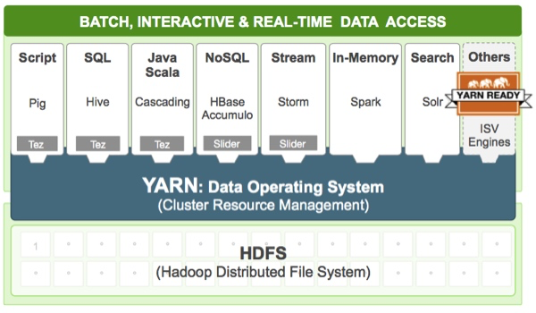
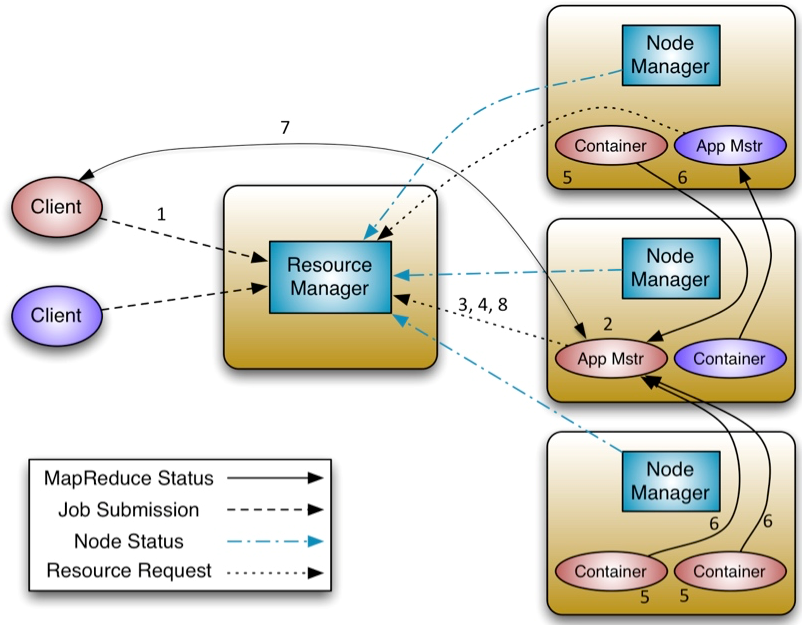

## 简介

**Yarn**（Yet Another Resource Negotiator）将“作业”这一概念换成了Application，以便运行**MapReduce**以外的其它应用，如，一个Storm应用。

> DAG，Directed Acyclic Graph，有向无环图。

如[下图](https://blog.csdn.net/suifeng3051/article/details/49486927)所示，**Yarn**拓展了**Hadoop**，使其不仅支持**MapReduce**，还方便的管理诸如**Hive**、**HBase**、**Pig**、**Spark**/**Shark**等应用，令这些应用互不干扰的运行在同一个**Hadoop**中。

## 组件

**YARN**主要有以下组件：

Resource Manager

- 全局级别的进程。

- **Scheduler**：Resource Manager
  中的一个专门用来进行资源管理的组件，负责分配Node Manager上的**Container**。

Node Manager

- 节点级别的进程。
- **Container**：对CPU、内存等计算资源的抽象，所有应用都运行在**Container**中。
- **Applicaton Manager**：接收任务，并未应用分配一个**Container**来运行Application Master，并对其进行监控。
- Node Manager会不断向Resource Manager发送本地**
  Container**的使用情况。
- 一个Node Manager拥有多个**Container**。

Application Master

- 应用级别的进程。
- 是对运行在**Yarn**中某个应用的抽象，向Resource Manager申请**Containers**
  ，与Node Manager交互来执行和监控具体的任务。

## 执行过程

如下图所示：

1. Client向Resource Manager提交**Applicaton**。
2. Resource Manager寻找一个可运行**Container**的Node
   Manager，并在**Container**中启动一个Application Master实例。
3. Application Master启动后，向Resource Manager
   注册，注册后Client就可通过Resource Manager获取为其创建的
   Application Master的详细信息，然后Client与Application Master直接交互。
4. Application Master向Resource Manager发送请求**
   Container**。
5. **Container**被分配完后，Resource Manager会请求Node
   Manager启动**Container**。
6. **Container**会把运行过程中进度、状态等信息发送给Application Master。
7. Client从和Application Master中获取自己提交的应用的进度、运行状态等信息。
8. 当提交的应用执行完成，Application Master向Resource
   Manager取消注册然后关闭，归还相应的**Container**。

