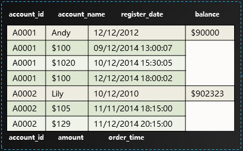

## 数据结构⭐

RDBMS是以行进行存储了，一行中的字段（列）是固定的，无论该列有没有值，这也使得RDBMS不适合存储稀疏表。

**HBase**[按照列进行存储](https://zhuanlan.zhihu.com/p/145551967)，一条记录字段是不固定的，没有值的字段不存储，因此，**HBase**比RDBMS适合存储稀疏表。

> 稠密表大家都一样。

### 键值存储

所谓的列式存储就是<u>键值对</u>存储，**HBase**使用[如上](https://blog.csdn.net/bitcarmanlee/article/details/78979836)结构的<u>键值对</u>来组织数据：

- Key：由行键、列族、列、时间戳、类型（增、删）等组成。
- Value：实际保存的值。

**HBase**与RDBMS相比，除了支持<u>高并发写</u>和<u>海量数据的随机、实时读</u>外，还有个有优点是Schema Less的。Schema Less是因为基于<u>键值对</u>，所以“<u>字段</u>”可以自由扩展。

**HBase**没有`JOIN`，但**Column Family**、Schema Less等设计实现的宽表效果，一定程度上起到了`JOIN`的作用。

> Schema Less指的是无需预设Schema，而非一点Schema都没有，**HBase**仍有Namespace、**Column Family**等Schema。
>
> Schema Less的特性决定了**HBase**适合存储稀疏表。

### File

上篇提到，**StoreFile**是对**HFile**的简单封装，如[上图](https://www.iteye.com/blog/asyty-1250301)所示，**HBase**对**HFile**[做了如下封装](https://blog.csdn.net/u011490320/article/details/50814967#3.4/8)：

- **Data Block**：保存数据，可被压缩。
- **Meta Block**：保存用户自定义的<u>键值对</u>，可被压缩，可选。
- **File Info** ：**HFile**的元信息，定长。
- **Data Block Index** ：对**Data Block**的索引，索引项为每个**Data Block**的起始点。
- **Meta Block Index**：对**Meta Block**的索引，索引项为每个**Meta Block**的起始点，可选。
- **Trailer**：保存了每一段的偏移量，或者说时其它数据块的起始位置， 定长。

> **Data Block Index**的底层也是B+树。

#### 关于数据块

**Data Block**的大小可在建表时通过参数指定，大的**Block**有利于顺序`scan`，小的**Block**利于随机查询。

**Data Block**的开头为Magic，由随机数字组成，用于防止数据损坏；Magic后面紧接着一个个<u>键值对</u>。

#### Region Server中的查询过程

1. Client到**Region Server**上查询数据时，会根据Namespace、Table Name、**Rowkey**先从**Block Cache**中寻找。
2. 若未果：
   1. 则去对应的**HFile**中寻找，先读取其**Trailer**来定位**Data Index**；
   2. 然后将**Data Index**读入内存，这样在检索时，便可以在内存中直接根据**Rowkey**定位**Data Block**的偏移量；
   3. 然后将整个**Data Block**读入内存，再通过遍历找到需要的<u>键值对</u>。

#### 关于缓存

**MemStore**主要用于写，[**Block Cache**](https://www.cnblogs.com/zackstang/p/10061379.html)用于读。

> **Block Cache**基于**LRU**。

**Block Cache**不是万能的，对于不会再次读取或很少再次读取的数据，如，随机读、全表扫描等场景，放入缓存只会打乱内存分布，触发过多没必要的**GC**，这时可以开启**Bucket Cache**。

开启堆外（Off Heap）的**Bucket Cache**后，**HBase**会将所有的**Data Block**放入**Bucket Cache**中；而`hbase:meta`、索引、Bloom Filter等元数据，仍然保存在堆内（On Heap）的**Block Cache**中。

**Bucket Cache**的速度接近**Block Cache**，但延迟稳定，无需**GC**。

## 行键的设计

**Rowkey**的设计原则：

##### 唯一

- 最基本的要求。

##### 简短

- 基于<u>键值对</u>的存储带来了[可观的数据膨胀](http://www.nosqlnotes.com/technotes/hbase/hbase-overview-writeflow/#10.5/25.1)，**Column Family**、**Column**、**Rowkey**是占存储空间，越小越节省空间。
- 对于**Rowkey**中包含时间戳的数据，可以考虑按日期分表，这样**Rowkey**中仅需保存时间，节省空间。

##### 散列

1. 散列的Key能保证负载的均衡。
2. 可以通过Hash（MD5、SHA-1）、反转（ID、手机号）、前缀加盐的方式进行散列。

> 身份证号、车牌号自带散列特点。
>
> 前缀加盐是比较好的散列方式，令**Rowkey**仍然业务相关，但是会增**Rowkey**的长度，增加文件体积。
>
> 最好不要采用时间、ID等明显有分段现象的属性直接当作**Rowkey**来使用，可以反转后再使用。

另外，**Rowkey**应该是业务相关，以便查询，但**业务相关**与**散列**是矛盾的，所以：

1. <u>写多于读</u>的情景，尽量**散列**，负载能够均衡，同时再配合预分区，可以有效缓解热点问题。
2. <u>读多于写</u>的情景，应避免**散列**，以便根据业务属性直接组装**Rowkey**，从而快速查出数据。

> 技巧：
>
> - 已经保存在**Rowkey**中的字段可以不再为其设计列，以减弱数据膨胀。
> - **Rowkey**按照字典序排列，但将时间差`Long.MAX_VALUE – timestamp`拼入**Rowkey**并不能使其散列。
>   - 倒序不是反转，但倒序可用来实现返回最近N条记录。
>   - 使用`scan.setReversed(true)`倒序扫描也可实现返回最近N条记录。

> **HBase**适合存储以实体为中心的数据。
>
> 1. 实体指的是自然人、车辆、账号、手机号等对象。
> 2. 以这些实体为中心的数据有：
>    1. 基础属性信息（含标签类数据）。
>    2. 关系信息（图数据）
>    3. 事件数据。
>
> 其中，事件数据又分为：
>
> 1. 监控数据。
>
> 2. 时序数据。
>
> 3. 位置数据。
>
> 4. 消息、日志数据。
>
> 5. 订单、交易记录。
>
>    1. 一个技巧，用一张表存储账户和交易两类数据，如[下图](http://www.nosqlnotes.com/technotes/hbase/hbase-rowkey/#27.5/41)所示：
>    
>    

## 列族的设计

**Column Family**虽然也能扩展，即，一张表支持多个**Column Family**，但是，**Column Family**[不要多于两个](https://blog.csdn.net/diaoxie5099/article/details/101350743)，因为不同的**Column Family**的数据量往往差异很大（不均匀），比如A列族有十万条数据，而B列族有十亿条，那么：

- 在1.2.0之前，A列族会随B列族进行`flush`、合并，B列族也会随A列族进行，这种相互作用导致大量不必要的IO，从而影响性能。
- 同时还会导致十万条数据会随十亿条数据的分散而分散，即，A列族分散在多个小文件中，进而导致对A列族的大规模扫描变慢。

并且，**Store**是以**Column Family**为单位的，越多的**Column Family**就会有越多的**MemStore**，消耗更多的内存，`flush`也会更吃力。

但如果，同一张表的不同**Column Family**的数据量差距不大，或者仅有的一个**Column Family**可以切分为多个数据量相差不大**Column Family**，那么，多**Column Family**的设计，允许程序按需查询数据，而非只能直接返回全部字段，[这样能节省IO、内存空间](https://www.cnblogs.com/duanxz/p/4660784.html#8/12)。

> 比如，轨迹记录可以分为`entity`、`action`、`site`三个**Column Family**：
>
> - `entity`保存身份证号、姓名、性别、车牌号、号牌种类等实体信息，
> - `action`保存发生时间、行为类型、行为标签、地点名称等行为信息，
> - `site`保存经纬度、地点编号、地点标签等点位信息。
>
> 如果无需在地图上绘制，就不需要查询`site`，从而节省IO。
>
> 但是，很难保证不同**Column Family**的数据量差距不大，因为即便**Column Family**的字段数量相同，但不同字段的长度往往不同。

更多关于**HBase**的调优、设计可参照[文章](https://www.cnblogs.com/duanxz/p/3154345.html)。

