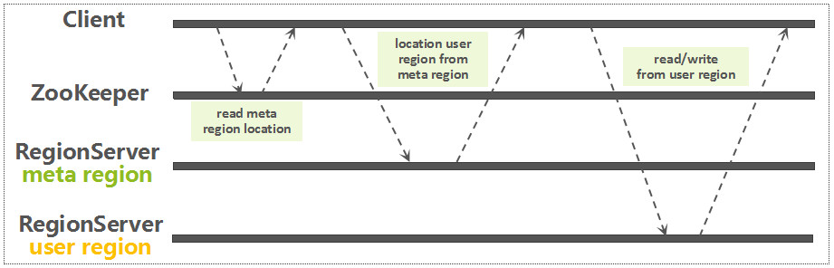

## 读写

### 路由[[1]](https://blog.csdn.net/wonderful_life_mrchi/article/details/77566803#数据读写流程)



如[上图](http://www.nosqlnotes.com/technotes/hbase/hbase-overview-writeflow/#11.5/25)所示：

1. Client访问**Zookeeper**，获取`hbase:meta`所在的**Region**和**Region Server**地址。
2. Client到相应的**Region Server**中读取`hbase:meta`表，并根据Namespace、Table Name、**Rowkey**获取**Region**以及**Region Server**地址。
3. Client向**Region Server**直接请求，进行数据读写。

可以看到，**HBase**的RPC过程有点多，[所以](https://chenhy.com/post/hbase-quickstart/#1-4-数据路由-hbase-meta)：

- Client从**Zookeeper**获取到`hbase:meta`所在的**Region Server**的地址后，会缓存该地址，以减少对**ZooKeeper**的访问。
- Client从`hbase:meta`中获取到**Rowkey**对应的**Region Server**的地址后，会缓存该地址，以减少对`hbase:meta`的访问。

> - 0.96 版本以前会多一步，这是因为**HBase**在设计之初担心`hbase:meta`会太大。
> - Client对`hbase:meta`的缓存不更新，如果`hbase:meta`的内容发生了变化，如**Region**放到了别的**Region Server**上，Client根据缓存去访问时就会报错，报错后会进行有限重试，所有重试失败后，就会去`hbase:meta`所在的**Region Server**获取最新的数据，如果`hbase:meta`不在之前的**Region Server**上，则会去**Zookeeper**上重新获取`hbase:meta`所在的**Region Server**的地址。
> - 以上两点补充来自[一篇超详细的HBase学习笔记](https://www.jianshu.com/p/569106a3008f#10/27)。

### 方式

数据的查询方式：

1. `get`，通过**Rowkey**直接返回指定的记录。
   1. `get`实际上是“起止行”相等的`scan`。
2. `scan`，对表进行扫描。
   1. 使用`setCaching`、`setBatch`方法提高速度，空间换时间。
   2. 设置“起止行”（`start-key`、`end-key`），从而缩小扫描范围。
   3. 使用`setFilter()`设置过滤器，但是会降低速度。

> `scan`实际上是由一个个的Scanner组成，[这些Scanner会被组织成](http://www.nosqlnotes.com/technotes/hbase/hbase-read/#17.3/29)KeyValueHeap，一个基于优先级队列（`PriorityQueue`）的数据结构，以<u>键值对</u>为单位逐个读取。

### 多条件查询[[2]](https://juejin.cn/post/6844903949732937736)

使用`setFilter()`设置单个过滤器或一组过滤器。

可将查询条件提前拼装到**Rowkey**中，对**Rowkey**施以相应过滤。

#### 比较过滤器

- `CompareFilter`支持`<`、`<=`、`=`、`!=`、`>=`、`>`、`exclude`等各类运算符。

- `CompareFilter`支持`Binary`、`Binary Prefix`、`Regex String`、`Sub String`、`Null`、`Bit`等比较器。

- `CompareFilter`分为`RowFilter`、`FamilyFilter`、`QualifierFilter`、`ValueFilter`、`DependentColumnFilter`等过滤器。

#### 专用过滤器

- `SingleColumnValueFilter`：过滤单列列值。

- `SingleColumnValueExcludeFilter`：排除单列列值。

- `PrefixFilter`：过滤行键前缀。
- `ColumnPrefixFilter`：过滤列名前缀。
- `PageFilter`：分页。
- `TimestampsFilter`：过滤时间戳。
- `FirstKeyOnlyFilter`：过滤首次行键。扫描完第一列，就跳转到下一行，适合统计行数。

#### 包装过滤器

- `SkipFilter`：包装一个过滤器，当被包装的过滤器遇到一个需要过滤的<u>键值对</u>时，则拓展过滤整行数据。
- `WhileMatchFilter`：包装一个过滤器，当被包装的过滤器遇到一个需要过滤的<u>键值对</u>时，结束本次扫描，返回已经扫描到的结果。


## 事务[[3]](http://hbasefly.com/2017/07/26/transaction-2/)

### 原子性

众所周知，**HBase**先写入**HLog**，再写入**MemStore**，**HLog**为**MemStore**提供回滚支持，而**HLog**无论单条写入，还是批量写入，都是原子性的，即，要么写入成功，要么写入失败。

[0.94版本中](http://www.nosqlnotes.com/technotes/hbase/hbase-overview-writeflow/#20.8/25)，**HBase**调整了**HLog**、**MemStore**的写入顺序，当**HLog**写入失败时，则回滚**MemStore**中的数据，以便更快地释放<span style=background:#c9ccff>行锁</span>，提高性能。

2.0.0版本，对<span style=background:#c9ccff>行锁</span>做了调整，受此影响，又将写入顺序改了回来。

```properties
# 单条写入
<logseq#-for-entire-txn>: <WALEdit-for-entire-txn>
# 批量写入
<logseq#-for-entire-txn>: <-1, 3, <Keyvalue-for-edit-c1>, <KeyValue-for-edit-c2>, <KeyValue-for-edit-c3>>
```

### 隔离性

[简单来说](https://www.ktanx.com/blog/p/4517)，**HBase**使用`CountDownLatch`实现行级的并发写入，使用**MVCC**实现行级的并发读写，使用`ReentrantWriteReadLock`实现**Region**/**Store**级别的并发读写。

#### 交叉问题

**HBase**实际上是一个<u>键值对</u>系统，写入时按单元格进行写入，而非行或者列。

如果在并发写时，不加以任何控制，会出现“交叉”问题。

> Timestamp属性很大程度上能用来区分写入的先后顺序，因为默认会使用插入数据时的时间，但插入时间[应该不一定是](https://blog.csdn.net/weixin_37275456/article/details/89846333)数据真正存入系统的时间，而`sacn`却是按照真正的存入时间进行读取。若不指定Timestamp/MaxVersions，则`scan`读取到的数据可能不是最新的，或者读取到的两个字段分别来自两个并发的写入，即，出现“交叉”问题。
>
> Timestamp属性也支持指定时间，但**HBase**只保留Timestamp最大的数据，而非最新的，故自定义Timestamp的数据可能插入失败。
>
> Timestamp为`long`型的毫秒，如果并发量较大，同一毫秒可能会写入多条数据，则需要结合`sequence id`来区分写入的先后顺序。

**HBase**使用<span style=background:#c9ccff>行锁</span>来控制并发写，避免出现“写交叉”问题。

**HBase**在批量写入时，一个**Region**启用一个线程，线程只会对自己负责的**Region**中的行逐行加锁。同一**Region**中的多个<span style=background:#c9ccff>行锁</span>采用**2PC**，在所有行写入完成后才会统一解锁。

> 从行的粒度上看，<span style=background:#c9ccff>行锁</span>意味着串行写，从表/分片的粒度上看，写算是并行的。
>
> 统一解锁能有效防止死锁。
>
> **HBase**在第一阶段就会解锁，而**MySQL**在第二阶段才会解锁。

#### 新旧问题

**HBase**使用**MVCC**来控制并发读写，避免了“新旧”问题。

> 如果在写入的同时，允许直接读取数据，那么读取到记录可能是不一致的，即，一部分是已更新的，另一部分是未更新的。

**HBase**的**MVCC**分为两方面:

- 按**Region**为每个写事务分配自增的`sequence id`，`sequence id`会放入队列。
- 每个写请求只能读取已完成的、`sequence id`最大的写事务更新的数据。

> **HBase**、**MySQL**都可以采用独享锁的方式来控制并发读写，但并发量会远低于用**MVCC**实现并发读写的方式。

#### 读写锁

**HBase**使用读写锁来控制**Region**/**Store**级别的并发，如：

- 更新**Region**中的数据时加<u>读锁</u>。
- 合并**Region**时加<u>读锁</u>。
- `split`、`flush`**Region**时加<u>写锁</u>。
- `flush`**MemStore**时加写锁。

#### 补充[[4]](http://www.nosqlnotes.com/technotes/hbase/hbase-overview-writeflow/#21.1/25)

在2.0.0版本之前，行级别的任何并发写入都是互斥的，由一个行锁控制。

在2.0.0版本之后，多个线程可以同时更新一行数据：

- 如果写同一行不同的**Column Family**，则不需要互斥。
- 如果写同一行的相同**Column Family**的相同的列，也不需要互斥，完全可以通过**MVCC**来控制数据的一致性。
- 但如果是**CAS**（如checkAndPut）或increment，依然需要独占的行锁。

### 持久性

**HLog**有多种持久化策略：`SKIP_WAL`，`ASYNC_WAL`，`SYNC_WAL`，`FSYNC_WAL`。

`SKIP_WAL`：不写**HLog**，性能最高。

`SYNC_WAL`：若OS不宕机，则不会丢失数据。

`FSYNC_WAL`：写入**HLog**后立刻落盘，但未实现。

### 一致性

**HBase**仅做到了**Region**级别的隔离，从而决定了**HBase**的事务仅限同一**Region**，不会跨**Region**/Table。


## 索引

**HBase**没有原生二级索引，**Rowkey**往往发挥着一部分索引的作用。

**Rowkey**按照字典序排列，类似于联合索引，重要的信息应往前放。

### 二级索引

##### Coprocessor

- 在`Put`数据时，向**HBase**中的二级索引表插入索引向。

  > **Apache Phoenix**功能围绕SQL On HBase，[提供二级索引](https://zhuanlan.zhihu.com/p/38030330)。

- 或者[直接改造Coprocessor](https://blog.csdn.net/bluishglc/article/details/31799255)，将索引数据连同原始数据一起保存。


##### Elasticsearch、Solr

- 在**Elasticsearch**、**Solr**等数据库建立对**HBase**表的二级索引。


### 增强

不难看出，**HBase**的[查询能力较弱](http://www.nosqlnotes.com/technotes/hbase/hbase-overview-concepts/)，我们可以使用如下工具，针对具体场景来增强**HBase**的查询能力：

1. OpenTSDB：时序数据存储，提供基于Metrics、时间、标签等条件的组合查询。
2. GeoMesa：时空数据存储，提供基于时间、空间范围的索引能力。
3. JanusGrph：图数据存储，提供基于属性、关系的图索引能力。

但是即便有了这些工具的增强，**HBase**的查询能力也不能与RDBMS相比，当然**HBase**也不是旨在取代RDBMS，而是一种对其的补充。

### 与时空索引

轨迹类数据很常见，这类数据往往以实体为中心，吞吐量大，但表结构扁平，适合用**HBase**存储。

> 轨迹类数据有四要素：Who，对象标识；When，时间戳；Where，空间坐标，往往是二维平面；What，行为类别。

**HBase**中的数据是按行键单维度排列，但我们往往需要从时空等多维度来查询轨迹，这时，在时空中相邻，尤其是在空间中相邻的轨迹数据，其主键往往不相邻，导致查询过程会扫描大量无关的数据。索引可以解决这一问题，但是面对海量数据，基于**B+树**的索引表现疲软，于是便诞生了GeoMesa等[时空索引技术](https://mp.weixin.qq.com/s/1swuYHLo5hzzJL0WNq0yAg)。

常见的空间索引技术有：

1. ##### Rectangel-Trees

   1. Minimum Bounding Rectangle，MBR，最小包围矩形。
   2. 自底向上构建，矩形间允许重叠。

   3. 平衡。

   4. 充分利用磁盘分页，拥有良好的随机读写（类似平衡树）。

      1. B树存放一维排序的数据，R树存放多维空间数据。
      2. 空间查询以范围查询为主，B树擅长数据点查，不擅长范围查询；R树虽然是空间索引，但是也不擅长范围（划定区域）查询，因为可能存在多个子树与划定区域存在交集，需要对多个子树进行查询。

2. ##### Quad-Trees

   1. 按点位将平面空间分割成4个象限。
   2. 不平衡。

   3. 结构不稳定，树结构与写入顺序相关，缺少树中的数据映射为Key的方法。

   4. 存在多种变体，如Point Region Quad-Trees。

      1. 四等分象限（数据分区与用户数据无关）。

3. ##### K-D Tree

   1. k-dimensional的简称，是一种分割k维空间的数据结构。
   2. 二分，趋于平衡。

4. ##### Space Filling Curve

   1. 四等分（每个区域）。
   2. 串联（切分）算法：

      1. Z-Order Curve：编码（映射）简单，迭代过程与Quad树相仿。
      2. Hilbert Curve：具有良好的填充性（距离保留度）。

   3. 将二维的空间数据转换为一维的排序，之后我们可以采用**B/B+树**来进行索引。

5. ##### GeoHash

   1. 等分。
   2. 编码长度越长，精度越高。
   3. 编码后的顺序与Z-Order一致，即，可以看作Z-Order的一种编码机制。
   4. 二进制分割，再用Base32编码，然后利用字符串前缀匹配规则，可快速实现<u>多边形区域的重叠计算</u>。

基于树的索引因为遍历顺序的不确定，进而导致无法映射出确定顺序的行键，所以GeoMesa这一开源索引采用自定义的GeoHash实现Z-Order曲线以索引三维时空。

