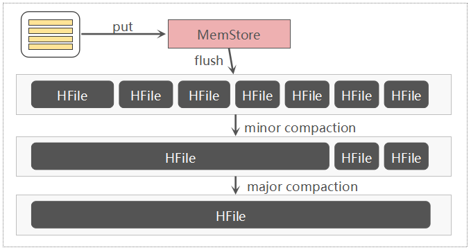
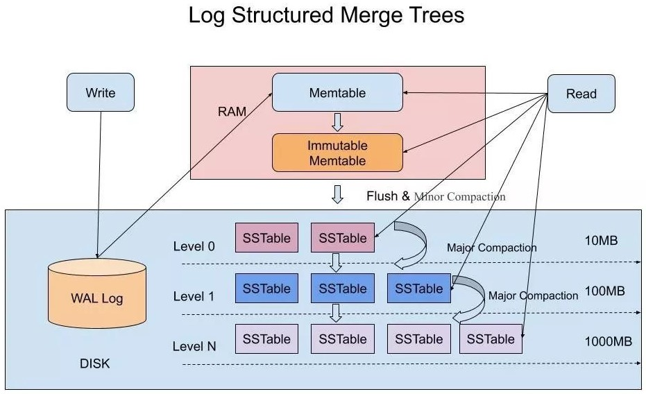

## 刷写

满足某些条件时，**Region Server**会将**MemStore**`flush`到**StoreFile**中。

[这些条件共有](https://cloud.tencent.com/developer/article/1005744)6种：

1. **MemStore**级别限制：当**Region**中任意一个**MemStore**的大小达到阈值，就会触发`flush`。
2. **Region**级别限制：当**Region**中所有**MemStore**的大小之和达到了阈值，就会触发`flush`。
3. **Region Server**级别限制：当一个**Region Server**中所有**MemStore**的大小之和达到了阈值，就会触发`flush`，将最大的几个**MemStore**刷写，直至所有**MemStore**的大小之和低于另一个阈值。
4. 当**Region Server**中**HLog**数量达到上限时：会选取最早的一个**HLog**对应的一个或多个**Region**进行`flush`。
5. 定期`flush`：默认周期为1小时。定期`flush`会有`20000毫秒`左右的随机延时，以避免所有的**MemStore**同时`flush`，
6. 手动`flush`：用户通过Shell命令对表或**Region**进行`flush`。

阈值检查的时机有3种：

1. 写操作前会检查阈值。
2. `compact`、`split`**Region**前会检查阈值。
3. 定时检查。

`flush`范围：

- 1.2.0以前，`flush`的单位是**Region**，而非单个**MemStore**。

  > 这也是不建议多列族的原因之一。

- 1.2.0之后，`flush`[的粒度细化到](http://hbasefly.com/2017/07/02/hbase-sequenceid/#5.1/12)**MemStore**，策略可配置。

  > 2.0.0版本起有[3种策略](https://www.iteblog.com/archives/2497.html#_MemStore_Flush)：FlushAllStoresPolicy、FlushAllLargeStoresPolicy、FlushNonSloppyStoresFirstPolicy。

`flush`时，**Region**会不可用：**Region Server**会对**Region**做Snapshot，对**HLog**进行Checkpoint。

## 合并

当满足某些条件时，**Region Server**会将**SotreFile**`compact`[为更大的](http://hbasefly.com/2016/07/13/hbase-compaction-1/)**StoreFile**：

1. Minor Compaction：每次`flush`前，会检查**StoreFile**的文件数量是否达到阈值，若是，则选取部分相同**Column Family**且相邻的**StoreFile**进行`compact`。会频繁进行。
2. Major Compaction：将整个**Region**中所有相同**Column Family**的**Store**`compact`成一个，`compact`时会清理<u>被标记删除的</u>、<u>TTL到期</u>、<u>版本号超过设定版本数</u>的数据，开销大。默认每周自动执行一次；但往往禁用自动触发，选择在空闲时间手动执行。

Major Compaction能减少**HFile**的数量，从而减少文件句柄数量，降低读取时延。

但`compact`同时也会带来写放大的问题，减少不必要的合并能节省IO。对于**Rowkey**不会或者很少跨**HFile**、较为陈旧且很少读取的**HFile**，是没有必要`compact`的。

所以，针对不同的场景来选择不同的合并策略。[[1]](http://www.nosqlnotes.com/technotes/hbase/flush-compaction/)

更多`compact`相关参数可查看[文章](https://blog.csdn.net/shenshouniu/article/details/83902291)。

## 拆分

当满足[拆分策略](https://www.cnblogs.com/duanxz/p/3154487.html)所规定的条件时，**Region Server**就会自动将**Region**`split`为均等的两份。

`split`前，**Region Server**会先将**Region**下线；`split`完成后，**Region Server**在`hbase:meta`新增**Daughter Region**的信息，即，将**Daughter Region**上线，向**Master**汇报，**Master**会将**Daughter Region**分配到相应的**Region Server**上，实现负载均衡。

`split`[过程会在秒级以内，因为](https://www.cnblogs.com/duanxz/p/4516283.html#11/12)只是对**Parent Region**进行了逻辑`split`，没有底层数据的重组，即，**Parent Region**没有被销毁，**Daughter Region**只是简单的对**Parent Region**进行了索引。只有当**Daughter Region**进行Major Compaction后，发现不再被**Parent Region**索引后，才会将**Parent Region**进行清理。

可以看到，`split`会导致**Region**暂时不可用，所以往往会关闭自动`split`，并且在建表时，对**Region**进行预分区来进一步避免`split`。

> 关闭方式为：将`hbase.hregion.max.filesize`设为足够大，并指定拆分策略为**ConstantSizeRegionSplitPolicy**。

### 拆分策略

- ##### ConstantSizeRegionSplitPolicy

  - 0.94 版本之前的默认策略，当一个**Region**的所有**SotreFile**的大小之和达到阈值时就会对其进行`split`。

- ##### IncreasingToUpperBoundRegionSplitPolicy

  - 0.94 版本之后的默认策略，根据`min(r^2 * flushSize, maxFileSize)`确定**Region**的体积阈值。
  - 其中`r`为**Region**的数量。
  - `flushSize`由`hbase.hregion.memstore.flush.size`确定，默认`134217728`（`128 MB`）。
  - `maxFileSize`由`hbase.hregion.max.filesize`确定，默认`10GB`。

- ##### DelimitedKeyPrefixRegionSplitPolicy

  - 以**Rowkey**的前缀为拆分依据，保证相同**Rowkey**前缀的数据在同一个**Region**中。
  - 通过分隔符来间隔前缀和后缀。

- ##### KeyPrefixRegionSplitPolicy

  - 以**Rowkey**的前缀为拆分依据，保证相同**Rowkey**前缀的数据在同一个**Region**中。
  - 通过**Table**的`prefix_split_key_policy.prefix_length`属性，来指定前缀长度。
  - 该策略适合前缀固定的**Rowkey**。
  - 当Table未设置该属性，或该属性不为**Integer**类型时，还是会使用**IncreasingToUpperBoundRegionSplitPolicy**。

> 按前缀拆分的两种策略较少使用。
>
> 技巧：“|”的[ASCII值](https://zh.wikipedia.org/wiki/ASCII#.E5.8F.AF.E6.98.BE.E7.A4.BA.E5.AD.97.E7.AC.A6)为124，“~”的ASCII值为126，大于所有的数字和字母等符号。

## Log Structured Merge Tree

[LSMT](https://cloud.tencent.com/developer/article/1441835)是一种文件组织方式，核心思想是将随机读写改为顺序读写。

**LSMT**以追加的的方式写入数据，包括删除、修改操作，这种方式大大提升了写入速度，但是牺牲了部分读性能。

当然，**LSMT**也对读性能进行了增强，通过划分内存、文件分层（分级）的方式。

> **LSMT**源自Google的BigTable，**HBase**、**Cassandra**均采用了**LSMT**。

### 数据结构

#### MemTable

**MT**使用跳表存储，以保持Key的有序。

#### Immutable MemTable

当**MT**超过一定大小，将对在内存中冻结，成为不可变的，即**Immutable MemTable**，**IMT**，同时会新建一个**MT**继续进行写入。

#### Sorted String Table

**SST**是**LSMT**的核心数据结构。

**SST**是一个有序、不可变的键值对存储结构，键、值的类型都是任意的字节数组。

**SST**内部由**Block**组成，每块大小通常为`64KB`，并且在**SST**文件的尾部保存有这些块的索引。

1. 读取**SST**时都是从文件末尾开始读，这样会先读取索引，然后对索引进行二分查找，快速找出数据在磁盘中的偏移量，进而读取数据。
2. 当然内存足够大的话，我们可以通过**MMap**将**SST**映射到内存中，提升查询速度。

### 合并

1. 把**IMT**给`dump`到磁盘的**SST**层的过程称为Minor Compaction。

   > 确切的说是`dump`到L0层，需要注意的是这一层的**SST**是没有进行`compact`的，所以Key在这一层中会出现重复。
   >
   > 其实，BigTable中的Minor Compaction在**HBase**中叫做`flush`，Merge Compaction对应**HBase**的Minor Compaction。

2. 当L0中的**SST**超出一定大小或一定数量时，就会进行`compact`，`compact`好的**SST**放入L1，此过程称为Merge Compaction。

3. 当L1中的**SST**超出一定大小或一定数量时，就会进行Major Compaction：
   1. 这个阶段会将标记删除、过期、超出版本数量限制的的数据删掉，将多个版本的数据`compact`。`compact`策略分为size-tiered和leveled。
   2. 而**SST**本身就是有序的，使用归并排序（Merge Sort）能进行高效`compact`。
   3. Major Compaction的过程开销巨大，一般会禁用自动（周期性）执行该功能，选择在空闲期间执行。

### 读取

**LSMT**的读取过程较为简单，先查内存中的缓存，若未命中则查询磁盘中的**SST**，查询过程中会逐层下沉，直到查询到数据，或全表扫描未果。

### 读优化

即便不出现全局扫描，顺序读要比顺序写略慢（因为写就是写完了，而读要一直查找直到找到符合条件的数据），**LSMT**从4个方面对顺序读进行了优化：

1. 缓存：通过将扫描过的块进行缓存，来提升之后的读速度。

2. 合并：定期`compact`（瘦身）文件，可以减少扫描的数据量，缩短扫描时间。

3. 压缩：**SST**的压缩不是将整个文件进行压缩，而是根据locality将数据进行分组，按组进行压缩，这样我们在读取数据解压时，只需解压部分，减少开销。

4. Bloom Filter：Bloom Filter可以减少不必要的的扫描。

   > Bloom说Key不存在，那肯定是不存在；Bloom说一个Key存在，那么Key可能存在。

### 写入

**LSMT**的写入过程简单概括成：先写**WAL**，然后写入内存中的**MemTable**，随着写入的进行，**MemTable**会变为**Immutable MemTable**，而后**Immutable MemTable**会`dump`到磁盘中，磁盘中的**SST**会逐渐积累并进行`compact`。

### 写放大

顺序写存在的3个放大问题：

1. 读放大：内存中没有，需要查硬盘。
2. 写放大：写入过程中触发`compact`，导致实际写入量放大。
3. 空间放大：数据存在冗余，实际占用空间较大。

写放大会导致IO毛刺。
