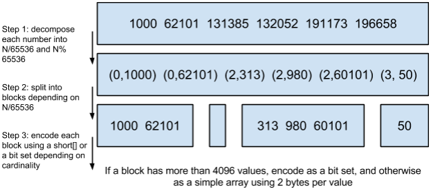

## 简述

**Lucene**是一个全文检索工具包。

全文检索是指：将一段文字或一篇文档，先进行分词处理，然后将词和文档建立映射，并将映射组织为索引，之后通过在索引中检索词，就可以找到相应的文章（全文），而建立的索引也称为倒排索引。

> 一般说的索引都是指倒排索引，因为正排索引是按照记录主键排序的，查询效率低，不适合索引文档。
>
> “倒排索引”中的“倒排”有必要吗？索引不都是字段指向ID，不都是倒排的吗？
>

基于**Lucene**的项目主要有：

1. **Apache Nutch**，一个高扩展性的网络爬虫项目。
2. **Apache Solr**，一个全文检索引擎。
3. **Elasticsearch**，一个全文检索引擎。

## Apache Nutch[[1]](https://blog.csdn.net/weixin_44037478/article/details/86492924)

**Nutch**一个爬虫项目，除了能够爬取网页，还能够自动维护网页的URL信息（去重、定时更新、重定向等）。

**Nutch**采用**MapReduce**来爬取、解析网页，并在0.8版本中将**MapReduce**和**HDFS**剥离成了单独的项目——**Hadoop**，当然**Nutch**仍旧基于**Hadoop**。

> 既然基于**Hadoop**，你可能会猜到**Nutch**可以将**HBase**作为储存工具。

> **Hadoop**是Doug Cutting[根据](https://zhuanlan.zhihu.com/p/163636311)儿子的大象玩偶生造出来的。
>
> - **MySQL**[是](https://learnku.com/articles/40537)Michael Monty Widenius根据女儿My来进行命名的；**MaxDB**是Monty根据儿子Max来命名的；**MariaDB**是Monty根据孙女Maria的名字来命名的。
> - Doug Cutting也是**Lucene**、**Nutch**、**Avro**的创始人。
>- **Lucene**诞生于1997年，**Nutch**诞生于2004年，**Hadoop**诞生于2006年。
> 
>**Google**创建于1998年，三大论文发表于2003~2006年。
> 
>互联网泡沫发生于1995~2001年。

从1.2版本以后，**Nutch**不再提供搜索功能，但是能够向**Solr**等搜索引擎提交爬取的网页。

## Apache Solr与Elasticsearch

**Solr**和**Elasticsearch**单论全文检索功能，性能、易用性都差不多，毕竟都是基于**Lucene**；经历了长期的发展，两者在可扩展性、分布式问题上的表现相仿。

不同的是，**Solr**支持非常复杂的查询，而**Elasticsearch**的聚合分析功能更强。

另外一点不同是，**Elasticsearch**更加易上手，但是由商业公司**Elastic**来维护开源工作，而**Solr**是开源社区维护，而且开源时间早，由大量的文档可查阅。

> 来自文章《[Solr vs Elasticsearch](https://logz.io/blog/solr-vs-elasticsearch/)》，另有[译文](https://www.cnblogs.com/xiaoqi/p/solr-vs-elasticsearch.html)。

## MySQL、Elasticsearch、HBase

### 场景[[2]](https://www.jianshu.com/p/4e412f48e820)⭐

三者涉及不同的应用场景，使得三者的读写设计、原理也不相同：

- **MySQL**对关系的表示和事务的支æŒæ˜¯ç‹¬ä¸€æ— äºŒçš„。

- **Elasticsearch**主è¦é’ˆå¯¹全文检索场景。

- **HBase**适åˆä»¥å®ä½“为中心的æµ·é‡æ•°æ®çš„高并å‘写入å’Œå®æ—¶读å–。

**MySQL**、**Elasticsearch**都能进行复杂条件的查询、聚合，但**Elasticsearch**天生分布式，性能要好一些。

**MySQL**单表数据达千万条后就会变慢，**HBase**则不会有这样的问题，因为天生分布式。

### 数据一致性⭐

**Elasticsearch** + **HBase**的组合，是搜索 + 详情场景的常见解决方案。

对于这种“同一份数据保存在不同数据源”的场景，数据的一致性是一个不容忽视的问题。

一份数据往往是通过消息队列分发到不同的数据源中，我们可以利用消息队列的消息堆积，或者说是利用消息队列对持久化的支持，采用延迟消费的方式，对不同数据源中的数据进行核对，来保证数据的一致性。

> 消息队列不丢消息是重要前提条件。
>
> 延迟而非实时，是为了确保各个数据源中的数据落盘；延迟而非实时，一定程度上也是为了减轻各个数据源的IO，避免、缓解IO毛刺。

## 数据结构🌙

### 主要文件[[3]](https://elasticsearch.cn/article/6178#tip4)

- ##### Field Index
  - `*.fdx`
  - 正排索引，存储文件的元数据信息，用于根据文档ID直接查询文档。
  
- ##### Field Data

  - `*.fdt`
  - 存储了正排存储数据，即，保存了写入的原文。

- ##### Term Dictionary
  - `*.tim`
  - 倒æ’索引的元数æ®ä¿¡æ¯ï¼Œä½¿ç”¨二分查找。
  - Term Dictionary按块存储，每个**Block**又会利用公共前缀压缩，从而节省空间，如，`Ab`开头的单词，就可以把`Ab`省去。
  
- ##### Term Index

  - `*.tip`
  - 二级索引，以加快查询速度。

- ##### Per-Document Values
  - `*.dvd`、`*.dvm`
  - 保存Doc-Values，用于<u>聚合</u>和<u>排序</u>。
  
  > 倒排索引是`Term-to-DocId`的形式，但是我们在查询时不只希望通过分词查询到文档，还希望进行聚合分析、对分词所属的字段进行过滤、排序，所以**Elasticsearch**在写入倒排索引时还会将`Doc-to-Values`写入。
  
- ##### Term Vector Data

  - `*.tvx`、`*.tvd`、`*.tvf`
  - 记录了一个**Document**中每个**Term**的位置，是实现关键词高亮的基础。

### 字典与文档列表[[4]](https://www.infoq.cn/article/database-timestamp-02)

Term Dictionary会指向Posting List：Term Dictionary中保存**Term**，以及**Term**对应的Posting List的指针。

Posting List是一个`int[]`，存储了所有符合某个**Term**的文档ID。

### 索引的索引

Term Index是对Term Dictionary的索引。

因为Term Dictionary的体积太大，所以无法全部装入内存，而Term Index的引入，能减少对Term Dictionary的寻址次数。

Term Index采用Trie树作为数据结构，并采用压缩，使得自己的体积只有所有**Term**体积之和的几十分之一，从而使得自己可以全部放入内存。

> Trie，前缀树、字典树

### 联合索引

**Elasticsearch**通过将Posting List转换成**Skip List**或**Bitset**，然后进行运算来实现联合索引。

> 而**MySQL**需要提前建立联合索引，否则只会采用多个单列索引中的一个。

#### Skip List

- 将条件字段的Posting List转换成**Skip List**，然后同时遍历这些**Skip List**，相互Skip。
- **Lucene**会对**Skip List**中的**Block**进行基于Frame Of Reference的压缩，以适应低区分度（low cardinality）、频繁出现的**Term**，如性别中的“男”、“女”。
- Frame Of Reference的压缩思路为：增量列表、多级索引。

#### Bitset

- 将条件字段的`filter`转换成**Bitset**，然后对这些**Bitset**做集合运算。
- **Lucene**中的**Bitset**使用了Roaring Bitmaps的数据结构，拥有良好的压缩效果、快速的逻辑（And、Or）操作。
- Roaring Bitmaps的压缩思路为：与其保存100个0，占用100个bit，还不如保存一次0，然后声明这个0重复了100遍。

#### Skip List与Bitset

如果`filter`以**Bitset**的形式缓存到了内存中，就会使用**Bitset**，否则使用**Skip List**。

对于简单的相等条件的`filter`，需要读磁盘的**Skip List**比需要缓存成内存的**Bitset**[还要快](https://www.elastic.co/blog/frame-of-reference-and-roaring-bitmaps)。

