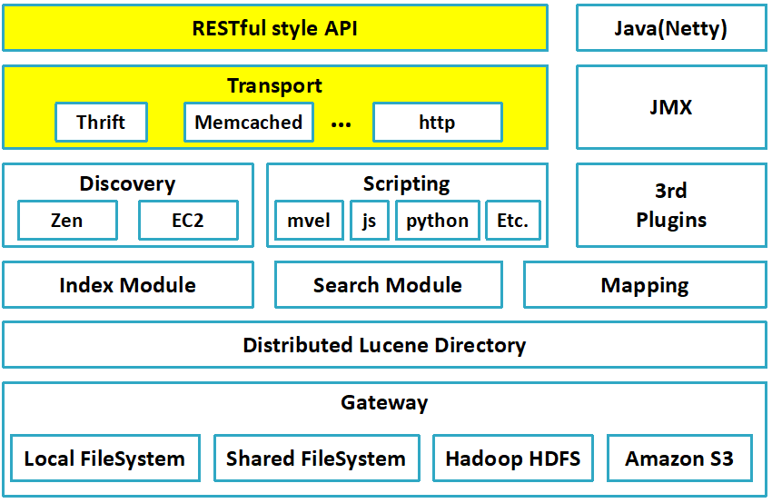

## 简述

**Elasticsearch**是一个分布式全文搜索引擎。

它基于**Lucene**开发，我们没有必要可以区分两者，除非有研究源码，或深入了解**Solr**与**Elasticsearch**的需要。


## 基本概念[[1]](https://www.cnblogs.com/duanxz/p/10108296.html)⭐

1. ##### NRT，Nearly Real Time

   1. **Elasticsearch**是一个近实时系统，写入**Elasticsearch**的数据不会立即生效，需等待<span style=background:#c2e2ff>每秒1次</span>的`refresh`后才会生效被查询到。
   2. 同时对于已生效数据，**Elasticsearch**能以秒级速度响应返回结果。

2. ##### Cluster，集群与中心化

   1. 从集群外部来看，也就是以Client的角度来看，**Elasticsearch**的集群是去中心化的，因为集群是作为一个整体对外提供服务的，从任何节点操作数据得到的结果都是一致的。
   2. 但是从集群内部来看，仍然需要有主节点这种角色来管理集群。

3. ##### Node

   1. 节点，即，一个**Elasticsearch**实例。
   2. 集群中的节点都拥有相同的集群名称（`cluster.name`）。

4. ##### Document

   1. 文档，几乎等同于RDBMS中的一行记录，或者Java中的Bean；不同的是，**Document**仅是最顶层结构或者根对象序列化成的JSON对象。

   2. **Document**使用JSON存储，结构多样，但是同一**Index**中的**Document**尽量结构一致，这样你好我好大家好。

      > `文档`和`行`的相同之处远多于两者的不同之处，与其纠结两者的区别，不如讨论其背后的数据库的不同。
      >
      > `文档`往往是支持非结构化，`文档`往往相互独立、没有太多的关联关系。

5. ##### Index

   1. 索引，广义上指具有相同结构的**Document**的集合，狭义上指的是倒排索引。
   2. 比起RDBMS中的<span style=background:#c2e2ff>数据库实例</span>的概念，**Index**更接近RDBMS中<span style=background:#f8d2ff>Table</span>的概念（6.0版本之后更是如此）。
   3. **Elasticsearch**的**Index**是按照字段进行划分的。

   ------

6. ##### Shard

   1. “分布式存储系统”都会将一个<span style=background:#f8d2ff>Table</span>分成若干部分，也就是一个个的分片，并将这些**Shard**均匀的分布到不同的**Node**上，以达到并行计算的目的。
   2. 一个**Index**在创建时就需要指定**Shard**的数量，默认`5片`，**Index**创建后，**Shard**数量无法修改。
      1. 可能是因为“根据Key来散列**Document**”这一设计导致的。
   3. 而**Shard**与**Node**的对应关系不是一成不变的，当有**Node**加入、退出集群时，“主节点”就会将这些**Shard**重新分配给**Data Node**，即，<span style=background:#c2e2ff>Relocate</span>，所以**Shard**的体积不宜过大，`50GB`以内（也有说`30GB`的）。
   4. **Shard**是以**Segment**为单位来组织数据。而**Segment**是<span style=background:#ff8000>不可修改的</span>，这就使得**Elasticsearch**免去了对读写操作的<span style=background:#c2e2ff>加锁</span>。
   5. 一个**Shard**就是一个完整的**Lucene**实例，提供完整的检索功能。

7. ##### Replica

   1. **Elasticsearch**的**Shard**其实有两种类型：Primary Shard、Replication Shard（**Replica**），**Replica**的内容与Primary Shard的内容完全一致（由同步机制来保持）。
   2. 一片Primary Shard默认有`1片`**Replica**。
   3. **Replica**也是可用于搜索的，确切的说是用于<span style=background:#d4fe7f>负载均衡</span>，从而提升集群整体的计算能力。

   > “分布式存储系统”都会有副本机制，以满足容灾、负载均衡的要求。

8. ##### Mapping

   1. 表结构。
   2. **Elasticsearch**是"Schema Free"的，即，允许我们不指定**Mapping**，**Elasticsearch**会使用默认值，并自动推导字段的类型。
   3. 但是这种灵活性开发者往往把握不住，造成数据结构混乱，失去对数据的控制，并且自动推导出来的类型可能不是预期的，会导致写入和查询的问题。所以尽量指定**Mapping**。

9. ##### Type

   1. **Document**的细分类型。
   2. 在低版本的**Elasticsearch**中，<span style=background:#ffb8b8>Index</span>可以类比RDBMS中的<span style=background:#ffb8b8>数据库实例</span>，<span style=background:#f8d2ff>Type</span>可以类比RDBMS中的<span style=background:#f8d2ff>Table</span>，<span style=background:#c9ccff>Mapping</span>可以类比<span style=background:#c9ccff>Schema</span>。
   3. 但是RDBMS中每张<span style=background:#f8d2ff>Table</span>拥有自己的<span style=background:#c9ccff>Schema</span>，并且每个<span style=background:#c9ccff>Schema</span>独立存储；但**Elasticsearch**不同，同一<span style=background:#ffb8b8>Index</span>中的<span style=background:#f8d2ff>Type</span>共用一个映射<span style=background:#c9ccff>Mapping</span>，即，不同<span style=background:#f8d2ff>Type</span>中相同名称的字段就是同一个字段。
   4. 并且在一种<span style=background:#ffb8b8>Index</span>中很少需要再细分<span style=background:#f8d2ff>Type</span>，或者说两种<span style=background:#f8d2ff>Type</span>的数据很少放入同一<span style=background:#ffb8b8>Index</span>，即便这两类数据关系密切。比如，商品的订单和评论，很少有人会将其放入同一张索引（表）中，并且多<span style=background:#f8d2ff>Type</span>导致了存储**稀疏不均**，严重影响了**Lucene**的压缩能力。
   5. “细分类型”这一设计在使用上很不方便，也正因此**Elasticsearch 6.0**后开始淡化<span style=background:#f8d2ff>Type</span>的概念，只允许一个<span style=background:#ffb8b8>Index</span>拥有一个<span style=background:#f8d2ff>Type</span>。

10. ##### Alias

    1. 别名，**Index**的别名，类似与RDBMS的视图、Linux的软链接。
    2. 我们可以为多个不同的**Index**设置相同的**Alias**，从而达到<span style=background:#c2e2ff>汇集</span>多个**Index**的效果。
    3. 同时**Alias**允许我们随意修改，只要不与现有**Index**同名，这种设计允许我们通过同一个**Alias**达到在不同**Index**上<span style=background:#c2e2ff>切换</span>的效果。
    4. 还可以为**Index**的<span style=background:#c2e2ff>子集</span>设置**Alias**。
    5. **Alias**还提供了原子操作[\_aliases](https://www.elastic.co/guide/cn/elasticsearch/guide/current/index-aliases.html)，方便我们进行”零停机数据迁移“。

    > 更多关于别名的操作，详见[文章](https://www.cnblogs.com/duanxz/archive/2013/05/11/3072547.html)

    ------

11. ##### Gateway

    1. 持久化方式：默认为持久化到本地文件，也可以选择**HDFS**。

12. ##### Zen Discovery

    1. 同网段自动发现机制：节点上线时会在网络中<span style=background:#c2e2ff>广播</span>以寻找并加入到已存在的相同`cluster.name`的集群，同时也支持预先指定节点IP。

       > 没有借助**Zookeeper**等组件。

13. ##### Cluster Health

    1. 集群健康度：一个比较重要的监控统计信息，有Green、Yellow、Red等3种值。 





## 角色

**Elasticsearch**集群中的节点存在5种角色：

1. ##### Master-eligible Node

   1. 候选主节点：集群会从中选举出主节点，也叫做**Candidate**。

   2. 主节点管理数据（创建、删除**Index**，分配**Shard**），以及追踪节点状态，该角色对机器配置要求较低。

   3. ```properties
      #配置为：
      node.master=true
      node.data=false
      ```

2. ##### Data Node

   1. 数据节点：负责数据的存储、查询、聚合等，是负载最重的角色。

   2. ```properties
      #配置为：
      node.master=false
      node.data=true
      ```
   
3. ##### Coordinate Node

   1. 用于协调请求的分发以及结果的合并。

   2. 在实际使用时，可以单独增设这类角色，减轻**Data Node**的负担。

   3. 前文提到，Client可以向集群中的任意节点发送请求，当节点收到请求后，就会成为**Coordinate Node**。

   4. ```properties
      #配置为：
      node.master=false
      node.data=false
      ```
   
   ------
   
4. ##### Ingest Node

   1. 这种角色的节点负责在数据写入前，对数据进行转换处理，以减轻**Data Node**的负担，该角色使用频率不高。
   2. 以上4种角色可以随意搭配，但是在实际使用时，往往都是一个节点只设置一种角色。

5. ##### Tribe Node

   1. 部落节点：横跨多个集群，收集集群的状态信息，将集群组合成一个更大的整体。

      > Elasticsearch 7.0后废除。


## 选举

**Elasticsearch**[使用**Bully**进行选举](https://zhuanlan.zhihu.com/p/110079342)，投票时，会先比较`cluster.state.version`，如果`cluster.state.version`相同，再比较`node.id`。

> **Elasticsearch 7.0**参照**Raft**对选举进行了调整。

**Master**会向各个**Node**发送的集群状态，`cluster.state.version`就是这个状态的版本号。当集群状态发生了变化，如新增了**Node**或者**Node**退出了，那么`cluster.state.version`就会加一。

**Master**会主动降级防止脑裂：

1. 当发现自己能连接的**Slave**小于半数时，会自动降级为**Candidate**。
2. 当发现集群中存在其它**Master**，且自己的`cluster.state.version`小于对方时，会自动降级为**Candidate**。

任一节点发现**Master**没有得到半数以上节点认可的时候，就会触发选举。

