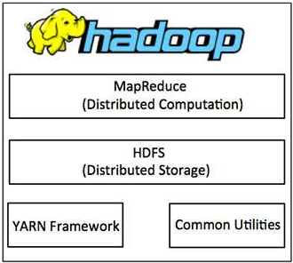
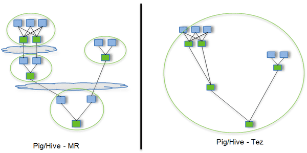

## 组成

**Hadoop**，是一个用于Reliable（可靠、容灾）、Scalable（可扩展），Distributed（分布式）计算的框架，它根据谷歌的[GFS论文](https://static.googleusercontent.com/media/research.google.com/zh-CN//archive/gfs-sosp2003.pdf)和[MapReduce论文](https://static.googleusercontent.com/media/research.google.com/zh-CN//archive/mapreduce-osdi04.pdf)实现，[主要由4部分组成](https://www.cnblogs.com/along21/p/10496468.html)：

1. **Common Utilities**
   1. 提供文件系统和操作系统的抽象供其它模块使用。
2. **HDFS**
   1. Hadoop Distributed File System，分布式文件系统，数据高吞吐量访问的保证。
3. **MapReduce**
   1. 一种分布式计算引擎，其核心思想是分治：将数据集切分成多个分片，并行地对其进行计算。
4. **YARN**
   1. 作业调度和集群资源管理的框架。

**Hadoop**关于容灾的理念：硬件故障是常见的，**Hadoop**框架能够自动处理故障节点。

> 除了**HDFS**，**Hadoop**还有多个文件系统的实现，如，Local、Amazon S3、Microsoft Azure、OpenStack Swift等。
>
> **Hadoop**使用Kerberos来认证用户；**Hadoop**自带鉴权功能，通过配置`hadoop-policy.xml`中的ACL（Access Control List）来设置具体规则。

## 主从架构

如[下图](https://www.cnblogs.com/duanxz/p/4775290.html)所示，**Hadoop**采用主从架构来组织服务器：

- **HDFS**的Data Node、**YARN**的Node Manager为**Slave**，负责处理具体任务。
- **HDFS**的Name Node、**YARN**的Resource Manager为**Master**，负责协调管理任务。

> **Master**、**Slave**只是对机器角色的划分，Name Node、Resource Manager分别为各自体系中的**Master**，Name Node、Resource Manager完全可以部署在不同的机器上，这时作为**Master**的机器就有多台。
>
> **Master**机器上往往还会部署集群的管理系统，方便通过浏览器查看集群状态。

## 生态

**Hadoop**的发展超越了批处理本身，现在的**Hadoop**一般指由多个项目组成的**Hadoop**生态。

### Avro

**Avro**是新的数据序列化格式与传输工具，用于逐步取代**Hadoop**的原有IPC（Inter-Process Communication）机制。

**Avro**是语言无关的，使用模式（Schema）来描述对象，且支持模式演化、支持别名。

**Avro**的对象容器文件的格式类似于SequenceFile（二进制、可压缩、可切分），并且是自声明的。

> **Avro**被Hadoop生态中的各组件广为支持。
>
> **Kafka**默认也是使用**Avro**。

### Flume

**Flume**能从多种数据源中收集日志/事件/消息，并将其批量写入到多种数据源中。

> Flume，[fluːm]，引水槽。

### Sqoop

**Sqoop**能从RDBMS向**HDFS**批量地导入、导出数据。

### Pig

**Pig**诞生于2010年，是一种轻量级语言，能自动地将语句转化为**MapReduce**，方便对Java不熟悉开发者使用**Hadoop**。

### **Hive**

**Hive**是一个基于**Hadoop**的分布式容错数据仓库，能够将结构化数据映射为数据库表，并将我们编写的SQL（HiveQL）转换为**Hadoop**上的应用来批处理。

> Hive，[haɪv]，蜂箱。

2007年，**Facebook**发布**Hive**，并于2008年捐献给**Apache**。

**Hive**是**Hadoop**生态中的第一个SQL框架。

**Hive**的默认引擎为**MapReduce**，但也可切换为**Tez**或**Spark**。

1. 早期的**Hive**使用**MapReduce**进行查询，复杂查询需要多次传递数据，性能低，只能用来做离线计算。
2. 后来**Hive**使用**Tez**，一个精简的**MapReduce**框架，性能得到了提升。
3. 再后来**Hive** 2.0推出，使用Hive-on-Spark，在性能（实时性）、可用性、稳定性等方面都有了进一步的提高。

### HBase

**HBase**，Hadoop DataBase，是一个基于**Hadoop**的数据库，具有分布式、版本化、非关系型的特点，提供类似BigTable的高并发写和实时、随机读大数据的能力。

**HBase**在列上实现了[BigTable论文](https://static.googleusercontent.com/media/research.google.com/zh-CN//archive/bigtable-osdi06.pdf)中提到的压缩算法、内存操作和布隆过滤器。

**HBase**没有使用**MapReduce**，而是使用了自带的基于**HDFS**的执行引擎。

**HBase**的表能作为**MapReduce**任务的输入和输出。

### Impala

**Impala**是一个大规模并行计算（Massively Parallel Processing，MPP）引擎。

**Hive**本身不支持交互式查询，对此可使用**Impala**。

**Impala**可以使用**Hive**的元数据，且支持**Hive**的格式，并兼容HiveQL。**Impala**使用**HDFS**或**HBase**存储数据。

**Impala**会在Data Node上运行专门的守护进程，当Client发起查询时，会先任意联系一个这种进程，此进程会发挥协调者的作用：向其它这种进程分发查询任务，并汇总结果集。

### Tez

**Tez**启动于2013年，并于2014年成为**Apache**中的项目。

**Tez**是一个源自**MapReduce**的执行引擎，但是比后者更灵活、性能更优越，它的出现是为了取代后者。

> **Pig**、**Hive**均支持**Tez**。
>
> **Impala**采用的是守护进程方案，**Tez**采用的是容器重用方案。

如[上图](https://www.yijiyong.com/dp/tez/01-intro.html)所示，一些稍微复杂的场景往往需要一组**MapReduce**才能实现。

- **MapReduce**中的Map、Reduce必须成对出现，但其中的部分Map或Reduce完全没有必要存在。
- **MapReduce**完成后必须写入到**HDFS**，无法仅保存在本地内存或磁盘中，以供被依赖的**MapReduce**使用。

**Tez**主要解决了以上两个问题。

- **Tez**将Map、Reduce这两种操作进一步细化，并允许将这些操作自由组合成一个DAG。
- **Tez**中的中间结果不会物化到**HDFS**上，而是写到本地磁盘上，甚至是在内存中缓存，从而避免了额外的复制开销（压缩、序列化、磁盘IO、带宽）。

> DAG，Directed Acyclic Graph，有向无环图。

### Spark

**Spark**诞生于2009年，并于2013年成为**Apache**中的项目。

**Spark**[是一个通用分布式计算引擎](https://www.techug.com/post/open-source-sql-engine.html)，它可以替代**MapReduce**、**Tez**。

1. **Spark**是通过为SQL生成DAG，加上各种算子和宽窄依赖的优化达到高性能的。
2. **Spark**是为了简化**MapReduce**的编写工作，允许我们以SQL的形式查询**Hadoop**中的数据。

> **Spark**与**Hadoop**结合得很好，但并不依赖**Hadoop**，它有自己的集群管理器。**MapReduce**、**Tez**仅用于批处理，而**Spark**还可用于流处理和迭代查询。
>
> 执行引擎和计算引擎的区别在于，它们所处理的数据类型和执行方式不同。
>
> - 执行引擎通常只处理结构化数据；计算引擎不光可以处理结构化数据，还可以处理半结构化数据，甚至非结构化数据。
> - 执行引擎往往仅支持批处理；计算引擎不光支持批处理，还支持流处理。

### Hive与HBase

两者的[应用场景不同](https://blog.csdn.net/zx8167107/article/details/79265537)：

1. **Hive**是数据仓库，用来存储海量结构化数据，以及数据的全量分析挖掘。

2. **HBase**是数据库，用来存储海量半结构化数据，以及数据的条件化（也就是非全量）查询。

两者用处不同，但是可以协同关系：

1. ETL工具将数据抽取到**HDFS**中。
2. **Hive**对数据进行清洗处理，得到处理好的数据后：
   1. **Hive**可以对这些数据做进一步的挖掘，
   2. **Hive**也可以将这些数据存入**HBase**中，由**HBase**提供随机实时查询。

两者对旧数据的修改删除都是通过追加覆盖的方式实现的，这也是它们追求写入性能的必然。

