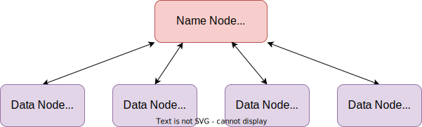

## 组成

**Hadoop**，是一个用于Reliable（可靠、容灾）、Scalable（可扩展），Distributed（分布式）计算的框架，它根据谷歌的[BigTable论文](https://static.googleusercontent.com/media/research.google.com/zh-CN//archive/bigtable-osdi06.pdf)和[MapReduce论文](https://static.googleusercontent.com/media/research.google.com/zh-CN//archive/mapreduce-osdi04.pdf)实现，[主要由4部分组成](https://www.cnblogs.com/along21/p/10496468.html)：

1. **Common Utilities**
   1. 提供文件系统和操作系统的抽象供其它模块使用。
2. **HDFS**
   1. Hadoop Distributed File System，分布式文件系统，数据高吞吐量访问的保证。
3. **MapReduce**
   1. 一种分布式计算引擎，其核心思想是分治：将数据集切分成多个分片，并行地对其进行计算。
4. **YARN**
   1. 作业调度和集群资源管理的框架。

**Hadoop**关于容灾的理念：硬件故障是常见的，**Hadoop**框架能够自动处理故障节点。

> 除了**HDFS**，**Hadoop**还有多个文件系统的实现，如，Local、Amazon S3、Microsoft Azure、OpenStack Swift等。
>
> **Hadoop**使用Kerberos来认证用户；**Hadoop**自带鉴权功能，通过配置`hadoop-policy.xml`中的ACL（Access Control List）来设置具体规则。

## 主从架构

如[下图](https://www.cnblogs.com/duanxz/p/4775290.html)所示，**Hadoop**采用主从架构来组织服务器：

- **HDFS**的Data Node、**MapReduce**的Node Manager为**Slave**，负责处理具体任务。
- **HDFS**的Name Node、**MapReduce**的Resource Manager为**Master**，负责协调管理任务。

> **Master**、**Slave**只是对机器角色的划分，Name Node、Resource Manager分别为各自体系中的**Master**，Name Node、Resource Manager完全可以部署在不同的机器上，这时作为**Master**的机器就有多台。
>
> **Master**机器上往往还会部署集群的管理系统，方便通过浏览器查看集群状态。

## 生态

**Hadoop**的发展超越了批处理本身，现在的**Hadoop**一般指由多个项目组成的**Hadoop**生态。

### Avro

**Avro**是新的数据序列化格式与传输工具，用于逐步取代**Hadoop**的原有IPC（Inter-Process Communication）机制。

**Avro**是语言无关的，使用模式（Schema）来描述对象，且支持模式演化、支持别名。

**Avro**的对象容器文件的格式类似于SequenceFile（二进制、可压缩、可切分），并且是自声明的。

> **Avro**被Hadoop生态中的各组件广为支持。
>
> **Kafka**默认也是使用**Avro**。

### Flume

**Flume**能从不同数据源高效实时的收集海量日志。

### Sqoop

**Sqoop**能从关系型数据库抽取数据。

### Pig

**Pig**诞生于2010年，是一种轻量级语言，能自动地将语句转化为**MapReduce**，方便对Java不熟悉开发者使用**Hadoop**。

### **Hive**

**Hive**是一个基于**Hadoop**的分布式容错数据仓库，能够将结构化数据映射为数据库表，并将我们编写的SQL（HiveQL）转换为**Hadoop**上的应用来批处理。

> Hive，[haɪv]，蜂箱。

2007年，**Facebook**发布**Hive**，并于2008年捐献给**Apache**。

**Hive**是**Hadoop**生态中的第一个SQL框架。

**Hive**的默认引擎为**MapReduce**，但也可切换为**Tez**或**Spark**。

1. 早期的**Hive**使用**MapReduce**进行查询，复杂查询需要多次传递数据，性能低，只能用来做离线计算。
2. 后来**Hive**使用**Tez**，一个精简的**MapReduce**框架，性能得到了提升。
3. 再后来**Hive** 2.0推出，使用Hive-on-Spark，在性能（实时性）、可用性、稳定性等方面都有了进一步的提高。

### HBase

**HBase**，Hadoop DataBase，是一个基于**Hadoop**的数据库，具有分布式、版本化、非关系型的特点，提供类似BigTable的高并发写和实时、随机读大数据的能力。

**HBase**在列上实现了[BigTable论文](https://static.googleusercontent.com/media/research.google.com/zh-CN//archive/bigtable-osdi06.pdf)中提到的压缩算法、内存操作和布隆过滤器。

**HBase**没有使用**MapReduce**，而是使用了自带的基于**HDFS**的执行引擎。

**HBase**的表能作为**MapReduce**任务的输入和输出。

## Impala

**Hive**本身不支持交互式查询，对此可使用**Impala**。

**Impala**可以使用**Hive**的元数据，且支持**Hive**的格式，并兼容HiveQL。

**Impala**会在Data Node上运行专门的守护进程，当Client发起查询时，会先任意联系一个这种进程，此进程会发挥协调者的作用：向其它这种进程分发查询任务，并汇总结果集。

### Tez

https://www.jianshu.com/p/357fceaa4042

**Tez**是一个源自**MapReduce**的计算引擎，但是比后者更灵活、性能更优越。

**Tez**将Map、Reduce这两种操作进一步细分，并允许将这些操作自由组合成一个DAG，且中间作业的输出不会物化到**HDFS**上，而是写到本地磁盘上，甚至是在内存中缓存，从而避免了额外的复制开销（磁盘IO、带宽）。

> DAG，Directed Acyclic Graph，有向无环图。

### Spark

**Spark**诞生于2009年，并于2013年成为**Apache**中的项目，要晚于**Hive**。

**Spark**[是一个分布式计算引擎](https://www.techug.com/post/open-source-sql-engine.html)，它对标的应该是**MapReduce**、**Tez**，性能要比**MapReduce**强。

1. **Spark**是通过为SQL生成DAG，加上各种算子和宽窄依赖的优化达到高性能的。
2. **Spark**是为了简化**MapReduce**的编写工作，允许我们以SQL的形式查询**Hadoop**中的数据。

**Spark**与**Hive**出现的原因一样，所以有时会拿[两者进行比较](https://www.codenong.com/cs109813783/)：**Spark**要比直接使用**MapReduce**的**Hive**要快，但是**Hive**是**Hadoop**的默认SQL，**Hadoop**的每个版本都支持**Hive**。

### Hive与HBase

两者的[应用场景不同](https://blog.csdn.net/zx8167107/article/details/79265537)：

1. **Hive**是数据仓库，用来存储海量结构化数据，以及数据的全量分析挖掘。

2. **HBase**是数据库，用来存储海量半结构化数据，以及数据的条件化（也就是非全量）查询。

两者用处不同，但是可以协同关系：

1. **ETL**工具将数据抽取到**HDFS**中。
2. **Hive**对数据进行清洗处理，得到处理好的数据后：
   1. **Hive**可以对这些数据做进一步的挖掘，
   2. **Hive**也可以将这些数据存入**HBase**中，由**HBase**提供随机实时查询。

两者对旧数据的修改删除都是通过追加覆盖的方式实现的，这也是它们追求写入性能的必然。

