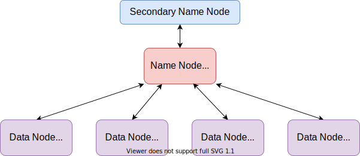
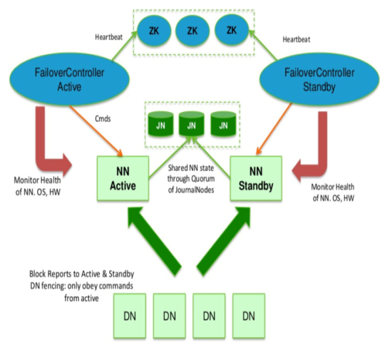
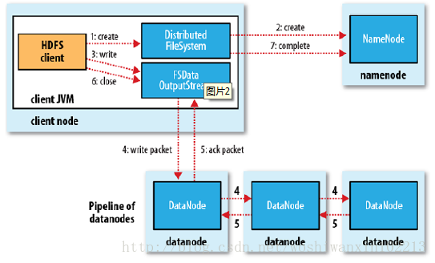
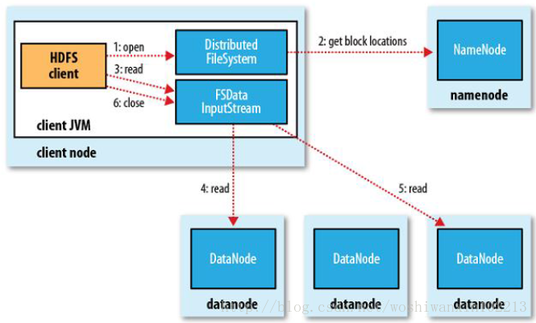
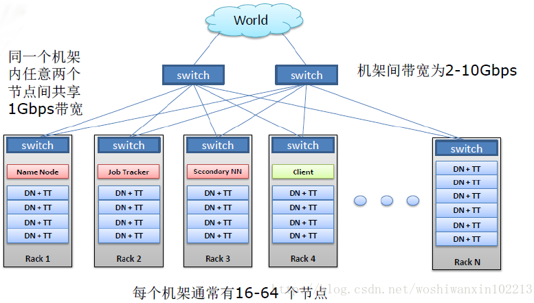

## 块

Client会将一个完整的大文件分为若干**Block**，然后上传到**HDFS**的不同节点上。

每块**Block**大小固定，默认`128MB`，按<u>键值对</u>存储在**HDFS**上，并内存中保存<u>键值对</u>的映射。

> 如果最后的**Block**不足`128MB`也不要紧，[会按实际大小存储](https://blog.csdn.net/scgaliguodong123_/article/details/46315345#二数据存储操作)。
>
> **HDFS**为了追求高吞吐，而采用大**Block**的设计，这样能减少**Block**数量，从而减少寻道次数、网络交互次数、减少内存占用。
>
> - 这样的设计一定程度上牺牲了访问延迟。
> - 文件总数受限于决于<span style=background:#ffb8b8>Name Node</span>的内存容量，对于同样的数据，**Block**越大，**Block**越少，[数据块映射等元数据](https://www.cnblogs.com/laov/p/3434917.html)就越少，越不容易消耗完<span style=background:#ffb8b8>Name Node</span>的内存。换句话说，**HDFS**不擅长存取小文件。
> - 当然，**Block**也不是越大越好，Map通常一次只处理一个**Block**，**Block**越少，Map也就越少，从而降低处理速度。

**Block**采用流式数据访问，只允许在文件末尾追加写入，不支持修改已写入的内容。

如下，每个**Block**会额外有2个**Replication**，共计3份，以实现容灾。

```properties
block1:node1,node2,node3
block2:node2,node3,node4
block3:node4,mode5,node6
block4:node5,node6.node7
```


## 节点



**HDFS**主要包括2种节点：<span style=background:#ffb8b8>Name Node</span>、<span style=background:#f8d2ff>Data Node</span>。

### 命名节点

<span style=background:#ffb8b8>Name Node</span>负责维护文件系统的文件/目录树，也就是Namespace。Namespace具体保存有：

- 文件、目录的元信息：副本级别、修改时间、访问时间、访问许可、块大小。
- 文件分布信息：文件与**Block**的映射、<u>**Block**与<span style=background:#f8d2ff>Data Node</span>的映射</u>。

<span style=background:#ffb8b8>Name Node</span>在内存中维护Namespace，但也会将Namespace持久化为文件：

- `fsimage`：Namespace的镜像（不包含<u>**Block**与<span style=background:#f8d2ff>Data Node</span>的映射</u>，<span style=background:#ffb8b8>Name Node</span>仅在内存中保存该映射）。
- `edits`：保存对Namespace的修改日志。
- `fstime`：保存最近一次Checkpoint的时间。

<span style=background:#ffb8b8>Name Node</span>[启动时会加载](https://blog.csdn.net/woshiwanxin102213/article/details/19990487#3.4/8)`fsimage`、`edits`，在内存中重新生成Namespace，启动速度较慢。

为了提升启动速度，<span style=background:#ffb8b8>Name Node</span>会定时将`fsimage`、`edits`合并为新的`fsimage`。

> <span style=background:#ffb8b8>Name Node</span>提供联邦特性，以扩展集群内存：将Namespace分成若干部分（Namespace Volume），每部分相互独立、互不通信，由不同的<span style=background:#ffb8b8>Name Node</span>管理。

### 数据节点

<span style=background:#f8d2ff>Data Node</span>负责数据的读写，且会定时向<span style=background:#ffb8b8>Name Node</span>发送心跳，报告自己所有的**Block**的列表，以便<span style=background:#ffb8b8>Name Node</span>建立<u>**Block**与<span style=background:#f8d2ff>Data Node</span>的映射</u>。

如果<span style=background:#ffb8b8>Name Node</span>没能收到心跳，就会认为<span style=background:#f8d2ff>Data Node</span>失效，会将失效节点中的**Block**在其它节点上的**Replication**复制一份，并将这份**Replication**交给一个健康的节点。

> <span style=background:#f8d2ff>Data Node</span>会在内存中缓存**Block**，但一个**Block**一般仅缓存在一个<span style=background:#f8d2ff>Data Node</span>的内存中。
>
> 随着时间的推移，各个<span style=background:#f8d2ff>Data Node</span>的**Block**分布会越来越不均匀，导致节点的负载也越来越不均衡，而均衡器（Balancer）会重新调整**Block**的分布。


## 高可用

<span style=background:#ffb8b8>Name Node</span>只有一个，存在单点失效风险，对此，**HDFS**提供了`3`种可选的应对机制。

### 元数据副本

通过配置，<span style=background:#ffb8b8>Name Node</span>可以在多个文件系统上，如本地磁盘和NFS（Network File System），实时、同步、原子地持久化元数据。

<span style=background:#ffb8b8>Name Node</span>失效后，可将元数据复制到另一台机器上，并重新启动一台<span style=background:#ffb8b8>Name Node</span>。

### 辅助命名节点

**HDFS**还可以配备一个<span style=background:#c9ccff>Secondary Name Node</span>，<span style=background:#c9ccff>Secondary Name Node</span>会定时从<span style=background:#ffb8b8>Name Node</span>中获取`fsimage`、`edits`，将两者合并为新的`fsimage`后会发送回<span style=background:#ffb8b8>Name Node</span>，以防止`fsimage`过大导致的恢复时间过长。

因为<span style=background:#c9ccff>Secondary Name Node</span>保存有`fsimage`、`edits`，故有备用**Master**的作用。但<span style=background:#c9ccff>Secondary Name Node</span>不支持自动切换，且写入总是滞后于<span style=background:#ffb8b8>Name Node</span>，切换时可能丢失部分数据。

### 活动-备用命名节点

以上两种机制只是缓解了可用性问题，为了真正实现高可用，**HDFS**提供了另一种机制。

如[下图](https://blog.csdn.net/chdhust/article/details/79521157)所示，这一机制包括一对<span style=background:#ffb8b8>Name Node</span>，其中一个为激活状态（<span style=background:#ffb8b8>Active Name Node</span>），另一个为就绪状态（<span style=background:#993af9;color:#f1f1f1>Standby Name Node</span>）。

- <span style=background:#ffb8b8>Active Name Node</span>负责处理Client请求，当其失效时，<span style=background:#993af9;color:#f1f1f1>Standby Name Node</span>就会自动接管。
- <span style=background:#993af9;color:#f1f1f1>Standby Name Node</span>可以配备多个，但<span style=background:#ffb8b8>Active Name Node</span>只有一个，由基于**Zookeeper**的Failover Controller选举而来。
- 因为**Block**的映射信息存储在<span style=background:#ffb8b8>Name Node</span>的内存中，而非磁盘中，所以<span style=background:#f8d2ff>Data Node</span>需要同时向两个<span style=background:#ffb8b8>Name Node</span>发送**Block**处理报告。

> <span style=background:#993af9;color:#f1f1f1>Standby Name Node</span>包含<span style=background:#c9ccff>Secondary Name Node</span>的作用，会为<span style=background:#ffb8b8>Active Name Node</span>

<span style=background:#ffb8b8>Name Node</span>和<span style=background:#993af9;color:#f1f1f1>Standby Name Node</span>基于QJM（Quorum Journal Manager）来共享`edits`。

- 同一时间，QJM仅允许一个<span style=background:#ffb8b8>Name Node</span>写入`edits`。
- QJM由一组Journal Node组成，`edits`的写入必须超过半数以上的Journal Node。

> QJM没有基于**Zookeeper**。




## 读写[[1]](https://blog.csdn.net/scgaliguodong123_/article/details/46315345)

### 写入过程

1. Client将文件分为若干**Block**，并将这些**Block**顺序编号、放入<u>上传队列</u>中，将这些**Block**逐个上传到**HDFS**中。

2. Client每次向<span style=background:#ffb8b8>Name Node</span>请求时，<span style=background:#ffb8b8>Name Node</span>都会为Client分配一个新的**Block**，并将一组<span style=background:#f8d2ff>Data Node</span>的<u>地址列表</u>返回给Client。

   > <span style=background:#ffb8b8>Name Node</span>分配前会做各种校验：文件是否存在，Client是否有相应权限。

3. Client将的**Block**上传到<u>地址列表</u>中第一个<span style=background:#f8d2ff>Data Node</span>上，这个<span style=background:#f8d2ff>Data Node</span>又会将**Block**同步给列表中的第二台<span style=background:#f8d2ff>Data Node</span>，第二台又会向下一台同步，依此类推。

4. 等<u>地址列表</u>中所有<span style=background:#f8d2ff>Data Node</span>都保存后，这个**Block**才算上传完，才会变为可见的，然后上传下一个**Block**。

如果写入时发生错误，Client会请求将<span style=background:#f8d2ff>Data Node</span>上未写完的**Block**清理掉，Client向<u>地址列表</u>其它的<span style=background:#f8d2ff>Data Node</span>继续写入该**Block**，<span style=background:#ffb8b8>Name Node</span>会另外寻找一台<span style=background:#f8d2ff>Data Node</span>保存该**Block**。



### 读取过程

1. Client向<span style=background:#ffb8b8>Name Node</span>请求文件，<span style=background:#ffb8b8>Name Node</span>向其返回文件的**Block**所在的<span style=background:#f8d2ff>Data Node</span>的地址，每次返回一个**Block**的一组<span style=background:#f8d2ff>Data Node</span>的地址。

   > 一个文件可能由多个**Block**组成，所以会分次读取。
   >
   > 因为**Block**存在副本，不同的副本往往会位于不同的<span style=background:#f8d2ff>Data Node</span>上。
   >
   > 这组<span style=background:#f8d2ff>Data Node</span>的地址按照拓扑结构排序，距离Client近的会排在前面。

2. Client从<u>地址列表</u>中选择离自己最近的<span style=background:#f8d2ff>Data Node</span>发起通信，以数据流的方式直接从该<span style=background:#f8d2ff>Data Node</span>中读取。

3. 读取完后Client会关闭连接，再次向<span style=background:#ffb8b8>Name Node</span>请求下一个**Block**的一批地址，然后重复刚才的读取过程。

如果与<span style=background:#f8d2ff>Data Node</span>的通信发生异常，Client会记录下这个<span style=background:#f8d2ff>Data Node</span>，然后从<u>地址列表</u>中选择一个下一个地址，发起连接，进行读取；后续的**Block**读取也会跳过刚才记录的<span style=background:#f8d2ff>Data Node</span>。

Client在读取时也会校验**Block**，会将损坏的**Block**报告给<span style=background:#ffb8b8>Name Node</span>，然后从其它的<span style=background:#f8d2ff>Data Node</span>重新读取该**Block**；<span style=background:#ffb8b8>Name Node</span>会从找到已损坏的**Block**的Replication，重新备份这份已损坏的**Block**。




## 带宽[[2]](https://www.cnblogs.com/laov/p/3434917.html)

网络带宽是数据中心最珍贵的资源，**Hadoop**采取数据本地化（Data Locality）以充分利用带宽。

同一机架（机柜）中的节点之间的带宽，要大于不同机架中的节点之间的带宽。

- 读取时，可以从不同的机架中的节点同时读取，充分利用多机架的带宽。
- 写入时，向多个机架中写入，效率会比较低，但能保证容灾。

HDFS支持机架感知（Rack Aware），Client写入时，

- 若为<span style=background:#f8d2ff>Data Node</span>，副本1会放于该节点上，副本2放于不同机架的节点上，副本3放于副本2所在机架的另一个节点上，其它副本在集群中随机放置。
- 若不为<span style=background:#f8d2ff>Data Node</span>，副本1随机选择一个节点放置，剩余副本的放置同上。



> <span style=background:#f8d2ff>Node Manager</span>往往与<span style=background:#f8d2ff>Data Node</span>部署在同一台机器上，以节省网络开销。

