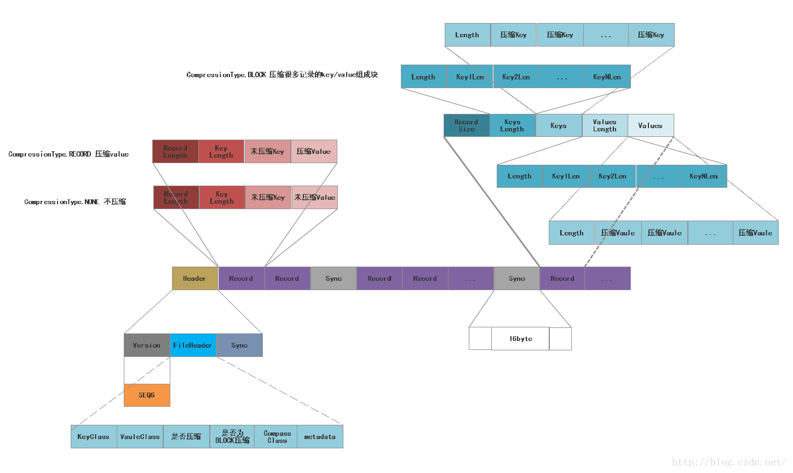
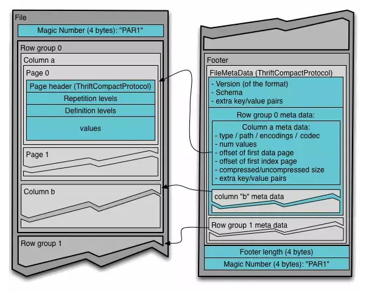

## 运行机制

**MapReduce**将计算作业分为Map和Reduce[两个阶段/任务](https://www.hadoopdoc.com/hadoop/hadoop-theory)，每个阶段/任务都以<u>键值对</u>作为输入、输出。

1. Map：对输入数据进行转换、过滤、连接等操作，产生中间结果（Intermediate Output）。
2. Reduce：对中间结果进行分组、聚合、连接等操作，产生最终结果。

> 输入数据、最终结果保存在**HDFS**上，中间结果仅保存在本地磁盘。

**MapReduce**源自函数式编程语言，开发者需要自行编写`Mapper.map()`、`Reducer.reduce()`，而分片、加载、解析、分区、排序、合并、混洗等其它函数**MapReduce**会自动添加。

> 广义的Map指Map阶段/任务，包含Input Split、`Mapper.map()`、Partition、Sort、Merge等子阶段；狭义的Map仅指`Mapper.map()`。本文的Map指的是广义的，对于狭义的Map用Mapper指代。Reduce也同理。

### Map

#### Input Split、Load and Parse

**MapReduce**将输入文件根据**Block**的大小进行分片，每个分片对应一个Map，如，有`3MB`、`129MB`两个不同大小的输入文件，会被分为`3MB`、`128MB`、`1MB`三个分片。

> 这里的切分不是真的将文件进行切分，而是保存文件的切分位置、分片的长度。
>

然后，**MapReduce**根据分片在相应的节点（离数据尽可能地近）上创建并运行Map。

Map会将数据载入（Load）并解析（Parse）为<u>键值对</u>形式的记录，但不解析记录本身。

> Key一般是记录的偏移量（Offset），Value是具体的数据记录。

#### Map

执行开发者编写的Mapper来处理记录。

#### Partition

每个Map都有一个环形内存缓冲，当缓冲使用量达到阈值时，就会进行一次溢写到磁盘上（Spill to Disk）。

但在真正写磁盘之前，Map会将生产的<u>键值对</u>分到不同的Partition中，并且每个Partition会有一个后台线程在内存中对<u>键值对</u>进行排序。

Partition数量由Reduce的数量决定，即每个Reduce一个Partition。

> 默认的分区函数会通过，对Key的<u>散列值</u>按Reduce的数量取模（`key.hashCode() % reduce_size`），来对<u>键值对</u>进行分区。显然，Key相同的<u>键值对</u>会被放入相同的Partition。
>
> 默认按照Key进行排序。

切分是在内存中进行，然后溢写到磁盘中，溢写完成后还会进一步地合并文件。

#### Merge

每次溢写都会新建一个文件，Map会将这些文件合并为一个已分区、已排序的文件。

### Reduce

#### Shuffle

Reduce会将Map产生的Partition拉取到本地，并保存为文件。

> 每个Map的完成时间不同，因此Reduce不会等Map全部结束才开始拉取，而是会启动少量线程与Map并行进行。
>

#### Merge

如果Partition文件数量很多，那么Reduce会进行多次合并，直到小于阈值（默认为`10`）。

合并的同时会进行排序。

Reduce不会将Partition文件合并为一整个文件，而是在内存中将进行最终的合并。

#### Reduce

执行开发者编写的Reducer来处理记录。

#### Output

将结果写到**HDFS**中。

> 默认用<u>制表符</u>分割Key、Value，用<u>换行符</u>分割记录。
>
> **HDFS**会自动创建相应的副本。

## 调优

| 范围           | 最佳实践                                                     |
| -------------- | ------------------------------------------------------------ |
| Map            | 如果Map的运行时长小于`1`分钟，可以考虑能否用更少的Map运行更长的时间，以及减小Map本身开销的占比，比提升集群资源利用率 减少溢写次数，从而减少磁盘写入次数 尽可能均匀地切分输入数据 |
| Reduce         | Reduce默认只有一个，可以适当增加Reduce数量（每个Reduce的运行时长应大于`5`分钟，且生产出至少一个**Block**，以减少Reduce的创建、运行开销） 适当增加内存，以便数据全部驻留在内存中 |
| Combine        | 开启Combine（预聚合），进而减少磁盘写入量、减少数据传输量    |
| 中间结果的压缩 | 压缩中间结果以减少磁盘写入量、减少数据传输量                 |
| 序列化         | 根据场景，直接处理Byte级别的<u>键值对</u>，无需序列化，节省开销 |

## 文件格式

体积小（二进制、可压缩）、支持切分的文件格式更适合**MapReduce**。

### SequenceFile[[1]](https://cwiki.apache.org/confluence/display/HADOOP2/SequenceFile)

SequenceFile是一种存储二进制<u>键值对</u>的平面文件，它被广泛应用于**MapReduce**的IO中。

> [平面文件](https://baike.baidu.com/item/平面文件/9553867)（Flat File）是去除了所有特定应用程序格式的电子记录，以便记录可以跨应用处理。
>
> **MapReduce**的中间结果采用的就是SequenceFile。SequenceFile也常用于合并小文件：将小文件的名称作为Key，内容作为Value，序列化到大文件中。

如[下图](https://blog.csdn.net/iteye_14970/article/details/82639055)所示，SequenceFile由[文件头]()和记录组成。记录共有`3`种格式：未压缩、记录级压缩和块级压缩。

### Parquet

**Parquet**是一种用于嵌套式数据的列式存储格式。

**Parquet**是语言无关的。**Parquet**没有绑定某一种内存表示法，因此可以使用**Avro**、**Protocol Buffers**或**Thrift**等来读写。

如[下图](https://github.com/apache/parquet-format)所示，**Parquet**文件由文件头、文件块、文件尾组成。

- 文件头仅包含一个魔数，用于识别整个**Parquet**文件格式。
- 每个文件块保存一个行组，行组由列块组成，列块由页组成。
  - **Parquet**会根据列的类型自动选择相应的带压缩效果的编码方式，如差分编码、游程长度编码、字典编码等。
  - **Parquet**还可以对页使用Snappy、gzip或LZO来进行二次压缩。
- 文件尾保存了所有的元数据：版本、模式、额外的键值对、所有块的元数据、文件尾长度和一个魔数。
  - **Parquet**文件是可分割的，且没有使用同步标记，因为文件块之间的边界信息都被保存在文件尾中，而文件尾总是最后写入。

## 旧版本

在**Hadoop 1**中，**MapReduce**的运行由Job Tracker、Task Tracker负责。

一个集群只有一个Job Tracker，但会有多个Task Tracker。

### 作业跟踪器

Job Tracker负责处理Client提交的作业、调度任务。

Job Tracker负责切分数据，以及将相关的**MapReduce**任务下发给多个Task Tracker来执行。

### 任务跟踪器

Task Tracker收到任务后会启动多个JVM，Task Tracker会监控这些并行任务，还会重启失败的任务，当任务完成时，会向Job Tracker报告。

Task Tracker会定时向Job Tracker发送心跳，报告任务的执行情况。

### 不足

随着Task Tracker数量地增长，Job Tracker的负担会变得很重；而“根据**Block**对任务进行划分”的方式太过简单，没有考虑CPU、内存、网络、磁盘等资源，Task Tracker间的负载不均匀。

> Task Tracker数量的上限大约为`4000`。

另外，**MapReduce**的源码可读性较差，难以维护。而且任何对于**MapReduce**的升级，都需要对整个**Hadoop**进行升级，并且需要对集群中的每个节点升级。

正是因为**MapReduce**存在诸多不足，所以就有了**YARN**。

> **YARN**没有Task Tracker，它使用Shuffle Handler将Map的结果发送给Reduce。Shuffle Handler是一个长期运行于Node Manager上的附加服务。
