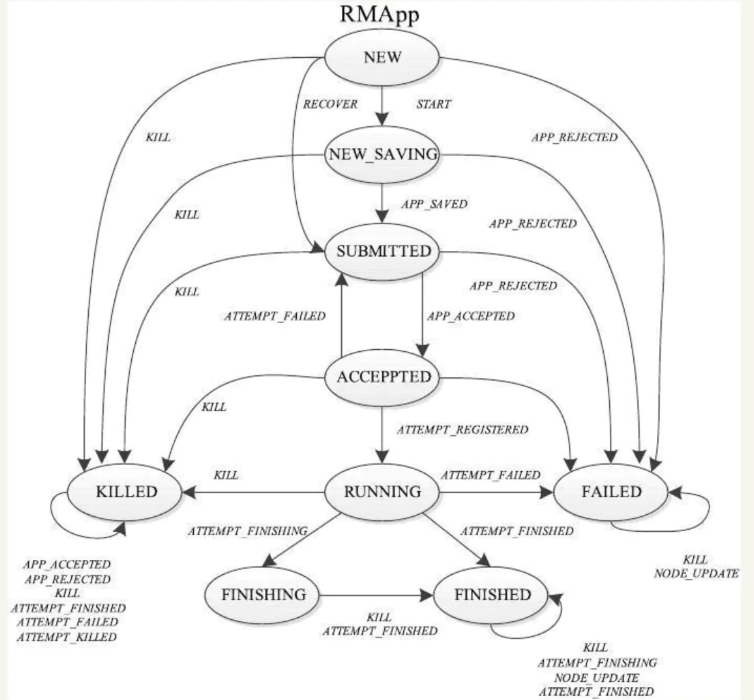

## 简述

**YARN**（Yet Another Resource Negotiator）的出现一方面是为了改善**Job Tracker**负担过重、功能耦合导致的可靠性、可扩展性、资源利用率不足等问题，另一方面是为了扩展**Hadoop**。

- 通过将**Job Tracker**拆分成Resource Manager、Application Master解决了负担过重的问题。
- 通过将Job扩展为了Application，如[下图](https://blog.csdn.net/suifeng3051/article/details/49486927)所示，使**Hadoop**不仅支持**MapReduce**，还支持**Hive**、**HBase**、**Pig**、**Spark**/**Shark**等类型的应用，即，**YARN**令这些不同类型的应用互不干扰的运行在同一个**Hadoop**中。

> Application要么由一个Job组成，要么由一组DAG Job组成。
>
> DAG，Directed Acyclic Graph，有向无环图。

## 组件

如下图所示，**YARN**主要有以下组件：

Resource Manager[[1]]()

- 全局级别的进程。
- Resource Manager包含`3`个组件：
  - **Scheduler**：负责将Node Manager上的**Container**分配给Application Master，共有FIFO、Capacity、Fair等`3`种。
  - **Application Manager**：负责管理Application Master，包括为Application Master申请**Container**、监控Application Master。
  - **Timeline Server**：负责存储应用历史。

Node Manager[[2]](https://www.jianshu.com/p/01ff4f60afce)

- 节点级别的进程。
- 负责管理节点上的**Container**，包括创建**Container**、监控**Container**的运行状况、释放**Container**。
  - **Container**：是对CPU、内存等计算资源的抽象表示，所有应用都运行于其中，根据应用的需求动态生成。

Application Master

- 应用级别的进程。
- 是对运行在**YARN**中某个应用的抽象，负责切分数据、为Task申请**Container**、监控Task的运行状况，对于运行失败的Task会通过重新申请**Container**的方式来“重启”Task。

> 启动Node Manager前，管理员需要先配置节点的可用资源（cpu-vcores、memory-mb），其中，CPU的个数时往往会几倍于物理CPU的核数，这样能细化资源量的粒度，并且物理性能越高的CPU，倍数越大，以缓解CPU异构wen'ti。
>
> Node Manager在启动时会向Resource Manager注册，并告知后者自己有多少可用资源。
>
> 不同的编程模型有不同的Application Master，用户可以参考官方配置模板中的`mapred-site.xml`配置来编写自己的Application Master。

## 生命周期

### 提交过程

从提交过程的角度来看，Application的生命周期[主要包括](https://blog.csdn.net/weixin_41910694/article/details/91466814#4__46)`4`个阶段：

- 第1阶段，**提交**
  - 第1步，Client调用`Job.waitForCompletion()`向Resource Manager提交Application。
  - 第2步，Resource Manager向Client返回Application ID等信息。
  - 第3步，Client上传`*.jar`、分片信息和配置文件等资源到**HDFS**上。
- 第2阶段，**初始化**
  - 第4步，Client请求Resource Manager分配**Container**以运行Application Master。
  - 第5步，Resource Manager收到请求后，会为Application分配一个**Container**，并通知相应的Node Manager。
  - 第6步，该Node Manager收到通知后会从**HDFS**上下载资源，以及创建并启动一个**Container**来运行Application Master。
- 第3阶段，**执行**
  - 第7步，Application Master请求Resource Manager分配一些**Container**以运行Task。
  - 第8步，Application Master根据Resource Manager返回的资源描述，通知这些**Container**对应的Node Manager。
  - 第9步，这些Node Manager收到通知后会从**HDFS**上下载资源，以及根据要求创建并启动**Container**以运行Task。
- 第4阶段，**注销**
  - 第10步，所有的Task运行完后，Application Master向Resource Manager注销然后关闭，并归还相应的**Container**。

> Application Master启动后，会向Resource Manager注册，然后Client会通过Resource Manager获取该Application Master的详细信息，与Application Master直接交互。
>
> Resource Manager为Task分配**Container**时，会将Task尽量分配给离数据比较近的Node Manager上。
>
> Resource Manager向Application Master返回资源描述，是具体的机器名以及每台机器可创建的Container的数量。
>
> Node Manager会对Application Master发来的通知进行验证，避免伪造的启动或者停止**Container**的命令。
>
> 执行**Container**实际上是执行一个Shell脚本。
>
> Task会将其进度和状态返回给Application Master，同时，Client会不停地向Application Master请求Application的进度和状态。

### 状态转换

**YARN**采用了大量的事件驱动设计，针对各类组件设计了不同的状态机，其中Resource Manager中的应用的状态机最为核心，但受制于篇幅仅介绍[该状态机](https://www.jianshu.com/p/e607431b06ce)的部分状态：

- ACCEPTED：Resource Manager的**Scheduler**接受Application后会进入该状态。
- RUNNING：Application Master启动成功后就会进入该状态。

## RPC协议

如[下图](https://www.cnblogs.com/liangzilx/p/14837562.html)所示，在**YARN**中，任何两个需相互通信的组件之间都有且仅有一个RPC协议，所有协议均采用Client/Server方式，除**ContainerManagementProtocol**采用的是Push通信模型（延迟低），其它协议均采用的是Pull通信模型。

- **ApplicationClientProtocol** ： Client通过该协议提交应用程序、查询应用程序状态等。
- **ResourceManagerAdministrationProtocol**： Admin通过该协议更新系统配置文件，比如节点黑白名单、用户队列权限等。
- **ApplicationMasterProtocol **：Application Master通过该协议向Resource Manager注册和注销，以及为各个Task申请资源。
- **ContainerManagementProtocol** ：Application Master通过该协议令Node Manager启动或者停止**Container**，以及获取各个**Container**的使用状态等信息。
- **ResourceTracker** ：Node Manager通过该协议向Resource Manager注册，并定时发送心跳信息汇报当前节点的资源使用情况和**Container**运行情况。

> 未能搜集到Client与Application Master之间的协议。

## 资源隔离

资源隔离有多种实现方式：硬件虚拟化、虚拟机、Cgroups和LinuxContainer等。

**YARN**对内存和CPU采用了[不同的资源隔离方案](https://www.jianshu.com/p/01ff4f60afce)。

### 内存

内存是一种限制性资源，其大小直接决定了应用的死活。

**YARN**提供了2种方案：

1. 基于Cgroups的方案。
   1. Cgroups是Linux内核提供的弹性资源隔离机制，可以<u>严格</u>限制内存使用上限，一旦进程使用资源量超过事先定义的上限值，则可将其杀死。
2. 线程监控方案。
   1. 默认方案。
   2. 在这一方案中，各个Task运行在独立的JVM中以达到资源隔离的目的。由于Task可能会创建子进程，而JVM在创建子进程之后、执行子进程之前会复制一份父进程内存空间，从而导致**Container**的内存使用量翻番，容易导致误判，对此，**YARN**采用了线程监控的方法进行解决：Node Manager会启动一个额外的线程来监控**Container**的内存使用量，并结合进程的“年龄”来判断内存使用量是否超标，一旦超标就会将其杀掉。

### CPU

CPU是一种弹性资源，其大小不会影响应用的死活，因此采用了Cgroups。

Node Manager默认不开启对CPU的资源隔离。

