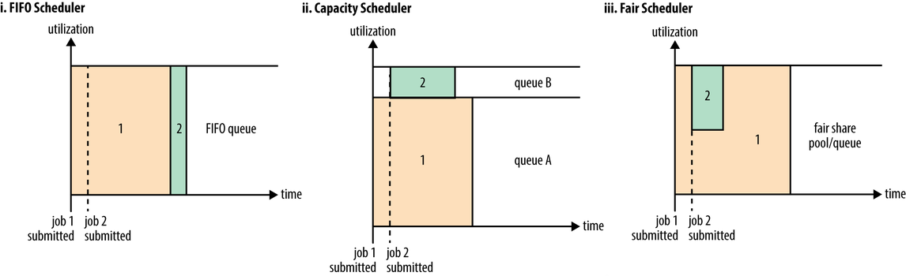

## 简述

**YARN**（Yet Another Resource Negotiator）是一个集群资源管理系统，它的出现一方面是为了改善**Job Tracker**负担过重、功能耦合导致的可靠性、可扩展性、资源利用率不足等问题，另一方面是为了扩展**Hadoop**。

- 通过将**Job Tracker**拆分成Resource Manager、Application Master解决了负担过重的问题。
- 通过将Job扩展为了Application，如[下图](https://blog.csdn.net/suifeng3051/article/details/49486927)所示，使**Hadoop**不仅支持**MapReduce**，还支持**Hive**、**HBase**、**Pig**、**Spark**/**Shark**等类型的应用，即，**YARN**令这些不同类型的应用互不干扰的运行在同一个**Hadoop**中。

> Application要么由一个Job组成，要么由一组DAG Job组成。
>
> DAG，Directed Acyclic Graph，有向无环图。

## 组件

如[下图](https://hadoop.apache.org/docs/stable/hadoop-yarn/hadoop-yarn-site/YARN.html)所示，**YARN**主要有以下组件：

Resource Manager

- 全局级别的进程。
- Resource Manager包含`3`个组件：
  - **Scheduler**：负责将Node Manager上的**Container**分配给Application，有FIFO、Capacity（默认）、Fair等`3`种。
  - **Application Manager**：负责管理Application Master，包括为Application Master申请**Container**、监控Application Master。
  - **Timeline Server**：负责存储应用历史。

Node Manager[[1]](https://www.jianshu.com/p/01ff4f60afce)

- 节点级别的进程。
- 负责管理节点上的**Container**，包括创建**Container**、监控**Container**的运行状况、释放**Container**。
  - **Container**：是对CPU、内存等计算资源的抽象表示，所有应用都运行于其中，根据应用的需求动态生成。

Application Master

- 应用级别的进程。
- 是对运行在**YARN**中某个应用的抽象，负责切分数据、为Task申请**Container**、监控Task的运行状况，对于运行失败的Task会通过重新申请**Container**的方式来“重启”Task。

> 启动Node Manager前，管理员需要先配置节点的可用资源（cpu-vcores、memory-mb），其中，CPU的个数时往往会几倍于物理CPU的核数，这样能细化资源量的粒度，并且物理性能越高的CPU，倍数越大，以缓解CPU异构问题。
>
> Node Manager在启动时会向Resource Manager注册，并告知后者自己有多少可用资源。
>
> 不同的编程模型有不同的Application Master，用户可以参考官方配置模板中的`mapred-site.xml`配置来编写自己的Application Master。
>
> Application需自行实现自身各个组件之间的通信，可借助**Hadoop**的RPC层来实现，但**YARN**并不提供。

### 调度器[[2]](https://www.oreilly.com/library/view/hadoop-the-definitive/9781491901687/ch04.html)

#### FIFO

**Hadoop 1**直接基于一个简单队列来分配资源，而队列的特点就是先进先出（First In First Out，FIFO），即会按提交顺序来为Job分配资源。FIFO满足充分利用资源的要求。

在一个繁忙的集群上，Job经常需要等待分配资源。Job有大有小，对于大Job，人们能容忍长时间的等待，但对于小Job，人们期望马上获得资源。FIFO无法满足人们的期望，于是便有了Capacity、Fair。

> FIFO还会根据Application的优先级（Priority）调整其在队列中的顺序。
>
> **Hadoop 2**继承了FIFO。
>
> Capacity、Fair分别由Yahoo！和Facebook贡献，之后整合进了**Hadoop 2**中。

#### Capacity

Capacity基于<u>多队列</u>来分配资源，不同的队列可以限定不同的<u>基本容量</u>（基于百分比），且支持<u>按层级划分</u>队列，当然每个<u>队列内</u>还是按FIFO的方式进行分配。

Capacity还支持<u>弹性</u>队列（Queue Elasticity）：如果一个队列的<u>基本容量</u>不够用，**Scheduler**会从其它空闲的队列中调配一部分容量给此队列；如果被抽取容量的空闲队列又变得繁忙起来，一般情况下，**Scheduler**不会以强行终止**Container**的方式向其返还容量，而是资源超额的队列释放资源后才会返还容量，而为各个队列限定<u>最大容量</u>可以缓解该状况。

Application可以按需提交到不同的队列中。如果队列不存在，则报错；如果未指定队列，则会提交到名为`default`的默认队列中。

> 小Application可以提交到专门的队列中，以便能及时获得资源。
>
> Application只有初始化后，才会正式为其分配资源，初始化的速度慢于分配速度，则可能会出现资源空闲，是一种浪费。[所以](https://www.jianshu.com/p/e659f1ae3898)，对于一个繁忙的集群，Capacity总是会<u>过量</u>初始化Application，即，让一些Application等待分配资源。
> 但同时，初始化后的Application也是要占用资源的（Application Master），而大量初始化但是未分配资源的Application则会占用过多的资源，也是一种浪费。对此，Capacity会对每个用户以及各个队列限制初始化的Application的数目。

#### Fair

Fair同样基于<u>多队列</u>来分配资源，每个队列可选择按FIFO方式进行分配还是按平均主义进行分配。

Fair支持预定义队列，不同的队列可以限定不同的<u>基本容量</u>（基于权重），且支持<u>按层级划分</u>队列。Fair也支持动态创建队列，队列以用户名名命，基本容量为`1`，于用户首次提交Application时创建。

Fair也支持<u>弹性</u>队列，且支持最大容量、最小容量。Fair还支持<u>抢占</u>（Preemption）：一个繁忙的队列在一定时间内未能获得<u>基本容量</u>，**Scheduler**就会强行终止超额队列中超额的那部分资源。

> <u>抢占</u>使得Application何时能执行变得可预测，但被终止的Task仍需重新执行，这会降低集群的整体效率，故<u>抢占</u>默认是关闭的。

Fair基于规则决定Application该放入哪个队列：Fair会遍历预定义的规则列表，直到匹配。

> Capacity、Fair均支持<u>延迟调度</u>，以追求Data Locality。
>
> Capacity、Fair默认只考虑内存这一种资源，不考虑CPU，但不同的Application对不同类型的资源的需求不同，对此，**Scheduler**其实可以将Application的主导资源作为度量标准，即主导资源公平性（Dominant Resource Fairness，DRF）。

## 生命周期

Application的生命周期[主要包括](https://blog.csdn.net/weixin_41910694/article/details/91466814#4__46)`6`个阶段：

- 第1阶段，**提交**
  - 第1步，Client调用`Job.waitForCompletion()`向Resource Manager提交Application（提交后，每秒轮询应用进度）。
  - 第2步，Resource Manager向Client返回Application ID等信息。
  - 第3步，Client上传`*.jar`、分片信息和配置文件等资源到**HDFS**上。
- 第2阶段，**初始化**
  - 第4步，Client请求Resource Manager分配**Container**以运行Application Master。
  - 第5步，Resource Manager收到请求后，会为Application分配一个**Container**，并通知相应的Node Manager。
  - 第6步，该Node Manager收到通知后会从**HDFS**上下载资源，以及创建并启动一个**Container**来运行Application Master。
- 第3阶段，**分配**
  - 第7步，Application Master请求Resource Manager分配一些**Container**以运行Task（超过`5%`的Map完成后，才会再为Reduce申请）。
- 第4阶段，**执行**
  - 第8步，Application Master根据Resource Manager返回的资源描述，通知这些**Container**对应的Node Manager。
  - 第9步，这些Node Manager收到通知后会从**HDFS**上下载资源，以及根据要求创建并启动**Container**以运行Task。
- 第5阶段，**进度和状态的更新**
  - 第10步，Task会将其进度和状态返回给Application Master，同时，Client会不断地向Application Master请求Application的进度和状态。
- 第6阶段，**完成**
  - 第11步，所有的Task运行完后，Application Master向Resource Manager注销然后关闭，并归还相应的**Container**。

> Application Master启动后，会向Resource Manager注册，然后Client会通过Resource Manager获取该Application Master的详细信息，与Application Master直接交互。
>
> Resource Manager为Task分配**Container**时，会将Task尽量分配给离数据比较近的Node Manager上，以追求Data Locality。
>
> Resource Manager向Application Master返回资源描述，是具体的机器名以及每台机器可创建的**Container**的数量。
>
> Node Manager会对Application Master发来的通知进行验证，避免伪造的启动或者停止**Container**的命令。
>
> 当从**HDFS**上下载的资源不再被使用（计数器归零）后，Node Manager会将其保留一段时间（基于LRU删除），以节省带宽。
>
> 执行**Container**实际上是执行一个Shell脚本。
>

### 状态转换

**YARN**采用了大量的事件驱动设计，针对各类组件设计了不同的状态机，其中Resource Manager中的应用的状态机最为核心，但受制于篇幅仅介绍[该状态机](https://www.jianshu.com/p/e607431b06ce)的部分状态：

- ACCEPTED：**Scheduler**接受Application后会进入该状态。
- RUNNING：Application Master启动成功后就会进入该状态。

## RPC协议

如[下图](https://www.cnblogs.com/liangzilx/p/14837562.html)所示，在**YARN**中，任何两个需相互通信的组件之间都有且仅有一个RPC协议，所有协议均采用Client/Server方式，除**ContainerManagementProtocol**采用的是Push通信模型（延迟低），其它协议均采用的是Pull通信模型。

- **ApplicationClientProtocol** ： Client通过该协议提交应用程序、查询应用程序状态等。
- **ResourceManagerAdministrationProtocol**： Admin通过该协议更新系统配置文件，比如节点黑白名单、用户队列权限等。
- **ApplicationMasterProtocol **：Application Master通过该协议向Resource Manager注册和注销，以及为各个Task申请资源。
- **ContainerManagementProtocol** ：Application Master通过该协议令Node Manager启动或者停止**Container**，以及获取各个**Container**的使用状态等信息。
- **ResourceTrackerProtocol** ：Node Manager通过该协议向Resource Manager注册，并定时发送心跳信息汇报当前节点的资源使用情况和**Container**运行情况。

> 未能搜集到Client与Application Master之间的协议。

## 资源隔离

资源隔离有多种实现方式：硬件虚拟化、虚拟机、Cgroups和LinuxContainer等。

**YARN**对内存和CPU采用了[不同的资源隔离方案](https://www.jianshu.com/p/01ff4f60afce)。

### 内存

内存是一种限制性资源，其大小直接决定了应用的死活。

**YARN**提供了2种方案：

1. 基于Cgroups的方案。
   1. Cgroups是Linux内核提供的弹性资源隔离机制，可以<u>严格</u>限制内存使用上限，一旦进程使用资源量超过事先定义的上限值，则可将其杀死。
2. 线程监控方案。
   1. 默认方案。
   2. 在这一方案中，各个Task运行在独立的JVM中以达到资源隔离的目的。由于Task可能会创建子进程，而JVM在创建子进程之后、执行子进程之前会复制一份父进程内存空间，从而导致**Container**的内存使用量翻番，容易导致误判，对此，**YARN**采用了线程监控的方法进行解决：Node Manager会启动一个额外的线程来监控**Container**的内存使用量，并结合进程的“年龄”来判断内存使用量是否超标，一旦超标就会将其杀掉。

### CPU

CPU是一种弹性资源，其大小不会影响应用的死活，因此采用了Cgroups。

Node Manager默认不开启对CPU的资源隔离。

