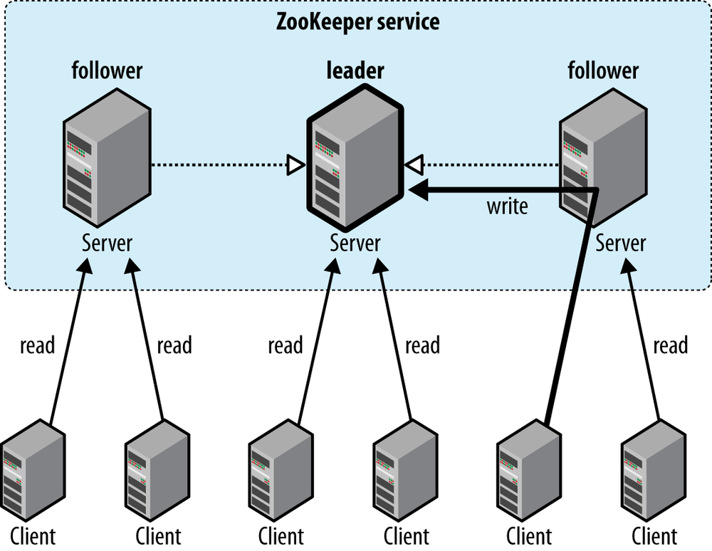

## 简述

[Zookeeper](https://zookeeper.apache.org/doc/r3.4.13/zookeeperOver.html)主要用于提供分布式协作，包括：**同步**、**配置维护**、**群组服务**、**命名**。

> **Zookeeper**最初由**Yahoo!**贡献，后成为**Hadoop**的子项目，并于2011年成为**Apache**顶级项目[\[1]](https://blog.csdn.net/weixin_38256474/article/details/90636262)。

## 数据结构

**Zookeeper**采用类似于文件系统的目录节点树来组织数据，该树状数据结构称为Namespace，树的节点为数据寄存器，叫做**ZNode**。

注意：Namespace并不是用来专门存储数据的，而是用来维护和监控所存储数据的状态变化，以便分布式系统通过共享Namespace的方式来相互协作。

**ZNode**分为持久和临时两种：

1. **Persistent**：持久节点一经创建，便一直存在，除非被显式清除。
2. **Ephemeral**：临时节点的生命周期同Session绑定。临时节点不能创建子节点，即，无法作为非叶子节点。

> 扩展阅读：[Ephemeral机制实现服务集群的陷阱](https://developer.aliyun.com/article/227260)。

此外，非叶子节点还能开启Sequential属性，开启后，该节点会维护其<u>第一级子节点</u>的顺序，并在创建<u>第一级子节点</u>时会被自动加上数字后缀。

**ZNode**会维护3种<u>版本号</u>，以缓存验证和协调更新：

1. Version：节点数据内容的版本号。
2. CVersion：子节点的版本号。
3. AVersion：**ACL**的版本号。

更新**ZNode**时需提供<u>版本号</u>，若<u>版本号</u>不匹配，则更新失败，并且，**ZNode**的任何更新操作都会引起<u>版本号</u>的变化，从而保证事务的原子性。

**ACL**，Access Control Lists，用于权限控制，包括`Create`、`Delete`、`Read`、`Write`、`Admin`等。

## 机制

### 监听

**Zookeeper**允许在指定节点上注册**Watch**，当节点数据发生变化时，会触发相应**Watch**，Server会将其封装为事件并通知Client。

**Watch**触发后就会被移除，以减轻压力，如需再次使用，只能重新注册。

从“移除”到“重新注册”这段时间，[Client是无法感知到Server的变化的](https://blog.csdn.net/qq_22115231/article/details/80784535#5/17)，如果有需要，可在重新注册前执行`get children`获取状态，自行比较变化。所以说，**Zookeeper**只能保证最终一致性，无法保证强一致性。

#### 操作

**Zookeeper**包含9种操作：`create`、`delete`、`exists`、`get acl`、`set acl`、`get children`、`get data`、`set data`、`sync`等。

在`exists`、`get children`和`get data`等读操作上可以设置**Watch**，当有`create`、`delete`和`set data` 等写操作时，**Watch**会被触发。**ACL**相关操作不会触发任何**Watch**。**Watch**类型和触发它的操作共同决定着事件的类型：

- 当**ZNode**被`create`子节点、`delete`或`set data`时，对`exists`的**Watch**会被触发。
- 当**ZNode**被`delete`或`set data`时，对`get data`的**Watch**会被触发。
  - 当**ZNode**被`create`时，对``get data``的**Watch**不会被触发，因为`get data`触发**Watch**的前提是**ZNode**已经存在。
- 当**ZNode**被`delete`时，或其子节点被`create`或`delete`时，对`get children`的**Watch**会被触发。

权限与操作[的对应关系为](https://matt33.com/2016/04/13/zookeeper-learn/#观察触发器)：

| 权限     | 操作                       |
| -------- | -------------------------- |
| `Create` | `create`（子节点）         |
| `Delete` | `delete`（子节点）         |
| `Read`   | `get children`、`get data` |
| `Write`  | `set data`                 |
| `Admin`  | `set acl`                  |

### 会话

Client会尝试与列表中的一台Server建立连接，如果连接失败，则会尝试连接另一台，直到与所有Server都无法建立连接，才算失败。

Client与Server建立TCP长连接后，会创建Session，之后Client通过心跳与Server保持连接，即便Server由于压力太大导致连接断开，又或者Client主动断开连接会话，再或者网络故障，只要Client能在Timeout之内重新连接上集群内的任意一台Sever，Session就仍然有效。

Session有3个状态：

1. CONNECTING：尝试与Server（重新）建立连接。
2. CONNECTED：与Server（重新）建立连接。
3. CLOSE：会话超时、权限检查、Client主动关闭。

> Session进入CONNECTED时，其对应的**ZNode**就会产生一个Watch Event。

Session有4个主要属性：

1. ID：Server会为Client分配全局唯一的Session.ID用于标识Session。
2. Timeout：由Client指定。
3. TickTime：Timeout的检查时间间隔。
4. isClosing：当Server检测到Session超时，会将Session.isClosing标记为已关闭。

> Session.Timeout不可小于2个Session.TickTime，且不可大于20个Session.TickTime。
>
> Session.TickTime通常为2秒。
>
> **Zookeeper**采用“分桶策略”来低耗高效地处理Session超时：[通过计算](https://thinkwon.blog.csdn.net/article/details/104397719#12__250)，将Session.Timeout相接近的Session放入到相同的Bucket中，然后定时对Bucket中的Session批量检测、清理。

## 与分布式

**Zookeeper**本身也支持分布式部署，由多实例组成集群。

**Zookeeper**集群属于CP系统，即，有良好的**Consistency**、**Partition Tolerance**，但在选举时会违反**Availability**。

### 事务

**Zookeeper**通过以下几点来保证**Consistency**：

原子性：要么都成功应用，要么都不应用。

顺序一致性：同一个Client发起的事务请求，都会按照发起顺序应用到集群去。

> **Zookeeper**会为Client的每个更新请求分配全局唯一的递增编号，来标识事务的先后顺序。

单一系统映像：无论Client连接哪台Server，它看到的数据都是一样的，并且它所有的请求的处理结果在所有Server上都是一致的。

> 当Server故障时，需要追上**Leader**的进度，才会接收请求。

可靠性：一旦集群应用事务并向Client返回响应，该事务带来的变更会一直被保留，除非另一个事务又进行了变更。

### 角色

**Zookeeper**集群中的角色分为：

- **Leader**：集群中只有一个**Leader**，**Leader**会向**Follower**、**Observer**[发送并维护心跳](https://blog.csdn.net/LYZ2017/article/details/78305674)。
- **Follower**：**Follower**只提供读服务，写请求会转发给**Leader**来处理。
- **Observer**：**Observer**跟**Follower**类似，会与**Leader**同步信息，用于分担集群的读压力；但不同的是：**Observer**不参与选举的任何过程，也不参与写操作的“过半成功”，不需要将事务持久化到磁盘。

> Client无法区分所连接的Server是**Leader**，还是**Follower**，还是**Observer**。

[Server有4种状态](https://blog.csdn.net/chengyuqiang/article/details/79190061)：

- LOOKING：寻找**Leader**中。
- LEADING：表示自己是**Leader**。
- FOLLOWING：表明自己是**Follower**。
- OBSERVER：表明自己是**Observer**。

### 选举过程

**Zookeeper**[通过基于**Paxos**的**ZAB**协议来选举](http://www.jasongj.com/zookeeper/fastleaderelection/#FastLeaderElection)**Leader**：

1. ##### 发起

   1. 集群节点依次启动，启动后会相互通信并寻找**Leader**，如果找到**Leader**，则直接将自己设置为**Follower**；
   2. 但如果集群中只有**Follower**，则会发起选举，每个节点先把票投给自己，然后会通过广播，让其它节点也投给自己，即，广播包含**ZXID**（Zookeeper Transaction ID）、**SID**（Server ID）等信息的选票。

2. ##### 处理

   1. 节点收到其它节点发来的拉票请求，会投票给**ZXID**最大的节点，即，数据最新的节点；
   2. 若**ZXID**相同，则投给其中**SID**最大的节点。

3. ##### 统计

   1. 当某台节点得到<u>半数以上</u>的选票时，就会成功当选，成为**Leader**。

4. ##### 重新选举

   1. 当**Leader**宕机或**Leader**失去大多数**Follower**时，集群就会进行**Failover**，发起重新选举。

> ZAB，Zookeeper Atomic Broadcast。
>
> **ZXID**长`64位`：
>
> - `高32位`保存Epoch，即，选举的轮次。
> - `低32位`用于保存事务轮次，递增计数。
> - 每次选出新**Leader**，`高32位`会加一，`低32位`都会重置，从而保证**ZXID**的全局递增。
>
> “<u>半数以上</u>”的设计能减少脑裂的发生。
>
> 为应对[延迟问题](https://www.cnblogs.com/kevingrace/p/12433503.html)，重新选举后，要将选举结果通知所有Client，之后新**Leader**才可以生效。
>
> 重新选举时，[集群会暂停服务](https://cloud.tencent.com/developer/article/1644921)，直到选出新**Leader**，新**Leader**会向**Follower**发送`NEWLEAD`，待所有**Follower**响应**Leader**后，**Leader**会广播`UPTODATE`，收到该命令的Server即可对外提供服务。这一过程大约持续`200毫秒`。
>
> 旧**Leader**恢复后会变成**Follower**。

## 持久化

**Zookeeper**会在内存中保存全量数据，QPS能达`100K`，与**Redis**旗鼓相当。

**Zookeeper**在内存中实际是用`HashMap`，而非树，来组织数据，其中，持久节点使用“**ZNode**的路径”作为Key，临时节点使用Session.ID作为Key。

**Zookeeper**[有2种数据文件](https://blog.csdn.net/varyall/article/details/79564418)：

1. Snapshot：用于保存内存中的全量数据。
2. Log：用于顺序记录写请求。

> 类似于**Redis**的RDB、AOF。
>
> **Redis**其实也可以用于实现配置中心，但是其持久化、集群的相关设计导致它不是强一致的。
>
> **Zookeeper**的更新只支持覆盖写，不支持追加写。

**Zookeeper**会结合这两种数据文件来恢复现场。

- 写请求会保存到Log，然后再保存到内存。

- **Leader**写入Log后，才会同步给**Follower**，且只有<u>半数以上</u>的**Follower**写入并响应时，**Leader**才会向Client返回Commit成功。

- Snapshot是模糊的，不精确到某一时刻，这就要求事务操作是幂等的，否则数据会不一致。[什么意思？](https://blog.csdn.net/varyall/article/details/79564418#3/15)

## 用途

### 同步（分布式锁）🌙

**Zookeeper**[实现分布式锁的一种方式](https://www.cyc2018.xyz/其它/系统设计/分布式.html#zookeeper-的有序节点)：

1. 创建一个持久节点，作为锁目录。

2. Client如需加锁，就在锁目录中创建临时且有序的子节点。

   1. 如果自己创建的节点的序号是节点列表中序号最小的，则加锁成功；

   2. 否则**Watch**前一个节点，当节点变更时重新判断。

3. Client删除创建的子节点即可解锁。

另一种实现方式：

1. 直接使用锁目录作为锁，锁目录为临时节点。
2. 创建锁目录即为加锁，删除锁目录即为解锁。
3. 所有节点**Watch**锁目录，阻塞等待其变化。

>这种实现方式存在羊群效应。
>
>羊群效应：一只羊动起来，其它羊一哄而上。
>
>**Watch**所有节点只会徒增开销，因为如果任意一个节点状态改变，其它所有的节点都会收到通知。

以上2种方案可用**Apache Curator**来实现。

> **Apache Curator**是**Netflix**开发的**Zookeeper**客户端，简化了原生**Zookeeper**客户端的开发，包括：重连、反复注册Watcher、异常处理等，可用来开发分布式锁。

如果持锁的Session超时了，则对应的临时节点会被删掉，其它Session就可获取锁了；但此时，该Session的Client仍然认为自己持有锁，进而破坏资源的互斥。

### 配置维护（注册订阅）

为分布式系统的节点提供一致的配置。

### 群组服务

感知分布式系统的变化，做出相应策略，如：

- 辅助选举：多个候选者通过在**Zookeeper**上抢注**ZNode**的方式来竞选，成功抢注的那个候选者会当选，落选的候选者、新加入的候选者都会监听该**ZNode**的变化，并进入休眠，等待重新竞选。
  - **Hadoop**、**HBase**、**Kafka**

### 命名

在**Zookeeper**上为分布式系统中的节点、服务等资源创建**ZNode**，这些**ZNode**会有全局唯一的名字，根据这些名字即可获取资源的地址、提供者等信息。

### 负载均衡

**Zookeeper**的负载均衡是可以调控，**Nginx**只是能调权重，其它需要可控的都需要自己写插件。

**Nginx**的吞吐量比**Zookeeper**大很多，根据业务需要进行选择。

