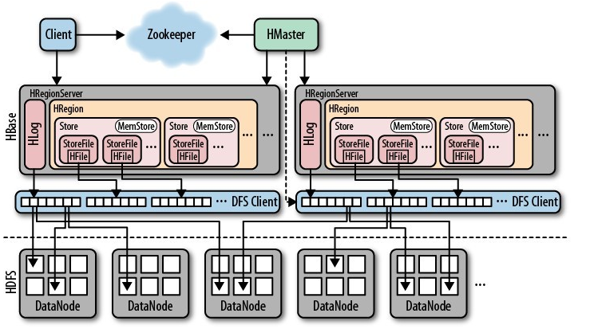

## 架构⭐

如[上图](https://www.cnblogs.com/along21/p/10496468.html)所示，**HBase**的架构包括：

1. ##### Client

   1. 包含访问**HBase**的接口，并维护缓存以加速访问。
   2. Client通过基于**Protocol Buffers**的RPC与**Region Server**通信。

2. ##### Zookeeper

   1. 存储表的元数据的地址。

      > 真正的元数据还是保存在**Region Server**上的，一张以“hbase”作为Namespace的表——`hbase:meta`上。

   2. 存储所有**Region**的寻址入口、**Master**的地址。

   3. 确保在任意时刻，集群中只有一个**Master**。

      > 多个Master-eligible通过抢注的方式来竞选**Master**。

   5. 监控**Region Server**的上下线，并通知**Master**。

      > **Region Server**会在**Zookeeper**上注册临时节点；
      >
      > 当**Region Server**宕机后，相应的Session会超时，**Zookeeper**就会移除对应的临时节点，并通知**Master**；
      >
      > **Master**处理宕机的**Region Server**上遗留的**HLog**，具体过程见下面的**HLog**。
   
3. ##### HMaster

   1. **Master**为**Region Server**分配**Region**。

      > 默认采用类似轮询的方式，来保证每个**Region Server**上的**Region**数量基本相同，以便负载的均衡。
      >
      > 对于热点聚集在某个**Region**上的问题，**Master**无力解决，也不会由**Master**来解决。
      >
      > 此外，还有[一种叫做StochasticLoadBalancer的策略](http://openinx.github.io/2016/06/21/hbase-balance/#stochasticloadbalancer策略)，会根据多个因素计算加权成本。

   2. 发现失效**Region Server**，并重新分配其上的**Region**。

   3. 执行建表等DDL操作。

   4. 也可以作为**Region Server**。

4. ##### HRegionServer

   1. 负责维护**Region**，处理**Region**上的IO。
   2. 负责`split`运行过程中变得过大的**Region**。
   3. 一张表分为多个**Region**，分布在多个**Region Server**上；当然，一个**Region Server**管理着多个**Region**。

5. ##### HRegion

   1. **Region**是**HBase**的中分布式存储和负载均衡的最小单位，**Store**则是最终存储的最小单位。
   2. **Region**相当于分片，储存表中的一部分连续数据；每个**Region**会保存所存储数据的起止行键，以便数据的定位查找。

6. ##### HLog[[1]](https://segmentfault.com/a/1190000023394317)[[2]](https://www.jianshu.com/p/569106a3008f#14/27)

   1. 每个**Region Server**拥有一个或多个**HLog**，多个**Region**会共享一个**HLog**。

      > 默认只有1个，1.1版本可以开启MultiWAL功能，允许多个**HLog**，以充分利用多个磁盘。
      >
      > 共享**HLog**体现了<u>顺序写替换随机写</u>的思想。

   2. **HLog**会定时滚动，滚动时会新建一个新**HLog**来接收新的日志，滚动的目的是为了防止单个**HLog**体积过大。

   3. 已落盘到**StoreFile**中的日志会被清理，清理过程以**HLog**文件为单位进行。

      > **HLog**失效时不会立即被清理，而是被移入`.oldlogs`中，由后台线程定时清理，以防止主从同步还在使用**HLog**。

   4. **HLog**是一种WAL，Write-Ahead Log，其本质上是一个SequenceFile：

      1. Key为HLogKey：保存有数据的归属信息，`sequence id`、write timestamp、cluster ids、region name、table name等信息。
      2. Value为WALEdit：也是对增删改等操作的进一步封装，实质上是**HBase**的<u>键值对</u>对象。

      > 事务、**Failover**、**HLog**的清理[都是根据](http://hbasefly.com/2017/07/02/hbase-sequenceid/)`sequence id`来进行的。

7. ##### HStore

   1. 一个**Region**包含多个**Store**，一个**Store**[对应一个](https://blog.csdn.net/zhouleilei/article/details/8500938)**Column Family**。

      > 这样的设计也从侧面反映出，**Column Family**的概念应对应数据库中的**Table**。

   2. 一个**Store**由一个内存中的**MemStore**和多个磁盘上的**StoreFile**组成。

8. ##### MemStore

   1. **HBase**中的数据是先写入**HLog**，然后再写入**MemStore**。

   2. **MemStore**采用跳表（`ConcurrentSkipListMap`）来组织数据。

      > 对于IO密集的场景，瓶颈不在内存，而在磁盘。
      >
      > 增大JVM的内存：
      >
      > - **MemStore**基于跳表，而跳表在数据量变大后，性能会恶化。所以才有了In-memory Flush and Compaction，但In-memory Flush and Compaction又从其它方面导致了性能的下降。[[3]](http://www.nosqlnotes.com/technotes/hbase/flush-compaction/)
      > - 更大的**MemStore**会带来更大的IO毛刺。
      > - 反而会影响**GC**，导致IO下降，不如增加一台机器，分摊IO压力。[[4]](http://hbasefly.com/2016/12/21/hbase-getorscan/#10/27)

9. ##### StoreFile

   1. **StoreFile**会根据一定条件进行`compact`，具体内容见《[5.3 刷写、合并、拆分](http://leanlee.top/notes/09、Elasticsearch、HBase/5.3 刷写、合并、拆分#合并)》。

   2. **StoreFile**是对**HFile**的简单封装。

      > HFile，Hadoop Binary File。
      >
      > **StoreFile**使用了**B+树**来索引数据，详情见《[5.1 数据结构](http://leanlee.top/notes/09、Elasticsearch、HBase/5.1 数据结构#file)》。

> **HBase**的**Master**、**Region Server**，类似于**HDFS**的Name Node、Data Node：
>
> - **Master**一般只用于管理**Region Server**，而**Region Server**一般不会改变，所以**Master**的压力并不大；
> - 但Name Node需要记录Data Node中每个**Block**的位置，对Data Node的写入，都需要更新到Name Node。

## HLog与Failover

**HLog**有3种**Failover**方式：

1. **Master**单打独斗。根据**HLog**中的记录和**Region**中的对应关系对**HLog**进行`split`，然后把**HLog**交给相应的**Region Server**进行重放。
2. **Master**发布任务，**Region Server**以抢占的方式认领这些任务。认领相应的**Region**和**HLog**后，会把**HLog**上的数据操作重新做一遍，然后将**MemStore**中的数据刷写到**StoreFile**上。[[5]](https://zhuanlan.zhihu.com/p/145551967#21/24)
3. 方式2产生很多小文件，所以方式3采用先重新分配**Region**，然后将**HLog**重放，而非直接写入**HDFS**。

> 但方式3在Rolling Upgrade时会[不可靠](http://hbasefly.com/2016/10/29/hbase-regionserver-recovering/#7/11)，已在1.2.0版本[移除](https://www.docs4dev.com/docs/zh/apache-hbase/2.1/reference/book.html#upgrade2.0.distributed.log.replay)。
>
> Rolling Upgrade是指：在高可用环境中一个节点先安装补丁或升级版本，其它节点正常提供服务，待节点安装或升级完成后，下一个节点再安装或升级。

## 与分布式

[HBase是一个分布式系统](https://blog.csdn.net/envinfo2012/article/details/74530974)，说起分布式，就需要说一下它的CAP。

### Consistency

**HBase**是强一致性的，因为一个值只会出现在一个**Region**中，而一个**Region**只归属于一个**Region Server**。

### Availability

很遗憾，**HBase**的**Region**在**Failover**时是不可用的。

### Partition Tolerance

**HLog**、**StoreFile**保存在**HDFS**中的，有容灾保证，默认3份副本，以异步方式复制；**MemStore**的容灾由**HLog**保证。

虽然**HLog**实质上也是**HFile**，但是与**StoreFile**不同的是，**HLog**采用同步写的方式，而非异步复制：

1. 一种方法为调用`sync()`方法，前一个Data Node写成功后，才会将数据发送给后一个Data Node，待最后的Data Node写入成功后，才算是写入成功，客户端才被允许继续写入。这种方式效率低，但是占用带宽少。
2. 另一个方法是多路同时写，也是当全部节点写入成功后，客户端才被允许继续。这种方式效率高，但是占用宽带多。

> 这里你可能会有疑问了，既然**StoreFile**是异步复制，那怎么怎么能说是强一致性呢？
>
> 这个问题就看你怎么看待**HDFS**与**HBase**的关系了：
>
> 1. 如果将**HDFS**与**HBase**区分来看，**HBase**虽然基于**HDFS**，但这是两个系统，异步复制是**HDFS**的事儿，与**HBase**无关，那么**HBase**是强一致性的。
> 2. 如果认为**HDFS**是**HBase**的基础，是**HBase**的一部分，那么**HDFS**异步复制，**HBase**也确实不能称为强一致性的。

> [不是所有的文件都保存在](http://www.nosqlnotes.com/technotes/hbase/hbase-overview-concepts/10/21)**HDFS**中，**HBase**会将一些小文件保存在自己的磁盘上。

## 专题

**HBase**[官方文档](](../images/9/Apache HBase ™ Reference Guide.html))的中文翻译可参照[[6]](https://www.w3cschool.cn/hbase_doc/)和[[7]](https://www.cwiki.us/display/ApacheHBaseZH/Apache+HBase)。

**HBase**[命令大全](https://www.yiibai.com/hbase)。

