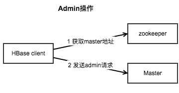
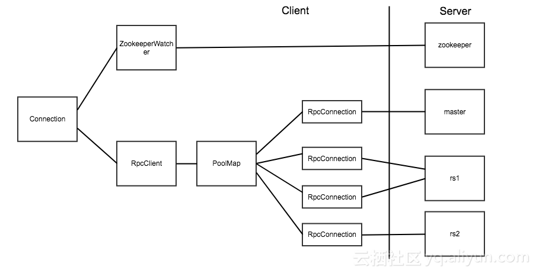

## 连接

### 犯错

新手在使用<u>**HBase**的Client提供的`Connection`</u>时，[往往会犯以下错误](https://developer.aliyun.com/article/581702)：

- 自行实现一个`Connection`的<u>资源池</u>，每次使用时从<u>资源池</u>中取出一个`Connection`。
- 每个线程设置一个`Connection`。
- 每次访问**HBase**时都创建一个临时的`Connection`，使用完成后调用`Connection.close()`将其关闭。

上述错误还有可能进一步引发“`Connection`数量过多，触发**Zookeeper**的连接数限制”这一错误。

### 路由


众所周知，**HBase**是一个分布式数据库，其集群有`3`种角色，而这`3`种角色分别管理着不同的信息。

如[上图](http://www.nosqlnotes.com/technotes/hbase/hbase-overview-writeflow/#11.5/25)所示，Client想要读写数据，需要访问`2`种角色：

1. **Zookeeper**：Client从中获取`hbase:meta`所在的**Region Server**。
1. **Region Master**：Client到`hbase:meta`所在的**Region Server**上获取数据所在的**Region Server**；然后Client到数据所在的**Region Server**上读写数据。

如下图所示，Client想要管理表，需要访问`2`种角色：

1. **Zookeeper**：Client从中获取**Master**的地址。
2. **Master**：Client向**Master**发送请求，**Master**根据请求来管理表。



### 封装

所以，<u>**HBase**的Client提供的`Connection`</u>不同于<u>其它单机数据库的Client提供的`Connection`</u>：<u>**HBase**的Client提供的`Connection`</u>会与**HBase**集群中的`3`个不同角色分别建立不同的**Socket**，而<u>其它单机数据库的Client提供的`Connection`</u>往往仅与数据库建立一个**Socket**。

或者说，<u>**HBase**的Client提供的`Connection`</u>是对多种连接的封装。

如下图所示：

- 真正建立连接的是`RpcConnection`，而`RpcConnection`由`PoolMap`来管理。
- `PoolMap`是对`ConcurrentHashMap`的封装，其中：
  - Key为ConnnectionId，包含服务器地址和用户`ticket`。
  - Value为一个`RpcConnection`的<u>资源池</u>。

当Client需要连接**Region Server**时，先会根据ConnectionId找到对应的<u>资源池</u>，再从<u>资源池</u>中获取一个`RpcConnection`来访问**Region Server**。




### 小结

显然，<u>**HBase**的Client提供的`Connection`</u>已经实现了对连接的管理，开发者无需在对其进行封装。

另外，`Connection`是线程安全的，但`Table`和`Admin`不是，所以：

- 一个`Connection`可以由同一进程中的不同线程所共享。
- 一个`Table`或`Admin`需要由每个线程所独享。

```java
// 多个线程共享Connection
connection = ConnectionFactory.createConnection(config);
...
// 每个线程独享Table
Table table = connection.getTable(TableName.valueOf("test"));
try {
	...
} finally {
    // Table.getTable()和Admin.getAdmin()都是轻量级，不必担心损耗，故在使用完后应立即关闭
	table.close();
}
```

另外，**HBase**的Client提供了三种<u>资源池</u>：Reusable、RoundRobin和ThreadLocal。

- <u>资源池</u>默认为Reusable，可通过`hbase.client.ipc.pool.type`配置项来调整。
- <u>资源池</u>的默认大小为`1`，即，每个**Region Server**`1`个连接，可通过`hbase.client.ipc.pool.size`配置项来调整。


## 调用

**HBase 2.x**提供的方法与**HBase 1.x**的[基本一致](https://juejin.cn/post/6844903949732937735)，但**HBase 2.x**废弃了一些方法，当然，这些废弃的方法在源码中都会指明新的替代方法，比如，定义表和列族时用到的`HTableDescriptor` 和 `HColumnDescriptor` 等类都被标识为废弃，取而代之的是 `TableDescriptorBuilder` 和 `ColumnFamilyDescriptorBuilder` 。

除了**Java API**，**HBase**还提供REST接口和Thrift接口。

