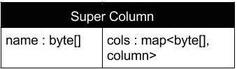

## 简述

**Cassandra**也是一款面向列的数据库，也是来自**Facebook**，常与**HBase**进行比较。

**HBase**和**Cassandra**的单机架构比较相似，都是源自于BigTable，但两者的分布式架构截然不同。**HBase**遵循了BigTable的绝大部分设计，但**Cassandra**则借鉴了**Amazon Dynamo**的设计，[具体来说](https://www.zhihu.com/question/309984206/answer/2145882117)：

- **HBase**采用<u>中心化架构</u>（主从模式），并强调数据写入的**强一致性**，是一个CP系统。
- **Cassandra**采用<u>去中心化架构</u>（多主模式），并强调在读取过程中完成**最终一致性**，是一个AP系统。

> **Cassandra**在国外[非常流行](https://db-engines.com/en/ranking)，除了**Facebook**，也被**Twitter**、**Cisco**、**eBay**、**Netflix**[等公司使用](https://www.w3cschool.cn/cassandra/cassandra_introduction.html)。

## 数据结构

### 列

**Cassandra**的<u>列</u>如[上图](https://www.w3cschool.cn/cassandra/cassandra_data_model.html)所示：

<u>超级列</u>是**Cassandra**中的特殊的一种<u>列</u>，存储了子列的映射。

如下图所示，<u>超级列</u>实际上也是一个<u>键值对</u>。

### CommitLog

一种[WAL](../07、MySQL/3.3 日志#预写式日志)，对应**HBase**的**HLog**，并且也采用了<u>追加写</u>的设计。

### MemTable

写入缓冲区，对应**HBase**的**MemStore**。

### SSTable File

内存中的缓冲会被持久化（`flush`）为磁盘上**SSTable File**，对应**HBase**的**StoreFile**。

### 其它

**Cassandra**也使用了**Bloom Filter**和**Row Index**的组合模式对Rowkey进行索引。

## 分布式架构

**Cassandra**[采用了去中心化的设计](https://www.w3cschool.cn/cassandra/cassandra_architecture.html)，这主要体现在：

- 集群中的所有节点都扮演相同的角色，或者说，节点不区分角色。
- 每个节点会同时互连其它节点。
- 当节点关闭时，其兄弟节点会接管其读写流量。
- 基于一致性散列存储数据，按照<u>散列值</u>的范围来切分数据。

与有角色的设计相比，无角色的设计使得集群便于管理、搭建，也无单点风险，但没有分工、每个节点需要承担全部的功能，且网络通信以广播为主，复杂、密集。

基于一致性散列的设计，决定了**Cassandra**擅长随机读取，但不擅长范围扫描，同时，**Cassandra**还提供二级索引，适合将字段为条件进行查询。

每个节点都能接收读写请求，无论数据处于集群的何处。

Client连接集群中的任意节点进行读写的效果都是相同的。

### 多副本

节点间会使用**Gossip**协议进行通信，来保持各节点状态的一致：

- 各节点会在后台检测集群中的其它节点是否故障。
- 查询数据时，如果检测到一些节点以过期值响应，**Cassandra**将向Client返回最新的值，并且执行读修复以更新失效值。

