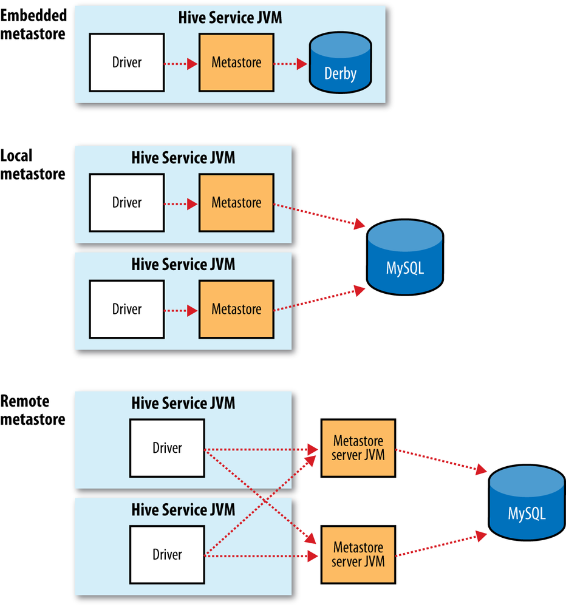
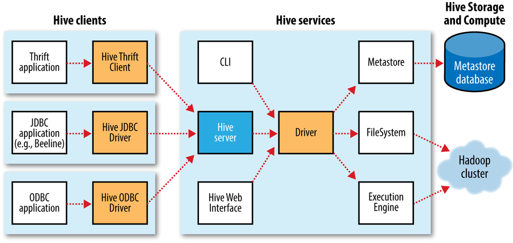

## 表

**Hive**以表的形式在**HDFS**等文件系统上组织数据，但表模式等元数据则由Metastore服务进行组织。

### Metastore

Metastore默认与其它**Hive**服务运行在同一进程中，但也可单独运行。

Metastore默认使用一个内嵌的以本地磁盘作为存储的Derby数据库实例，但也可以通过JDBC连接其它独立的数据库实例。

> Derby默认只支持一个会话，即一个用户。

### 写时模式与读时模式

在执行查询之前，需要将数据先加载到系统中。

- RDBMS在加载数据时，或者说写入数据时，会先对数据进行解析、模式检查，然后才会将其序列化为内部格式然后存入磁盘。也就是说，表的模式是在加载数据时强制确定的，如果在加载时发现数据不符合模式，则拒绝加载数据。这种设计被称为<u>写时模式</u>。
- **Hive**并不强制使用任何特定的文件格式，其加载仅仅是复制或移动文件（不会修改文件、原样逐字存储）。**Hive**在查询时，才会解析数据、检查模式（这也意味着**Hive**能在原始数据上执行查询）。这种设计被称为<u>读时模式</u>。

与<u>写时模式</u>相比，<u>读时模式</u>的加载过程更为简单、迅速。

在<u>写时模式</u>的基础上，可以进一步建立索引、压缩数据，从而提升查询性能。但如果查询不固定，则往往不能决定使用何种索引，索引也就没那么重要了，而<u>读时模式</u>更适合这种场景。

> <u>读时模式</u>还可以针对不同的分析任务，对同一数据采用不同的模式，更加灵活。

### 托管表和外部表

**Hive**中的表分为`2`种：

- Managed Table，托管表/内部表
  - 建表时无需指定存储路径，**Hive**会在`hive.metastore.warehouse.dir`下自动创建。
  - 使用`LOAD`加载数据时，**Hive**会将源文件移动到相应的存储路径中。如果源文件和存储路径不位于同一个文件系统中，移动会失败，此时可使用`LOCAL`，将源文件复制到目标文件系统中。
  - 删表时，会将元数据和数据一并删除。
- External Table，外部表
  - 建表时需要指定存储路径。
  - 使用`LOAD`加载数据时，**Hive**仅记录源文件的位置，不会移动或复制源文件，甚至不会检查源文件是否存在。如果未指定`LOCATION`，**Hive**会将数据存储到`hive.metastore.warehouse.dir`下。
  - 删表时，仅会将元数据删除，不会删除数据。

如果表只需要由**Hive**处理，则应使用托管表/内部表；如果既需要由**Hive**处理，也需要由其它工具来处理，则应使用外部表。如果想对同一张表应用不同的模式，那么可以使用外部表。	

### 分区

在**Hive**中，表可以按指定字段切分为区，这些字段以子目录的形式存在，不在数据文件中。

**Partition**实际上是一种粗粒度的索引，能有效缩小查询范围，进而提升查询速度。

> **Hive**支持动态的（推断）创建、插入**Partition**，开启后会有额外的开销，适合那些**Partition**不确定的场景。

### 分桶

在**Hive**中，表以及分区，可以进一步切分为桶，**Bucket**就是一个个的数据文件，**Bucket**的数量在建表时指定。插入数据时，会对指定字段的<u>散列值</u>按**Bucket**数取模，来决定放入哪个**Bucket**。

> **Bucket**的实际数量其实是由Reduce的数量决定的，当设置`SET hive.enforce.bucketing=true;`后，Reduce数才会自动采用DDL中指定的**Bucket**数，生产出指定数量的**Bucket**。

基于`rand()`进行取样，需要遍历整个表，但如果表分布均匀，并且进行了**Bucket**，那么可以通过限定**Bucket**的范围来进行部分抽样，以缩短时间。

### 存储格式

**Hive**将表的存储格式分为了两种层次：

- 行格式：对应`ROW FORMAT`子句，用于声明字段与字段之间该用何种分隔符、复杂类型该用何种分隔符、行与行之间该用何种分隔符。
- 文件格式：对应`STORED AS`子句，用于声明用哪种格式的文件来存储数据。

## 查询

### 连接

每个连接用一个**MapReduce**来实现，但如果连接条件使用了相同的字段，那么平均每个连接可以用少于一个**MapReduce**作业来实现。`JOIN`子句中表的顺序很重要，最大的表放在最后。

`JOIN`可分为`3`种：Common Join、Map Join和Bucket Map Join。

> 相比于Common Join，Map Join和Bucket Map Join可以看作是一种优化手段。

#### Common Join

Common Join也称为Shuffle Join、Reduce Join，指的是在Reduce中进行`JOIN`，其过程贯穿Map和Shuffle。

- Map：将连接条件中的所有字段组合为Key，将Reduce需要的字段组合为Value，并且，Value中还会包含Tag，用于标识Value属于哪张表。
- Reduce：将通过Shuffle获取到的<u>键值对</u>，根据Key以及Value中的Tag来进行`JOIN`。

#### Map Join

Map Join也称为Broadcast Join，顾名思义，就是在Map中进行`JOIN`。

如果一个连接表小到足以放入内存，**Hive**就会使用<u>分布式缓存</u>，即，将该表直接放入每个Map的内存来执行`JOIN`。

> 相比于Common Join，Map Join减少了网络IO及带宽占用，性能更好。

#### Bucket Map Join

Bucket Map Join类似于Map Join：如果左右两表都在连接字段上进行了**Bucket**，那么可以在Map中进行`JOIN`，Map在处理左表时，可以直接获取右表中对应的**Bucket**，来进行连接，从而缩短时间。

> Map Join需要将小表全部放入内存，而Bucket Map Join仅会将相应的**Bucket**放入内存。
>
> 如果**Bucket**中的数据已经是排序完的，这样**Bucket**的Map Join连接就变成了归并排序，更进一步地缩短了时间。

### 索引、事务和更新

**Hive**在很多方面与RDBMS相似，但两者的体系结构不同，所支持的特性也就不同。不过随着时间的推移，**Hive**看上去和用起来都越来越像RDBMS。

**Hive 0.7**引入了索引，包括`2`种，但功能、效率有限：

- 紧凑索引：存储每个值的**HDFS**的块号，而非每个文件的偏移量。该索引体积小，且对于值被聚集存储于相似行的情况，仍然有效。
- 位图索引：使用压缩的位集合来存储具有某个特殊值的行。该索引适合于低选择性/低基数的字段，如，性别、国籍。

**Hive 0.7**还引入了表级和分区级锁，以防止一个进程正在读取的表或分区被另一个进程删除。锁由**Zookeeper**透明管理。

**Hive 0.13**引入了事务，提供表的一致性快照供读操作。

**Hive 0.14**引入了小批量行级更改（`INSERT`、`UPDATE`和`DELETE`），先前的**Hive**只支持大批量`INSERT`。但**HDFS**不支持就地文件更新，所以行级更改实际上是保存在小的增量文件中，由后台服务定期将其合并到基表中。行级更改需要先开启事务才能使用。

### 视图

**Hive**只支持只读的逻辑视图，不支持物化视图，只能通过新建表的方式来物化视图。

## 架构

**Hive**架构的主要组件，除了上面提到的Metastore，还有Driver。

Driver负责解析、编译、优化、执行HiveQL。

- 解析：将SQL转换为抽象语法树（Abstract Syntax Tree，AST）。
- 编译：将AST转换为<u>查询块</u>，然后将<u>查询块</u>转换为<u>逻辑计划</u>（Logical Plan）。
- 优化：优化<u>逻辑计划</u>。
- 执行：将<u>逻辑计划</u>转换为可运行的<u>物理计划</u>（Physical Plan），以便**MapReduce**、**Tez**、**Spark**等引擎执行。

