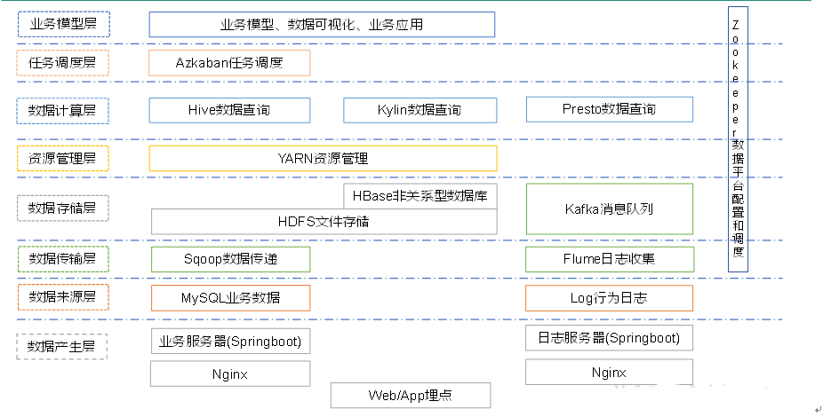
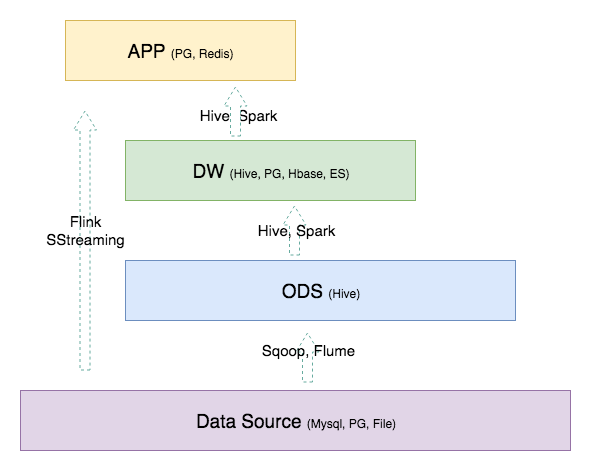
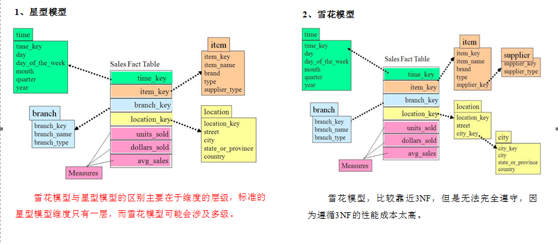
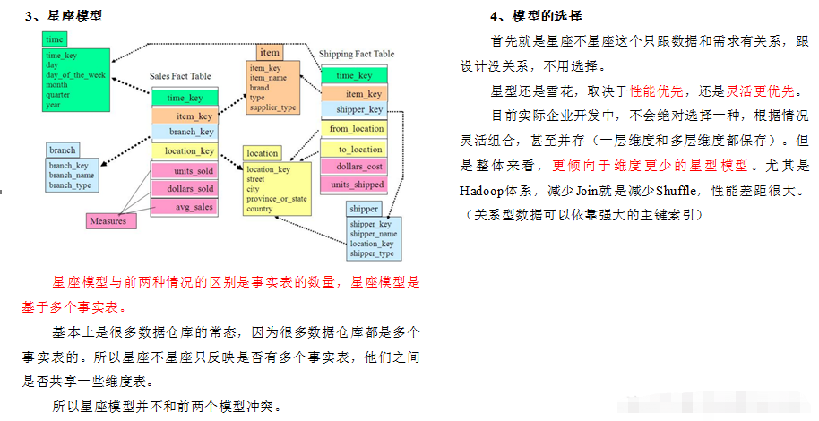

## 简述

Data Warehouse，DW/DWH，数据仓库/数仓，[是一套](https://juejin.cn/post/6969874734355841031)包含ETL、调度、建模在内的理论体系。

> ETL：Extract Transform Load，数据的抽取、转换、加载，更广义的ETL还包括清洗、分类、重组、合并、切分、统计等。

数仓不是数据的最终目的地，建设数仓不是只为了存储数据，而是服务于其它业务，如OLAP、可视化、数据挖掘等，进而帮助管理者进行决策，[帮助企业](https://blog.csdn.net/wjt199866/article/details/115184169)改进业务流程、控制生产成本、提高产品质量。

## 系统架构

数仓包括数据的采集传输、存储、计算、查询、可视化，元数据管理，任务调度，集群监控等多个方面，[每个方面都有与之相关的中间件](https://www.cnblogs.com/shengyang17/p/14099397.html)：

- 数据
  - 采集传输：Flume、Kafka、Sqoop、Logstash、DataX等。
    - 爬虫：Nutch、Heritrix、Scrapy、WebCollector
  - 存储：MySQL、HDFS、HBase、Redis、MongoDB、Elasticsearch等。
  - 计算：Hive、Tez、Spark、Flink、Storm等。
  - 查询：Presto、Kylin、Impala、Druid等。
  - 可视化：ECharts、Superset、QuickBI、DataV、Kibana等。
- 元数据管理：Atlas等。
- 任务调度：Azkaban、Oozie、DolphinScheduler等。
- 集群监控：Zabbix等。
- 配置管理：Zookeeper等。

### 数据采集

数仓的[数据采集方式主要有3种](https://www.cnblogs.com/amyzhu/p/13513425.html)：

1. 业务库：根据不同场景，可采用[Sqoop](https://www.cnblogs.com/Agent9527/p/14128532.html)定时抽取方式，或采用**Alibaba Canal**监听**MySQL**的Bin Log等方式。
2. 埋点日志：根据不同的场景，可采用**Flume**定时同步日志文件，也可以采用**Spark Streaming**、**Flink**或**Kafka**来实时采集。
3. 爬虫系统。

### 实例

上图为一个数仓的系统架构设计，其对应的数据流转如下图所示：

## 表分层

表分层是数仓设计中的一个重要环节，将不同的表置于不同的分层能令整个数据体系[更易理解、使用、管理](https://www.cnblogs.com/itboys/p/10592871.html)：

- 清晰数据结构：每个数据层各司其职，方便使用和维护的。
- 简化复杂问题：将复杂的任务分解为多个步骤，每个步骤只需关注特定问题。
- 统一数据口径：提供统一的数据出口、输出口径。
- 减少重复工作：提供通用的中间层，进而减少重复的开发工作。

如[上图](https://www.cnblogs.com/itboys/p/10592871.html)所示，数仓的常见分层为`3`层，自下而上为ODS、DW、APP（ADS），其中DW又细分为DWD、DWM、DWS。

此外，还会有个DIM。

如[下图](https://www.cnblogs.com/itboys/p/10592871.html)所示，不同的表分层往往采用不同的数据库。

### Dimension，DIM，维度层

#### Fact Table，事实表

<u>事实表</u>是指存储有事实记录的表，即，表中的每行数据代表一个业务事件，如，系统日志、销售记录、商品订单等。

> 术语“事实”指的是业务事件的度量值（可统计次数、个数、金额等）。

<u>事实表</u>中的记录会不断地增长，其体积往往远大于其它表。

#### Dimension Table，维度表

<u>维度表</u>，也称查找表（Lookup Table），是与<u>事实表</u>相对应的一种表，如，日期表（存储与日期对应的周、月、季度等属性）、地点表（包含国家、省／州、城市等属性）。

<u>维度表</u>保存了维度的属性值，可以跟<u>事实表</u>做关联，相当于将<u>事实表</u>上经常重复出现的属性提取出来，用一张表进行管理。

<u>维度表</u>主要是包含`2`个部分：

- 高基数维度数据
  - 一般是用户资料、商品资料的表。
  - 记录数可达千万级，甚至亿级。
- 低基数维度数据
  - 一般是配置表，如，枚举字段对应的中文含义、日期维表等。
  - 记录数在个位数、千级、万级。

### Operation Data Store，ODS，数据运营层

数据准备区，也称为贴源层、业务层。

数据源中的数据，经过抽取、洗净、传输，即，ETL之后，写入ODS。

ODS是数仓的准备区，即，为DWD层提供原始数据，以减少对业务系统的影响。

> 为了考虑后续可能需要追溯数据问题，因此对于这一层就不建议做过多的数据清洗工作，原封不动地接入原始数据即可。

### Data Warehouse，DW，数据仓库层

#### Data Warehouse Details，DWD，数据细节层

DWD起到隔离业务层和数仓层的作用。

DWD保持与ODS相同的粒度。

DWD主要负责数据的清洗和规范化，如：去空、去脏、脱敏、离群值等。

##### 维度建模

DWD[需构建维度模型](https://blog.csdn.net/wjt199866/article/details/115184169)，即，以某一个事实表为中心来组织表，主要面向业务，数据往往存在冗余。

> 维度建模多用于OLAP。
>
> 与维度建模相对应的是关系建模，多用于OLTP。
>
> 标准的关系建模使用多表关联，虽然不存在数据冗余，但不适用于大规模数据的查询。

> DWD以业务过程为驱动，DWS、DWM、DWT、ADS以需求为驱动。

如[上图](https://www.cnblogs.com/shengyang17/p/10558342.html)所示，维度模型主要有`3`种，其中，星座模型最为常见。

> 维度建模[一般分为4个步骤](https://www.cnblogs.com/shengyang17/p/10558342.html)：选择业务过程、声明粒度、确认维度、确认事实。
>
> 为了提升易用性，维度建模时通常会进行维度退化，即，将维度退化至事实表中，减少<u>事实表</u>和<u>维度表</u>的关联。

> [在IBM看来](https://www.ibm.com/cloud/learn/data-warehouse)，维度模型只包含星型模型和雪花模型两种。

#### Data Warehouse Middle，DWM，数据中间层

DWM是在DWD的基础上，对统计指标进行轻微地聚合，生成不同的中间结果表，以提升公共指标的复用性，减少不必要的重复加工。

> DWM也叫做Data Warehouse Base，DWB，数据基础层。

#### Data Warehouse Service，DWS，数据服务层

DWS是在DWM的基础上，整合/汇总成多个主题，用于业务查询、OLAP、数据分发。

DWS的每个主题通常为一张宽表，即，表往往数量相对较少、字段较多，一张表会涵盖比较多的业务内容。

#### Data Warehouse Topic，DWT，数据主题层

DW一般分为DWD、DWM、DWS，[但也有采用](https://blog.csdn.net/wjt199866/article/details/115184169)DWD、DWS、DWT这种分层方式，这种方式：

- 将之前的DWM/DWB去掉，由DWS进行全部聚合操作。
- 同时，将DWS中按主题汇聚指标/建表的职责，提取为DWT。

### Application Data Service，ADS，数据服务层

ADS针对具体的业务。

ADS的存储往往分为两部分：

- 一部分由**Elasticsearch**、**Redis**、**PostgreSQL**组成，供线上系统查询。
- 一部分由**Hive**、**Druid**组成，供数据分析、分析。

> 数据报表通常存放在该层。

> [一个电商数据仓库的分层设计方案](https://www.cnblogs.com/shengyang17/p/10545198.html)（据评论说出自尚硅谷）。

## 与数据湖、数据集市

#### 与数据湖

数据仓库将来自多个来源的原始数据收集到一个中央存储库中，该存储库使用为数据分析设计的预定义模式进行结构化。数据湖是没有预定义模式的数据仓库。

数仓中的表通常采用预设计模式，而采用动态模式（无预设计模式）的数仓则称为数据湖。

#### 与数据集市

数据集市是一个规模相对较小的数仓，其中的数据仅特定于特定业务线或部门。

## Ad-Hoc Query，即席查询

即席查询[是](https://www.jiqizhixin.com/articles/2020-06-11-5)用户根据自己的需求，灵活的选择查询条件，系统能够根据条件快速的进行查询返回结果。

即席查询这一计算模式兼具了良好的时效性与灵活性，是对批处理，流计算两大计算模式有力补充，解决了适合商业智能分析人员的便捷交互式分析的问题。

常见框架有：Impala、Hawq、Dremel、Drill、Phoenix、Tajo、Presto、Hortonworks Stinger。
