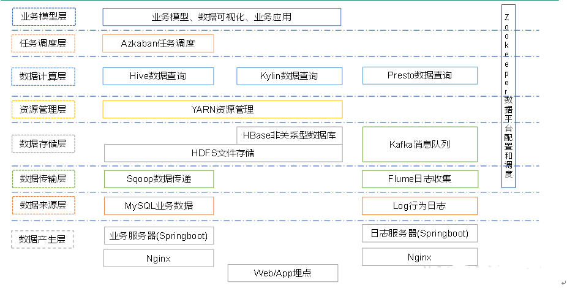
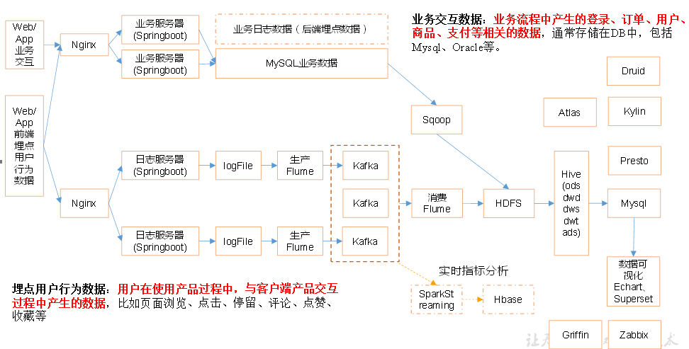
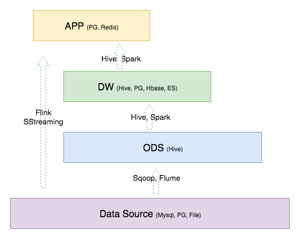
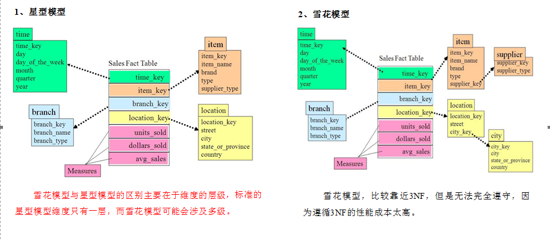
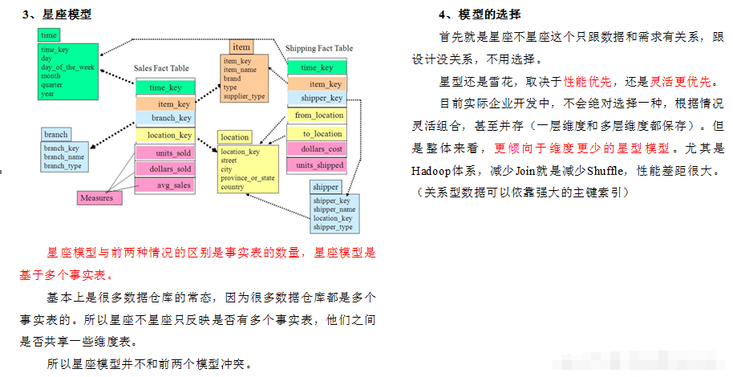

## 简述

当数据增长到一定的规模，**OLAP**就不适合放在RDBMS中进行，这是往往会将**OLAP**剥离到专门的系统中，让RDBMS专注**OLTP**、减小压力。而这一专门的系统叫做数据仓库。

数据仓库，Data Warehouse，[是一套](https://juejin.cn/post/6969874734355841031)包含ETL、调度、建模在内的理论体系。

> ETL：Extract Transform Load，数据的抽取、转换、加载，更广义的ETL还包括清洗、过滤、分类、重组、合并、切分、统计等。
>
> 清洗又包括值的规范化、编码、去重、模式转换和脱敏等步骤。

数仓不是数据的最终目的地，数仓不是只为了存储数据，更多的是为了其它业务服务，如，报表、可视化、数据挖掘等，进而帮助管理者进行决策，[帮助企业](https://blog.csdn.net/wjt199866/article/details/115184169)改进业务流程、控制生产成本、提高产品质量。

## 系统架构

数仓包括数据的采集传输、存储、计算、查询、可视化，元数据管理，任务调度，集群监控等多个方面，[每个方面都有与之相关的中间件](https://www.cnblogs.com/shengyang17/p/14099397.html)：

- 数据
  - 采集传输：Flume、Sqoop、Canal、Logstash、DataX、Kafka等。
    - 爬虫：Nutch、Heritrix、Scrapy、WebCollector等。
  - 存储：MySQL、HDFS、HBase、Redis、MongoDB、Elasticsearch等。
  - 计算：Hive、Tez、Spark、Flink、Storm等。
  - 查询：Presto、Kylin、Impala、Druid等。
  - 可视化：ECharts、Superset、QuickBI、DataV、Kibana等。
- 元数据管理：Atlas等。
- 任务调度：Azkaban、Oozie、DolphinScheduler等。
- 集群监控：Zabbix等。
- 配置管理：Zookeeper等。

### 数据采集

数仓的[数据采集方式主要有3种](https://www.cnblogs.com/amyzhu/p/13513425.html)：

1. 业务库：根据不同场景，可采用[Sqoop](https://www.cnblogs.com/Agent9527/p/14128532.html)定时抽取方式，或采用**Alibaba Canal**监听**MySQL**的Bin Log等方式。
2. 日志：根据不同的场景，可采用**Flume**定时同步日志文件，也可以采用**Kafka**搭配**Spark Streaming**或**Flink**来实时采集。
3. 爬虫：略。

### 实例

上图为一个数仓的系统架构设计，其对应的数据流转如下图所示：

## 表分层

表分层是数仓设计中的一个重要环节，将不同的表置于不同的分层能令整个数据体系[更易理解、使用、管理](https://www.cnblogs.com/itboys/p/10592871.html)：

- 清晰数据结构：每个数据层各司其职，方便使用和维护的。
- 简化复杂问题：将复杂的任务分解为多个步骤，每个步骤只需关注特定问题。
- 统一数据口径：提供统一的数据出口、输出口径。
- 减少重复工作：提供通用的中间层，进而减少重复的开发工作。

如[上图](https://www.cnblogs.com/itboys/p/10592871.html)所示，数仓的常见分层为`3`层，自下而上为ODS、DW、APP（ADS），其中DW又细分为DWD、DWM、DWS。

此外，还会有个DIM。

如[下图](https://www.cnblogs.com/itboys/p/10592871.html)所示，不同的表分层往往采用不同的数据库。

### 维度层

维度层，Dimension，DIM。

#### 事实表

<u>事实表</u>（Fact Table）是指存储有事实记录的表，即，表中的每行数据代表一个业务事件，如，系统日志、销售记录、商品订单等。

> 术语“事实”指的是业务事件的度量值（可统计次数、个数、金额等）。

<u>事实表</u>中的记录会不断地增长，其体积往往远大于其它表。

#### 维度表

<u>维度表</u>（Dimension Table），也称查找表（Lookup Table），是与<u>事实表</u>相对应的一种表，如，日期表（存储与日期对应的周、月、季度等属性）、地点表（包含国家、省／州、城市等属性）。

<u>维度表</u>保存了维度的属性值，可以跟<u>事实表</u>做关联，相当于将<u>事实表</u>上经常重复出现的属性提取出来，用一张表进行管理。

<u>维度表</u>主要是包含`2`个部分：

- 高基数维度数据
  - 一般是用户资料、商品资料的表。
  - 记录数可达千万级，甚至亿级。
- 低基数维度数据
  - 一般是配置表，如，枚举字段对应的中文含义、日期维表等。
  - 记录数在个位数、千级、万级。

### 数据运营层

数据运营层，Operation Data Store，ODS，也称为数据准备区、贴源层。

数据源中的数据，经过ETL之后，写入ODS。

ODS是数仓的准备区，即，为DWD层提供原始数据，以减少对业务系统的影响。

> 为了后续能追溯数据问题，不建议对这一层做清洗工作，原封不动地导入原始数据即可。

### 数据仓库层

数据仓库层，Data Warehouse，DW。

#### 数据细节层

数据细节层，Data Warehouse Details，DWD，起到隔离业务层和数仓层的作用。

DWD保持与ODS相同的粒度。

DWD主要负责数据的清洗和规范化，如：去空、去脏、脱敏、离群值等。

##### 维度建模

DWD[需构建维度模型](https://blog.csdn.net/wjt199866/article/details/115184169)，即，以某一个事实表为中心来组织表，主要面向业务，数据往往存在冗余。

> 维度建模多用于OLAP。
>
> 与维度建模相对应的是关系建模，多用于OLTP。
>
> 标准的关系建模使用多表关联，虽然不存在数据冗余，但不适用于大规模数据的查询。

> DWD以业务过程为驱动，DWS、DWM、DWT、ADS以需求为驱动。

如[上图](https://www.cnblogs.com/shengyang17/p/10558342.html)所示，维度模型主要有`3`种，其中，星座模型最为常见。

> 维度建模[一般分为4个步骤](https://www.cnblogs.com/shengyang17/p/10558342.html)：选择业务过程、声明粒度、确认维度、确认事实。
>
> 为了提升易用性，维度建模时通常会进行维度退化，即，将维度退化至事实表中，减少<u>事实表</u>和<u>维度表</u>的关联。

> [在IBM看来](https://www.ibm.com/cloud/learn/data-warehouse)，维度模型只包含星型模型和雪花模型两种。

#### 数据中间层

数据中间层，Data Warehouse Middle，DWM，是在DWD的基础上，对统计指标进行轻微地聚合，生成不同的中间结果表，以提升公共指标的复用性，减少不必要的重复加工。

> DWM也叫做Data Warehouse Base，DWB，数据基础层。

#### 数据服务层

数据服务层，Data Warehouse Service，DWS，是在DWM的基础上，整合/汇总成多个主题，用于业务查询、OLAP、数据分发。

DWS的每个主题通常为一张宽表，即，表往往数量相对较少、字段较多，一张表会涵盖比较多的业务内容。

#### 数据主题层

数据主题层，Data Warehouse Topic，DWT。

DW一般分为DWD、DWM、DWS，[但也有采用](https://blog.csdn.net/wjt199866/article/details/115184169)DWD、DWS、DWT这种分层方式，这种方式：

- 将之前的DWM/DWB去掉，由DWS进行全部聚合操作。
- 同时，将DWS中按主题汇聚指标/建表的职责，提取为DWT。

### 数据服务层

数据服务层，Application Data Service，ADS，针对具体的业务。

ADS的存储往往分为两部分：

- 一部分由**Elasticsearch**、**Redis**、**PostgreSQL**组成，供线上系统查询。
- 一部分由**Hive**、**Druid**组成，供数据分析。

> 数据报表通常存放在该层。

> [一个电商数据仓库的分层设计方案](https://www.cnblogs.com/shengyang17/p/10545198.html)（据评论说出自尚硅谷）。

## Iceberg

**Iceberg**是一种表格式，可用于实现实时数仓、数据湖。

> [表格式是](https://bigdata.djbook.top/sites/122.html/)一个位于计算层（**Flink**、**Spark**）和存储层（**ORC**、**Parqurt**）的中间层，它不定义数据存储方式，而是定义数据、元数据的组织方式，向上提供统一的“表”的语义。
>
> 数据湖[需要支持](https://blog.51cto.com/u_15127525/2686217)数据更新、事务、可扩展的元数据。
>
> - 数据更新：在分区中追加数据、合并或重写分区。

**Iceberg**的核心思想为，基于快照在时间轴上跟踪表的所有变化。

- 快照是表数据文件在某一时刻的一个完整集合。
- 每次更新都会生成一个新的快照。
- 表的元数据是不可修改的，并且始终向前迭代。

> **Iceberg**中，表的多级分区只是一个逻辑概念，实际上会拼接为一个分区。这种设计减少了文件列表的读取次数。
>
> **Iceberg**的增量读取、表结构变更都是基于快照实现的。
>
> **Iceberg**使用JSON格式保存Schema、Partition Spec以及当前Snapshot Manifests文件路径，使用**AVRO**格式保存Manifests文件路径、提交的文件以及文件级别元数据。
>
> **Iceberg**对数据、元数据的再组织，减少了不必要的读取，进而提升了读取效率。

### 数据湖

数据仓库使用为数据分析而设计的预定义模式对 从多个来源收集的数据 进行结构化，而数据湖是没有预定义模式的数据仓库。换句话说，数仓中的表采用预定义模式，而数据湖中的表采用动态模式（无预定义模式）。

### 数据集市

数据集市是一个规模相对较小的数仓，其中的数据仅特定于特定业务线或部门。

### 实时数仓

实时数仓[往往采用](https://mp.weixin.qq.com/s/N7lGOXHqMAeiokF3myH7_g)基于**Kafka**+**Flink**的方式，这种方式存在无法复用离线数仓的数据血缘、数据质量等问题，需要新建一套，增加了系统复杂性和运行、维护成本，因此，有人提出了流批一体的想法。流批一体包括SQL统一和计算引擎统一两种实现方式，但流批一体的核心，不在实现方式上，而在存储层，这也正是**Iceberg**等表格式所努力的方向。

> 数仓架构包含Lambda和Kappa[两种](https://libertydream.github.io/2020/04/12/lambda-%E5%92%8C-kappa-%E7%AE%80%E4%BB%8B/)：
>
> - λ，Lambda：实时数仓和离线数仓并行的架构，整个过程可用函数方程表示为`Query=λ(Complete data)=λ(live streaming data)⋅λ(stored data)`
> - κ，Kappa：流批一体的架构，整个过程可用函数方程表示为`Query=K(New data)=K(Live streaming data)`。
>
> Lambda实际以批处理为主，且对批处理和流处理采取不同的处理逻辑，一旦流处理变多，就会加剧开发成本、计算成本，而Kappa不存在这两个问题。
>
> Lambda较为流行，Kappa实际落地较少。

> 网易数据湖大数据系列文章：
>
> 1. [实时数据仓库的发展、架构和趋势](https://mp.weixin.qq.com/s/N7lGOXHqMAeiokF3myH7_g)
> 2. [Apache Iceberg快速入门](https://mp.weixin.qq.com/s/LuvN5u9CBPj5AJ_SgJiHsw)
> 3. [如何正确使用Iceberg](https://mp.weixin.qq.com/s/QBIozrtOF5rVnQjneBFS0g)
> 4. [在网易云音乐的实践]()

## Ad-Hoc Query，即席查询

即席查询[是](https://www.jiqizhixin.com/articles/2020-06-11-5)用户根据自己的需求，灵活的选择查询条件，系统能够根据条件快速的进行查询返回结果。

> 换句话说，除了定期执行的/自动的查询外，剩下的/手动的查询，都是即席查询。

即席查询这一处理模式兼具了良好的时效性与灵活性，是对批处理、流处理两大计算模式有力补充，解决了适合商业智能分析人员的便捷交互式分析的问题。

常见框架有：Impala、Hawq、Dremel、Drill、Phoenix、Tajo、Presto、Hortonworks Stinger。
