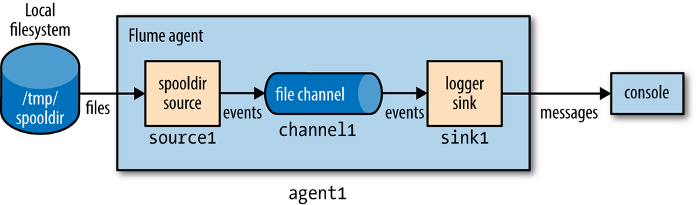
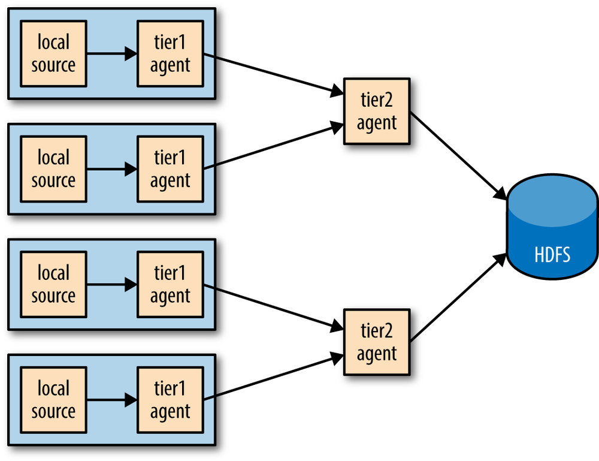
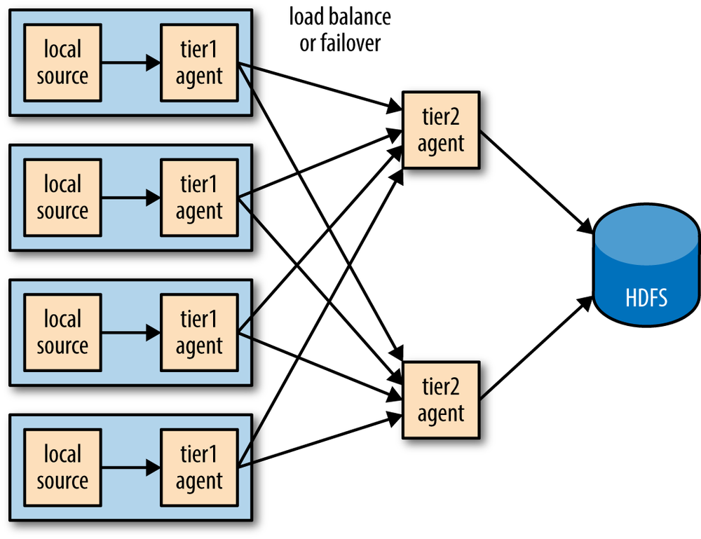

## 简述

**Flume**能从多种数据源中收集事件，如，**Avro**、**Thrift**、HTTP、JMS、本地日志文件等。

**Flume**会将收集到的事件，批量地写入到多种数据源中，如，**Avro**、**Thrift**、**Elasticsearch**、**Solr**、**HBase**、**HDFS**、本地日志文件等。

> 消息、日志、事件是三位一体的。
>
> **Flume**既支持逐条处理事件，也支持批量处理事件，而批理能有效节省IO次数。**Flume**在批量处理时，即便事件的数量不足一批次，也不会引起阻塞。

## 组件

如上图所示，**Flume**主要由持续运行的Agent组成，每个Agent由Source、Channel、Sink等`3`部分组成。

- Source：负责将数据源产生的事件提交给Channel。
- Channel：负责存储事件。包括File、JDBC、Memory等`3`种。
  - File，将事件存储于本地文件系统上的事务日志中，具有持久性，即便Agent重启也不会丢失事件。
  - JDBC，将事件存储在内嵌的Derby数据库中。
  - Memory，将事件存储在内存的队列中，不具有持久性，但性能高/吞吐量大。
- Sink：负责将Channel中的事件转发给数据源。

Source与Channel是一对多的关系，而Channel与Sink是多对一的关系。

> 一个Source向多个Channel提交事件，有专门的术语，叫做扇出（Fan Out）。

### 拦截器

拦截器，Interceptor，能够在事件被Source提交到Channel之前，修改或删除事件。

Interceptor有Host、Morphline、Regex Extractor、Regex Filtering、Static、Timestamp、UUID等`7`种。

### HDFS Sink

**HDFS**是**Flume**的主要Sink对象，其过程基于文件，在满足以下条件中的任意一条之前，文件都将保持打开状态：

1. 达到给定的打开时间。
2. 达到给定的文件大小。
3. 写满了给定数量的事件。

**HDFS** Sink支持基于时间的**Partition**（子目录），时间取自事件的`header`中的`timestamp`，但`header`中默认没有`timestamp`，需要通过Timestamp Interceptor来添加。

> **MapReduce**会忽略以`_`为前缀的文件，故对于处于打开状态的文件，HDFS Sink会以`_`作为前缀进行标识。
>
> HDFS Sink的输出文件的默认类型为SequenceFile。

## 事务与幂等

Source使用事务来确保事件提交成功；Sink也采用类似的方式来转发事件，当转发失败时会回滚，以等待重新转发。

不难看出，无论是Source，还是Sink，**Flume**中的事件会重复，不满足Exactly Once，满足At Least Once。Exactly Once需要两阶段的提交协议来实现，开销大，故**Flume**只实现了At Least Once，事件的去重由目标数据源自行实现。

## 拓扑

如上左图所示，由于**Flume**采用的是[代理](../06、Spring Cloud/9.3 20Kubernetes#代理)模式中的Agent，而非Proxy，所以想要汇集文件，需要将Agent进行连接，组成网络拓扑。

如上右图所示，Agent网络拓扑还可以进一步配置，以实现负载均衡，而负载均衡一定程度上还有容灾的作用。

> 汇集文件，即减少文件数量、增加文件大小，有助于**MapReduce**的处理。
>
> Agent与Agent之间通过**Avro**或**Thrift**来进行通信。
>
> Agent的负载均衡仅支持round_robin。默认情况下，不会忽略不可用的Sink，每次都会尝试，但是可以通过设置，让不可用的Sink在超时时间呈指数级增长时被列入黑名单。

