## 简述

如[下图](https://www.hadoopdoc.com/spark/spark-intro)所示，**Spark**主要由`5`部分组成：

1. Spark Core：该模块提供弹性分布式数据集（Resilient Distributed Dataset，RDD），并实现了应用调度、RPC、序列化、压缩和内存计算，并为Spark SQL、Spark Streaming、Spark MLlib、Spark GraphX等上层组件提供API。
2. Spark SQL：该模块允许我们使用SQL来查询结构化数据。
3. Spark Streaming：该模块以微小的批的方式处理流数据，提供强大的交互和数据查询。
4. Spark MLlib：该模块封装了很多高效的机器学习（迭代）算法。
5. Spark GraphX：该模块用于处理图数据。

## Spark Core

见《[7.1 Resilient Distributed Dataset](./7.1 Resilient Distributed Dataset)》《[7.2 运行机制](./7.2 运行机制)》和《[7.3 调优](./7.3 调优)》。

## Spark SQL

[Spark SQL](https://spark.apache.org/docs/latest/sql-programming-guide.html)用于处理结构化数据，它在**RDD**的基础上对数据和计算提供额外的关于结构的信息，进而提供额外的优化。

> Spark SQL简化了结构化数据的编程过程，并且能[自动](https://blog.csdn.net/MrZhangBaby/article/details/106146943)对结构化数据的处理进行优化。
>
> Spark SQL使用名为Catalyst的优化器来生成和优化执行计划。
>
> Spark SQL提供SQL和API两种交互方式，两种方式只是形式不同，使用的执行引擎完全相同。

Spark SQL支持多种数据源：

- 文件：Parquet、ORC、JSON等。
- Hive。
- JDBC。

### Dataset

Spark SQL的核心概念是Dataset，它在**RDD**的基础上加强了类型，更进一步增加了对SQL支持。

Dataset对类型的加强包括：

- 在概念上，Dataset是特定域的对象集合，而**RDD**是任何对象的集合。
- 在API上，Dataset的总是强类型的。
- 在模型上，Dataset类似于数据库中的表，使用Schema来描述数据的类型。

正是这些对类型的加强，尤其是Schema，使得Spark SQL能了解数据的结构（数据集包含哪些列，每列的名称和类型各是什么），从而实现了SQL的执行和优化。

> 强类型指的是，具有严格的类型检查规则，即，变量或表达式的类型必须在编译或运行时显式地指定或推导。弱类型指的是，具有宽松的类型检查规则，即，变量或表达式的类型可以在编译或运行时自动转换或推导。
>
> `SparkSession`是Spark SQL的基础，早期版本使用的是`SQLContext`或者`HiveContext`。
>
> Dataset使用堆外内存，GC压力小。
>
> 有了Schema，每次序列化和反序列化时无需再处理数据的结构信息。

#### DataFrame

DataFrame是一种特殊的Dataset，它的类型为`Row`。

> `type DataFrame = Dataset[Row]`。
>
> 实际上，先有的DataFrame，后来Spark将DataFrame扩展成了Dataset。
>
> DataFrame的设计灵感[来自](https://www.hadoopdoc.com/spark/spark-sql-dataframe)**Python**的Pandas库和R语言的DataFrame数据结构。

DataFrame[可以看作是](https://andr-robot.github.io/RDD-DataFrame和DataSet区别/)Dataset的非类型化的视图或别名。

> 非类型化指的是类型为`Row`。

此外，DataFrame在编译时对类型转化的进行安全检查，而非运行时。Dataset还支持非结构化数据，但DataFrame不支持。

> [对于非结构化数据](https://blog.csdn.net/sun_0128/article/details/107858345)，Dataset会通过反射推断出Schema。

## Spark Streaming

如[上图](https://spark.apache.org/docs/latest/streaming-programming-guide.html)所示，[Spark Streaming](https://www.hadoopdoc.com/spark-streaming/spark-streaming-tutorial)将接收到的实时数据流，按一定的时间间隔划分的连续的**RDD**序列，即转换离散流（Discretized Stream，DStream），然后交由Spark Core进行处理。

Spark Streaming在**RDD**的Lineage和Checkpoint基础上来进行容错。此外，Spark Streaming还会对输入流创建多个副本，支持WAL，以进一步保证容错。

### 优缺点

优点：Exactly Once、容错容易实现；贴近**RDD**，故学习成本低、与**RDD**交互好。

缺点：近实时。

### 操作

DStream的操作可分为如下`3`种：

- 无状态操作。
  - 无状态操作指的是，只需关注当前批次中的实时数据，其算子与**RDD**中的大部分算子相通。
- 有状态操作。
  - 有状态操作指的是，处理当前批次的数据时，需要依赖历史数据。
- 窗口操作。
  - 窗口指的是，指定的时间段范围。窗口操作就是，定时操作指定时间段范围内的数据。
  - 窗口是流处理的重要特征，Spark Streaming提供批处理间隔（Batch Duration）、窗口间隔（Window Duration）和滑动间隔（Slide Duration）等窗口参数。

### 调优

Spark Streaming可采取如下措施来优化性能：

- 增加并行度。
- 关闭序列化/反序列化，或使用Kryo代替默认的序列化/反序列化。
- 合理设置Batch Duration，后续上游任务的执行超过Batch Duration，进而避免下游任务无法按时提交所导致的阻塞。
- 合理设置内存中的数据的失效时间，保证有足够的内存。

