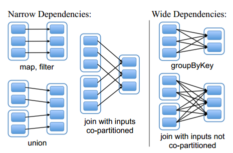

## 简述

**RDD**是**Spark**最核心的概念。

- **RDD**是只读的、不可变的，但可以转换为另一个新的**RDD**。
- **RDD**是分布式的，可以在不同节点存储同一数据集的不同**Partition**，并在此基础上进行带位置偏好的并行计算。
- **RDD**是弹性的，可以自动分区，可以自动容错（自动重新安排计算来重建丢失的**Partition**）。

> 只读、不可变，意味着不需要任何一致性维护。
>
> 除了从现有**RDD**转换，**RDD**还可以通过从内存中的对象集合或从外部存储器加载来创建。
>
> **RDD**支持Hash和Range两种Partitioner。

## 算子

在**Spark**中，**RDD**的[操作](https://www.hadoopdoc.com/spark/spark-rdd-transformation-and-action)称为[算子](https://blog.csdn.net/a1043498776/article/details/77478151)，可分为`2`种。

- 转换，Transformation：从现有的**RDD**生成新的**RDD**。
- 动作，Action：触发对**RDD**的计算，然后将计算结果返回给**Driver**。

转换是惰性的，动作是立竿见影的：在对**RDD**执行动作之前，不会执行任何的转换。

> [在数学中](https://www.zhihu.com/question/24989360/answer/29702293)，函数是数到数的映射，泛函是函数到数的映射，算子是函数到函数的映射。在**Spark**中，算子可以理解为函数。
>
> 如果一个操作的返回类型是**RDD**，那么它是一个转换，否则是一个动作。

### 拓展[[1]](https://spark.apache.org/docs/latest/api/scala/org/apache/spark/index.html)

- 转换又分为`2`种：Value和<u>键值对</u>。
  - Value：`map()`、`flatMap()`、`mapPartitions()`、`glom()`、`groupBy()`、`filter()`、`distinct()`、`subtract()`、`union()`、`intersection()`、`cartesian()`、`sample()`、`takeSample()`、`cache()`、`persist()`、`sortBy()`等。
  - <u>键值对</u>：`mapValues()`、`combineByKey()`、`reduceByKey()`、`foldByKey`、`aggregateByKey()`、`groupByKey()`、`partitionBy()`、`cogroup()`、`join()`、`leftOutJoin()`、`rightOutJoin()`、`sortByKey()`、`coalesce()`、`repartition()`等。
- 动作可[分为`3`种](https://blog.csdn.net/jasonding1354/article/details/46848763)：
  - 无输出：`foreach()`、`foreachPartition()`。
  - 写入到外部存储器：`saveAsTextFile()`、`saveAsSequenceFile()`、`saveAsObjectFile()`。
  - 内存集合：`collect()`、`collectAsMap()`、`lookup()`、`count()`、`countByKey()`、`countByValue()`、`take()`、`top()`、[`reduce()`、`fold()`、`aggregate()`](https://www.jianshu.com/p/15739e95a46e)等。

> `map()`、`flatMap()`的区别在于对<u>集合类型的元素</u>的处理：
>
> - `map()`不会将<u>集合类型的元素</u>展开（flatten），长度为`N`的**RDD**转换后长度仍为`N`。
> - `flatMap()`会将<u>集合类型的元素</u>展开，并将这些<u>子元素</u>合并为一个新的**RDD**，新**RDD**的长度大于等于原**RDD**的长度`N`。
>
> `map()`、`mapValues()`的[区别](https://stackoverflow.com/questions/36696326/map-vs-mapvalues-in-spark)在于语义和分区：
>
> - `map()`即可接收单元素，也可接收<u>键值对</u>，且既可以处理Key，也可以处理Value；`mapValues()`只接收<u>键值对</u>，且仅可以处理Value。
> - `map()`会忽略自定义的Partitioner；`mapValues()`会使用自定义的Partitioner。（Repartition时，即便使用的是相同的Key，由于Partition信息的丢失，所以会强制执行Shuffle）
>
> `map()`、`mapPartitions()`的[区别](https://www.cnblogs.com/schoolbag/p/9640990.html)在于调用粒度上：
>
> - `map()`是细粒度的，采用直接遍历每个元素的方式。函数的调用次数多，对象的创建、销毁次数多，但内存占用小。
> - `mapPartitions()`是粗粒度的，采用的是遍历**Partition**，然后调用**Partition**的迭代器的方式来遍历每个元素的方式。函数的调用次数少，对象能复用，但内存占用多。
>
> 如果新旧**RDD**的Partitioner不一致，[会](https://www.cnblogs.com/duanxz/p/6327375.html)自动重分区（`partitionBy()`）。
>
> **MapReduce**会自动排序，但**Spark**需要手动指定。

## 依赖关系

如[上图](http://shiyanjun.cn/archives/744.html)所示，有转换就会有[依赖关系](https://bbs.pinggu.org/thread-4637506-1-1.html)，**Spark**将依赖分为`2`种：

- 窄依赖，Narrow Dependency：父**RDD**的**Partition**与子**RDD**的**Partition**之间是一对一、多对一的依赖关系。
- 宽依赖，Wide Dependency：父**RDD**的**Partition**与子**RDD**的**Partition**之间是多对多的依赖关系。

> 具有<u>宽依赖</u>关系的**Partition**间的转换，其实就是Shuffle。
>
> 两个**RDD**，如果具有相同的Hash分区或Range分区，则其`JOIN`是<u>窄依赖</u>，否则是<u>宽依赖</u>。

## DAG

**Spark**应用由若干个**Job**组成，**Job**由若干**Stage**构成，**Stage**由若干**Task**组成。

> **Spark**以DAG的形式表示每个**Job**。
>
> Spark Web UI分别提供**Job**和**Stage**`2`种DAG，`2`种DAG的顶点不同，分别为**Stage**和**Task**。

当对**RDD**执行一个动作时，**Driver**就会自动创建并提交一个**Job**。

**Stage**则根据**RDD**之间的依赖关系进行划分。

- <u>窄依赖</u>是确定性的，具有<u>窄依赖</u>关系的**RDD**分区的转换可以在同一个线程中完成，所以会被划分到同一个**Stage**中。
- <u>宽依赖</u>是不确定性的，在<u>宽依赖</u>关系中，子**RDD**分区只能等父**RDD**分区Shuffle完后，才能开始计算，所以会被划分到不同的**Stage**中。
- 划分是从后往前进行的：遇到<u>宽依赖</u>就断开，划分出新的**Stage**；遇到<u>窄依赖</u>就将**RDD**加入到当前的**Stage**中。

> 在模型层面，**Job**之间没有依赖关系，**Stage**之间、**Task**之间往往有依赖关系。在业务逻辑层面，**Job**之间也可能有依赖关系。
>
> 惰性/延迟（Lazy）计算是为了划分**Stage**，以及合并同一**Stage**中的转换。这是一种优化手段。
>
> 也可以说，**Stage**按照Shuffle进行划分。

**Stage**会根据**Partition**而横切为若干**Task**，每个**Task**包含若干**RDD**以及对**RDD**的转换，换句话说，每个**Task**的处理逻辑完全相同，只是负责的**Partition**不同。**Stage**/**Task**分为`2`种：

- Shuffle Map：以Shuffle为输出边界，根据分区函数把结果写到本地磁盘上的一组新的**Partition**中，以便后续**Stage**/**Task**取用。后续**Stage**/**Task**可以是Shuffle Map，也可以是Result。
- Result：将结果返回给**Driver**。**Driver**会将每个**Partition**的结果进行汇总。

