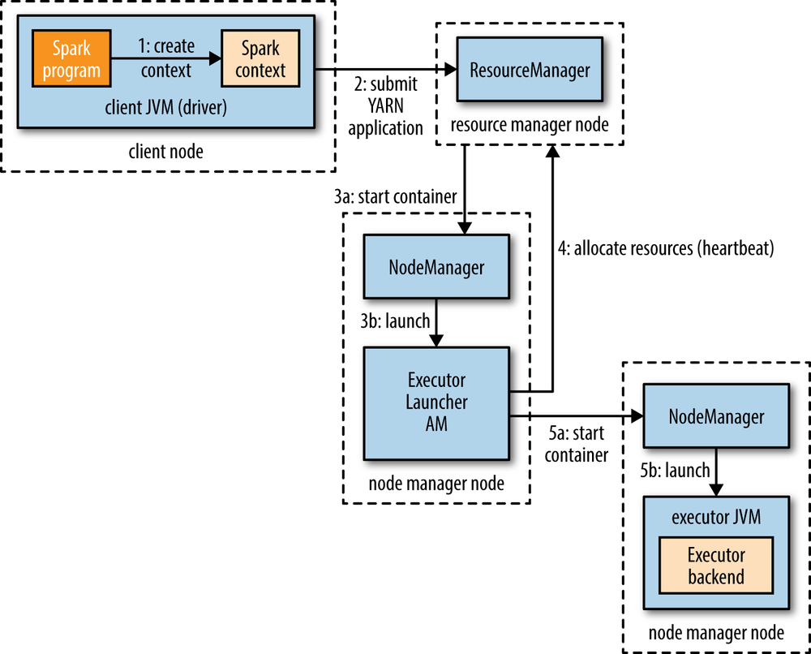
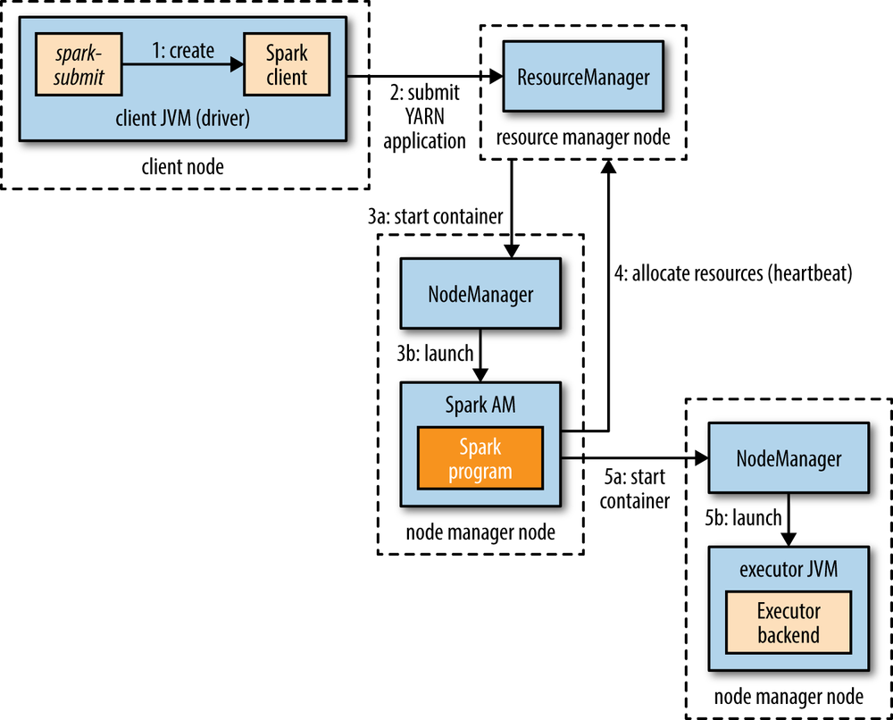

## 组件

如上图所示，**Spark**应用由一个**Driver**和若干**Executor**组成：

- **Driver**：负责创建并管理Spark Context、申请资源以运行**Executor**、向**Executor**分配**Task**、监控**Task**的执行情况、汇总**Executor**返回的结果。
- **Executor**：负责执行**Task**。

> 运行**Executor**的节点叫做**Worker**。两者的关系类似于**Container**与Node Manager，一个**Executor**执行运行于一个**Worker**上，但一个**Worker**可运行多个**Executor**。
>
> **Executor**为应用专属，且在应用运行期间一直驻留。

## 运行过程

### 提交

调用`spark-submit`[命令](https://www.hadoopdoc.com/spark/spark-submit-intro#h2-spark-submit-)，将**Spark**应用提交到本地，本地会创建一个**Driver**。

**Job**提交后，**Driver**会将其依次传递给内部的Spark Context、DAG Scheduler和Task Scheduler。

- Spark Context：**Spark**应用的入口，提供运行应用所需的上下文，包括应用的运行时环境、配置，对外部数据源的读写，以及对应用的调度、监控。
- DAG Scheduler：负责将**Job**分解为若干**Stage**，并将这些**Stage**构建成一个DAG。
- Task Scheduler：负责调度**Task**，即，将每个**Stage**中的**Task**分配给相应的**Executor**来执行。

### 构建

DAG Scheduler在构建DAG时，会为每个**Task**设置<u>位置偏好</u>，以追求Data Locality。

<u>位置偏好</u>主要有`5`种：

- Node Local：对于保存在**HDFS**上的**RDD**分区来说，其**Task**的<u>位置偏好</u>就是**Partition**对应的Data Node。
- Process Local：对于进行了持久化的**RDD**分区来说，其**Task**的<u>位置偏好</u>就是那些拥有持久化**Partition**的**Executor**。
- Rack Local：本地机架。
- Not Local：非本地。
- Speculative **Task**：推测**Task**。

### 调度

Task Scheduler会先基于**Executor**列表，在斟酌<u>位置偏好</u>的同时，构建**Task**到**Executor**的映射；然后根据此映射，将**Task**分配给到相应的**Executor**；当**Executor**执行完**Task**，Task Scheduler会继续向其分配新的**Task**，直到所有的**Task**全部完成。

**Stage**只有在其依赖的**Stage**完成后，才会被提交。

被分配的**Task**通过Scheduler Backend启动。Scheduler Backend会通知**Executor** Backend启动**Task**。

### 执行

**Executor**分`3`步执行**Task**：

1. **Executor**在本地缓存了先前的**Task**的<u>`*.jar`和文件依赖关系</u>，**Executor**会检查这些<u>`*.jar`和文件依赖关系</u>是需要更新。
2. 由于**Task**的代码是以序列化字节的形式通过消息发送而来的，因此需要反序列化代码。
3. 在JVM上执行代码。

**Task**完成时，无论失败与否，**Executor**都会向**Driver**发送状态更新消息。如果**Task**失败，**Driver**会将**Task**分配到另一个**Executor**上重新执行。

## 运行方式

**Driver**会作为一个不由<u>集群管理器</u>管理的Client来运行，而**Executor**有`5`种运行方式。

### 本地模式和独立模式

本地模式没有<u>集群管理器</u>，**Executor**直接和**Driver**运行在同一个JVM中。这种模式主要用于测试或小规模应用。

独立模式有一个基于**Zookeeper**的简单的分布式<u>集群管理器</u>，由一个Master和多个Worker组成，当应用启动时，Master会要求Worker生成**Executor**。

### Mesos (deprecated)

**Mesos**是一个通用的<u>集群管理器</u>，它允许根据策略在不同的应用之前共享资源。

- 细粒度模式下（默认模式），每个**Spark Task**被当成一个**Mesos Task**来执行，有额外的进程启动开销，但资源划分粒度细，有助于高效地利用资源。
- 粗粒度模式下，**Executor**在进程中执行**Task**。

> **Spark**一开始是为了推广**Mesos**而开发的。

### YARN

**Spark**应用可以作为**YARN**上的一个应用来运行，**Executor**对应**Container**。

根据<u>用户代码</u>运行的位置，运行于**YARN**上的**Spark**应用分为`yarn-client`和`yarn-cluster`两种模式。

- `yarn-client`：<u>用户代码</u>运行在Client中，其输出是立即可见的，故适用于交互式应用，如，Spark Shell。
- `yarn-cluster`：<u>用户代码</u>运行在Application Master中，有助于保存日志供稍后查看，且Application Master能自动容灾，故适用于生成作业。

> `yarn-client`也会在**YARN**上运行Application Master，用于申请**Container**以运行**Executor**，启动后的**Executor**会向**Driver**注册。

### Kubernetes

[略](https://spark.apache.org/docs/latest/#launching-on-a-cluster)。

