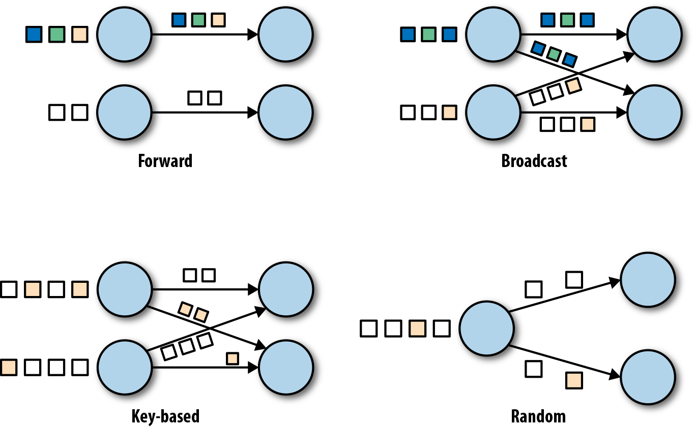

## 流

一个无限增长的数据集，叫做流式数据，简称流。

这类数据有以下特点：

- 无界：数据随时间的推移而不断加入。
- 事件：数据类型多为事件。
- 有序：事件的发生总是有时间先后顺序的。
- 不可变：事件一旦产生，就不能改变，只能通过发布新事件的方式进行弥补。
- 可重复结果：或者说是可重播。

### 流表二元性

表可以看作是流的当前状态，或者说流在某一时刻的状态便是表。

流始终将记录解释为`insert`，而表始终将记录解释为`upsert`。

### 流批二元性

流跟批的主要区别在于数据集是否有界，换句话说，有界流可以看作是批，无界批可以看作是流。

## 流式处理

流式处理，也叫做流式计算，指的是从流式数据中持续读取、处理、生成结果。

流处理是近实时，介于在线计算和离线计算之间。

流处理[是一种编程范式，介于](https://my.oschina.net/u/2424727/blog/2989115)“请求/响应”范式和“批处理”范式之间。

> 请求/响应：延迟低。
> 流处理：延迟低。
> 批处理：延迟高，吞吐高。
>
> 增加并行度是降低延迟并提高吞吐的主要方法。

### 图

流处理也使用DAG来描述处理过程：节点表示算子，边表示流向。算子可分为`3`类：转换（Transformation）、输入（Source）和输出（Sink）。

普通的流DAG称为逻辑流图（Logical Graph），包含<u>**Partition**</u>/<u>并行任务</u>等执行详情的流DAG称为物理流图（Physical Graph）。

如下图所示，流处理包含`4`种分发策略。

- Forward：一对一，往往直接在同一物理节点内进行分发，以节省资源/减少开销。
- Broadcast：广播。
- Key-based：将Key相同的数据分发到同一任务中，以便聚合。
- Random：随机分发，以便负载均衡。

> Forward分发策略的算子合并为一个大算子，直接在本地运行，从而节省序列化、网络开销。**Flink**将一个大算子称为一节算子链（Operator Chain）。
>

### 状态

状态是对历史事件的累积结果，状态包括计数器、累加器、缓存和窗口等。

自然的，有状态的操作需要历史事件，其**Partition**和容错保证也更加复杂。

状态可能会大到超过内存，所以状态的高效存储和访问也很关键。

### 窗口

窗口（Window）是指从数据流中切分出来的有限数据集，其划分依据有个数（Count Window）和时间戳（Time Window）两种，当满足划分条件时，就会创建新的Window并触发对旧的Window内数据的计算。

> 窗口操作实际上就是批处理。

Window可以滑动（Sliding Window），特别的，<u>滑动距离</u>等于<u>窗口大小</u>的Window，或者说相互之间没有重叠的Window，称为<u>滚动窗口</u>（Tumbling Window）。

Window的大小一般是固定的，但也可以不固定，如基于用户会话的窗口（Session Window）。

### 水位线

在流处理中，事件有发生时间（Event Time）、到达时间（Ingestion Time）、处理时间（Processing Time）。大部分场景关注的是<u>发生时间</u>，但受网络延迟的影响，事件何时到达流处理系统是不可控的，<u>发生时间</u>会出现乱序。<u>窗口操作</u>会缓冲/等待数据，对于有有序要求的场景，可以通过排序来实现，但Window不能无限缓冲/等待，于是便有了水位线（Watermark）机制。

Watermark是一个流处理系统自身的事件，它包含一个时间刻度`T`，当它出现在流中时，晚于`T`到达事件将会被忽略。Watermark是<u>窗口操作</u>中，平衡结果的完整性/准确性和延迟的主要方式。

> 对于晚于`T`到达的事件，除了选择忽略，还可以选择输出到其它流中，或者重新触发计算。比起重新触发计算，由批处理定期对结果进行修正也是一种选择。

### 反压

反压，Backpressure，[是一种现象](https://www.zhihu.com/question/49618581/answer/237078934)：当生产速度远大于消费速度时，**Consumer**发生Buffer溢出。

发生Backpressure时，**Consumer**的唯一选择是丢弃事件，否则将面临崩溃。更好的做法是避免Backpressure的发生，即，减缓事件的生产，增强消费。

## 框架[[1]](https://www.cnblogs.com/duanxz/p/3639907.html)

- **Storm**
  - 实时，低延迟。
  - 无状态设计。
  - 仅有记录记录确认机制，不提供Exactly Once。
  - 仅支持固定大小的Window。
- **Spark Streaming**
  - 微批，高延迟。
  - 有状态设计。
  - 提供Exactly Once。
  - 仅支持时间段划分Window。
    - <u>窗口大小</u>只能是检查点间隔的倍数。
    - 且不支持<u>计数窗口</u>或<u>会话窗口</u>。
- **Flink**
  - 实时，低延迟。
  - 有状态设计。
  - 基于分布式快照提供Exactly Once。
  - 丰富的Window。
- **Kafka Streams**
  - 低延迟。
  - 提供Exactly Once。

> **Trident**是对**Storm**的扩展，但采用的是微批的方式，支持有状态，提供Exactly Once。
>
> 与**Storm**[相比](https://tech.meituan.com/2017/11/17/flink-benchmark.html)，**Flink**吞吐高、延迟低，还支持SQL。

## 应用场景[[2]](https://tech.meituan.com/2021/08/26/data-warehouse-in-meituan-waimai.html)

- 生产
  - ETL
  - 系统监控
  - 生产特征、搜索推荐
  - 实时交互
  - 识别风险、异常
- 运营
  - 当日完成度
  - 趋势变化