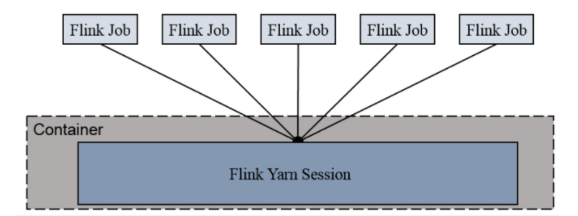
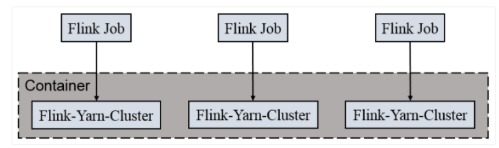

## 简述

**Flink**是一个通用分布式计算引擎，提供满足Exactly Once的有状态的流处理。

> **Flink**还支持批处理，还支持[通过流控](https://confucianzuoyuan.github.io/flink-tutorial/book/chapter03-02-01-基于信任度的流控制.html)来应对[Backpressure](./8 流处理#反压)。
>
> 有状态的流处理可用于训练作弊检测模型。
>
> 金融交易分析等大量实时计算业务对延迟有较高要求

## 组件

如[上图](https://nightlies.apache.org/flink/flink-docs-release-1.17/zh/docs/concepts/flink-architecture/)所示，一个Flink集群包含一个**Job Manager**和多个**Task Manager**。

### Task Manager

**Task Manager**负责执行**Task**，生成快照，以及缓存、分发数据。

**Task Manager**也采用**Slot**方式来划分资源。**Task Manager**会向**Resource Manager**注册自己。

> **Flink**将Application横切为多个流水线（Pipeline），Pipeline一般包含所有的算子，一个Pipeline完整地托付给一个**Task**来执行，一个**Task**只负责执行一个Pipeline。
>
> 一个Application拥有的**Slot**的数量`N`，就是**Task**或算子的最大并行度。

**Task Manager**上的同一Application的**Task**共享TCP连接（通过多路复用）、心跳信息、数据集和数据结构等。

> **Task Manager**也使用了堆外内存，来减小GC压力。

### Job Manager

**Job Manager**负责调度**Task**、对**Task**的执行成功或失败作出反应、协调生成快照和协调故障恢复等。此外，资源管理等功能**Job Manager**的`3`个部分组成：

- **Resource Manager**
  - 负责**Slot**的分配、回收。
  - 根据运行方式的不同，采用不同的实现。
- **Dispatcher**
  - 提供REST接口，供Client提交Application。收到Application后，会为其创建并启动一个**Job Master**实例。
  - 提供Web UI来展示Application的信息。
- **Job Master**
  - 根据Logical Graph，协调**Task**的执行。

> 在旧架构中，每个Application都各有一个**Job Manager**的，并且**Job Manager**与**Resource Manager**、**Dispatcher**是并列关系。
>在新架构中，各个Application可以共用一个**Job Manager**，并且**Resource Manager**、**Dispatcher**整合进了**Job Manager**中，作为后者的一部分。
> 
> **Job Manager**的高可用有**Zookeeper**和**Kubernetes**[两种实现](https://nightlies.apache.org/flink/flink-docs-release-1.17/zh/docs/deployment/ha/overview/)。
>
> 在**Flink**中，Logical Graph被称为Job Graph，Physical Graph被称为Execution Graph。

### Client

Client负责将Application打包并提交给**Job Manager**，提交后，Client可以选择断开连接，也可以选择保持连接以接收报告。

## 运行方式

**Flink**提供了`2`种打包Application的方式。

- 打包为JAR，然后由Client提交到**Flink**集群。
- 打包为容器镜像，且镜像包含**Job Manager**和**Task Manager**。

### 独立模式

略。

### Mesos

略。

### YARN

**Flink**提供了`2`种**YARN**运行的模式。

- Session Cluster
  - 在**YARN**上申请一定的Container，创建一个**Flink**集群，之后所有的Application都提交到该集群，即便所有的Application运行结束，**Flink**集群也会保持运行。
  - 节省了集群的启动时间，适合执行时间短的Application。
- Per Job Cluster
  - 每个提交的Application，都会在**YARN**上创建单独的**Flink**集群，Application运行结束，**Flink**集群也随即终止。
  - 资源隔离，适合执行时间长的Application。

### Kubernetes

略。

## 窗口

对于<u>滑动窗口</u>，**Flink**会将一个事件复制到每个相关的Window，如，每隔`15`分钟生成一个`24`小时的<u>滑动窗口</u>，则每个事件将被复制`4 * 24 = 96`个Window中。

**Flink**的时间Window会和时间自动对齐，如，在`12:05`启动了一个`1`小时的Window，那么Window将在`13:00`关闭，而非`13:05`。但**Flink**也允许通过调整参数来改变Window的对齐方式。

> 关于Window的具体实现，可阅读[文章](http://wuchong.me/blog/2016/05/25/flink-internals-window-mechanism/#Window-的实现)。

## 水位线

**Flink**支持[Watermark](./8 流处理#水位线)。

> **Flink**中的时间戳精确到毫秒。（`16Byte`的长整型，`16*8=128bit`）

每个**Task**会有一到多个输入，也会有一到多个输出。**Task**会为每个输入维护一个Watermark，为所有输入维护一个公共的Watermark。

- 当一个输入收到新的Watermark时，会将其与当前Watermark作比较，将当前Watermark更新为两者中的最大值。
- 然后，从所有输入的Watermark中选出最小值，并将公共的Watermark更新为该值，如果公共的Watermark有变化，就会触发定时器，**Task**就计算旧Window中的数据、创建新Window，并将新的公共Watermark传递给所有（广播）的输出。

不难看出，一个输入的速度变慢或停滞，会导致整体的处理速度变慢或停滞。

**Flink**有`3`种方式生成Watermark。

- 在Source处分配。当Source空闲时，可以主动声明退出Watermark的计算，**Flink**会将其从下游的输入中排除。
- 定期从记录中提取时间戳并生成Watermark。
- 从每条记录中提取时间戳并生成Watermark。

## 状态

一般来说，流中的数据都可以表示为<u>键值对</u>。
对于<u>键值对</u>数据，**Flink**仍然以<u>键值对</u>的形式维护状态，Key不变，但Value变为了状态，Value有`3`种：Value/单值、List/列表、Map/映射。
新的<u>键值对</u>叫做状态项。

> 无法表示为<u>键值对</u>意味着无法并行处理。

一个算子往往会由多个并行**Task**来执行，具有相同Key的数据会分发给固定的**Task**来执行。**Flink**会将Key划分为键组（Key Group），以Key Group形式来维护Key的分布。当调整算子的并行度时，Key Group也会随之发生变化，当然也会伴随状态转移。并行度有`3`种调整方式：

- 列表：**Task**以点对点的形式，均匀地**Task**间重新分配状态项。
- 联合列表：**Task**以广播的形式，在**Task**间重新分配状态项，**Task**可以选择使用或丢弃状态项。
- 广播：**Task**以广播的形式，在**Task**间重新分配状态项。

### 状态的维护

状态的维护由**Task Manager**的状态后端（State Backend）这一组件负责，它在本地保存状态，以追求高吞吐和低延迟。

State Backend有`3`种实现：

1. **Memory State Backend**
   1. 使用纯本地内存（JVM堆）来保存状态以及状态快照。
   2. 仅支持全量快照。
   3. 适合测试、开发。
2. **Fs State Backend**
   1. 使用本地内存（JVM堆）来保存状态，使用外部存储器保存状态快照。
   2. 仅支持全量快照。
   3. 容量受限于内存大小。
3. **RocksDB State Backend**
   1. 使用**RocksDB**（本地磁盘）来保存状态，使用外部存储器保存状态快照。
   2. 支持全量快照，还支持增量快照，以减少IO。
   3. 适合体积大且变化缓慢的状态。

## 快照

快照（Snapshot）是全局一致性镜像的简称。

**Flink**通过定期生成的有状态的Snapshot配合流重放的方式进行容错。

> **Flink**会定期清理旧的Snapshot。

Snapshot保存的是流在某一时刻的整体状态，包括对数据源的偏移量（消费进度）、各个算子对应该偏移量的状态。而“某一时刻”也被称为检查点（Checkpoint）。

Snapshot的生成基于Barrier。

- Barrier类似于Watermark，只不过包含的是Checkpoint ID。
- Barrier由Source算子添加到数据流中，Barrier会以广播的形式进行传递。
- 当收到第一个Barrier后，**Task**会开始生成Snapshot。
  - 为了缩短等待时间，**Task**被设计为不等待所有Barrier都到齐，但最终生成的Snapshot是对齐。

> 传递语义：
>
> - 如上文所属，Barrier默认会对齐，此时地容错满足Exactly Once。
>   - 但这里的Exactly Once指的是，每个事件仅其对应的状态恰好作用一次，而非每个事件恰好处理一次。
>   - 想要实现真正的Exactly Once，Source必须支持数据重放，Sink必须支持事务（两阶段提交协议）或幂等。
>- 可以关闭Barrier的对齐，容错也就变成了At Least Once。
> - 而如果Application忽略快照，直接重启，则没有容错保证，即，At Most Once。
> 
> 流中的数据也就分为了`3`种：用户数据、Watermark和Barrier。

Snapshot的生成由State Backend负责，基于[Copy On Write](../08、MongoDB、Redis、Kafka/2.2 MongoDB的存储引擎#copy-on-write)，并且是异步进行的，不会阻塞数据流。

> **Memory State Backend**是个例外，仅支持同步生成。
>
> 执行对齐时，会暂停数据处理，但会缓存Barrier后的数据。

**Flink**允许用户手动触发Snapshot的创建、删除，以便用户主动停止Application，进而进行Application的调整（修复、改进、迁移、归档）、**Flink**集群的调整。这种情况下的Checkpoint被称为Savepoint。

## API

**Flink**提供了不同层级的API，自底向上依次为：

- **Stateful Stream Processing**：提供对单流或多流的处理，提供具有全局一致性和容错保障的状态，提供事件时间和处理时间的处理。
- **Core APIs**：分为DataStream（对流、批均适用）和DataSet（适用于批）两部分，提供Transformation、Join、Aggregation、Window、State和Loop/Iteration等操作。表达能力强，繁琐。
- **Table API**：提供流的Schema（将流描述为表），提供声明式编程，提供基于规则的优化器来优化代码（用户声明的执行逻辑）。表达能力稍逊，简洁。
- **SQL**：直接提供基于SQL的编程。

> 
