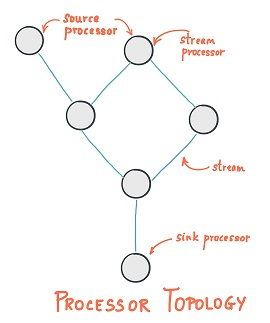
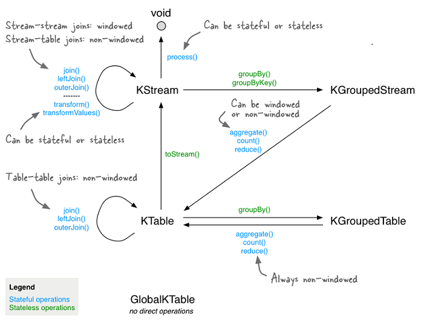

## 简述

流处理框架主要使用**Kafka**来中转消息，于是**Kafka**[干脆](https://juejin.cn/post/6844903934557945870)推出了自己的流处理框架：**Kafka Streams**。

**Kafka Streams**基于**Kafka**，是一组丰富的、轻量级的客户端库。

此外还有低延迟、自动容灾、Exactly Once等特点。

## 设计

**Kafka Streams**中的表分为：

- `KTable`：基于某一分区的表。
- `GlobalKTable`：基于全部分区的表，常用于`JOIN`。

### 拓扑

**Kafka Streams**中的拓扑指的是一系列计算逻辑的集合。

拓扑中的每个节点叫做流处理器，代表计算逻辑中具体的步骤，包括<u>各种转换操作</u>。

有两种比较特殊的处理器：

- Source Processor：没有上游处理器，而是从一个或多个**Topic**中输入流。
- Slink Processor：没有下游处理器，而是将流输出到指定的**Topic**。

## API

<u>各种转换操作</u>包括：汇集、分发、过滤、映射、关联、分组、聚合等。

聚合又包括：计数、求和、求平均数、求最值等。

> **Kafka Streams**不仅提供Java API，还提供了KSQL。

