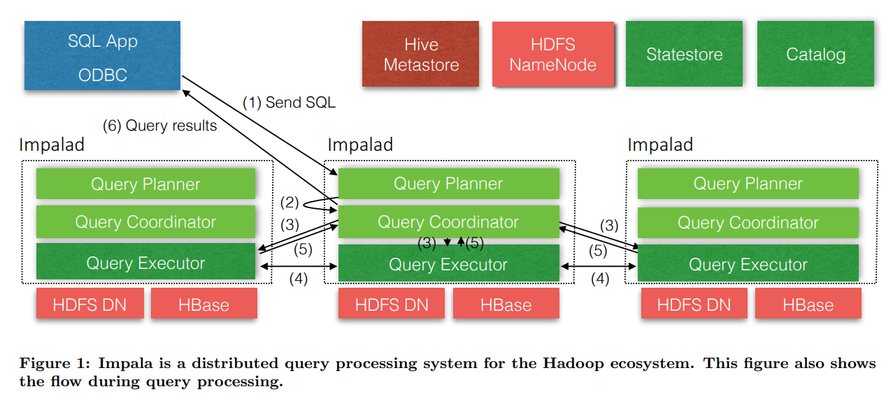

## 架构

如[上图](https://www.cidrdb.org/cidr2015/Papers/CIDR15_Paper28.pdf)所示，**Impala**主要包含[3种服务](https://blog.csdn.net/weixin_39666736/article/details/118090375)：Impala Daemon、Statestore Daemon和Catalog Daemon。

## Impala Daemon

Impala Daemon，简称**Impalad**，一个**Impala**集群往往有多个**Impalad**。

### 角色

**Impalad**采用多主模式，分为`3`种角色：

- Query Planner/Compiler：接收来自Client的SQL，对SQL进行解析、语法检查，从而生成、优化<u>执行计划</u>。
- Query Coordinator：根据<u>执行计划</u>协调计算（分配任务，汇总结果）。
- Query Executor：执行计算。

> Compilation：query parsing, semantic analysis, and query planning/optimization.

### 进程

**Impalad**[分为2种进程](https://blog.csdn.net/novelly/article/details/16974945)。

- Frontend
  - 采用Java。
  - 会扮演Compiler、Coordinator角色。
- Backend
  - 采用C++，与Java相比，内存开销小。
  - 会扮演Executor角色。

**Impalad**采用无主模式，当Client向集群发起查询时，会联系任意一个Frontend，由该Frontend与各个Backend进行通信。

> **Impala**各个服务、组件基于**Thrift**进行通信。

### 计算与存储

**Impala**只负责计算，使用**HDFS**存储数据，实现了计算、存储的解耦。

> **Impala**也支持将**HBase**、**Kudu**作为存储。

但实际上**Impala**（Backend）往往与Data Node部署在相同的节点上，以降低响应时间、节省网络带宽。

- Backend会利用**HDFS**的Short-Circus Local Reads，绕过Data Node直接读取磁盘。
- Backend会利用**HDFS**的Caching来尽量从内存中读取数据。

正因为**Impala**的底层是**HDFS**，故不支持随机Update/Delete，只支持以**Partition**为单位的批量Insert/Delete。

### 执行计划

如[上图](https://www.cidrdb.org/cidr2015/Papers/CIDR15_Paper28.pdf)所示，<u>执行计划</u>的生成包括`2`个阶段：

1. 串行
   1. 该阶段将<u>语法树</u>（Parse Tree）转化为<u>单节点计划树</u>（Single Node Plan Tree）。
   2. <u>单节点计划树</u>中的计划节点（Plan Node）分为对**HDFS**或**HBase**的Scan、Hash Join、Cross Join、Union、Hash Aggregation、Sort、Top-N和Analytic Evaluation等。
2. 并行
   1. 该阶段根据<u>单节点计划树</u>生成分布式<u>执行计划</u>，生成过程中会尽可能的追求Data Locality。
   2. 支持的策略有，必要的交换节点、本地聚合等，支持的并行策略不是很多，如，`JION`只支持Broadcast/Partitioned Join、`GROUP BY`则是固定的二阶段+Repartition的策略等。

> Top-N：`ORDER BY fields LIMIT n`。

### 执行特点

查询的执行过程（Execution）有[以下特点](https://www.zhihu.com/question/391626341/answer/2692289312)：

- 采用带有Exchange操作的Volcano模型，整个执行过程管道化（pipeline-able）。
- 对于需要大量内存的算子，如，Hash Join、Hash Aggregation、Sort、Analytic Evaluation等，会在内存不够时将数据溢写到磁盘。
- 支持Radix Partition的Hash join，并实现了Bloom Filter向Probe侧的Scanner下推的能力。
- 广泛支持了Runtime Code Generation，能在根据运行时的信息编译出高效的函数，从而减少了对低效的通用函数的调用，能有效提升在大数据量下，高度重复、反复执行的计算逻辑的执行效率。

## Statestore Daemon

Statestore Daemon，简称**Statestored**。

**Statestored**负责管理集群中的<u>状态信息</u>，其通过发布-订阅模式定期向所有**Impalad**服务传递这些<u>状态信息</u>。

> **Statestored**采用Push方式推送<u>状态信息</u>，以便使各个**Impalad**里的<u>状态信息</u>尽可能保持最新，但又不影响查询执行的关键路径。对某种<u>状态信息</u>感兴趣的节点可以订阅这个<u>状态信息</u>，当发生更新时，**Statestored**会主动推送给所有订阅了的节点。
>
> 比起**Impalad**直接相互通信，由**Statestored**负责传递信息，即能减少网络IO，还能方便集群的拓展。
>

**Impalad**以心跳的方式向**Statestored**汇报健康状态，当某一**Impalad**离线后，**Statestored**会通知所有的**Impalad**，避免出现不可达的通信。

一个**Impala**集群往往只需要一个**Statestored**，因为<u>状态信息</u>是动态的，不需要持续化到磁盘中。当**Statestored** Failover后，只需**Impalad**重新注册，**Statestored**即可重建所有的<u>状态信息</u>。

因为**Statestored**提供的不是强一致性语义，当Frontend接收到SQL后，它仅会利用本地的信息（不一定最新）来生成<u>执行计划</u>，并随<u>执行计划</u>将这些本地信息传递到Backend上。

## Catalog Daemon

Catalog Daemon，简称**Catalogd**，一个**Impala**集群往往只需要一个**Catalogd**。

**Catalogd**负责管理表、分区等<u>元数据</u>，执行DDL，以及通过**Statestored**将<u>元数据</u>信息广播到集群。

> **Catalogd**往往和**Statestored**部署在同一个节点上，以减少网络IO。

**Catalogd**会将<u>元数据</u>持久化到第三方存储中，如，**Hive**的Metastore。

> 在**Impala**中执行DDL或`LOAD`，**Impala**会将<u>元数据</u>同步到Metastore；但如果在**Hive**中执行DDL或`LOAD`，**Hive**不会将<u>元数据</u>同步给**Impala**，需要**Impala**执行`REFRESH`或`INVALIDATE`。

## 总结

**Impala**快的原因：

1. 采用常驻进程的方式避免了频繁启动。
2. 采用了Runtime Code Generation技术，减小了内存压力，提升了执行效率。
3. 聚合算子会在本地进行预聚合，有效减少了网络IO。
4. 使用**Parquert**、**HBase**、**Kudu**等高效的列式存储。
5. 充分利用内存，磁盘读写少。
