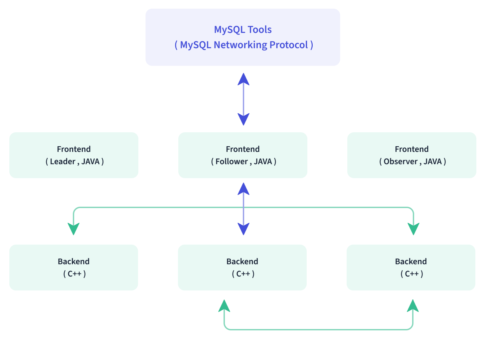

## 简述

**Doris**是一个基于MPP架构的高性能、实时的分析型数据库，能提供毫秒级的大数据查询，不仅支持高并发的点查询场景，也支持高吞吐的复杂分析场景。

> **Doris**由百度于2017年开源，2018年捐赠给Apache，2022年成为Apache的顶级项目。
>
> **Doris**采用**MySQL**协议，支持标准SQL，高度兼容**MySQL**语法。

## 数据模型[[1]](https://doris.apache.org/zh-CN/docs/dev/data-table/data-model)

**Doris**将字段分为Key和Value两种，Key、Value均可由多个字段组成。Key用于快速查找（全局有序）、聚合。

**Doris**的数据模型源自Google Mesa，分为`3`种：

- Aggregate，聚合：会自动地按Key对数据进行聚合，这种预聚合能大幅提升读性能。
- Unique，主键：Key唯一，相同Key的数据会被覆盖，但不会聚合，适用于实时更新场景。
- Duplicate，明细：原样存储，既不根据Key进行覆盖，更不会根据Key进行聚合，适用于事实表的明细存储。

### Aggregate模型

Aggregate模型提供多种聚合方式，如`SUM`、`MIN`、`MAX`和`REPLACE`等。

### Unique模型

Unique模型，在1.2版本之前，是Aggregate模型的一个特例，由于Aggregate模型的实现方式是读时合并（Merge On Read，MOR），因此在一些聚合查询上性能表现不佳，所以**Doris**在1.2版本后，为Unique模型引入新的实现方式—写时合并（Merge On Write，MOW）—来优化查询性能。

> Unique模型默认是整行更新，但也支持部分列更新。

### Duplicate模型

严格来说，Duplicate模型会按Key进行排序，不是原样存储。

> Duplicate模型的Key，称为Sorted Column更贴切，官方建议选择前`2~4列`作为Key。

## 数据划分[[2]](https://doris.apache.org/zh-CN/docs/dev/data-table/data-partition/)

### 分区

**Doris**支持分区，提供Range和List两种划分方式。

> List是由枚举值构成的列表。

**Doris**支持手动分区、动态分区和自动分区。

- 动态分区：按设定时间规则，定时滚动添加、删除分区。
- 自动分区：数据写入时，才根据需要创建分区。

> 若建表时不配置Partition，**Doris**会自动生成一个与表名同名的、全值范围的、对用户透明（不可删除）的Partition。

### 分桶

**Doris**支持分桶（Bucket），桶文件也被称为Tablet，提供Hash和Random两种划分方式。

> 分桶字段可以指定一到多个，分桶字段：
> 
> - 对于Aggregate模型和Unique模型，必须为Key字段。
> - 对于Duplicate模型，可以是Key字段和Value字段。
> 
> 添加Partition时，可以为该Partition单独指定Bucket的数量，但Partition的Bucket数量一旦指定，不可更改，所以，在确定Bucket数量时，需要预先考虑集群扩容的情况。
>
> 如果选择多个分桶字段，则数据分布更均匀，但如果一个查询条件不包含所有分桶列的等值条件，那么该查询会退化为扫描所有分桶，增加IO，甚至影响其他查询。

#### 大小和数量

Tablet过小，则聚合效果不佳，且元数据管理压力大；Tablet过大，则不利于副本的迁移、补齐，且会增加Schema Change或者Rollup操作失败重试的代价（这些操作失败重试的粒度是Tablet）。

当Tablet的大小和数量冲突时，优先考虑大小原则。

#### Random Distribution

除了Hash划分，Bucket其实还支持Random划分。因为没有分桶字段，所以也就无法限定分桶范围，即扫描分区内的全部分桶。

在导入数据时，可同时设置单分片导入和Random划分，这样单次导入作业每个批次的数据，将随机选择一个Tablet进行写入。

- 如果OLAP表是只读的，则这种设置可以避免严重的数据倾斜。
- 如果导入的数据量很大，那么一个作业在将数据写入对应的分区时，只写入一个分片，能有效缓解数据导入和Compaction导致的写放大问题，进而提高数据导入的并发度和吞吐量，以及集群的稳定性。

Random划分适合对整个分区的聚合查询分析，不适合高并发的点查询。

## 查询加速

### 索引[[3]](https://doris.apache.org/zh-CN/docs/dev/data-table/index/index-overview/)

**Doris**仅支持在Key字段上创建索引。

**Doris**支持两类索引：

1. 内建的（对用户透明）智能索引，包括前缀索引和ZoneMap索引。
2. 用户手动创建的二级索引，包括[倒排索引](https://doris.apache.org/zh-CN/docs/dev/data-table/index/inverted-index)、[Bloom Filter索引](https://doris.apache.org/zh-CN/docs/dev/data-table/index/bloomfilter)、[N-Gram Bloom Filter索引](https://doris.apache.org/zh-CN/docs/dev/data-table/index/ngram-bloomfilter-index) 和[Bitmap索引](https://doris.apache.org/zh-CN/docs/dev/data-table/index/bitmap-index)。

前缀索引、ZoneMap索引建立在对Key排序的基础上，同时也建立在字段的Block（`1024`行）级别上。

> ZoneMap索引包含整型、日期类型字段/每一列的`MIN`、`MAX`、`NULL`值个数等信息。

#### 前缀索引

**Doris**支持前缀索引：取Key的前`36Byte`作为前缀，来创建索引，但遇到`VARCHAR`类型的字段时，前缀会直接截断，并且最多使用`VARCHAR`的前`20Byte`。

前缀索引的字段上的过滤条件仅支持`=`、`<`、`>`、`<=`、`>=`、`IN`和`BETWEEN`，并且过滤条件使用`AND`连接（并列的且关系），而非`OR`、`<>`/`!=`。

> 换句话说，`VARCHAR`类型的字段只能作为前缀索引的最后一个字段。
>
> Bloom Filter索引对区分度大/基数大的字段过滤效果明显，如果`VARCHAR`类型的字段不能放在前缀索引中，可以考虑Bloom Filter索引。
>
>不难看出，**Doris**的前缀索引是稀疏的、粗粒度的：根据给定前缀字段，快速定位Block，然后做二分查找。

#### 倒排索引

与**Doris**中其他索引不同的，倒排索引在存储层使用独立的文件，跟Segment文件有逻辑对应关系、但存储的文件相互独立。这样的好处是可以做到创建、删除索引不用重写Tablet和Segment文件，大幅降低处理开销。

### Rollup

**Doris**支持创建针对单个Base表的物化Rollup表。

- Base，基础：在**Doris**中，通过`CREATE TABLE`创建的表被称为原始表或基础表。
- Rollup，上卷：在多维分析中，将数据按指定的粒度进行进一步聚合。

> 下文将Base表、Rollup表分别简称为Base、Rollup。

#### 作用

Rollup通过将聚合结果（更粗粒度）物化的方式来减少Key/数据量，从而提高某些查询的效率。

Rollup中的字段顺序可以与Base中的不同，并且**Doris**不仅会自动地为Base生成和维护前缀索引，还会自动地为每个Rollup生成和维护前缀索引，所以，按需创建Rollup能有效增加前缀索引的命中率，也正因此，Rollup的含义已经超出了 “上卷” 的范围，故在源代码中，被命名为物化索引（Materialized Index）。

> 物化索引的名称并不确切，更确切的名称是，自带稀疏的前缀索引的、经过物化的自动聚合表。

#### 特点

Rollup不能单独创建，必须构建于Base之上。Rollup可以创建多个。Rollup一经创建便不能修改。Rollup的创建是异步的，即，用户提交创建任务后，**Doris**会在后台对存量的数据进行计算，直到创建成功。

Rollup与Base是强一致的，其强一致性由**Doris**自动维护。

Rollup在物理上独立存储，创建地越多，占用的磁盘空间也就越大，同时由于在导入的ETL阶段会自动产生所有Rollup的数据，故会影响导入速度，但是不会降低、只会提高查询效率。

查询时仅需指定Base，无需也无法指定Rollup，**Doris**会根据查询条件自动前缀索引选择最长、创建较早、行数最少的一个Base或Rollup。

如果`DELETE`语句中的过滤条件中的Key，不存在于Rollup中，则语句不能被执行。此时，需先将Rollup删除，然后方可删除数据。

#### 命中

查询时，要命中Rollup需满足以下条件，否则只能命中：

1. 查询或者子查询中涉及的所有字段都存在于同一张Rollup中。
2. 如果查询或者子查询中有`JOIN`，其类型必须是`INNER JOIN`。

> 可以通过`EXPLAIN sql;`查看执行计划中ScanNode节点的PreAggregation的值来判断是否命中Rollup，以及Rollup字段来判断命中的是哪一张Rollup。

### 物化视图

**Doris**中的物化视图分为同步和异步两种。

> 同步物化视图不支持直接查询，但异步物化视图支持。

#### 同步物化视图

**Doris**中的同步物化视图只能构建于一张表上，即，创建语句中不支持`JOIN`，也正因此，**Doris**中的同步物化视图不是真正意义上物化视图，更像是克服了部分局限性的增强版的Rollup：

- Rollup仅支持对Aggregate模型做聚合，同步物化视图支持对Duplicate模型做聚合。
- Rollup的聚合方式有限，即，字段的聚合方式无需也无法修改、必须与Base完全相同，也正因此，Rollup仅支持`COUNT`、`MAX`、`MIN`、`SUM`聚合方式；同步物化视图支持更丰富的聚合函数，除了`COUNT`、`MAX`、`MIN`、`SUM`外，还支持`PERCENTILE_APPORX`、`HLL_UNION`等，并且字段的聚合方式不必与Base相同。

> 对于Unique模型，无论是Rollup，还是同步物化视图，都只能被用于调整Key的顺序，不支持做物化聚合。

同步物化视图的刷新与基表保持一致。

同步物化视图的定义，不是与每个特定的查询一模一样最好，因为维护同步物化视图是有开销的；也不是越抽象越好，越能匹配上更多的分组和聚合方式越好，越能被复用越好，因为这对具体查询的提升是有限的，换句话说，定义同步物化视图时需要平衡时间和空间。

#### 异步物化视图

异步物化视图支持多表，借助集群内外的调度来定时更新。

异步物化视图支持全量刷新或分区增量刷新。

> 分区增量刷新：当异步物化视图的基表的分区数据发生变化时，识别出对应变化的分区并对其刷新（增量），无需刷新整个异步物化视图。

## 架构

如[上图](https://doris.apache.org/zh-CN/docs/dev/summary/basic-summary/)所示，**Doris**的进程仅分为`2`类，不依赖**Hadoop**等外部组件，两类进程均支持横向扩展：

- 管理节点，Frontend，主要负责用户请求的接入、生成<u>执行计划</u>、元数据的管理、节点管理相关工作。
  - 对于元数据的管理，Frontend采用了类似于**ZooKeeper**的设计，将节点分为Leader、Follower和Observer等三种角色。至少部署`3`个Follower，才能实现元数据的读写高可用。

- 工作节点，Backend，主要负责执行计算、存储数据。
  - 从节点又分为Coordinator和Worker。

两类进程通过一致性协议来保证服务的高可用和数据的高可靠。

**Doris**的查询引擎[源自](https://www.infoq.cn/article/vxup94ub59ya*k0tnefe)**Impala**。

- **Impala**采用多主模式，每个节点都缓存元数据，而这可能会面临元数据落后/不一致的问题。
- **Doris**采用主从模式，将元数据的管理放到主节点中，从而避免了元数据的不一致。

除了采用了与**Impala**不同的主从模式，**Doris**还将**Statestored**、**Catalogd**的功能也整合进了Frontend中，从而实现了不依赖**Hadoop**等外部组件，部署、扩展更加简便。

**Impala**由**Hive**的Metastore保证数据的一致性，由**HDFS**保证数据的可靠性；而**Doris**自行实现：采用**Paxos**协议来保证一致性，采用Memory + Checkpoint + Journal的机制来确保元数据的高性能及高可靠。

**Doris**查询引擎的所有的内存结构能够按照列式布局，是向量化的。

> 对于行式布局，每一次对行的函数调用，都会：打断CPU流水，不利于分支预测；指令和数据Cache Miss高；编译器不友好，不利于循环展开，不利于使用SIMD等CPU加速指令。
> 但对于列存布局，能采用向量化执行，从而大幅减少虚函数调用、提升Cache命中率、高效利用SIMD指令、提升CPU利用率。
> 在宽表聚合场景下，向量化引擎的性能是非向量化引擎的`5`~`10`倍。

**Doris**采用了Adaptive Query Execution技术， 可根据Runtime Statistics来动态调整执行计划。

**Doris**使用CBO和RBO结合的优化策略。

> RBO，Rule Based Optimizer，支持常量折叠、子查询改写、谓词下推、列裁剪、分区分桶裁剪、等价谓词推导、公共表达式复用等。
> CBO，Cost Based Optimizer，支持Join Re-Order。CBO还在优化中，通过更加精准的统计信息收集和推导，提供更加精准的代价模型预估。

#### ENGINE

**Doris**的ENGINE类型默认为olap，由**Doris**负责数据管理和存储的，其他ENGINE类型，如mysql、broker和es等，本质上只是对外部表的映射，**Doris**本身并不创建、管理和存储这些类型的数据。

## 数据表的查询

### 关联

**Doris**默认使用Broadcast Join。Shit，文档前后矛盾呀，可能是说对数据量的预估不准：

- 如果预估的小表，在过滤后仍然无法放入内存，Broadcast Join将无法完成，进行报错。
- 如果预估小表过大，则会自动切换为Shuffle Join。

### 数据更新和删除

**Doris**提供`2`种删除方式：

- 通过`DELETE FROM WHERE`语句，比较通用，适合频率较低的定时删除任务。
- 对于Unique模型，可以通过导入数据的方式将需要删除的主键行数据进行导入。**Doris**内部会通过删除标记位对数据进行最终的物理删除。这种删除方式适合以实时的方式对数据进行删除。

### 技巧

**Doris**支持[从结果中排除](https://doris.apache.org/zh-CN/docs/dev/data-table/basic-usage/#select--except)的一个或多个列的名称：`SELECT * EXCEPT`。

**Doris**支持对两个表进行[原子替换](https://doris.apache.org/zh-CN/docs/dev/advanced/alter-table/replace-table/)：`ALTER TABLE [db.]tbl1 REPLACE WITH TABLE tbl2 [PROPERTIES('swap' = 'true')];`。
