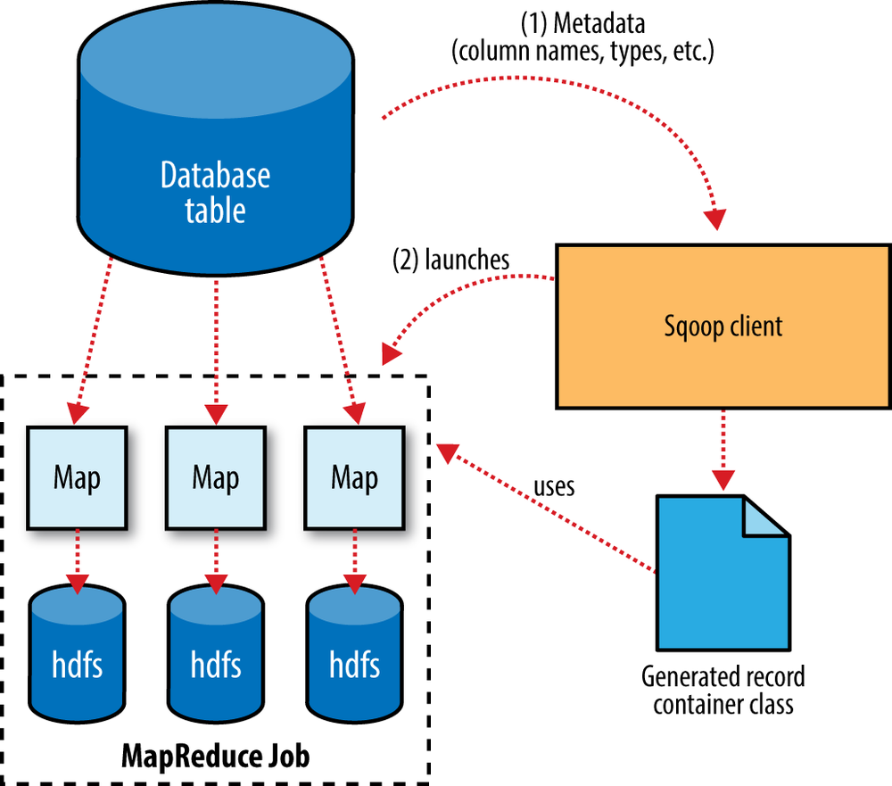
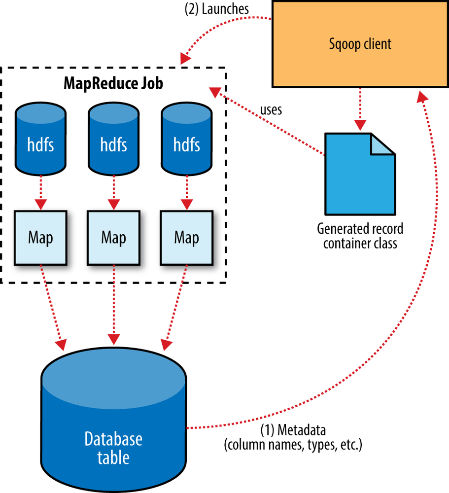

## 简述

**Sqoop**能从RDBMS向**HDFS**批量地导入、导出数据。

> **Sqoop 1**仅提供命令行工具，不提供Java API，难以嵌入到其它程序中。另外，**Sqoop 1**的所有连接器都必须掌握所有的输出格式，这为编写新的连接器带来了大量工作。
>
> 正是因为存在以上局限，**Sqoop 2**除了提供命令行工具外，还提供Java API，以及REST API、Web UI等一系列服务器组件和客户端。**Sqoop 2**还支持**Spark**。

## 连接器

连接器，Connector，是**Sqoop**最主要的组件，它基于JDBC。

> **Sqoop**附带的Connector支持**MySQL**、**PostgreSQL**、**Oracle**、**SQL Server**、**DB2**和**Netezza**等常见的RDMBS。**Sqoop**所提供的对**MySQL**、**PostgreSQL**、**Oracle**和**Netezza**的Connector都是经过优化的，会使用特定的API来提供传输效率。
>
> **Sqoop**还提供一个通用的Connector，用于连接支持JDBC协议的RDBMS。
>
> 除了内置的Connector，还支持很多第三方的Connector可供选择。

在导入数据前，Connector会检查表的格式（字段及字段的类型），并将SQL类型映射成Java基本类型、生成Java类。

**Sqoop**默认导入整张表，但也支持通过`--query`、`where`等参数来指定要导入的字段以及数据的过滤条件。

### 原理

如上两图所示，Connector的导入、导出基于**MapReduce**，能够将数据导入为文本文件、SequenceFile、**Avro**或**Parquet**，但目前仅支持将**Parquet**加载到**Hive**中。

### 导入

**Sqoop**默认根据RDBMS的表的主键来划分数据，如果基于主键分布不均匀，也可以手动指定其它字段来进行划分。

由于是并行地读取RDBMS，所以**Sqoop**无法保证数据的一致性，除非暂停表的更新。

**Sqoop**支持增量更新，只有当记录的指定字段大于指定值时，才会插入该条记录。**Sqoop**的增量更新有`2`种：

- Incremental Append，自增列，不需要特意指定字段，适用于RDBMS中有新行插入时。
- Incremental Lastmodified，对于时间字段，需要指定更新标识的字段，适用于RDBMS的行有更新时。

除了JDBC，**Sqoop**还提供直接模式，对于**MySQL**来说，是基于mysqldump将数据导入到**HDFS**。

### 导出

**Sqoop**在导出时，允许指定并发量。

由于是并行地写入RDBMS，所以**Sqoop**无法保证数据的一致性。

- 要使用导出数据的应用须在**Sqoop**导出完后，才能看到完整的导出结果。
- 或者先将数据导出到临时中间表，然后再利用RDBMS自身的一个事务将临时中间表导入到最终目标表。但这种方式需要写两次，开销大。

除了JDBC，**Sqoop**还提供直接模式，对于**MySQL**来说，是基于mysqlimport将数据从**HDFS**导出。
