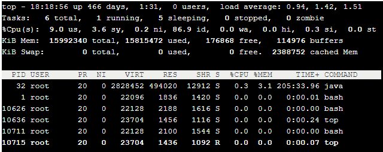

### RM

“rm -rf /”会清空磁盘，[造成非常严重的结果](https://www.zhihu.com/question/29438735/answer/1828100420)。

这个命令的实质是清空索引树，并非将文件内容一一删除。

所以如果不小心执行了这一命令，请立即关机，我们可以将原磁盘作为挂载盘挂载到其他机器上，将数据复制出来，亡羊补牢。

像“rm -rf ./*”这种命令我们也不要使用了，一不小心就会输成“rm -rf /”，甚至“-f”这一参数也不要使用，或者安装safe_rm，或者使用除root外的其他用户并禁用该用户的rm权限。

### TOP

第一行：任务队列信息。

第二行：task进程信息。

第三行：CPU状态。

第四行：内存状态。

第五行：进程信息：

1. PID：进程id。
2. USER：进程所有者。
3. PR：进程优先级。
4. NI：nice值，负值表示高优先级，正值表示低优先级。
5. VIRT：进程使用的虚拟内存总量，单位kb。VIRT=SWAP+RES。
6. RES：进程使用的、未被换出的物理内存大小，单位kb。RES=CODE+DATA。
7. SHR：共享内存大小，单位kb。
8. S：进程状态：
   1. D：不可中断的睡眠状态。
   2. R：运行。
   3. S：睡眠。
   4. T：跟踪/停止。
   5. Z：僵尸进程。
9. %CPU：上次更新到现在的CPU时间占用百分比。
10. %MEM：进程使用的物理内存百分比。
11. TIME+：进程使用的CPU时间总计，单位1/100秒。
12. COMMAND：进程名称（命令名/命令行）。

## 定时任务

#### Crontab

#### Quartz

#### Spring Boot @Scheduled

#### RocketMQ

#### Redis

使用**Sorted Set**，消息内容作为Key，时间戳做**Score**，调用`ZADD`来生产消息，循环调用`ZRANGEBYSCORE`获取N秒前的数据。
