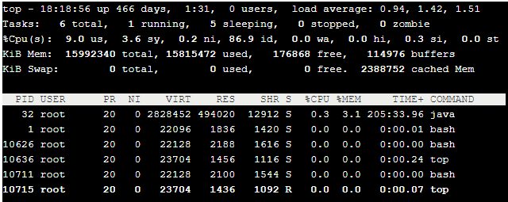

## top



第一行：任务队列信息。

第二行：进程信息总览。

第三行：CPU状态。

第四行：内存状态。

第五行：进程信息详情：

1. **PID**：进程ID。
2. **USER**：进程所有者。
3. **PR**：进程优先级。
4. **NI**：`nice`值。
    1. 负值表示高优先级，正值表示低优先级。
5. **VIRT**：进程使用的虚拟内存总量，单位`KB`。
    1. `VIRT=SWAP+RES`。
6. **RES**：进程使用的、未被换出的物理内存大小，单位`KB`。
    1. `RES=CODE+DATA`。
7. **SHR**：共享内存大小，单位`KB`。
8. **S**：进程状态：
    1. **D**：不可中断的睡眠状态。
    2. **R**：运行。
    3. **S**：睡眠。
    4. **T**：跟踪/停止。
    5. **Z**：僵尸进程。
9. **%CPU**：上次更新到现在的CPU时间占用百分比。
10. **%MEM**：进程使用的物理内存百分比。
11. **TIME+**：进程使用的CPU时间总计，单位`1/100秒`。
12. **COMMAND**：进程名称（命令名/命令行）。


## perf

```bash
perf record -F 99 -p 13204 -g -- sleep 30
```

`perf`命令是performance的缩写，是Linux自带的性能分析工具，会返回函数的<u>调用栈</u>。

上面的代码中：

- `perf record`表示记录。
- `-F 99`表示每秒`99次`。
- `-p 13204`是进程号，即对哪个进程进行分析。
- `-g`表示记录<u>调用栈</u>。
- `sleep 30`是持续`30秒`。

运行`perf`后会产生一个庞大的文本文件。

> 如果一台服务器有`16`个CPU，每秒抽样`99`次，持续`30`秒，就得到`47,520`个<u>调用栈</u>，长达`几十万`甚至上`百万行`。

为了便于阅读，可执行`perf report -n --stdio`来统计每个<u>调用栈</u>出现的**百分比**，然后从高到低排列。

> 但其结果还是不易读，所以才有了**火焰图**。


## 火焰图


如[上图](https://www.ruanyifeng.com/blog/2017/09/flame-graph.html)所示，Flame Graph，火焰图，是基于`perf`结果产生的SVG，用于展示CPU的<u>调用栈</u>：

- `y轴`
  - 表示<u>调用栈</u>，每一层都是一个函数。
  - <u>调用栈</u>越深，火焰就越高，顶部就是正在执行的函数，下方都是它的父函数。
- `x轴`
  - 表示抽样数。
  - 如果一个函数在`x轴`占据的宽度越宽，就表示它被抽到的次数多，即执行的时间长。

**火焰图**就是看顶层的哪个函数占据的宽度最大。只要有"平顶"（Plateaus），就表示该函数可能存在性能问题。

<span style=background:#fdc200>注意</span>：

- `x轴`不代表时间，而是所有的<u>调用栈</u>合并后，按字母顺序排列的。
- 颜色没有特殊含义，因为**火焰图**表示的是CPU的繁忙程度，所以一般选择暖色调。

